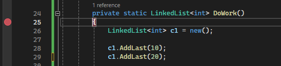
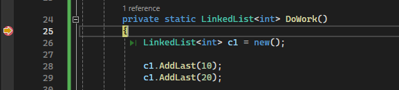
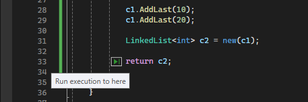
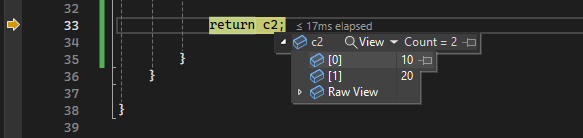

# Quickstart: Debug ASP.NET Core with the Visual Studio debugger

The Visual Studio debugger provides many powerful features to help you debug your apps. This article provides a quick way to learn some of the basic features.

## Create a new project

1. Open Visual Studio.

   If the start window is not open, choose **File** > **Start Window**.

1. On the start window, choose **Create a new project**.

1. On the **Create a new project** window, enter or type *web app* in the search box. Next, choose **C#** from the Language list. Select the **ASP.NET Core Web App (Razor Pages)** template and follow steps to create the project.

    If you don't see the **ASP.NET Core Web App (Razor Pages)** project template, go to **Tools** > **Get Tools and Features...**, which opens the Visual Studio Installer. Choose the **ASP.NET and web development** workload, then choose **Modify**.

    Visual Studio creates the project.

1. In Solution Explorer, open *Privacy.cshtml* (under Pages) and replace the following code:

   ```html
   @{
    ViewData["Title"] = "Privacy Policy";
   }
   ```

   with this code:

   ```html
   @{
    ViewData["Title"] = "Privacy Policy";
    <label>@PrivacyModel.PrivacyMessage</label>
   }
   ```

1. In Solution Explorer, open *Privacy.cshtml.cs* (under Pages/Privacy.cshtml) and replace the following code.

    ```csharp
    public void OnGet()
    {
    }
    ```

    with this code:

    ```csharp

    public static string? PrivacyMessage { get; set; }

    public void OnGet()
    {
       LinkedList<int> result = DoWork();
       PrivacyMessage = "Result of work: " + result.First.Value + ", " + result.First.Value;
    }

    private static LinkedList<int> DoWork()
    {
       LinkedList<int> c1 = new();

       c1.AddLast(10);
       c1.AddLast(20);

       LinkedList<int> c2 = new(c1);

       return c2;

    }
    ```

## Set a breakpoint

A *breakpoint* is a marker that indicates where Visual Studio should suspend your running code so you can take a look at the values of variables, or the behavior of memory, or whether or not a branch of code is getting run. It's the most basic feature in debugging.

1. To set the breakpoint, click in the gutter to the left of the `DoWork` function (or select the line of code and press **F9**).

    

    The breakpoint is set to the left of the opening brace (`{`).

1. Now press **F5** (or choose **Debug > Start Debugging**).

1. When the web page loads, select the **Privacy** link at the top of the web page.

    The debugger pauses where you set the breakpoint. A yellow arrow identifies the statement where the debugger and app execution is paused. The line with the opening brace (`{`) after the `DoWork` function declaration hasn't yet executed.

    

    > [!TIP]
    > If you have a breakpoint in a loop or recursion, or if you have many breakpoints that you frequently step through, use a [conditional breakpoint](../debugger/using-breakpoints.md#BKMK_Specify_a_breakpoint_condition_using_a_code_expression) to make sure that your code is suspended ONLY when specific conditions are met. This saves time and can also make it easier to debug issues that are hard to reproduce.

## Navigate code

There are different commands to instruct the debugger to continue. We show a useful code navigation command that is available starting in Visual Studio 2017.

While the code is paused at the breakpoint, hover over the statement `return c2` until the green **Run to click** button  appears, and then press the **Run to click** button.



The app continues execution, and pauses on the line of code where you clicked the button.

Common keyboard commands used to step through code include **F10** and **F11**. For more in-depth instructions, see [First look at the debugger](../debugger/debugger-feature-tour.md).

## Inspect variables in a datatip

1. In the current line of code (marked by the yellow execution pointer), hover over the `c2` object with your mouse to show a datatip.

    

    The datatip shows you the current value of the `c2` variable and allows you to inspect its properties. When debugging, if you see a value you don't expect, you probably have a bug in the preceding or calling lines of code.

2. Expand the datatip to look at the current property values of the `c2` object.

3. If you want to pin the datatip so that you can continue to see the value of `c2` while you execute code, select the small pin icon. (You can move the pinned datatip to a convenient location.)

## Next steps

In this tutorial, you've learned how to start the debugger, step through code, and inspect variables. You might want to get a high-level look at debugger features along with links to more information.

> [!div class="nextstepaction"]
> [First look at the debugger](../debugger/debugger-feature-tour.md)
