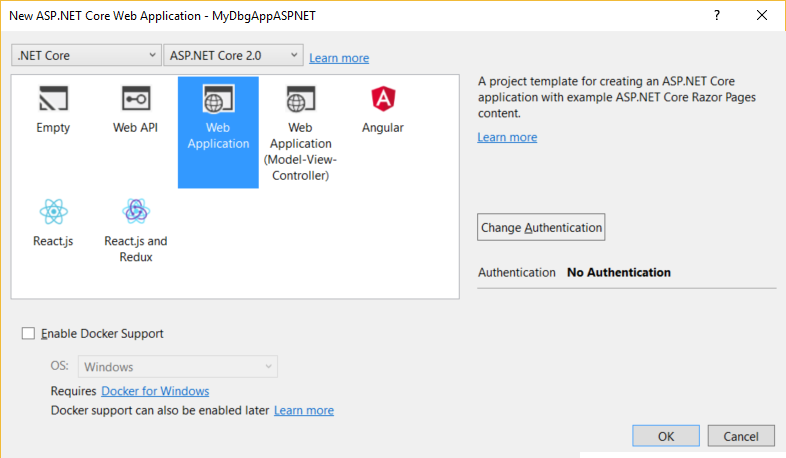
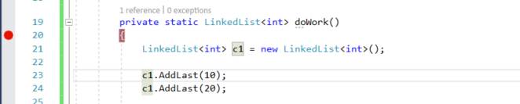
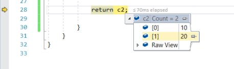

# Quickstart: Debug ASP.NET Core with the Visual Studio debugger

The Visual Studio debugger provides many powerful features to help you debug your apps. This topic provides a quick way to learn some of the basic features.

## Create a new project

1. Open Visual Studio.

    ::: moniker range=">=vs-2019"
    Press **Esc** to close the start window. Type **Ctrl + Q** to open the search box, type **asp.net**, choose **Templates**, then choose **Create new ASP.NET Core Web Application**. In the dialog box that appears, choose **Create**.
    ::: moniker-end
    ::: moniker range="vs-2017"
    From the top menu bar, choose **File** > **New** > **Project**. In the left pane of the **New project** dialog box, under **Visual C#**, choose **Web**, and then in the middle pane choose **ASP.NET Core Web Application**. Type a name like **MyDbgApp** and click **OK**.

    In the dialog box that appears, choose **Web Application** in the middle pane, and then click **OK**.

    
    ::: moniker-end

    If you don't see the **ASP.NET Core Web Application** project template, go to **Tools** > **Get Tools and Features...**, which opens the Visual Studio Installer. Choose the **ASP.NET and web development** workload, then choose **Modify**.

    Visual Studio creates the project.

1. In Solution Explorer, open About.cshtml.cs (under Pages/About.cshtml) and replace the following code

    ```csharp
    public void OnGet()
    {
        Message = "Your application description page.";
    }
    ```

    with this code:

    ```csharp
    public void OnGet()
    {
        LinkedList<int> result = doWork();
        Message = "Result of work: " + result.First.Value + ", " + result.First.Value;
    }

    private static LinkedList<int> doWork()
    {
        LinkedList<int> c1 = new LinkedList<int>();

        c1.AddLast(10);
        c1.AddLast(20);

        LinkedList<int> c2 = new LinkedList<int>(c1);

        return c2;

    }
    ```

## Set a breakpoint

A *breakpoint* is a marker that indicates where Visual Studio should suspend your running code so you can take a look at the values of variables, or the behavior of memory, or whether or not a branch of code is getting run. It is the most basic feature in debugging.

1. To set the breakpoint, click in the gutter to the left of the `doWork` function (or select the line of code and press **F9**).

    

    The breakpoint is set to the left of the opening brace (`{`).

1. Now press **F5** (or choose **Debug > Start Debugging**).

1. When the web page loads, click the **About** link at the top of the web page.

    The debugger pauses where you set the breakpoint. The statement where the debugger and app execution is paused is indicated by the yellow arrow. The line with the opening brace (`{`) after the `doWork` function declaration has not yet executed.

    

    > [!TIP]
    > If you have a breakpoint in a loop or recursion, or if you have many breakpoints that you frequently step through, use a [conditional breakpoint](../debugger/using-breakpoints.md#BKMK_Specify_a_breakpoint_condition_using_a_code_expression) to make sure that your code is suspended ONLY when specific conditions are met. This saves time and can also make it easier to debug issues that are hard to reproduce.

## Navigate code

There are different commands to instruct the debugger to continue. We show a useful code navigation command that is available starting in Visual Studio 2017.

While paused at the breakpoint, hover over the statement `return c2` until the green **Run to click** button  appears, and then press the **Run to click** button.


The app continues execution, and pauses on the line of code where you clicked the button.

Common keyboard commands used to step through code include **F10** and **F11**. For more in-depth instructions, see [First look at the debugger](../debugger/debugger-feature-tour.md).

## Inspect variables in a datatip

1. In the current line of code (marked by the yellow execution pointer), hover over the `c2` object with your mouse to show a datatip.

    

    The datatip shows you the current value of the `c2` variable and allows you to inspect its properties. When debugging, if you see a value you don't expect, you probably have a bug in the preceding or calling lines of code.

2. Expand the datatip to look at the current property values of the `c2` object.

3. If you want to pin the datatip so that you can continue to see the value of `c2` while you execute code, click the small pin icon. (You can move the pinned datatip to a convenient location.)

## Edit code and continue debugging

If you identify a change that you want to test in your code while in the middle of a debugging session, you can do that, too.

1. In the `OnGet` method, click the second instance of `result.First.Value` and change `result.First.Value` to `result.Last.Value`.

1. Press **F10** (or **Debug > Step Over**) a few times to advance the debugger and execute the edited code.

    

    **F10** advances the debugger one statement at a time, but steps over functions instead of stepping into them (the code that you skip still executes).

For more information on using edit-and-continue and on feature limitations, see [Edit and Continue](../debugger/edit-and-continue.md).

## Next steps

In this tutorial, you've learned how to start the debugger, step through code, and inspect variables. You may want to get a high-level look at debugger features along with links to more information.

> [!div class="nextstepaction"]
> [First look at the debugger](../debugger/debugger-feature-tour.md)
