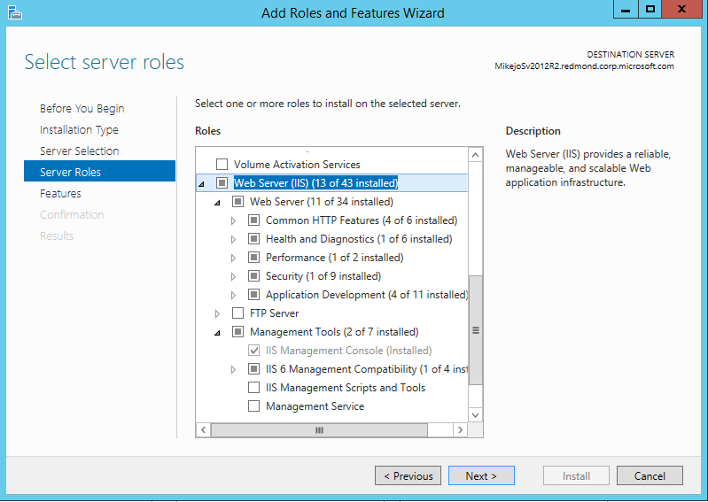

# Remote Debug ASP.NET on a Remote IIS Computer
You can deploy an ASP.NET Web application to a Windows Server computer with IIS, and set it up for remote debugging. This guide explains how to set up and configure a Visual Studio 2017 ASP.NET MVC 4.5.2 application, deploy it to IIS, and attach the remote debugger from Visual Studio. To remote debug ASP.NET Core, see [Remote Debug ASP.NET Core on an IIS Computer](../debugger/remote-debugging-aspnet-on-a-remote-iis-computer.md).

These procedures have been tested on these server configurations:
* Windows Server 2012 R2 and IIS 10
* Windows Server 2008 R2 and IIS 7.5

There are many ways you can deploy and debug on IIS. Here are a few of the common scenarios.

|Scenario|Notes|
|-|-|-|
|[Azure App Service](https://docs.microsoft.com/en-us/azure/app-service-web/web-sites-dotnet-get-started)|From Visual Studio, you can quickly publish and debug your app to a fully provisioned instance of IIS. However, the configuration of IIS is preset and you cannot customize it. To use this option, choose **Microsoft Azure App Service** from the **Publish** dialog box, follow the prompts to publish, and debug in **Server Explorer** by right-clicking on the App Service instance, and choosing **Attach Debugger**.|
|[Azure VM](https://docs.microsoft.com/en-us/azure/virtual-machines/virtual-machines-windows-hero-role)|If you want more control of the IIS configuration, you can install the IIS role on an Azure VM. To do this, first create an Azure VM, and then the steps are virtually the same as the steps described in this topic. Two of the steps are different for an Azure VM: [Connect to the VM](https://docs.microsoft.com/en-us/azure/virtual-machines/virtual-machines-windows-hero-role#connect-to-the-virtual-machine-and-sign-in) by downloading and running the RDP file, and you must open ports in the [Network security group](https://docs.microsoft.com/en-us/azure/virtual-machines/virtual-machines-windows-hero-role#open-port-80) on the VM.|
|[Windows Server](#bkmk_configureII)|Follow the steps in this tutorial to remote debug on Windows Server or a VM running Windows Server.|

## Create the ASP.NET 4.5.2 application on the Visual Studio computer
  
1. Create a new MVC ASP.NET application. (**File / New / Project**, then select **Visual C# / Web / ASP.NET Web Application** . In the **ASP.NET 4.5.2** templates section, select **Web Application**. Make sure that **Enable Docker Support** is not selected and that **Authentication** is set to **No Authentication**. Name the project **MyASPApp**.)

2. Open the  HomeController.cs file, and set a breakpoint in the `About()` method.

## <a name="bkmk_configureIIS"></a> Install and Configure IIS on Windows Server

These steps show only a very basic configuration of IIS. For information on installing to a Windows Desktop machine, see [Publishing to IIS](https://docs.asp.net/en/latest/publishing/iis.html#iis-configuration).

For Windows Server operating systems, use the **Add Roles and Features** wizard via the **Manage** link or the **Dashboard** link in **Server Manager**. On the **Server Roles** step, check the box for **Web Server (IIS)**.



On the **Role services** step, select the IIS role services you desire or accept the default role services provided.

Proceed through the confirmation steps to install the web server role and services. A server/IIS restart is not required after installing the Web Server (IIS) role.

## Update browser security settings on Windows Server

Before you can download the software described in this tutorial, you may need to add the following trusted sites to your browser. These sites are currently required:

- microsoft.com
- go.microsoft.com
- download.microsoft.com
- visualstudio.com

In Internet Explorer, you can add the trusted sites by going to **Internet Options > Security > Trusted Sites > Sites**. These steps are different for other browsers.

When you download the software, you may get requests to grant permission to load various web site scripts and resources. In most cases, these additional resources are not required to install the software.

## <a name="BKMK_deploy_asp_net"></a> Install ASP.NET 4.5 on Windows Server

On Windows Server 2012 R2, see [IIS Configuration](https://docs.asp.net/en/latest/publishing/iis.html#iis-configuration) if you need more detailed information.

1. Use the Web Platform Installer (WebPI) to install ASP.NET 4.5 (from the Server node in Windows Server 2012 R2, choose **Get New Web Platform Components** and then search for ASP.NET)

    

    > [!NOTE]
    > If you are using Windows Server 2008 R2, install ASP.NET 4 instead using this command:
     **C:\Windows\Microsoft.NET\Framework(64)\v4.0.30319\aspnet_regiis.exe -ir**

2. Restart the system (or execute **net stop was /y** followed by **net start w3svc** from a command prompt to pick up a change to the system PATH).

## <a name="BKMK_install_webdeploy"></a> (Optional) Install Web Deploy 3.6 on Windows Server

1. If you intend to deploy your applications with Web Deploy in Visual Studio, install the latest version of Web Deploy on the server.

    To install Web Deploy, use the [Web Platform Installer (WebPI)](https://www.microsoft.com/web/downloads/platform.aspx) or obtain an installer directly from the [Microsoft Download Center](https://www.microsoft.com/search/result.aspx?q=webdeploy&form=dlc). You find Web Deploy in the Applications tab. 

2. Verify that Web Deploy is running correctly by opening  **Control Panel / System and Security / Administrative Tools / Services** and make sure that **Web Deployment Agent Service** is running (the service name is different in older versions).

    If the agent service is not running, start it. If it is not present at all, go to **Control Panel / Programs / Uninstall a program**, find **Microsoft Web Deploy <version>**. Choose to **Change** the installation and make sure that you choose  **Will be installed to the local hard drive** for the Web Deploy components. Complete the change installation steps.

## Open required ports on Windows Server

Some required ports may already be opened depending on the exact versions of the software installed. Required ports:

- 80 - Required for IIS
- 8172 - (Optional) Required for Web Deploy to deploy the app from Visual Studio
- 4022 - Required for remote debugging from Visual Studio 2017 (earlier versions have different port numbers, like 4020).

1. To open a port on Windows Server, use **Control Panel / System and Security / Windows Firewall / Allow an app or feature through Windows Firewall**.

    > [!NOTE]
    > On an Azure VM, you open ports through the [Network security group](https://docs.microsoft.com/en-us/azure/virtual-machines/virtual-machines-windows-hero-role#open-port-80).

2. Then choose **Advanced / Inbound Rules / New Rule / Port**. Choose **Next** and under **Specific local ports**, enter the port number, click **Next**, then **Allow the Connection**, click **Next** and add the name (**IIS**, **Web Deploy**, or **msvsmon**) for the Inbound Rule.

3. Create additional rules for the other required ports.

## <a name="BKMK_deploy_asp_net"></a> Configure ASP.NET Web site on the Windows Server computer

1. Open the **Internet Information Services (IIS) Manager** and go to **Sites**.

2. Right-click the **Default Web Site** node and select **Add Application**.

3. Set the **Alias** field to **MyASPApp** and the Application pool field to **ASP.NET v4.0** (ASP.NET 4.5 is not an option for the Application pool). Set the **Physical path** to **C:\Publish** (where you will later deploy the ASP.NET project).

4. With the site selected in the IIS Manager, choose **Edit Permissions**, and go through steps to add either IUSR, IIS_IUSRS, or the user configured for the Application Pool as an authorized user with Read & Execute rights.

## <a name="bkmk_webdeploy"></a> (Optional) Publish and deploy the app using Web Deploy from Visual Studio

If you installed Web Deploy using the Web Platform Installer, you can deploy the app directly from Visual Studio.

1. Start Visual Studio with elevated privileges, and re-open the project.

    This may be required to deploy your app using Web Deploy.

2. In the **Solution Explorer**,  right-click the project node and select **Publish**.

3. For **Select a publish target**, select **IIS, FTP, etc** and click **Publish**.

    

4. Enter the correction configuration parameters for your IIS setup.

    

    If a host name doesn't resolve when you try to validate in the next step in the **Server** text box, try the IP address. Make sure you use port 80 in the **Server** text box, and make sure that port 80 is open in the firewall. (Web Deploy also requires port 8172 to be open on the server.)

6. Click **Next**, choose a **Debug** configuration, and choose **Remove additional files at destination** under the **File Publish** options.

5. Click **Prev**, and then choose **Validate**. If the connection setup validates, you can try to publish.

6. Click **Publish** to publish the app.

    The Output tab will show you if publishing is successful.

    If you get an error mentioning Web Deploy, recheck the Web Deploy [installation steps](#BKMK_install_webdeploy) and make sure the correct ports are open.

7. Once you publish successfully, go to the Windows Server machine and verify that you can run the app correctly by opening the app in your browser.

    If the app deploys but doesn't run correctly, there may be an issue with your IIS configuration, your ASP.NET installation, or your Web site configuration. Recheck earlier steps.

## (Optional) Publish and Deploy the app by publishing to a local folder from Visual Studio

You can also publish and deploy the app using the file system or other tools.

1. (ASP.NET 4.5.2) Make sure that the web.config file lists the correct version of the .NET Framework.  For example, if you are targeting ASP.NET 4.5.2, make sure this version is listed in web.config.
  
    ```xml
    <system.web>
      <compilation debug="true" targetFramework="4.5.2" />
      <httpRuntime targetFramework="4.5.2" />
      <httpModules>
        <add name="ApplicationInsightsWebTracking" type="Microsoft.ApplicationInsights.Web.ApplicationInsightsHttpModule, Microsoft.AI.Web" />
      </httpModules>
    </system.web>
  
    ```

2. In the **Solution Explorer**,  right-click the project node and select **Publish**.
3. For **Select a publish target**, select **Custom** and name the profile **MyASPApp**. Click **Next**.
4. On the **Connection** tab, set the **Publish method** field to **File System** and  the **Target location** field to a local directory. Click **Next**.

    

5. Set the configuration to **Debug**. Click **Publish**.

    
    
    The application should be published to the local directory.

6. Copy the ASP.NET project directory from the Visual Studio computer to the local directory configured for the ASP.NET app (which we'll call **C:\Publish**) on the Windows Server computer. You can copy the project manually, use Xcopy, Robocopy, Powershell, or other options.

    > [!CAUTION]
    >  If you need to make changes to the code or rebuild, you must republish and repeat this step. The executable you copied to the remote machine must exactly match your local source and symbols.

7. On the Windows Server, verify that you can run the app correctly by opening the app in your browser.

    If the app doesn't run correctly, there may be an issue with your IIS configuration, your ASP.NET installation, or your Web site configuration. Recheck earlier steps.

## <a name="BKMK_msvsmon"></a> Download and Install the Remote Tools on Windows Server

[!INCLUDE [remote-debugger-download](../debugger/includes/remote-debugger-download.md)]

> [!NOTE]
>  The remote computer and the Visual Studio computer must be connected over a network, workgroup, or homegroup, or else connected directly through an Ethernet cable. Debugging over the Internet is not supported in this scenario.
  
## <a name="BKMK_setup"></a> Set up the remote debugger on Windows Server

[!INCLUDE [remote-debugger-configuration](../debugger/includes/remote-debugger-configuration.md)]

## <a name="BKMK_attach"></a> Attach to the ASP.NET application from the Visual Studio computer

1. On the Visual Studio computer, open the **MyASPApp** solution.
2. In Visual Studio, click **Debug / Attach to Process** (Ctrl + Alt + P).

    > [!TIP]
    > In Visual Studio 2017, you can re-attach to the same process you previously attached to by using **Debug / Reattach to Process...** (Shift+Alt+P). 

3. Set the Qualifier field to **\<remote computer name>:4022**.
4. Click **Refresh**.
    You should see some processes appear in the **Available Processes** window.

    If you don't see any processes, try using the IP address instead of the remote computer name (the port is required). You can use `ipconfig` in a command line to get the IPv4 address.

5. Check  **Show processes from all users**.
6. Type the first letter of a process name to quickly find **w3wp.exe** for ASP.NET 4.5.

    

7. Click **Attach**

8. Open the remote computer's website. In a browser, go to **http://\<remote computer name>**.
    
    You should see the ASP.NET web page.
9. In the running ASP.NET capplication, click the link to the **About** page.

    The breakpoint should be hit in Visual Studio.