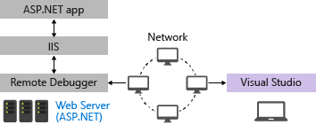
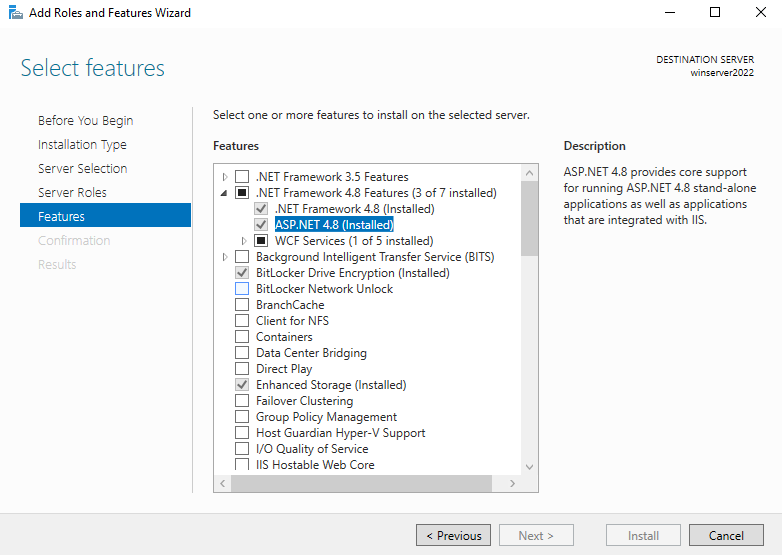

# Remote Debug ASP.NET on a Remote IIS Computer

To debug an ASP.NET application that has been deployed to IIS, install and run the remote tools on the computer where you deployed your app, and then attach to your running app from Visual Studio.



This guide explains how to set up and configure a Visual Studio ASP.NET MVC 4.8 application, deploy it to IIS, and attach the remote debugger from Visual Studio.

> [!NOTE]
> To remote debug ASP.NET Core instead, see [Remote Debug ASP.NET Core on an IIS Computer](../debugger/remote-debugging-aspnet-on-a-remote-iis-computer.md). For Azure App Service, see [Remote debug ASP.NET Core on Azure](/training/modules/dotnet-debug-visual-studio-azure-web-apps/) or, for Visual Studio Enterprise, use the [Snapshot Debugger](../debugger/debug-live-azure-applications.md) (.NET 4.6.1 required).

## Prerequisites

Visual Studio 2019 or a later version is required to follow the steps shown in this article.

These procedures have been tested on these server configurations:

* Windows Server 2022 and IIS 10
* Windows Server 2012 R2 and IIS 8 (For Windows Server 2008 R2, the server steps are different)

## Network requirements

The remote debugger is supported on Windows Server starting with Windows Server 2008 Service Pack 2. For a complete list of requirements, see [Requirements](../debugger/remote-debugging.md#requirements_msvsmon).

> [!NOTE]
> Debugging between two computers connected through a proxy is not supported. Debugging over a high latency or low-bandwidth connection, such as dialup Internet, or over the Internet across countries/regions is not recommended and might fail or be unacceptably slow.

## App already running in IIS?

This article includes steps on setting up a basic configuration of IIS on Windows server and deploying the app from Visual Studio. These steps are included to make sure that the server has required components installed, that the app can run correctly, and that you're ready to remote debug.

* If your app is running in IIS and you just want to download the remote debugger and start debugging, go to [Download and Install the remote tools on Windows Server](#BKMK_msvsmon).

* If you want help with ensuring your app is set up, deployed, and running correctly in IIS so that you can debug, follow all the steps in this article.

## Create the ASP.NET 4.8 application on the Visual Studio computer

1. Create a new MVC ASP.NET application.

    In Visual Studio, choose **File** > **Start window** to open the Start window, and then choose **Create a new project**. In the search box, type **asp.net framework**, and then choose **ASP.NET Web Application (.NET Framework)**. In the dialog box that appears, name the project **MyASPApp**, choose **ASP.NET Framework 4.8**, and then choose **Create**.

    Select **MVC** and choose **Create**.

1. Open the *HomeController.cs* file in the Controllers folder and set a breakpoint in the `return View;` statement in the `Privacy` method.

   In older templates, open the *Privacy.cshtml.cs* file and set a breakpoint in the `OnGet` method.

## <a name="bkmk_configureIIS"></a> Install and Configure IIS on Windows Server

[!INCLUDE [remote-debugger-install-iis-role](../debugger/includes/remote-debugger-install-iis-role.md)]

## Update browser security settings on Windows Server

If you're using an older version of Windows Server, you might need to add some domains as trusted sites to enable you to download some of the web server components. Add the trusted sites by going to **Internet Options > Security > Trusted Sites > Sites**. Add the following domains.

- microsoft.com
- go.microsoft.com
- download.microsoft.com
- iis.net

When you download the software, you might get requests to grant permission to load various web site scripts and resources. Some of these resources aren't required, but to simplify the process, select **Add** when prompted.

## <a name="BKMK_deploy_asp_net"></a> Install ASP.NET 4.8 on Windows Server

If you want more detailed information to install ASP.NET on IIS, see [IIS 8.0 Using ASP.NET 3.5 and ASP.NET 4.5](/iis/get-started/whats-new-in-iis-8/iis-80-using-aspnet-35-and-aspnet-45).

> [!NOTE]
> The Web Platform Installer reached End-of-Life on 7/1/22. For more information, see [Web Platform Installer - End of support and sunsetting the product/application feed](https://blogs.iis.net/iisteam/web-platform-installer-end-of-support-feed). You can directly install ASP.NET 4.8 from IIS.

1. In the left pane of Server Manager, select **IIS**. Right-click the server and select **Add Roles and Features**.

1. In the wizard, advance to the **Features** section and install ASP.NET 4.8.

    

    > [!NOTE]
    > If you are using Windows Server 2008 R2, install ASP.NET 4 instead using this command:

     **C:\Windows\Microsoft.NET\Framework64\v4.0.30319\aspnet_regiis.exe -ir**

1. Restart the system (or execute **net stop was /y** followed by **net start w3svc** from a command prompt to pick up a change to the system PATH).

## Choose a deployment option

If you need help with deploying the app to IIS, consider these options:

* Deploy by creating a publish settings file in IIS and importing the settings in Visual Studio. In some scenarios, this is a fast way to deploy your app. When you create the publish settings file, permissions are automatically set up in IIS.

* Deploy by publishing to a local folder and copying the output by a preferred method to a prepared app folder on IIS.

## (Optional) Deploy using a publish settings file

You can use this option to create a publish settings file and import it into Visual Studio.

> [!NOTE]
> If you want to configure Web Deploy manually instead of importing the publish settings, you will need to make sure that an app folder on the server is configured with the correct values and permissions (see [Configure ASP.NET Web site](#BKMK_deploy_asp_net)).

### Install and configure Web Deploy on Windows Server

[!INCLUDE [install-web-deploy-with-hosting-server](../deployment/includes/install-web-deploy-with-hosting-server.md)]

### Create the publish settings file in IIS on Windows Server

[!INCLUDE [install-web-deploy-with-hosting-server](../deployment/includes/create-publish-settings-iis.md)]

### Import the publish settings in Visual Studio and deploy

[!INCLUDE [install-web-deploy-with-hosting-server](../deployment/includes/import-publish-settings-vs.md)]

After the app deploys successfully, it should start automatically. If the app doesn't start after deployment, start the app in IIS to verify that it runs correctly. 

When you're ready, switch to a debug configuration.

> [!IMPORTANT]
> If you choose to debug a Release configuration, you disable debugging in the *web.config* file when you publish.

::: moniker range=">=vs-2022"
1. Select **More Options** > **Edit** to edit the profile, and then select **Settings**.
1. Select a **Debug** configuration, and then select **Remove additional files at destination** under the **File Publish** options.
1. Select **Save** and then republish the app.
::: moniker-end

::: moniker range="vs-2019"
1. Select **Edit** to edit the profile, and then select **Settings**.
1. Select a **Debug** configuration, and then select **Remove additional files at destination** under the **File Publish** options.
1. Select **Save** and then republish the app.
::: moniker-end

> [!WARNING]
> Using username and password credentials (basic authentication) is not the most secure method of authentication. Whenever possible, use alternative methods. For example, consider publishing to a package from Visual Studio, and then use *WebDeploy.exe* from a command line to deploy the package. With that method, you can use IIS Manager to configure authorized Windows users who can publish to the web server, and run *WebDeploy.exe* under that Windows user account. See [Installing and Configuring Web Deploy on IIS 8.0 or Later](/iis/install/installing-publishing-technologies/installing-and-configuring-web-deploy-on-iis-80-or-later). If you do use password credentials, be sure to use a strong password, and secure the password from being leaked or shared.

## (Optional) Deploy by publishing to a local folder

You can use this option to deploy your app if you want to copy the app to IIS using PowerShell, RoboCopy, or you want to manually copy the files.

### <a name="BKMK_deploy_asp_net"></a> Configure the ASP.NET Web site on the Windows Server computer

1. Open Windows Explorer and create a new folder, **C:\Publish**, where you later deploy the ASP.NET project.

2. If it's not already open, open the **Internet Information Services (IIS) Manager**. (In the left pane of Server Manager, select **IIS**. Right-click the server and select **Internet Information Services (IIS) Manager**.)

3. Under **Connections** in the left pane, go to **Sites**.

4. Select the **Default Web Site**, choose **Basic Settings**, and set the **Physical path** to **C:\Publish**.

5. Right-click the **Default Web Site** node and select **Add Application**.

6. Set the **Alias** field to **MyASPApp**, accept the default Application Pool (**DefaultAppPool**), and set the **Physical path** to **C:\Publish**.

7. Under **Connections**, select **Application Pools**. Open **DefaultAppPool** and set the Application pool field to **ASP.NET v4.0** (ASP.NET 4.5 isn't an option for the Application pool).

8. With the site selected in the IIS Manager, choose **Edit Permissions**, and make sure that IUSR, IIS_IUSRS, or the user configured for the Application Pool is an authorized user with Read & Execute rights.

   If you don't see one of these users with access, go through steps to add IUSR as a user with Read & Execute rights.

> [!IMPORTANT]
> For security information related to the built-in accounts, see [Understanding Built-In User and Group Accounts in IIS 7](/iis/get-started/planning-for-security/understanding-built-in-user-and-group-accounts-in-iis).

### Publish and Deploy the app by publishing to a local folder from Visual Studio

You can also publish and deploy the app using the file system or other tools.

For ASP.NET 4.8, make sure the web.config file lists the correct version of .NET.

- If you're targeting ASP.NET 4.8, make sure this version value is listed in the web.config file:

   ```xml
      <system.web>
        <compilation debug="true" targetFramework="4.8" />
        <httpRuntime targetFramework="4.8" />
        <httpModules>
          <add name="ApplicationInsightsWebTracking" type="Microsoft.ApplicationInsights.Web.ApplicationInsightsHttpModule, Microsoft.AI.Web" />
        </httpModules>
      </system.web>
      ```

- If you install ASP.NET 4 instead of 4.8, the version value should be specified as 4.0 in the web.config file.

Follow these steps to publish and deploy the app:

[!INCLUDE [remote-debugger-deploy-app-local](../debugger/includes/remote-debugger-deploy-app-local.md)]

## <a name="BKMK_msvsmon"></a> Download and Install the remote tools on Windows Server

Download the version of the remote tools that matches your version of Visual Studio.

[!INCLUDE [remote-debugger-download](../debugger/includes/remote-debugger-download.md)]

## <a name="BKMK_setup"></a> Set up the remote debugger on Windows Server

[!INCLUDE [remote-debugger-configuration](../debugger/includes/remote-debugger-configuration.md)]

> [!NOTE]
> If you need to add permissions for additional users, change the authentication mode, or port number for the remote debugger, see [Configure the remote debugger](../debugger/remote-debugging.md#configure_msvsmon).

For information on running the remote debugger as a service, see [Run the remote debugger as a service](../debugger/remote-debugging.md#bkmk_configureService).

## <a name="BKMK_attach"></a> Attach to the ASP.NET application from the Visual Studio computer

::: moniker range=">=vs-2022"

Starting in Visual Studio 2022 version 17.10 Preview 2, the Attach to Process dialog box has changed. If you need instructions that match the older dialog box, switch to the Visual Studio 2019 view (upper left version selector in the article).

1. On the Visual Studio computer, open the solution that you're trying to debug (**MyASPApp** if you're following all the steps in this article).

2. In Visual Studio, select **Debug > Attach to Process** (Ctrl + Alt + P).

   > [!TIP]
   > In Visual Studio 2017 and later versions, you can reattach to the same process you previously attached to by using **Debug > Reattach to Process...** (Shift + Alt + P).

3. Set the **Connection Type** to **Remote (Windows)**.

   The **Connection Target** option appears.

   Set the **Connection Target** to **\<remote computer name>** and press **Enter**.

   Verify that Visual Studio adds the required port to the computer name, which appears in the format: **\<remote computer name>:port**

   On Visual Studio 2022, you should see **\<remote computer name>:4026**

   The port is required. If you don't see the port number, add it manually.
::: moniker-end

::: moniker range="vs-2019"
1. On the Visual Studio computer, open the solution that you're trying to debug (**MyASPApp** if you're following all the steps in this article).

2. In Visual Studio, select **Debug > Attach to Process** (Ctrl + Alt + P).

   > [!TIP]
   > In Visual Studio 2017 and later versions, you can reattach to the same process you previously attached to by using **Debug > Reattach to Process...** (Shift + Alt + P).

3. Set the Qualifier field to **\<remote computer name>** and press **Enter**.

   Verify that Visual Studio adds the required port to the computer name, which appears in the format: **\<remote computer name>:port**

   On Visual Studio 2019, you should see **\<remote computer name>:4024**

   The port is required. If you don't see the port number, add it manually.
::: moniker-end
4. Select **Refresh**.

   You should see some processes appear in the **Available Processes** window.

   If you don't see any processes, try using the IP address instead of the remote computer name (the port is required). You can use `ipconfig` in a command line to get the IPv4 address.

   If you want to use the **Find** button, you might need to [open outbound UDP port 3702](#bkmk_openports) on the server.

5. Check  **Show processes from all users**.

6. Type the first letter of a process name to quickly find *w3wp.exe* for ASP.NET 4.5.

   If you have multiple processes showing w3wp.exe, check the User Name column. In some scenarios, the User Name column shows your app pool name, such as IIS APPPOOL\DefaultAppPool. If you see the App Pool, an easy way to identify the correct process is to create a new named App Pool for the app instance you want to debug, and then you can find it easily in the User Name column.

   ::: moniker range=">=vs-2022"
   
   ::: moniker-end
   ::: moniker range="vs-2019"
   
   ::: moniker-end

7. Select **Attach**.

8. Open the remote computer's website. In a browser, go to **http://\<remote computer name>**.

   You should see the ASP.NET web page.

9. In the running ASP.NET application, select the link to the **Privacy** page.

   The breakpoint should be hit in Visual Studio.

   If you're unable to attach or hit the breakpoint, see [Troubleshoot remote debugging](/troubleshoot/developer/visualstudio/debuggers/troubleshooting-remote-debugging).

## Troubleshooting IIS deployment

- If you can't connect to the host using the host name, try the IP address instead.
- Make sure the required ports are open on the remote server.
- Verify that the version of ASP.NET used in your app is the same as the version you installed on the server. For your app, you can view and set the version in the **Properties** page. To set the app to a different version, that version must be installed.
- If the app tried to open, but you see a certificate warning, choose to trust the site. If you already closed the warning, you can edit the publishing profile, a *.pubxml file, in your project and add the following element (for test only): `<AllowUntrustedCertificate>true</AllowUntrustedCertificate>`
- After it's deployed, start the app in IIS to test that it deployed correctly.
- Check the Output window in Visual Studio for status information, and check your error messages.

## <a name="bkmk_openports"></a> Open required ports on Windows Server

In most setups, required ports are opened by the installation of ASP.NET and the remote debugger. However, you might need to verify that ports are open.

> [!NOTE]
> On an Azure VM, you must open ports through the [Network security group](/azure/virtual-machines/windows/nsg-quickstart-portal).

Required ports:

* 80: Required for IIS.

::: moniker range=">=vs-2022"
* 4026: Required for remote debugging from Visual Studio 2022 (see [Remote Debugger Port Assignments](../debugger/remote-debugger-port-assignments.md) for more information).
::: moniker-end

* 4024: Required for remote debugging from Visual Studio 2019 (see [Remote Debugger Port Assignments](../debugger/remote-debugger-port-assignments.md) for more information).

* UDP 3702: (Optional) Discovery port enables you to the **Find** button when attaching to the remote debugger in Visual Studio.

In addition, these ports should already be opened by the ASP.NET installation:

* 8172: (Optional) Required for Web Deploy to deploy the app from Visual Studio.

### Open a port

1. To open a port on Windows Server, open the **Start** menu, search for **Windows Defender Firewall** or **Windows Firewall with Advanced Security**.

   For **Windows Defender Firewall**, choose **Advanced settings**.

1. Then choose **Inbound Rules > New Rule > Port**. Choose **Next** and under **Specific local ports**, enter the port number, select **Next**, then **Allow the Connection**, select Next, and add the name (**IIS**, **Web Deploy**, or **msvsmon**) for the Inbound Rule.

   If you want more details on configuring Windows Firewall, see [Configure the Windows Firewall for Remote Debugging](../debugger/configure-the-windows-firewall-for-remote-debugging.md).

1. Create more rules for the other required ports.
