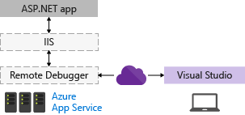
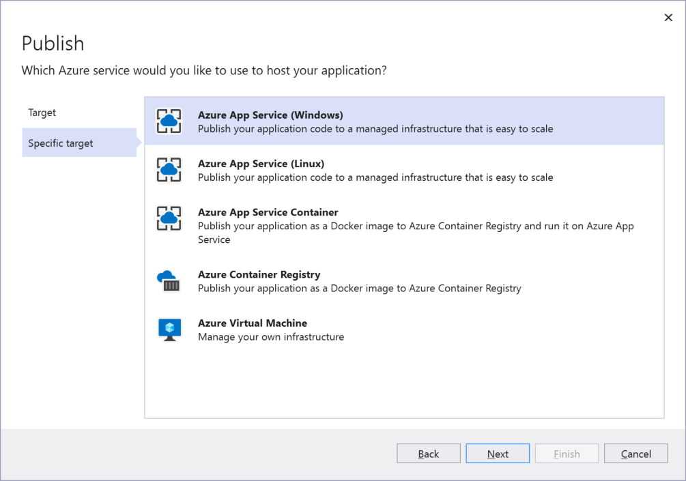
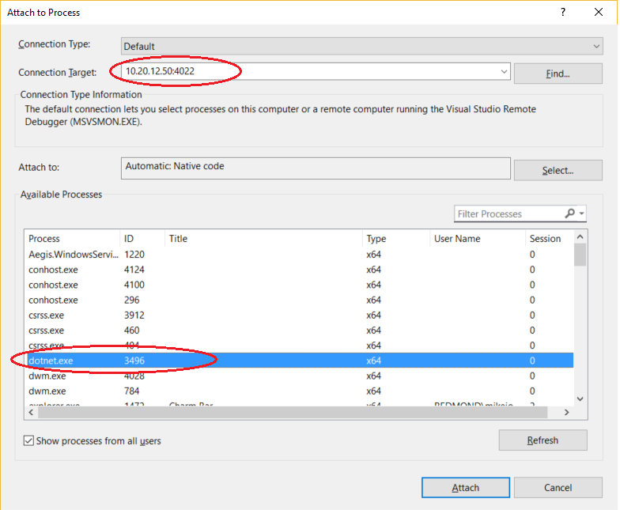

# Remote Debug ASP.NET Core on IIS in Azure in Visual Studio

This guide explains how to set up and configure a Visual Studio ASP.NET Core app, deploy it to IIS using Azure, and attach the remote debugger from Visual Studio.

For IIS scenarios, Linux is not supported.

The recommended way to remote debug on Azure depends on your scenario:

* To debug ASP.NET Core on Azure App Service, see [Debug Azure apps using the Snapshot Debugger](../debugger/debug-live-azure-applications.md). This is the recommended method.
* To debug ASP.NET Core on Azure App Service using more traditional debugging features, follow steps in this topic (see the section [Remote debug on Azure App Service](#remote_debug_azure_app_service)).

    In this scenario, you must deploy your app from Visual Studio to Azure but you do not need to manually install or configure IIS or the remote debugger (these components are represented with dotted lines), as shown in the following illustration.

    

* To debug IIS on an Azure VM, follow steps in this topic (see the section [Remote Debug on an Azure VM](#remote_debug_azure_vm)). This allows you to use a customized configuration of IIS, but the setup and deployment steps are more complicated.

    For an Azure VM, you must deploy your app from Visual Studio to Azure and you also need to manually install the IIS role and the remote debugger, as shown in the following illustration.

    

* To debug ASP.NET Core on Azure Service Fabric, see [Debug a remote Service Fabric application](/azure/service-fabric/service-fabric-debugging-your-application#debug-a-remote-service-fabric-application).

> [!WARNING]
> Be sure to delete the Azure resources that you create when you have completed the steps in this tutorial. That way you can avoid incurring unnecessary charges.

## Prerequisites

::: moniker range=">=vs-2019"
Visual Studio 2019 or later versions is required to follow the steps shown in this article.
::: moniker-end
::: moniker range="vs-2017"
Visual Studio 2017 is required to follow the steps shown in this article.
::: moniker-end

### Network requirements

Debugging between two computers connected through a proxy is not supported. Debugging over a high latency or low bandwidth connection, such as dialup Internet, or over the Internet across countries is not recommended and may fail or be unacceptably slow. For a complete list of requirements, see [Requirements](../debugger/remote-debugging.md#requirements_msvsmon).

## Create the ASP.NET Core application on the Visual Studio computer

1. Create a new ASP.NET Core web application.

    ::: moniker range=">=vs-2019"
    In Visual Studio 2019, choose **Create a new project** in the start window. If the start window is not open, choose **File** > **Start Window**. Type **web app**, choose **C#** as the language, then choose **ASP.NET Core Web Application (Model-View-Controller)**, and then choose **Next**. On the next screen, name the project **MyASPApp**, and then choose **Next**.

    Choose either the recommended target framework or .NET 6, and then choose **Create**.
    ::: moniker-end
    ::: moniker range="vs-2017"
    In Visual Studio 2017, choose **File > New > Project**, then select **Visual C# > Web > ASP.NET Core Web Application**. In the ASP.NET Core templates section, select **Web Application (Model-View-Controller)**. Make sure that ASP.NET Core 2.1 or later is selected, that **Enable Docker Support** is not selected and that **Authentication** is set to **No Authentication**. Name the project **MyASPApp**.
    ::: moniker-end

1. Open the About.cshtml.cs file and set a breakpoint in the `OnGet` method (in older templates, open HomeController.cs instead and set the breakpoint in the `About()` method).

##  Remote Debug ASP.NET Core on an Azure App Service (Windows)

From Visual Studio, you can quickly publish and debug your app to Azure App Service on Windows, which is based on a fully provisioned instance of IIS. If you are hosting IIS on a VM, try debugging on an [Azure VM](#remote_debug_azure_vm).)

::: moniker range=">= vs-2022"

1. Create a publish profile for Azure App Service using the Publish window.

1. In the profile, select the **...** menu under **Hosting**. Choose the **Attach Debugger** option.

   Visual Studio attempts to attach the remote debugger to the instance of Azure App Service (Windows) that the profile is publishing to.

   :::image type="content" source="../debugger/media/attach-debugger-publish-profile.png" alt-text="Screenshot of the Attach Debugger option from within the Publish summary page.":::

> [!NOTE]
> In Visual Studio 2022, Cloud Explorer is deprecated. Cloud Explorer provided the previous method of remote debugging Azure App Service.

::: moniker-end
::: moniker range="<= vs-2019"
#### To deploy the app and remote debug using Cloud Explorer

1. In Visual Studio, right-click the project node and choose **Publish**.

    If you have previously configured any publishing profiles, the **Publish** pane appears. Select either **New** or **New profile**.

1. Create a new publish profile.

    Choose **Azure** from the **Publish** dialog box and select **Next**. Then choose **Azure App Service (Windows)**, select **Next**, and follow the prompts to create a profile.

    

    In Visual Studio 2017, choose **Azure App Service** from the **Publish** dialog box, select **Create New**, and follow the prompts to create a profile.

    For more detailed instructions, see [Deploy an ASP.NET Core web app to Azure using Visual Studio](/aspnet/core/tutorials/publish-to-azure-webapp-using-vs).

1. In the Publish window, choose **Edit Configuration** and switch to a Debug configuration, and then choose **Publish**.

   A Debug configuration is required to debug the app.

1. Open **Cloud Explorer** (**View** > **Cloud Explorer**), right-click on the App Service instance and choose **Attach Debugger**.

   If Cloud Explorer is not available, open Server Explorer instead. Then, right-click on the App Service instance in Server Explorer and choose **Attach Debugger**.

1. In the running ASP.NET application, click the link to the **About** page.

    The breakpoint should be hit in Visual Studio.

    That's it! The rest of the steps in this topic apply to remote debugging on an Azure VM.

::: moniker-end

##  Remote Debug ASP.NET Core on an Azure VM

You can create an Azure VM for Windows Server and then install and configure IIS and the other required software components. This takes more time than deploying to an Azure App Service and requires that you follow the remaining steps in this tutorial.

These procedures have been tested on these server configurations:

* Windows Server 2012 R2 and IIS 8
* Windows Server 2016 and IIS 10
* Windows Server 2019 and IIS 10

### App already running in IIS on the Azure VM?

This article includes steps on setting up a basic configuration of IIS on Windows server and deploying the app from Visual Studio. These steps are included to make sure that the server has the required components installed, that the app can run correctly, and that you are ready to remote debug.

* If your app is running in IIS and you just want to download the remote debugger and start debugging, go to [Download and Install the remote tools on Windows Server](#BKMK_msvsmon).

* If you want help to make sure that your app is set up, deployed, and running correctly in IIS so that you can debug, follow all the steps in this topic.

  * Before you begin, follow all the steps described in [Create a Windows Virtual Machine](/azure/virtual-machines/windows/quick-create-portal), which includes steps to install the IIS web server.

  * Make sure you open port 80 in the Azure [Network security group](/azure/virtual-machines/windows/nsg-quickstart-portal). When you verify that port 80 is open, also open the [correct port](#bkmk_openports) for the remote debugger (4026, 4024, or 4022). That way, you won't have to open it later. If you're using Web Deploy, also open port 8172.

### Update browser security settings on Windows Server

If Enhanced Security Configuration is enabled in Internet Explorer (it is enabled by default), then you may need to add some domains as trusted sites to enable you to download some of the web server components. Add the trusted sites by going to **Internet Options > Security > Trusted Sites > Sites**. Add the following domains.

- microsoft.com
- go.microsoft.com
- download.microsoft.com
- iis.net

When you download the software, you may get requests to grant permission to load various web site scripts and resources. Some of these resources are not required, but to simplify the process, click **Add** when prompted.

### Install ASP.NET Core on Windows Server

1. Install the .NET Core Hosting Bundle on the hosting system. The bundle installs the .NET Core Runtime, .NET Core Library, and the ASP.NET Core Module. For more in-depth instructions, see [Publishing to IIS](/aspnet/core/publishing/iis?tabs=aspnetcore2x#iis-configuration).

    For the current .NET Core hosting bundle, install the [ASP.NET Core Hosting Bundle](https://dotnet.microsoft.com/permalink/dotnetcore-current-windows-runtime-bundle-installer).
    For .NET Core 2, install the [.NET Core Windows Server Hosting](https://aka.ms/dotnetcore-2-windowshosting).

    > [!NOTE]
    > If the system doesn't have an Internet connection, obtain and install the *[Microsoft Visual C++ 2015 Redistributable](https://www.microsoft.com/download/details.aspx?id=53840)* before installing the .NET Core Windows Server Hosting bundle.

2. Restart the system (or execute **net stop was /y** followed by **net start w3svc** from a command prompt to pick up a change to the system PATH).

## Choose a deployment option

If you need help to deploy the app to IIS, consider these options:

* Deploy by creating a publish settings file in IIS and importing the settings in Visual Studio. In some scenarios, this is a fast way to deploy your app. When you create the publish settings file, permissions are automatically set up in IIS.

* Deploy by publishing to a local folder and copying the output by a preferred method to a prepared app folder on IIS.

## (Optional) Deploy using a publish settings file

You can use this option create a publish settings file and import it into Visual Studio.

> [!NOTE]
> This deployment method uses Web Deploy, which must be installed on the server. If you want to configure Web Deploy manually instead of importing the settings, you can install Web Deploy 3.6 instead of Web Deploy 3.6 for Hosting Servers. However, if you configure Web Deploy manually, you will need to make sure that an app folder on the server is configured with the correct values and permissions (see [Configure ASP.NET Web site](#BKMK_deploy_asp_net)).

### Configure the ASP.NET Core web site

1. In IIS Manager, in the left pane under **Connections**, select **Application Pools**. Open **DefaultAppPool** and set the **.NET CLR version** to **No Managed Code**. This is required for ASP.NET Core. The Default Web Site uses the DefaultAppPool.

2. Stop and restart the DefaultAppPool.

### Install and configure Web Deploy for Hosting Servers on Windows Server

[!INCLUDE [install-web-deploy-with-hosting-server](../deployment/includes/install-web-deploy-with-hosting-server.md)]

### Create the publish settings file in IIS on Windows Server

[!INCLUDE [install-web-deploy-with-hosting-server](../deployment/includes/create-publish-settings-iis.md)]

### Import the publish settings in Visual Studio and deploy

[!INCLUDE [install-web-deploy-with-hosting-server](../deployment/includes/import-publish-settings-vs.md)]

> [!NOTE]
> If you restart an Azure VM, the IP address may change.

After the app deploys successfully, it should start automatically. If the app does not start from Visual Studio, start the app in IIS to verify that it runs correctly. For ASP.NET Core, you also need to make sure that the Application pool field for the **DefaultAppPool** is set to **No Managed Code**.

1. In the **Settings** dialog box, enable debugging by clicking **Next**, choose a **Debug** configuration, and then choose **Remove additional files at destination** under the **File Publish** options.

    > [!IMPORTANT]
    > If you choose a Release configuration, you disable debugging in the *web.config* file when you publish.

1. Click **Save** and then republish the app.

## (Optional) Deploy by publishing to a local folder

You can use this option to deploy your app if you want to copy the app to IIS using PowerShell, RoboCopy, or you want to manually copy the files.

###  Configure the ASP.NET Core Web site on the Windows Server computer

If you are importing publish settings, you can skip this section.

1. Open the **Internet Information Services (IIS) Manager** and go to **Sites**.

2. Right-click the **Default Web Site** node and select **Add Application**.

3. Set the **Alias** field to **MyASPApp** and the Application pool field to **No Managed Code**. Set the **Physical path** to **C:\Publish** (where you will later deploy the ASP.NET Core project).

4. With the site selected in the IIS Manager, choose **Edit Permissions**, and make sure that IUSR, IIS_IUSRS, or the user configured for the Application Pool is an authorized user with Read & Execute rights.

    If you don't see one of these users with access, go through steps to add IUSR as a user with Read & Execute rights.

### (Optional) Publish and Deploy the app by publishing to a local folder from Visual Studio

If you're not using Web Deploy, you must publish and deploy the app using the file system or other tools. You can start by creating a package using the file system, and then either deploy the package manually or use other tools like PowerShell, Robocopy, or XCopy. In this section, we assume you are manually copying the package if you are not using Web Deploy.

[!INCLUDE [remote-debugger-deploy-app-local](../debugger/includes/remote-debugger-deploy-app-local.md)]

###  Download and Install the remote tools on Windows Server

Download the version of the remote tools that matches your version of Visual Studio.

[!INCLUDE [remote-debugger-download](../debugger/includes/remote-debugger-download.md)]

###  Set up the remote debugger on Windows Server

[!INCLUDE [remote-debugger-configuration](../debugger/includes/remote-debugger-configuration.md)]

> [!NOTE]
> If you need to add permissions for additional users, change the authentication mode, or port number for the remote debugger, see [Configure the remote debugger](../debugger/remote-debugging.md#configure_msvsmon).

###  Attach to the ASP.NET application from the Visual Studio computer

1. On the Visual Studio computer, open the solution that you are trying to debug (**MyASPApp** if you are following the steps in this article).
2. In Visual Studio, click **Debug > Attach to Process** (Ctrl + Alt + P).

    > [!TIP]
    > In Visual Studio 2017 and later versions, you can re-attach to the same process you previously attached to by using **Debug > Reattach to Process...** (Shift+Alt+P).

3. Set the Qualifier field to **\<remote computer name>** and press **Enter**.

    Verify that Visual Studio adds the required port to the computer name, which appears in the format: **\<remote computer name>:port**

    ::: moniker range=">=vs-2022"
    On Visual Studio 2022, you should see **\<remote computer name>:4026**
    ::: moniker-end
    ::: moniker range="vs-2019"
    On Visual Studio 2019, you should see **\<remote computer name>:4024**
    ::: moniker-end
    ::: moniker range="vs-2017"
    On Visual Studio 2017, you should see **\<remote computer name>:4022**
    ::: moniker-end
    The port is required. If you don't see the port number, add it manually.

4. Click **Refresh**.
    You should see some processes appear in the **Available Processes** window.

    If you don't see any processes, try using the IP address instead of the remote computer name (the port is required). You can use `ipconfig` in a command line to get the IPv4 address.

    If you want to use the **Find** button, you may need to [open UDP port 3702](#bkmk_openports) on the server.

5. Check  **Show processes from all users**.

6. Type the first letter of your process name to quickly find your app.

    * If you're using the [in-process hosting model](/aspnet/core/host-and-deploy/aspnet-core-module?view=aspnetcore-3.1&preserve-view=true#hosting-models) on IIS, select the correct **w3wp.exe** process. Starting in .NET Core 3, this is the default.

    * Otherwise, select the **dotnet.exe** process. (This is the out-of-process hosting model.)

    If you have multiple processes showing *w3wp.exe* or *dotnet.exe*, check the **User Name** column. In some scenarios, the **User Name** column shows your app pool name, such as **IIS APPPOOL\DefaultAppPool**. If you see the App Pool, but it's not unique, create a new named App Pool for the app instance you want to debug, and then you can find it easily in the **User Name** column.

    ::: moniker range=">=vs-2019"
    
    ::: moniker-end
    ::: moniker range="vs-2017"
    
    ::: moniker-end

7. Click **Attach**.

8. Open the remote computer's website. In a browser, go to **http://\<remote computer name>**.

    You should see the ASP.NET web page.
9. In the running ASP.NET application, click the link to the **About** page.

    The breakpoint should be hit in Visual Studio.

## Troubleshooting IIS deployment

- If you can't connect to the host using the host name, try the IP address instead.
- Make sure the required ports are open on the remote server.
- For ASP.NET Core, you need to make sure that the Application pool field for the **DefaultAppPool** is set to **No Managed Code**.
- Verify that the version of ASP.NET used in your app is the same as the version you installed on the server. For your app, you can view and set the version in the **Properties** page. To set the app to a different version, that version must be installed.
- If the app tried to open, but you see a certificate warning, choose to trust the site. If you already closed the warning, you can edit the publishing profile, a *.pubxml file, in your project and add the following element (for test only): `<AllowUntrustedCertificate>true</AllowUntrustedCertificate>`
- If the app does not start from Visual Studio, start the app in IIS to test that it deployed correctly.
- Check the Output window in Visual Studio for status information, and check your error messages.

###  Open required ports on Windows Server

In most setups, required ports are opened by the installation of ASP.NET and the remote debugger. However, if you are troubleshooting deployment issues and the app is hosted behind a firewall, you may need to verify that the correct ports are open.

On an Azure VM, you must open ports through the [Network security group](/azure/virtual-machines/windows/nsg-quickstart-portal).

Required ports:

* 80 - Required for IIS
::: moniker range=">=vs-2022"
* 4026 - Required for remote debugging from Visual Studio 2022 (see [Remote Debugger Port Assignments](../debugger/remote-debugger-port-assignments.md) for more information).
::: moniker-end
::: moniker range="vs-2019"
* 4024 - Required for remote debugging from Visual Studio 2019 (see [Remote Debugger Port Assignments](../debugger/remote-debugger-port-assignments.md) for more information).
::: moniker-end
::: moniker range="vs-2017"
* 4022 - Required for remote debugging from Visual Studio 2017 (see [Remote Debugger Port Assignments](../debugger/remote-debugger-port-assignments.md) for more information).
::: moniker-end
* UDP 3702 - (Optional) Discovery port enables you to the **Find** button when attaching to the remote debugger in Visual Studio.

In addition, these ports should already be opened by the ASP.NET installation:
- 8172 - (Optional) Required for Web Deploy to deploy the app from Visual Studio
