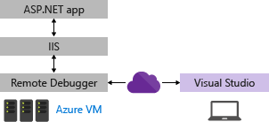
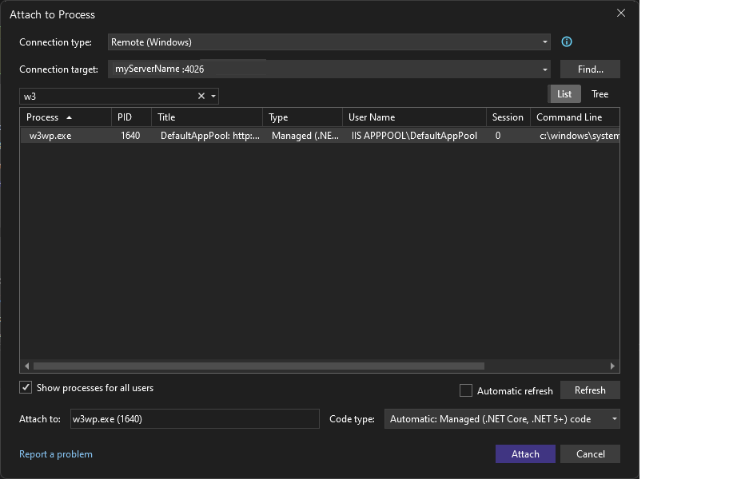
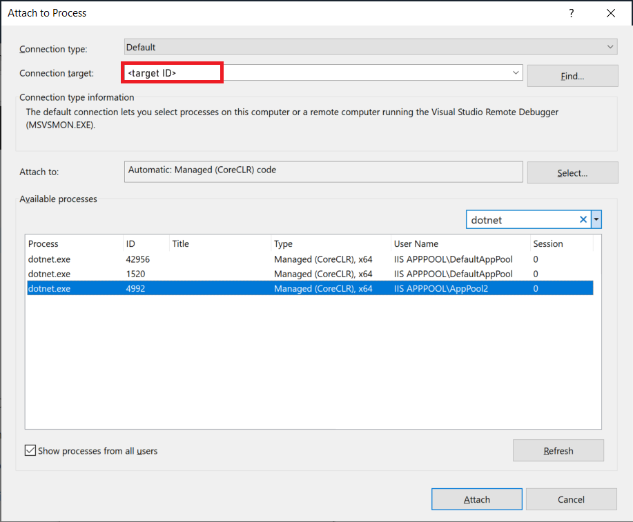

# Remote Debug ASP.NET Core on IIS using an Azure VM from Visual Studio

This guide explains how to set up and configure a Visual Studio ASP.NET Core app, deploy it to IIS using an Azure VM, and attach the remote debugger from Visual Studio.

For IIS scenarios, Linux isn't supported.

To debug IIS on an Azure VM, follow the steps in this article. Using this method, you can use a customized configuration of IIS, but the setup and deployment steps are more complicated. If you don't need to customize IIS for your scenario, you might choose simpler methods to host and debug the app in [Azure App Service](../debugger/remote-debugging-azure-app-service.md) instead.

For an Azure VM, you must deploy your app from Visual Studio to Azure and you also need to manually install the IIS role and the remote debugger, as shown in the following illustration.

> [!WARNING]
> Be sure to delete the Azure resources that you create when you have completed the steps in this tutorial. That way you can avoid incurring unnecessary charges.

These procedures have been tested on these server configurations:

* Windows Server 2022 and IIS 10
* Windows Server 2019 and IIS 10
* Windows Server 2016 and IIS 10

## Prerequisites

Visual Studio 2019 or later versions is required to follow the steps shown in this article.

### Network requirements

Debugging between two computers connected through a proxy isn't supported. Debugging over a high latency or low bandwidth connection, such as dialup Internet, or over the Internet across countries/regions isn't recommended and might fail or be unacceptably slow. For a complete list of requirements, see [Requirements](../debugger/remote-debugging.md#requirements_msvsmon).

## App already running in IIS on the Azure VM?

This article includes steps on setting up a basic configuration of IIS on Windows server and deploying the app from Visual Studio. These steps are included to make sure that the server has the required components installed, that the app can run correctly, and that you're ready to remote debug.

* If your app is running in IIS and you just want to download the remote debugger and start debugging, go to [Download and Install the remote tools on Windows Server](#BKMK_msvsmon).

* If you want help ensuring your app is set up, deployed, and running correctly in IIS so that you can debug, follow all the steps in this article.

  * Before you begin, follow all the steps described in [Create a Windows Virtual Machine](/azure/virtual-machines/windows/quick-create-portal), which includes steps to install the IIS web server.

  * Make sure you open port 80 in the Azure [Network security group](/azure/virtual-machines/windows/nsg-quickstart-portal). When you verify that port 80 is open, also open the [correct port](#bkmk_openports) for the remote debugger (4026, 4024, or 4022). That way, you don't have to open it later. If you're using Web Deploy, also open port 8172.

## Create the ASP.NET Core application on the Visual Studio computer

1. Create a new ASP.NET Core web application.

   In Visual Studio, choose **File** > **Start window** to open the Start window, and then choose **Create a new project**. In the search box, type **web app**, then choose **C#** as the language, then choose **ASP.NET Core Web Application (Model-View-Controller)**, and then choose **Next**. On the next screen, name the project **MyASPApp**, and then choose **Next**.

   Choose either the recommended target framework or .NET 8, and then choose **Create**. The version must match the version installed on the server.

1. Open the *HomeController.cs* file in the Controllers folder and set a breakpoint in the `return View;` statement in the `Privacy` method.

   In older templates, open the *Privacy.cshtml.cs* file and set a breakpoint in the `OnGet` method.

## Update browser security settings on Windows Server

If you're using an older version of Windows Server, you might need to add some domains as trusted sites to enable you to download some of the web server components. Add the trusted sites by going to **Internet Options > Security > Trusted Sites > Sites**. Add the following domains.

- microsoft.com
- go.microsoft.com
- download.microsoft.com
- iis.net

When you download the software, you might get requests to grant permission to load various web site scripts and resources. Some of these resources aren't required, but to simplify the process, select **Add** when prompted.

## Install ASP.NET Core on Windows Server

1. Install the .NET Core Hosting Bundle on the hosting system. The bundle installs the .NET Core Runtime, .NET Core Library, and the ASP.NET Core Module. For more in-depth instructions, see [Publishing to IIS](/aspnet/core/publishing/iis?tabs=aspnetcore2x#iis-configuration).

   For the current .NET Core hosting bundle, install the [ASP.NET Core Hosting Bundle](https://dotnet.microsoft.com/permalink/dotnetcore-current-windows-runtime-bundle-installer).

   > [!NOTE]
   > If you previously installed IIS, the ASP.NET Core IIS Module gets installed with ASP.NET Core. Otherwise, install the ASP.NET Core IIS Module manually.

   For .NET Core 2, install the [.NET Core Windows Server Hosting](https://aka.ms/dotnetcore-2-windowshosting).

   > [!NOTE]
   > If the system doesn't have an Internet connection, obtain and install the *[Microsoft Visual C++ 2015 Redistributable](https://www.microsoft.com/download/details.aspx?id=53840)* before installing the .NET Core Windows Server Hosting bundle.

1. Restart the system (or execute **net stop was /y** followed by **net start w3svc** from a command prompt to pick up a change to the system PATH).

## Choose a deployment option

If you need help deploying the app to IIS, consider these options:

* Deploy by creating a publish settings file in IIS and importing the settings in Visual Studio. In some scenarios, this approach is a fast way to deploy your app. When you create the publish settings file, permissions are automatically set up in IIS.

* Deploy by publishing to a local folder and copying the output by a preferred method to a prepared app folder on IIS.

## (Optional) Deploy using a publish settings file

You can use this option create a publish settings file and import it into Visual Studio.

> [!NOTE]
> This deployment method uses Web Deploy, which must be installed on the server. If you want to configure Web Deploy manually instead of importing the settings, you can install Web Deploy 3.6 instead of Web Deploy 3.6 for Hosting Servers. However, if you configure Web Deploy manually, you will need to make sure that an app folder on the server is configured with the correct values and permissions (see [Configure ASP.NET Web site](#BKMK_deploy_asp_net)).

### Configure the ASP.NET Core web site

1. In IIS Manager, in the left pane under **Connections**, select **Application Pools**. Open **DefaultAppPool** and set the **.NET CLR version** to **No Managed Code**. This is required for ASP.NET Core. The Default Web Site uses the DefaultAppPool.

1. Stop and restart the DefaultAppPool.

### Install and configure Web Deploy on Windows Server

[!INCLUDE [install-web-deploy-with-hosting-server](../deployment/includes/install-web-deploy-with-hosting-server.md)]

### Create the publish settings file in IIS on Windows Server

[!INCLUDE [install-web-deploy-with-hosting-server](../deployment/includes/create-publish-settings-iis.md)]

### Import the publish settings in Visual Studio and deploy

[!INCLUDE [install-web-deploy-with-hosting-server](../deployment/includes/import-publish-settings-vs.md)]

> [!NOTE]
> If you restart an Azure VM, the IP address might change.

After the app deploys successfully, it should start automatically.

- If the app doesn't start after deployment, start the app in IIS to verify that it runs correctly. 
- For ASP.NET Core, make sure the Application pool field for the **DefaultAppPool** is set to **No Managed Code**.

When you're ready, switch to a debug configuration.

> [!IMPORTANT]
> If you choose to debug a Release configuration, you disable debugging in the *web.config* file when you publish.

::: moniker range=">=vs-2022"
1. Select **More Options** > **Edit** to edit the profile, and then select **Settings**.
1. Select **Save** and then republish the app.
1. Select a **Debug** configuration, and then select **Remove additional files at destination** under the **File Publish** options.
::: moniker-end

::: moniker range="vs-2019"
1. Select **Edit** to edit the profile, and then select **Settings**.
1. Select **Save** and then republish the app.
1. Select a **Debug** configuration, and then select **Remove additional files at destination** under the **File Publish** options.
::: moniker-end

> [!WARNING]
> Using username and password credentials (basic authentication) is not the most secure method of authentication. Whenever possible, use alternative methods. For example, consider publishing to a package from Visual Studio, and then use *WebDeploy.exe* from a command line to deploy the package. With that method, you can use IIS Manager to configure authorized Windows users who can publish to the web server, and run *WebDeploy.exe* under that Windows user account. See [Installing and Configuring Web Deploy on IIS 8.0 or Later](/iis/install/installing-publishing-technologies/installing-and-configuring-web-deploy-on-iis-80-or-later). If you do use password credentials, be sure to use a strong password, and secure the password from being leaked or shared.

## (Optional) Deploy by publishing to a local folder

You can use this option to deploy your app if you want to copy the app to IIS using PowerShell, RoboCopy, or you want to manually copy the files.

###  Configure the ASP.NET Core Web site on the Windows Server computer

If you're importing publish settings, you can skip this section.

1. Open the **Internet Information Services (IIS) Manager** and go to **Sites**.

1. Right-click the **Default Web Site** node and select **Add Application**.

1. Set the **Alias** field to **MyASPApp** and the Application pool field to **No Managed Code**. Set the **Physical path** to **C:\Publish** (where you later deploy the ASP.NET Core project).

1. With the site selected in the IIS Manager, choose **Edit Permissions**, and make sure that IUSR, IIS_IUSRS, or the user configured for the Application Pool is an authorized user with Read & Execute rights.

   If you don't see one of these users with access, go through steps to add IUSR as a user with Read & Execute rights.

> [!IMPORTANT]
> For security information related to the built-in accounts, see [Understanding Built-In User and Group Accounts in IIS 7](/iis/get-started/planning-for-security/understanding-built-in-user-and-group-accounts-in-iis).

### (Optional) Publish and Deploy the app by publishing to a local folder from Visual Studio

If you're not using Web Deploy, you must publish and deploy the app using the file system or other tools. You can start by creating a package using the file system, and then either deploy the package manually or use other tools like PowerShell, Robocopy, or XCopy. In this section, we assume you're manually copying the package if you aren't using Web Deploy.

[!INCLUDE [remote-debugger-deploy-app-local](../debugger/includes/remote-debugger-deploy-app-local.md)]

###  Download and Install the remote tools on Windows Server

Download the version of the remote tools that matches your version of Visual Studio.

[!INCLUDE [remote-debugger-download](../debugger/includes/remote-debugger-download.md)]

###  Set up the remote debugger on Windows Server

[!INCLUDE [remote-debugger-configuration](../debugger/includes/remote-debugger-configuration.md)]

> [!NOTE]
> If you need to add permissions for additional users, change the authentication mode, or port number for the remote debugger, see [Configure the remote debugger](../debugger/remote-debugging.md#configure_msvsmon).

###  Attach to the ASP.NET Core application from the Visual Studio computer

::: moniker range=">=vs-2022"

Starting in Visual Studio 2022 version 17.10 Preview 2, the Attach to Process dialog box has changed. If you need instructions that match the older dialog box, switch to the Visual Studio 2019 view (upper left version selector in the article).

1. On the Visual Studio computer, open the solution that you're trying to debug (**MyASPApp** if you're following all the steps in this article).

2. In Visual Studio, select **Debug > Attach to Process** (Ctrl + Alt + P).

   > [!TIP]
   > In Visual Studio 2017 and later versions, you can reattach to the same process you previously attached to by using **Debug > Reattach to Process...** (Shift + Alt + P).

3. Set the **Connection Type** to **Remote (Windows)**.

   The **Connection Target** option appears.

   Set the **Connection Target** to **\<remote computer name>** and press **Enter**.

   Verify that Visual Studio adds the required port to the computer name, which appears in the format: **\<remote computer name>:port**

   On Visual Studio 2022, you should see **\<remote computer name>:4026**

   The port is required. If you don't see the port number, add it manually.
::: moniker-end

::: moniker range="vs-2019"
1. On the Visual Studio computer, open the solution that you're trying to debug (**MyASPApp** if you're following all the steps in this article).

2. In Visual Studio, select **Debug > Attach to Process** (Ctrl + Alt + P).

   > [!TIP]
   > In Visual Studio 2017 and later versions, you can reattach to the same process you previously attached to by using **Debug > Reattach to Process...** (Shift + Alt + P).

3. Set the Qualifier field to **\<remote computer name>** and press **Enter**.

   Verify that Visual Studio adds the required port to the computer name, which appears in the format: **\<remote computer name>:port**

   On Visual Studio 2019, you should see **\<remote computer name>:4024**

   The port is required. If you don't see the port number, add it manually.
::: moniker-end
4. Select **Refresh**.

   You should see some processes appear in the **Available Processes** window.

   If you don't see any processes, try using the IP address instead of the remote computer name (the port is required). You can use `ipconfig` in a command line to get the IPv4 address.

   If you want to use the **Find** button, you might need to [open outbound UDP port 3702](#bkmk_openports) on the server.

5. Check  **Show processes from all users**.

6. Type the first letter of your process name to quickly find your app.

   * If you're using the [in-process hosting model](/aspnet/core/host-and-deploy/aspnet-core-module?view=aspnetcore-3.1&preserve-view=true#hosting-models) on IIS, select the correct **w3wp.exe** process. Starting in .NET Core 3, this process is the default.

   * Otherwise, select the **dotnet.exe** process. (This is the out-of-process hosting model.)

   If you have multiple processes showing *w3wp.exe* or *dotnet.exe*, check the **User Name** column. In some scenarios, the **User Name** column shows your app pool name, such as **IIS APPPOOL\DefaultAppPool**. If you see the App Pool, but it's not unique, create a new named App Pool for the app instance you want to debug, and then you can find it easily in the **User Name** column.

   ::: moniker range=">=vs-2022"
   
   ::: moniker-end
   ::: moniker range="vs-2019"
   
   ::: moniker-end

7. Select **Attach**.

8. Open the remote computer's website. In a browser, go to **http://\<remote computer name>**.

   You should see the ASP.NET web page.

9. In the running ASP.NET application, select the link to the **Privacy** page.

   The breakpoint should be hit in Visual Studio.

   If you're unable to attach or hit the breakpoint, see [Troubleshoot remote debugging](/troubleshoot/developer/visualstudio/debuggers/troubleshooting-remote-debugging).

## Troubleshooting IIS deployment

- If you can't connect to the host using the host name, try the IP address instead.
- Make sure the required ports are open on the remote server.
- For ASP.NET Core, you need to make sure that the Application pool field for the **DefaultAppPool** is set to **No Managed Code**.
- Verify that the version of ASP.NET used in your app is the same as the version you installed on the server. For your app, you can view and set the version in the **Properties** page. To set the app to a different version, that version must be installed.
- If the app tried to open, but you see a certificate warning, choose to trust the site. If you already closed the warning, you can edit the publishing profile, a *.pubxml file, in your project and add the following element (for test only): `<AllowUntrustedCertificate>true</AllowUntrustedCertificate>`
- After it's deployed, start the app in IIS to test that it deployed correctly.
- Check the Output window in Visual Studio for status information, and check your error messages.

###  Open required ports on Windows Server

In most setups, required ports are opened by the installation of ASP.NET and the remote debugger. However, if you're troubleshooting deployment issues and the app is hosted behind a firewall, you might need to verify that the correct ports are open.

On an Azure VM, you must open ports through:

- The [Network security group](/azure/virtual-machines/windows/nsg-quickstart-portal).
- The [firewall on Windows Server](../debugger/remote-debugging-aspnet-on-a-remote-iis-computer.md#open-a-port)

Required ports:

* 80 - Required for IIS
::: moniker range=">=vs-2022"
* 4026 - Required for remote debugging from Visual Studio 2022 (see [Remote Debugger Port Assignments](../debugger/remote-debugger-port-assignments.md) for more information).
::: moniker-end
::: moniker range="vs-2019"
* 4024 - Required for remote debugging from Visual Studio 2019 (see [Remote Debugger Port Assignments](../debugger/remote-debugger-port-assignments.md) for more information).
::: moniker-end

* UDP 3702 - (Optional) The Discovery port enables you to the **Find** button when attaching to the remote debugger in Visual Studio. This must be an outbound port (outbound rule).

In addition, these ports should already be opened by the ASP.NET Core installation:
- 8172 - (Optional) Required for Web Deploy to deploy the app from Visual Studio
