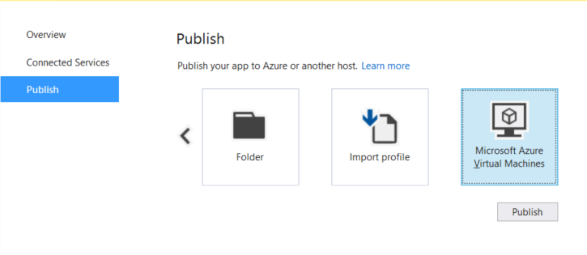
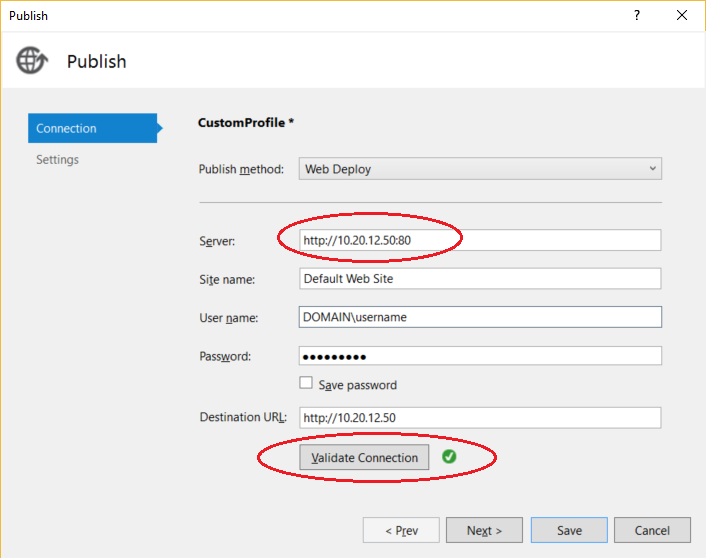

# Remote Debug ASP.NET Core on IIS in Azure in Visual Studio 2017

This guide explains how to set up and configure a Visual Studio 2017 ASP.NET Core app, deploy it to IIS using Azure, and attach the remote debugger from Visual Studio.

The recommended way to remote debug on Azure depends on your scenario:

* To debug ASP.NET Core on Azure App Service, see [Debug Azure apps using the Snapshot Debugger](../debugger/debug-live-azure-applications.md). This is the recommended method.
* To debug ASP.NET Core on Azure App Service using more traditional debugging features, follow steps in this topic (see the section [Remote debug on Azure App Service](#remote_debug_azure_app_service)).

    In this scenario, you must deploy your app from Visual Studio to Azure but you do not need to manually install or configure IIS or the remote debugger (these components are represented with dotted lines), as shown in the following illustration.

    

* To debug IIS on an Azure VM, follow steps in this topic (see the section [Remote Debug on an Azure VM](#remote_debug_azure_vm)). This allows you to use a customized configuration of IIS, but the setup and deployment steps are more complicated.

    For an Azure VM, you must deploy your app from Visual Studio to Azure and you also need to manually install the IIS role and the remote debugger, as shown in the following illustration.

    

* To debug ASP.NET Core on Azure Service Fabric, see [Debug a remote Service Fabric application](/azure/service-fabric/service-fabric-debugging-your-application#debug-a-remote-service-fabric-application).

> [!WARNING]
> Be sure to delete the Azure resources that you create when you have completed the steps in this tutorial. That way you can avoid incurring unnecessary charges.

### Requirements

Debugging between two computers connected through a proxy is not supported. Debugging over a high latency or low bandwidth connection, such as dialup Internet, or over the Internet across countries is not recommended and may fail or be unacceptably slow. For a complete list of requirements, see [Requirements](../debugger/remote-debugging.md#requirements_msvsmon).

## Create the ASP.NET Core application on the Visual Studio 2017 computer 

1. Create a new ASP.NET Core application. (Choose **File > New > Project**, then select **Visual C# > Web > ASP.NET Core Web Application**).

    In the **ASP.NET Core** templates section, select **Web Application**.

2. Make sure that **ASP.NET Core 2.0** is selected, that **Enable Docker Support** is **not** selected and that **Authentication** is set to **No Authentication**.

3. Name the project **MyASPApp** and click **OK** to create the new solution.

4. Open the About.cshtml.cs file and set a breakpoint in the `OnGet` method (in older templates, open HomeController.cs instead and set the breakpoint in the `About()` method).

##  Remote Debug ASP.NET Core on an Azure App Service

From Visual Studio, you can quickly publish and debug your app to a fully provisioned instance of IIS. However, the configuration of IIS is preset and you cannot customize it. For more detailed instructions, see [Deploy an ASP.NET Core web app to Azure using Visual Studio](/aspnet/core/tutorials/publish-to-azure-webapp-using-vs). (If you need the ability to customize IIS, try debugging on an [Azure VM](#BKMK_azure_vm).) 

#### To deploy the app and remote debug using Server Explorer

1. In Visual Studio, right-click the project node and choose **Publish**.

2. Choose **Microsoft Azure App Service** from the **Publish** dialog box, select **Create New**, and follow the prompts to publish.

    For detailed instructions, see [Deploy an ASP.NET Core web app to Azure using Visual Studio](/aspnet/core/tutorials/publish-to-azure-webapp-using-vs).

3. Open **Server Explorer** (**View** > **Server Explorer**), right-click on the App Service instance and choose **Attach Debugger**.

4. In the running ASP.NET application, click the link to the **About** page.

    The breakpoint should be hit in Visual Studio.

    That's it! The rest of the steps in this topic apply to remote debugging on an Azure VM.

##  Remote Debug ASP.NET Core on an Azure VM

You can create an Azure VM for Windows Server and then install and configure IIS and the other required software components. This takes more time than deploying to an Azure App Service and requires that you follow the remaining steps in this tutorial.

First, follow all the steps described in [Install and run IIS](/azure/virtual-machines/virtual-machines-windows-hero-role).

When you open port 80 in the Network security group, also open port 4022 for the Remote Debugger. That way, you won't have to open it later.

### Update browser security settings on Windows Server

Depending on your browser security settings, it may save you time to add the following trusted sites to your browser so you can easily download the software described in this tutorial. Access to these sites may be needed:

- microsoft.com
- go.microsoft.com
- download.microsoft.com
- visualstudio.com

If you are using Internet Explorer, you can add the trusted sites by going to **Internet Options > Security > Trusted Sites > Sites**. These steps are different for other browsers. (If you need to download an older version of the remote debugger from my.visualstudio.com, some additional trusted sites are required to sign in.)

When you download the software, you may get requests to grant permission to load various web site scripts and resources. In most cases, these additional resources are not required to install the software.

### Install ASP.NET Core on Windows Server

1. Install the [.NET Core Windows Server Hosting](https://aka.ms/dotnetcore-2-windowshosting) bundle on the hosting system. The bundle will install the .NET Core Runtime, .NET Core Library, and the ASP.NET Core Module. For more in-depth instructions, see [Publishing to IIS](/aspnet/core/publishing/iis?tabs=aspnetcore2x#iis-configuration).

    > [!NOTE]
    > If the system doesn't have an Internet connection, obtain and install the *[Microsoft Visual C++ 2015 Redistributable](https://www.microsoft.com/download/details.aspx?id=53840)* before installing the .NET Core Windows Server Hosting bundle.

3. Restart the system (or execute **net stop was /y** followed by **net start w3svc** from a command prompt to pick up a change to the system PATH).

###  (Optional) Install Web Deploy 3.6 on Windows Server

[!INCLUDE [remote-debugger-install-web-deploy](../debugger/includes/remote-debugger-install-web-deploy.md)]

###  Configure ASP.NET Web site on the Windows Server computer

1. Open the **Internet Information Services (IIS) Manager** and go to **Sites**.

2. Right-click the **Default Web Site** node and select **Add Application**.

3. Set the **Alias** field to **MyASPApp** and the Application pool field to **No Managed Code**. Set the **Physical path** to **C:\Publish** (where you will later deploy the ASP.NET project).

4. With the site selected in the IIS Manager, choose **Edit Permissions**, and make sure that IUSR, IIS_IUSRS, or the user configured for the Application Pool is an authorized user with Read & Execute rights.

    If you don't see one of these users with access, go through steps to add IUSR as a user with Read & Execute rights.

###  (Optional) Publish and deploy the app using Web Deploy from Visual Studio

If you installed Web Deploy using the Web Platform Installer, you can deploy the app directly from Visual Studio.

1. Start Visual Studio with elevated privileges, and re-open the project.

    This may be required to deploy your app using Web Deploy.

2. In the **Solution Explorer**,  right-click the project node and select **Publish**.

3. For **Select a publish target**, select **Microsoft Azure Virtual Machine** and click **Publish**.

    

4. In the dialog box, select the Azure VM that you created previously.

4. Enter the correction configuration parameters for your Azure VM and IIS setup.

    

    If a host name doesn't resolve when you try to validate in the next steps in the **Server** text box, try the IP address. Make sure you use port 80 in the **Server** text box, and make sure that port 80 is open in the firewall.

6. Click **Next**, choose a **Debug** configuration, and choose **Remove additional files at destination** under the **File Publish** options.

5. Click **Prev**, and then choose **Validate**. If the connection setup validates, you can try to publish.

6. Click **Publish** to publish the app.

    The Output tab will show you if publishing is successful, and your browser will open the app.

    If you get an error mentioning Web Deploy, recheck the Web Deploy installation steps and make sure the [correct ports are open](#bkmk_openports) are on the server.

    If the app deploys successfully but doesn't run correctly, recheck that both IIS and your Visual Studio project are using the same version of ASP.NET. If that is not the problem, there may be an issue with your IIS configuration or your Web site configuration. On the Windows Server, open the Web site from IIS for more specific error messages, and then recheck earlier steps.

### (Optional) Publish and Deploy the app by publishing to a local folder from Visual Studio

If you're not using Web Deploy, you must publish and deploy the app using the file system or other tools. You can start by creating a package using the file system, and then either deploy the package manually or use other tools like PowerShell, RoboCopy, or XCopy. In this section, we assume you are manually copying the package if you are not using Web Deploy.

[!INCLUDE [remote-debugger-deploy-app-local](../debugger/includes/remote-debugger-deploy-app-local.md)]

###  Download and Install the remote tools on Windows Server

[!INCLUDE [remote-debugger-download](../debugger/includes/remote-debugger-download.md)]
  
###  Set up the remote debugger on Windows Server

[!INCLUDE [remote-debugger-configuration](../debugger/includes/remote-debugger-configuration.md)]

> [!NOTE]
> If you need to add permissions for additional users, change the authentication mode, or port number for the remote debugger, see [Configure the remote debugger](../debugger/remote-debugging.md#configure_msvsmon).

###  Attach to the ASP.NET application from the Visual Studio computer

1. On the Visual Studio computer, open the **MyASPApp** solution.
2. In Visual Studio, click **Debug > Attach to Process** (Ctrl + Alt + P).

    > [!TIP]
    > In Visual Studio 2017, you can re-attach to the same process you previously attached to by using **Debug > Reattach to Process...** (Shift+Alt+P). 

3. Set the Qualifier field to **\<remote computer name>:4022**.
4. Click **Refresh**.
    You should see some processes appear in the **Available Processes** window.

    If you don't see any processes, try using the IP address instead of the remote computer name (the port is required). You can use `ipconfig` in a command line to get the IPv4 address.

    If you want to use the **Find** button, you may need to [open UDP port 3702](#bkmk_openports) on the server.

5. Check  **Show processes from all users**.
6. Type the first letter of a process name to quickly find **dotnet.exe** (for ASP.NET Core).
    >Note: For an ASP.NET Core app, the previous process name was dnx.exe.

    

7. Click **Attach**.

8. Open the remote computer's website. In a browser, go to **http://\<remote computer name>**.
    
    You should see the ASP.NET web page.
9. In the running ASP.NET application, click the link to the **About** page.

    The breakpoint should be hit in Visual Studio.

###  Troubleshooting: Open required ports on Windows Server

In most setups, required ports are opened by the installation of ASP.NET and the remote debugger. However, if you are troubleshooting deployment issues and the app is hosted behind a firewall, you may need to verify that the correct ports are open.

On an Azure VM, you must open ports through the [Network security group](/azure/virtual-machines/virtual-machines-windows-hero-role#open-port-80). 

Required ports:

- 80 - Required for IIS
- 4022 - Required for remote debugging from Visual Studio 2017 (see [Remote Debugger Port Assignments](../debugger/remote-debugger-port-assignments.md) for more information).
- UDP 3702 - (Optional) Discovery port enables you to the **Find** button when attaching to the remote debugger in Visual Studio.

In addition, these ports should already be opened by the ASP.NET installation:
- 8172 - (Optional) Required for Web Deploy to deploy the app from Visual Studio

