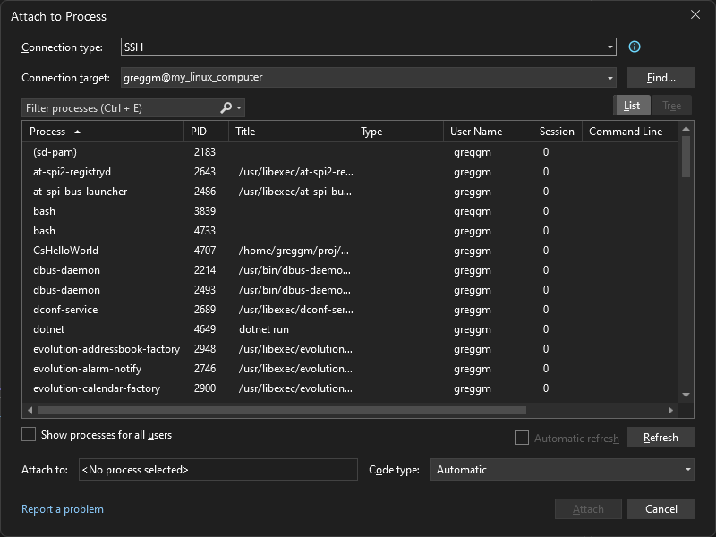
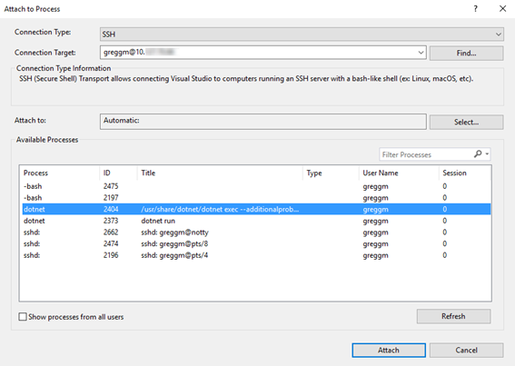
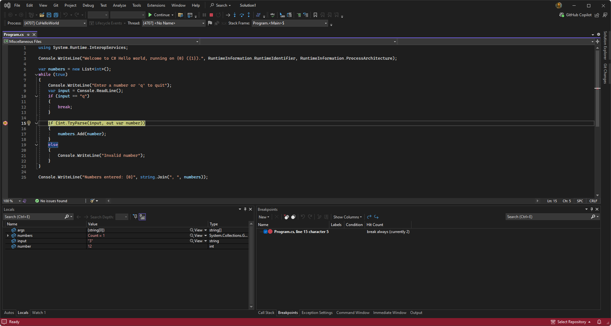
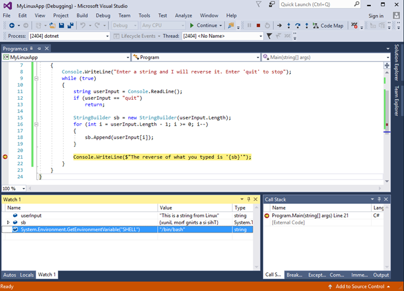

# Debug .NET Core on Linux using SSH by attaching to a process

Starting in Visual Studio 2017, you can attach to .NET Core and .NET 5+ processes running on a local or remote Linux deployment over Secure Shell (SSH). This article describes how to set up debugging and how to debug. For debugging scenarios using Docker containers, see [Attach to a process running on a Docker container](../debugger/attach-to-process-running-in-docker-container.md) and the [container tools](../containers/edit-and-refresh.md) articles instead. To debug Linux on WSL 2 from Visual Studio (no attach to process), see [Debug .NET Core Apps in WSL 2 with Visual Studio](../debugger/debug-dotnet-core-in-wsl-2.md).

> [!NOTE]
> For debugging Linux running on Azure Kubernetes Service (AKS), [Bridge to Kubernetes](/visualstudio/bridge/overview-bridge-to-kubernetes) is recommended instead of attach to process.

## Prerequisites

[!INCLUDE [prerequisites-dotnet-linux-ssh](../debugger/includes/prerequisites-dotnet-linux-ssh.md)]

## Prepare your application for debugging

To prepare your application for debugging:

- Consider using a Debug configuration when you build the application. It is much harder to debug retail-compiled code (a Release configuration) than debug-compiled code. If you need to use a Release configuration, first disable Just My Code. To disable this setting, choose **Tools** > **Options** > **Debugging**, and then deselect **Enable Just My Code**.

::: moniker range=">=vs-2022"
- Make sure your project is configured to produce [portable PDBs](https://github.com/OmniSharp/omnisharp-vscode/wiki/Portable-PDBs) (which is the default setting), and make sure the PDBs are in the same location as the DLL. To configure this in Visual Studio, right-click the project, then choose **Properties** > **General** > **Debug symbols**.
::: moniker-end

::: moniker range="vs-2019"
- Make sure your project is configured to produce [portable PDBs](https://github.com/OmniSharp/omnisharp-vscode/wiki/Portable-PDBs) (which is the default setting), and make sure the PDBs are in the same location as the DLL. To configure this in Visual Studio, right-click the project, then choose **Properties** > **Build** > **Advanced** > **Debugging Information**.
::: moniker-end

## Build and deploy the application

You can use several methods to deploy the app prior to debugging. For example, you can:

- Copy sources to the target computer and build with `dotnet build` on the Linux machine.

- Build the app on Windows, and then transfer the build artifacts to the Linux machine. (The build artifacts consist of the application itself, the portable PDBs, any runtime libraries it might depend on, and the *.deps.json* file.)

When the app is deployed, start the application.

## Attach the debugger

When the application is running on the Linux machine, you are ready to attach the debugger.

1. In Visual Studio, choose **Debug** > **Attach to Process…**.

1. In the **Connection Type** list, select **SSH**.

1. Change the **Connection Target** to the IP address or host name of the target computer.

   If you haven't already provided credentials, you'll be prompted to enter a password and/or private key file. For more information on using a private key file, see [Set up a remote connection](/cpp/linux/connect-to-your-remote-linux-computer#set-up-the-remote-connection).

   There are no port requirements to configure, except the port that the SSH server is running on.

1. Find the process that you would like to debug.

   Your code runs either in a unique process name or a process named dotnet. To find the process that you're interested in, check the **Title** column, which shows the command line arguments for the process.

   In the following example, you see a list of processes from a remote Linux machine over an SSH transport displayed in the **Attach to Process** dialog box.

   ::: moniker range=">=vs-2022"
   
   ::: moniker-end
   ::: moniker range="vs-2019"
   
   ::: moniker-end

1. Choose **Attach**.

   In the dialog that appears, select the type of code you would like to debug. Choose **Managed (.NET Core for Unix)**.

1. Use Visual Studio debugging features to debug the app.

   In the following example, you see the Visual Studio debugger stopped at a breakpoint in code running on a remote Linux machine.

   ::: moniker range=">=vs-2022"
   
   ::: moniker-end
   ::: moniker range="vs-2019"
   
   ::: moniker-end

## Related content

- [Set up a remote connection](/cpp/linux/connect-to-your-remote-linux-computer#set-up-the-remote-connection)