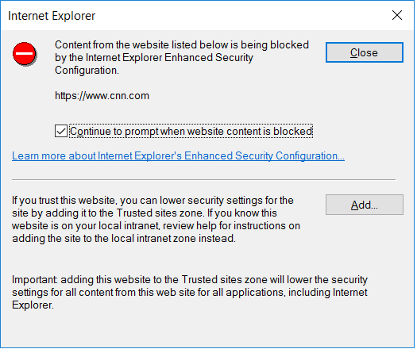

# How to: Unblock the download of the remote tools on Windows Server

 [!INCLUDE [Visual Studio](~/includes/applies-to-version/vs-windows-only.md)]

For older versions of Windows Server that include Internet Explorer, the default security settings in Internet Explorer on Windows Server can make it time-consuming to download components such as the remote tools.

* Enhanced Security Configuration is enabled on Internet Explorer, which prevents you from opening websites and accessing web resources unless the domain containing the resource is explicitly allowed (that is, trusted). Although you can disable this setting, we don't recommend it because it can present a security risk.

* On Windows Server 2016, a default setting in **Internet Options** > **Security** > **Internet** > **Custom Level** > **Downloads** also disables file downloads. If you choose to download the remote tools directly on Windows Server, you must enable file download.

To download the tools on Windows Server, we recommend one of the following actions:

* Download the remote tools on a different computer such as the one running Visual Studio, and then copy the *.exe* file to Windows Server.

* Run the remote debugger [from a file share](../debugger/remote-debugging.md#fileshare_msvsmon) on your Visual Studio machine.

* Download the remote tools directly on Windows Server and accept the prompts to add trusted sites. Modern websites often include many third-party resources, which can result in many prompts. Also, any redirected links may need to be added manually. You can choose to add some of the trusted sites before beginning the download. Go to **Internet Options > Security > Trusted Sites > Sites** and add the following sites.

  * visualstudio.microsoft.com
  * download.visualstudio.microsoft.com
  * about:blank

  For older versions of the debugger on my.visualstudio.com, add these other sites to make sure that login is successful:

  * microsoft.com
  * go.microsoft.com
  * download.microsoft.com
  * my.visualstudio.com
  * login.microsoftonline.com
  * login.live.com
  * secure.aadcdn.microsoftonline-p.com
  * msft.sts.microsoft.com
  * auth.gfx.ms
  * app.vssps.visualstudio.com
  * vlscppe.microsoft.com
  * query.prod.cms.rt.microsoft.com

    If you choose to add these domains while downloading the remote tools, then choose **Add** when prompted.

    

    When you download the software, you get more requests to grant permission to load various web site scripts and resources. On my.visualstudio.com, we recommend that you add the extra domains to make sure that login is successful.