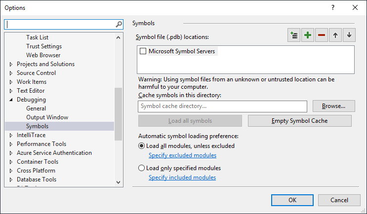

# Specify symbol (.pdb) and source files in the Visual Studio debugger

Program database (*.pdb*) files, also called symbol files, map identifiers and statements in your project's source code to corresponding identifiers and instructions in compiled apps. 

A *.pdb* file holds debugging and project state information that allows incremental linking of a Debug configuration of your app. The Visual Studio debugger uses *.pdb* files to determine two key pieces of information while debugging:

* The source file name and line number to display in the Visual Studio IDE
* Where in the app to stop for a breakpoint

Symbol files also show the location of the source files, and optionally, the server to retrieve them from.
  
The debugger only loads *.pdb* files that exactly match the *.pdb* files created when an app was built (that is, the original *.pdb* files or copies). This exact duplication is necessary because the actual layout of apps can change even if the code itself has not changed. For more information, see [Why does Visual Studio require debugger symbol files to exactly match the binary files that they were built with?](https://blogs.msdn.microsoft.com/jimgries/2007/07/06/why-does-visual-studio-require-debugger-symbol-files-to-exactly-match-the-binary-files-that-they-were-built-with/)

> [!TIP]
> If you want to debug code outside your project source code, such as Windows code or third-party code your project calls, you must specify the location of the external code's *.pdb* files (and optionally, the source files), which must exactly match the builds in the apps. 

> [!NOTE]
> For debugging managed code on a remote device, all symbol files must be located either on the local machine, or in a location [specified in the debugger options](#configure-debugger-symbol-options).  
  
## Set debug compiler options for symbol files  

When you build a project from the Visual Studio IDE with the standard **Debug** build configuration, the C++ and managed compilers create the appropriate symbol files for your code. You can also set compiler options in code to create the symbol files.  
  
**C++ options**  
  
A *.pdb* file is created when you build with [/ZI or /Zi](/cpp/build/reference/z7-zi-zi-debug-information-format) (for C/C++).  
  
In [!INCLUDE[vcprvc](../code-quality/includes/vcprvc_md.md)], the [/Fd](/cpp/build/reference/fd-program-database-file-name) option names the *.pdb* file the compiler creates. When you create a project in [!INCLUDE[vsprvs](../code-quality/includes/vsprvs_md.md)] using wizards, the **/Fd** option is set to create a *.pdb* file named *\<project>.pdb*.  
  
If you build your C/C++ application using a makefile, and you specify **/ZI** or **/Zi** without **/Fd**, you end up with two *.pdb* files:  
  
- *VC\<x>.pdb*, where *\<x>* represents the version of Visual C++, for example *VC11.pdb*. This file stores all debugging information for the individual *.obj* files and resides in the same directory as the project makefile.  
  
- *project.pdb*. This file stores all debug information for the *.exe* file. For C/C++, it resides in the *\debug* subdirectory.  
  
Each time it creates an *.obj* file, the C/C++ compiler merges debug information into *VC\<x>.pdb*. The inserted information includes type information, but does not include symbol information, such as function definitions. So even if every source file includes common header files such as *\<windows.h>*, the typedefs from those headers are stored only once, rather than in every *.obj* file.  
  
The linker creates *project.pdb*, which contains debug information for the project's *.exe* file. The *project.pdb* file contains full debug information, including function prototypes, not just the type information found in *VC\<x>.pdb*. Both *.pdb* files allow incremental updates. The linker also embeds the path to the *.pdb* file in the *.exe* or *.dll* file that it creates.  
  
**.NET Framework options**  
  
Build with **/debug** to create a *.pdb* file. You can build applications with **/debug:full** or **/debug:pdbonly**. Building with **/debug:full** generates debuggable code. Building with **/debug:pdbonly** generates *.pdb* files, but does not generate the `DebuggableAttribute` that tells the JIT compiler that debug information is available. Use **/debug:pdbonly** if you want to generate *.pdb* files for a release build that you do not want to be debuggable. For more information, see [/debug (C# compiler options)](/dotnet/csharp/language-reference/compiler-options/debug-compiler-option) or [/debug (Visual Basic)](/dotnet/visual-basic/reference/command-line-compiler/debug).  
  
**Web applications**  
  
Set the *web.config* file of your ASP.NET application to debug mode. Debug mode causes ASP.NET to generate symbols for dynamically generated files and enables the debugger to attach to the ASP.NET application. Visual Studio sets this automatically when you start to debug, if you created your project from the web projects template.  

## Symbol file source locations

When you debug a project in the Visual Studio IDE, the debugger automatically loads symbol files that are located in the project folder. 

The debugger also searches for symbol files in the following locations:

1. The location that is specified inside the DLL or the executable (*.exe*) file.  
   
   By default, if you have built a DLL or an *.exe* file on your computer, the linker places the full path and filename of the associated *.pdb* file in the DLL or *.exe* file. The debugger checks to see if the symbol file exists in that location.  
   
1. The same folder as the DLL or *.exe* file.
   
1. Any locations specified in the debugger options for symbol files. To add and enable symbol locations, see [Configure debugger symbol options](#configure-debugger-symbol-options). 
   
    - Any local symbol cache folder.  
  
    - Specified network, internet, or local symbol servers and locations, such as the Microsoft Symbol Servers if selected. [!INCLUDE[vsprvs](../code-quality/includes/vsprvs_md.md)] can download debugging symbol files from symbol servers that implement the `symsrv` protocol. [Visual Studio Team Foundation Server](http://msdn.microsoft.com/Library/bd6977ca-e30a-491a-a153-671d81222ce6) and the [Debugging Tools for Windows](http://msdn.microsoft.com/library/windows/hardware/ff551063\(v=VS.85\).aspx) are two tools that can use symbol servers. Symbol servers you might use include:  
      
      **Public Microsoft Symbol Servers**: To debug a crash that occurs during a call to a system DLL or to a third-party library, you often need system *.pdb* files. System *.pdb* files contain symbols for Windows DLLs, *.exe* files, and device drivers. You can get symbols for Windows operating systems, MDAC, IIS, ISA, and the [!INCLUDE[dnprdnshort](../code-quality/includes/dnprdnshort_md.md)] from the public Microsoft Symbol Servers. 
      
      **Symbol servers on an internal network or on your local machine**: Your team or company can create symbol servers for your own products, and as a cache for symbols from external sources. You might have a symbol server on your own machine. 
      
      **Third-party symbol servers**: Third-party providers of Windows applications and libraries can provide access to symbol server on the internet. 
    
    > [!WARNING]
    > If you use a symbol server other than the public Microsoft Symbol Servers, make sure that the symbol server and its path are trustworthy. Because symbol files can contain arbitrary executable code, you can be exposed to security threats.  

## Configure debugger symbol locations and options

You can add and configure symbol locations and other options in the **Tools** > **Options** > **Debugging** (or **Debug** > **Options**) dialog box.  

### Specify symbol locations and loading behavior

On the **Tools** > **Options** > **Debugging** > **Symbols** page, you can:

- Specify and select search paths and symbol servers for Microsoft, Windows, or third-party components.
- Specify modules that you do or don't want the debugger to automatically load symbols for.
- Change these settings while you are actively debugging. See [Manage symbols while debugging](#manage-symbols-while-debugging). 
  
**To specify symbol locations and loading options**

1. In Visual Studio, open **Tools** > **Options** > **Debugging** > **Symbols** (or **Debug** > **Options** > **Symbols**).  
   
     
   
1. Under **Symbol file (.pdb) locations**,
   - To use the **Microsoft Symbol Servers**, select the checkbox.  
   
   - To add a new symbol server location,
     1. Select the **+** symbol in the toolbar. 
     1. Type the URL or folder path of the symbol server or symbol location in the text field. Statement completion helps you find the correct format.
     
     >[!NOTE]
     >Only the specified folder is searched. You must add entries for any subfolders that you want to search.  
   
   - To add a new VSTS Symbol Server location, 
     1. Select the  icon in the toolbar. 
     1. In the **Connect to VSTS Symbol Server** dialog, choose one of the available symbol servers, and select **Connect**.  
   
   - To change the loading order for the symbol locations, use **Ctrl**+**Up** and **Ctrl**+**Down**, or the **Up** and **Down** arrow icons. 
   - To edit a URL or path, double-click the entry, or select it and press **F2**.  
   - To remove an entry, select it, and then select the **-** icon.
  
1.  (Optional) To improve symbol loading performance, under **Cache symbols in this directory**, type a local folder path that symbol servers can copy symbols to.  
  
    > [!NOTE]
    > Do not place the local symbol cache in a protected folder, like C:\Windows or a subfolder. Use a read-write folder instead.  
  
    > [!NOTE]
    > For C++ projects, if you have the `_NT_SYMBOL_PATH` environment variable set, it will override the value set under **Cache symbols in this directory**.
  
1. Specify the modules that you want the debugger to load from the **Symbol file (.pdb) locations** when it starts.  
  
  -  Select **Load all modules, unless excluded** (the default) to load all the symbols for all modules in the symbol file location, except modules you specifically exclude. To exclude certain modules, select **Specify excluded modules**, select the **+** icon, type the names of the modules to exclude in the field, and select **OK**.  
  
  -  To load only modules you specify from the symbol file locations, select **Load only specified modules**. Select **Specify included modules**, list only the modules you want symbol files loaded for, and then select **OK**. The symbol files for other modules are not loaded.  
  
1.  Select **OK**.

### Specify additional symbol options for debugging
  
You can select additional symbol options in **Tools** > **Options** > **Debugging** > **General** (or **Debug** > **Options** > **General**):  

- **Load DLL exports (native only)**  
  Loads DLL export tables. Symbolic information from DLL export tables can be useful for working with Windows messages, Windows procedures (WindowProcs), COM objects, marshaling, or any DLL you don't have symbols for. Reading DLL export information involves some overhead, so loading export tables is turned off by default.  
  
  To see what symbols are available in the export table of a DLL, use `dumpbin /exports`. Symbols are available for any 32-bit system DLL. By reading the `dumpbin /exports` output, you can see the exact function name, including non-alphanumeric characters. Seeing the exact function name is useful for setting a breakpoint on a function, because function names might be truncated elsewhere in the debugger. The calls are listed in the calling order, with the current function (the most deeply nested) at the top. For more information, see [dumpbin /exports](/cpp/build/reference/dash-exports).  
  
- **Enable address level debugging** and **Show disassembly if source not available**  
  
  Always shows the disassembly when source or symbol files are not found.  
  
    
  
- **Enable source server support**  
  
  Uses Source Server to help debug an app when there is no source code on the local machine, or the *.pdb* file does not match the source code. Source Server takes requests for files and returns the actual files from source control. Source Server runs by using a DLL named *srcsrv.dll* to read the app's *.pdb* file. The *.pdb* files contains pointers to the source code repository, as well as commands used to retrieve source code from the repository. You can limit the commands that *srcsrv.dll* can execute from the app's *.pdb* file by listing the allowed commands in a file named *srcsrv.ini*. Place the *srcsrv.ini* file in the same folder as *srcsrv.dll* and *devenv.exe*.  
  
  >[!IMPORTANT]
  >Arbitrary commands can be embedded in an app's *.pdb* file, so make sure to put only the commands you want to execute into a *srcsrv.ini* file. Any attempt to execute a command not in the *srcsvr.ini* file will cause a confirmation dialog box to appear. For more information, see [Security Warning: Debugger Must Execute Untrusted Command](../debugger/security-warning-debugger-must-execute-untrusted-command.md). No validation is done on command parameters, so be careful with trusted commands. For example, if you listed *cmd.exe* in your *srcsrv.ini*, a malicious user might specify parameters on *cmd.exe* that would make it dangerous.  
  
  Select this item and the child items you want. **Allow source server for partial trust assemblies (Managed only)** and **Always run untrusted source server commands without prompting** can increase the security risks.  
  
    
  

##  Manage symbols while debugging 

### Use the Modules window

During debugging, the **Modules** window shows the code modules the debugger is treating as user code, or My Code, and their symbol loading status. 

You can use the **Modules** window to load symbols or change symbol options while debugging. You can also load symbols from the **Call Stack**, **Locals**, **Autos**, or any **Watch** window. For more information, see [Get more familiar with how the debugger attaches to your app](../debugger/debugger-tips-and-tricks.md#modules_window).

**To change symbol locations or options while debugging:**

1. To open the **Modules** window, while debugging, select **Debug** > **Windows** > **Modules**. 
1. In the **Modules** window, right-click the **Symbol Status** or **Symbol File** headers, or any module. 
1. In the context menu, select one of the following options:  
  
|Option|Description|  
|------------|-----------------|  
|**Load Symbols**|Appears for modules with skipped, not found, or not loaded symbols. Attempts to load symbols from locations specified on the **Options** > **Debugging** > **Symbols** page. If the symbol file is not found or not loaded, launches **File Explorer** so you can specify a new location to search.|  
|**Symbol Load Information**|Shows the location of a loaded symbol file, or the locations that were searched if the debugger cannot find the file.|  
|**Symbol Settings**|Opens the **Options** > **Debugging** > **Symbols** page, where you can edit and add symbol locations.|  
|**Always Load Automatically**|Adds the selected symbol file to the list of files that are automatically loaded by the debugger.|  

### Use the No Symbols Loaded page

There are several ways for the debugger to break into code that does not have symbol or source files available:  

-  Step into code.  
-  Break into code from a breakpoint or exception.  
-  Switch to a different thread.  
-  Change the stack frame by double-clicking a frame in the **Call Stack** window.  
   
When one of these happens, the debugger displays the **No Symbols Loaded** page to help you find and load the necessary symbols.  
  
   
  
**To use the No Symbols Loaded document page to help find and load missing symbols:**  
  
-   To change the search path, select an unselected path, or select **New** and enter a new path. Select **Load** to search the paths again and load the symbol file if it is found.  
-   To override any symbol options and retry the search paths, select **Browse and find \<executable-name>**. The symbol file is loaded if it is found, or **File Explorer** opens so you can manually select the symbol file.  
-   To open the **Options** > **Debugging** > **Symbols** page, select **Change Symbol Settings**.  
-   To show the disassembly in a new window one time, select **view disassembly**. (To always show the disassembly when source or symbol files are not found, select that option in **Options** > **Debugging** > **General**.) 

## See also  
[Understand symbol files and Visual Studio symbol settings](https://blogs.msdn.microsoft.com/devops/2015/01/05/understanding-symbol-files-and-visual-studios-symbol-settings/)

[.NET remote symbol loading changes in Visual Studio 2012 and 2013](https://blogs.msdn.microsoft.com/devops/2013/10/16/net-remote-symbol-loading-changes-in-visual-studio-2012-and-2013/)
