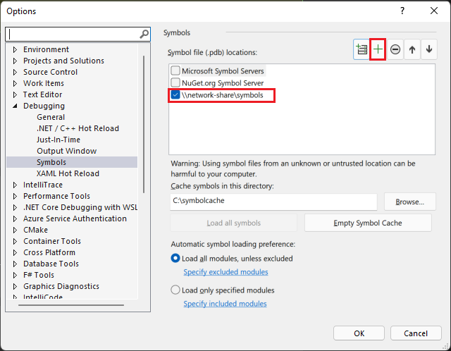
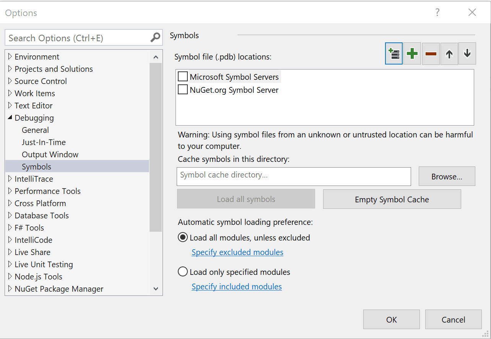
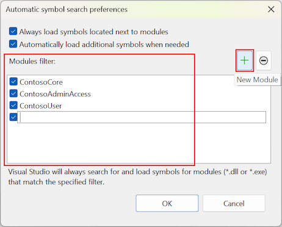
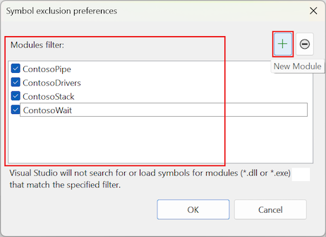
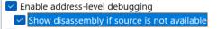
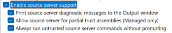
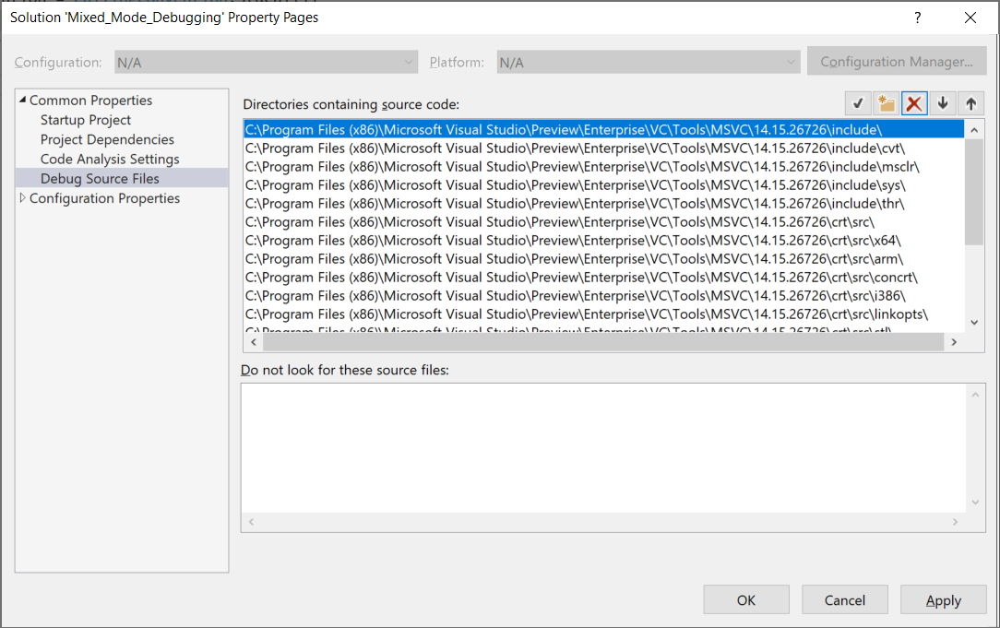

# Specify symbol (.pdb) and source files in the Visual Studio debugger (C#, C++, Visual Basic, F#)

Program database (*.pdb*) files, also called symbol files, map identifiers and statements in your project's source code to corresponding identifiers and instructions in compiled apps. These mapping files link the debugger to your source code, which enables debugging.

When you build a project from the Visual Studio IDE with the standard Debug build configuration, the compiler creates the appropriate symbol files. This article describes how to manage symbol files in the IDE, for example:

- [Configure the location of symbol files](#configure-location-of-symbol-files-and-loading-options)
- [Load symbols while debugging](#load-symbols-while-debugging)
- [Compiler options for symbols](#compiler-symbol-options).

For a detailed explanation of symbol files, see the following:

- [Understand symbol files and Visual Studio symbol settings](https://devblogs.microsoft.com/devops/understanding-symbol-files-and-visual-studios-symbol-settings/)

## How symbol files work

The *.pdb* file holds debugging and project state information that allows incremental linking of a Debug configuration of your app. The Visual Studio debugger uses *.pdb* files to determine two key pieces of information while debugging:

- The source file name and line number to display in the Visual Studio IDE.
- Where in the app to stop for a breakpoint.

Symbol files also show the location of the source files, and optionally, the server to retrieve them from.

The debugger only loads *.pdb* files that exactly match the *.pdb* files created when an app was built (that is, the original *.pdb* files or copies). This exact duplication is necessary because the layout of apps can change even if the code itself has not changed. For more information, see [Why does Visual Studio require debugger symbol files to exactly match the binary files that they were built with?](/archive/blogs/jimgries/why-does-visual-studio-require-debugger-symbol-files-to-exactly-match-the-binary-files-that-they-were-built-with)

> [!TIP]
> To debug code outside your project source code, such as Windows code or third-party code your project calls, you must specify the location of the external code's *.pdb* files (and optionally, the source files), which must exactly match the builds in your app.

## Where the debugger looks for symbols

When you debug a project in the Visual Studio IDE, the debugger automatically loads symbol files that it can find by default.

> [!NOTE]
> When debugging managed code on a remote device, all symbol files must be located either on the local machine, or in a location [specified in the debugger options](#configure-location-of-symbol-files-and-loading-options).

The debugger searches for symbol files in the following locations:

1. The project folder.

1. The location that is specified inside the DLL or the executable (*.exe*) file.

   By default, if you have built a DLL or an *.exe* file on your computer, the linker places the full path and filename of the associated *.pdb* file in the DLL or *.exe* file. The debugger checks to see if the symbol file exists in that location.

1. The same folder as the DLL or *.exe* file.

1. Any locations specified in the debugger options for symbol files. To add and enable symbol locations, see [Configure symbol locations and loading options](#configure-location-of-symbol-files-and-loading-options).

   - Any local symbol cache folder.

   - Specified network, internet, or local symbol servers and locations, such as the Microsoft Symbol Servers if selected. Visual Studio can download debugging symbol files from symbol servers that implement the `symsrv` protocol. [Visual Studio Team Foundation Server](/azure/devops/pipelines/tasks/build/index-sources-publish-symbols) and the [Debugging Tools for Windows](/windows-hardware/drivers/debugger/index) are two tools that can use symbol servers.

     Symbol servers you might use include:

     **Public Microsoft Symbol Servers**: To debug a crash that occurs during a call to a system DLL or to a third-party library, you often need system *.pdb* files. System *.pdb* files contain symbols for Windows DLLs, *.exe* files, and device drivers. You can get symbols for Windows operating systems, MDAC, IIS, ISA, and .NET from the public Microsoft Symbol Servers.

     **Symbol servers on an internal network or on your local machine**: Your team or company can create symbol servers for your own products, and as a cache for symbols from external sources. You might have a symbol server on your own machine.

     **Third-party symbol servers**: Third-party providers of Windows applications and libraries can provide access to symbol server on the internet.

  > [!WARNING]
  > If you use a symbol server other than the public Microsoft Symbol Servers, make sure that the symbol server and its path are trustworthy. Because symbol files can contain arbitrary executable code, you can be exposed to security threats.

## Configure location of symbol files and loading options

The debugger checks various locations for symbols by default. See [Where the debugger looks for symbols](#where-the-debugger-looks-for-symbols).

On the **Tools** > **Options** > **Debugging** > **Symbols** page, you can:

- Specify and select search paths for symbol files.
- Specify symbol servers for Microsoft, Windows, or third-party components.
- Specify modules that you do or don't want the debugger to automatically load symbols for.
- Change these settings while you are actively debugging. See [Load symbols while debugging](#load-symbols-while-debugging).

**To specify symbol locations and loading options:**

::: moniker range="= vs-2022"
  > [!NOTE]
  > These options were updated in Visual Studio 2022 Version 17.12 Preview 1.
::: moniker-end

1. In Visual Studio, open **Tools** > **Options** > **Debugging** > **Symbols** (or **Debug** > **Options** > **Symbols**).

2. Under **Symbol file (.pdb) locations**,
   - To use the **Microsoft Symbol Servers** or **NuGet.org Symbol Server**, select the checkbox.

   - To add a new symbol server location,
     1. Select the **+** symbol in the toolbar.
     1. Type the URL (http), network share, or local path of the symbol server or symbol location in the text field. Statement completion helps you find the correct format.

    ::: moniker range=">= vs-2022"
     
    ::: moniker-end
    ::: moniker range="<= vs-2019"
     
    ::: moniker-end

   > [!NOTE]
   > Only the specified folder is searched. You must add entries for any subfolders that you want to search.

   - To add a new Azure DevOps Symbol Server location:

     1. Select the  icon in the toolbar.
     1. In the **Connect to Azure DevOps Symbol Server** dialog, choose one of the available symbol servers, and select **Connect**.

        For additional information, see [Add Azure Artifacts symbol server](/azure/devops/artifacts/symbols/debug-with-symbols-visual-studio#add-azure-artifacts-symbol-server).

   - To change the loading order for the symbol locations, use **Ctrl**+**Up** and **Ctrl**+**Down**, or the **Up** and **Down** arrow icons.
   - To edit a URL or path, double-click the entry, or select it and press **F2**.
   - To remove an entry, select it, and then select the **-** icon.

3. (Optional) To improve symbol loading performance, under **Cache symbols in this directory**, type a local folder path that symbol servers can copy symbols to.

  > [!NOTE]
  > Do not place the local symbol cache in a protected folder, like C:\Windows or a subfolder. Use a read-write folder instead.

  > [!NOTE]
  > If you have the `_NT_SYMBOL_PATH` environment variable set, it overrides the value set under **Cache symbols in this directory**.

4. Specify the modules that you want the debugger to load from the **Symbol file (.pdb) locations** when it starts.

   ::: moniker range=">= vs-2022"

   - Select **Automatically choose what module symbols to search for** (recommended) to allow
   Visual Studio to decide what symbols to search for and load. By default, Visual Studio
   automatically loads symbols that were built by your opened solution, and loads any
   additional symbols that are needed to perform common debugging operations. This reduces
   the number of files that must be searched for and loaded by Visual Studio, which 
   improves debugger performance. You can force additional symbols to load by clicking the
   **Specify module filters** link.

   - Select **Search for all module symbols unless excluded** to force Visual Studio to
   load all symbols in your debugged process. This is not recommended because it may
   slow down your debugging experience. If you select this option, you can force
   Visual Studio to ignore certain symbols by clicking the **Specify module filters**
   link.

   ::: moniker-end
   ::: moniker range="<= vs-2019"

   - Select **Load all modules, unless excluded** (the default) to load all the symbols for all modules in the symbol file location, except modules you specifically exclude. To exclude certain modules, select **Specify excluded modules**, select the **+** icon, type the names of the modules to exclude, and select **OK**.

   - To load only modules you specify from the symbol file locations, select **Load only specified modules**. Select **Specify included modules**, select the **+** icon, type the names of the modules to include, and then select **OK**. The symbol files for other modules are not loaded.
   ::: moniker-end

5. Select **OK**.

::: moniker range=">= vs-2022"

### Specify module filters
Both the **Automatically choose what module symbols to search for** and **Search for all
module symbols unless excluded** options allow you to have more fine control over what symbols
are searched for while debugging. Choose **Specify module filters** to fine-tune your experience.

By default, you see the following dialog when **Automatically choose what module symbols to search for** is selected:

You can add a module to the filter by using the '+' icon. Module filters support simple wild-card
matching. A '\*' matches any group of characters. For example '\*myproduct\*' will match files such
as 'myproduct.utilities.dll' and 'entrypoint.myproduct.exe', among others.

There are several additional options to further customize your experience:

- **Always load symbols located next to modules** instructs visual studio to load pdb files that
are stored in the file system beside their corresponding .dll or .exe files. This can be helpful,
for example, when attempting to debug a deployed web app.

- **Automatically load additional symbols when needed** instructs Visual Studio to search for
symbols to perform common debug actions, such as stepping, even if the module that you will be
stepping to is not in your project or in the modules filter. The way that searching is determined
might be affected by your [Just My Code](just-my-code.md) settings.

If you have selected **Search for all module symbols unless excluded**, then the module filter
dialog looks like this:

In this dialog, you can choose what modules you *do not* want Visual Studio to load symbols for.
In this scenario, Visual Studio attempts to load symbols for every module in your debugged
process (including modules by third parties), unless you add a matching filter to exclude them.
The only other way that this behavior will be modified is by your [Just My Code](just-my-code.md)
settings.

::: moniker-end

## Other symbol options for debugging

You can select additional symbol options in **Tools** > **Options** > **Debugging** > **General** (or **Debug** > **Options** > **General**):

- **Load dll exports (Native only)**

  Loads DLL export tables for C/C++. For details, see [DLL export tables](#use-dumpbin-exports). Reading DLL export information involves some overhead, so loading export tables is turned off by default. You can also use `dumpbin /exports` in a C/C++ build command line.

- **Enable address level debugging** and **Show disassembly if source not available**

  Always shows the disassembly when source or symbol files are not found.

  

- **Enable source server support**

  Uses Source Server to help debug an app when there is no source code on the local machine, or the *.pdb* file does not match the source code. Source Server takes requests for files and returns the actual files from source control. Source Server runs by using a DLL named *srcsrv.dll* to read the app's *.pdb* file. The *.pdb* file contains pointers to the source code repository, as well as commands used to retrieve source code from the repository.

  You can limit the commands that *srcsrv.dll* can execute from the app's *.pdb* file by listing the allowed commands in a file named *srcsrv.ini*. Place the *srcsrv.ini* file in the same folder as *srcsrv.dll* and *devenv.exe*.

  > [!IMPORTANT]
  > Arbitrary commands can be embedded in an app's *.pdb* file, so make sure to put only the commands you want to execute into a *srcsrv.ini* file. Any attempt to execute a command not in the *srcsvr.ini* file will cause a confirmation dialog box to appear. For more information, see [Security Warning: Debugger Must Execute Untrusted Command](../debugger/security-warning-debugger-must-execute-untrusted-command.md).
  >
  > No validation is performed on command parameters, so be careful with trusted commands. For example, if you listed *cmd.exe* in your *srcsrv.ini*, a malicious user might specify parameters on *cmd.exe* that would make it dangerous.

  Select this item and the child items you want. **Allow source server for partial trust assemblies (Managed only)** and **Always run untrusted source server commands without prompting** can increase the security risks.

  

## Compiler symbol options

When you build a project from the Visual Studio IDE with the standard **Debug** build configuration, the C++ and managed compilers create the appropriate symbol files for your code. You can also set compiler options in code.

To set the compiler options for your build configurations in Visual Studio, see [Set debug and release configurations](../debugger/how-to-set-debug-and-release-configurations.md).

### .NET options

Build with **/debug** to create a *.pdb* file. You can build applications with **/debug:full** or **/debug:pdbonly**. Building with **/debug:full** generates debuggable code. Building with **/debug:pdbonly** generates *.pdb* files, but does not generate the `DebuggableAttribute` that tells the JIT compiler that debug information is available. Use **/debug:pdbonly** if you want to generate *.pdb* files for a release build that you do not want to be debuggable. For more information, see [/debug (C# compiler options)](/dotnet/csharp/language-reference/compiler-options/debug-compiler-option) or [/debug (Visual Basic)](/dotnet/visual-basic/reference/command-line-compiler/debug).

### C/C++ options

- *VC\<x>.pdb* and *\<project>.pdb* files

  A *.pdb* file for C/C++ is created when you build with [/ZI or /Zi](/cpp/build/reference/z7-zi-zi-debug-information-format). In Visual C++, the [/Fd](/cpp/build/reference/fd-program-database-file-name) option names the *.pdb* file the compiler creates. When you create a project in Visual Studio using the IDE, the **/Fd** option is set to create a *.pdb* file named *\<project>.pdb*.

  If you build your C/C++ application using a makefile, and you specify **/ZI** or **/Zi** without using **/Fd** to specify a filename, the compiler creates two *.pdb* files:

  - *VC\<x>.pdb*, where *\<x>* represents the version of the Microsoft C++ compiler, for example *VC11.pdb*

    The *VC\<x>.pdb* file stores all debugging information for the individual object files, and resides in the same directory as the project makefile. Each time it creates an object file, the C/C++ compiler merges debug information into *VC\<x>.pdb*. So even if every source file includes common header files such as *\<windows.h>*, the typedefs from those headers are stored only once, rather than in every object file. The inserted information includes type information, but does not include symbol information, such as function definitions.

  - *\<project>.pdb*

    The *\<project>.pdb* file stores all debug information for the project's *.exe* file, and resides in the *\debug* subdirectory. The *\<project>.pdb* file contains full debug information, including function prototypes, not just the type information found in *VC\<x>.pdb*.

  Both the *VC\<x>.pdb* and *\<project>.pdb* files allow incremental updates. The linker also embeds the path to the *.pdb* files in the *.exe* or *.dll* file that it creates.

- DLL export tables

  Use `dumpbin /exports` to see the symbols available in the export table of a DLL. Symbolic information from DLL export tables can be useful for working with Windows messages, Windows procedures (WindowProcs), COM objects, marshaling, or any DLL you don't have symbols for. Symbols are available for any 32-bit system DLL. The calls are listed in the calling order, with the current function (the most deeply nested) at the top.

  By reading the `dumpbin /exports` output, you can see the exact function names, including non-alphanumeric characters. Seeing exact function names is useful for setting a breakpoint on a function, because function names can be truncated elsewhere in the debugger. For more information, see [dumpbin /exports](/cpp/build/reference/dash-exports).

### Web applications

Set the *web.config* file of your ASP.NET application to debug mode. Debug mode causes ASP.NET to generate symbols for dynamically generated files and enables the debugger to attach to the ASP.NET application. Visual Studio sets this automatically when you start to debug, if you created your project from the web projects template.

## Load symbols while debugging

You can use the **Modules**, **Call Stack**, **Locals**, **Autos**, or any **Watch** window to load symbols or change symbol options while debugging. For more information, see [Get more familiar with how the debugger attaches to your app](../debugger/debugger-tips-and-tricks.md#modules_window).

### Work with symbols in the Modules window

During debugging, the **Modules** window shows the code modules the debugger is treating as user code, or My Code, and their symbol loading status. You can also monitor symbol loading status, load symbols, and change symbol options in the **Modules** window.

**To monitor or change symbol locations or options while debugging:**

1. To open the **Modules** window, while debugging, select **Debug** > **Windows** > **Modules** (or press **Ctrl** + **Alt** + **U**).
1. In the **Modules** window, right-click the **Symbol Status** or **Symbol File** headers, or any module.
1. In the context menu, select one of the following options:

|Option|Description|
|------------|-----------------|
|**Load Symbols**|Appears for modules with skipped, not found, or not loaded symbols. Attempts to load symbols from locations specified on the **Options** > **Debugging** > **Symbols** page. If the symbol file is not found or not loaded, launches **File Explorer** so you can specify a new location to search.|
|**Symbol Load Information**|Shows the location of a loaded symbol file, or the locations that were searched if the debugger cannot find the file.|
|**Symbol Settings**|Opens the **Options** > **Debugging** > **Symbols** page, where you can edit and add symbol locations.|
|**Always Load Automatically**|Adds the selected symbol file to the list of files that are automatically loaded by the debugger.|
|**Decompile Source to Symbol File**|For .NET code, you can choose this option and then follow instructions in [Generate and embed sources for an assembly](../debugger/decompilation.md#generate-and-embed-sources-for-an-assembly).|

### Use the No Symbols Loaded/No Source Loaded pages

There are several ways for the debugger to break into code that does not have symbol or source files available:

- Step into code.
- Break into code from a breakpoint or exception.
- Switch to a different thread.
- Change the stack frame by double-clicking a frame in the **Call Stack** window.

When this happens, the debugger displays the **No Symbols Loaded** or **No Source Loaded** pages to help you find and load the necessary symbols or source.

 

**To use the No Symbols Loaded document page to help find and load missing symbols:**

- To change the search path, select an unselected path, or select **New Path** or **New VSTS Path** and enter or select a new path. Select **Load** to search the paths again and load the symbol file if it is found.
- To override any symbol options and retry the search paths, select **Browse and find \<executable-name>**. The symbol file is loaded if it is found, or **File Explorer** opens so you can manually select the symbol file.
- To open the symbol settings page to configure behavior, select **Change Symbol Settings** (or choose **Options** > **Debugging** > **Symbols**).
- (Advanced) To show the disassembly in a new window one time, select **view disassembly**, or select **Options dialog** to set the option to always show the disassembly when source or symbol files are not found. For more information, see [View disassembly code](../debugger/how-to-use-the-disassembly-window.md).
- To show the locations searched and the outcome, expand **Symbol load information**.
- For C# code, you can also choose to [decompile the source code](../debugger/decompilation.md) from the **No Symbols Loaded** or **No Source Loaded** pages.

If the debugger finds the *.pdb* file after you execute one of the options, and can retrieve the source file using the information in the *.pdb* file, it displays the source. Otherwise, it displays a **No Source Loaded** page that describes the issue, with links to actions that might resolve the issue.

**To add source file search paths to a solution:**

You can specify the locations the debugger searches for source files, and exclude specific files from the search.

1. Select the solution in **Solution Explorer**, and then select the **Properties** icon, press **Alt**+**Enter**, or right-click and select **Properties**.

1. Select **Debug Source Files**.

   

1. Under **Directories containing source code**, type or select source code locations to search. Use the **New Line** icon to add more locations, the **Up** and **Down** arrow icons to reorder them, or the **X** icon to delete them.

   >[!NOTE]
   >The debugger searches only the specified directory. You must add entries for any subdirectories that you want to search.

1. Under **Do not look for these source files**, type the names of source files to exclude from search.

1. Select **OK** or **Apply**.

## Related content
- [Understand symbol files and Visual Studio symbol settings](https://devblogs.microsoft.com/devops/understanding-symbol-files-and-visual-studios-symbol-settings/)
