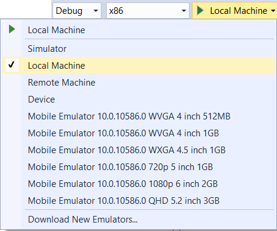

# Start a debugging session for a UWP app in Visual Studio
  
 This topic describes how to start a debugging session for UWP apps written in XAML and Visual C++, Visual C#, or Visual Basic, and for UWP apps written in HTML and JavaScript. Debugging an app involves both configuring the debugging session and choosing the way to start the app.  
  
##   The easy way to start debugging  
  
1.  Open the app solution in Visual Studio.  
  
2.  Choose F5.  
  
 Visual Studio builds and starts the app with the debugger attached. Execution continues until a breakpoint is reached, you manually suspend execution, an unhandled exception occurs, or the app ends.  
  
##   Choose the build configuration options  
  
1.   From the drop-down list next to the **Start Debugging** button on the debugger **Standard** toolbar, choose **Debug**.  
  
2.  From the **Platform** list choose the target platform to build for.  
  
##   Choose the deployment target  
  
You can deploy and debug a UWP app on the Visual Studio machine, a connected device, the Visual Studio simulator on the local machine, a remote device, or an emulator. Select the deployment target from the drop-down list to the right of the **Platform** target on the debugger **Standard** toolbar.
  
  
  
Choose one of these options:  
  
|||  
|-|-|  
|**Local Machine**|Debug the app in the current session on your local machine.|  
|**Simulator**|Debug the app in the Visual Studio simulator for UWP apps. The simulator is a Desktop window that enables you to debug device functionality—such as touch gestures and device rotation—that may not be available on the local machine. This option is only available if your app's **Target Platform Min. Version** is less than or equal to the operating system on your development machine. See [Run UWP apps in the simulator](../debugger/run-windows-store-apps-in-the-simulator.md).|  
|**Remote Machine**|Debug the app on a device that is connected to the local machine over an intranet or directly connected by using an Ethernet cable. To debug remotely, the Remote Tools for Visual Studio must be installed and running on the remote device. See [Run UWP apps on a remote machine](../debugger/run-windows-store-apps-on-a-remote-machine.md).|  
|**Device**|Debug the app on a USB-connected device. The device must be developer unlocked and have the screen unlocked.|  
|**Mobile Emulator**|Boot an emulator with the configuration specified in the emulator name, deploy the app, and start debugging. Emulators are only available on Hyper-V enabled machines.|  

##   Choose additional debugging options  

If you need to configure additional debugging options, open the property page for the project.
  
1.  In Solution Explorer, select the project. On the shortcut menu, choose **Properties**.  
  
2.  Do this to open the debug property page for the project:  
  
    -   For Visual C# and Visual Basic apps, choose **Debug**.  
  
           
  
    -   For Visual C++ and JavaScript apps, expand the **Configuration Properties**  node and then choose **Debugging**.  
  
           

###   Choose the debugger to use  
By default, Visual Studio debugs managed code in C# and Visual Basic apps. For C# and Visual Basic apps, you can choose to debug both the managed and native C/C++ code in your app. In C++ apps, Visual Studio debugs native code by default. In JavaScript apps, Visual Studio debugs script by default. 
  
For C++ apps and JavaScript, you can choose to debug specific types of code that are in components of your app instead of, or in addition to, the native code. You specify the code to debug in the **Debugger Type** list on the **Debugging** property page of the app project.  
  
Choose one of these debuggers from the **Application process** list:  
  
|||  
|-|-|  
|**Managed Only**|Debug managed code in your app. JavaScript code and native C/C++ code are ignored.|  
|**Native Only**|Debug native C/C++ code in your app. Managed code and JavaScript code are ignored.|  
|**Mixed (Managed and Native)**|Debug native C/C++ code and managed code in your app. JavaScript code is ignored. In C++ projects, this option is called **(Managed and Native)**.|  
|**Script Only**|Debug JavaScript code in your app. Managed code and native code are ignored.|  
|**Script and Native**|Debug native C/C++ code and JavaScript code in your app. Managed code is ignored. Available in C++ projects only.|  
|**GPU only (C++ AMP)**|Debug native C++ code that runs on a graphics processing unit (GPU). Available in C++ projects only.|  

In C# and Visual Basic apps, you can also set the same **Debugger type** values for any background tasks that are part of the project.
  
###   (Optional) Delay starting the debug session  
 By default, Visual Studio immediately starts the app when you start debugging. You can also start a debug session but delay the start of your app. When you choose this option, the app is started in the debugger when it is launched from the Start screen or by an activation contract or when it is started by another process or method. You also delay the start of your app when you want to debug a background task when the app itself is not running.  
  
 To delay the launch of your app, you can:  
  
-   For Visual C# and Visual Basic apps, select **Do not launch, but debug my code when it starts** on the **Debug** property page.  
  
-   For Visual C++ and JavaScript apps, choose **No** from the **Launch Application** list on the **Debugging** property page.  
  
###   (Optional) Disable network loopbacks  
  
 For security reasons, a UWP app that is installed in the standard manner is not allowed to make network calls to the device it is installed on. By default, Visual Studio deployment creates an exemption from this rule for the deployed app. This exemption allows you to test communication procedures on a single machine. Before you submit your app to Microsoft Store, you should test your app without the exemption.  
  
 To remove the network loopback exemption:  
  
-   For Visual C# and Visual Basic apps, clear the **Allow local network loopback** check box on the **Debug** property page.  
  
-   For Visual C++ and JavaScript apps, choose **No** from the **Allow Local Network Loopback** list on the **Debugging** property page.  
  
###   (Optional) Reinstall the app when you start debugging  
 To diagnose problems with the installation and initial configuration of your Visual C# or Visual Basic app, choose **Uninstall and then reinstall my package** on the **Debug**  property page to recreate an original install when you start debugging. This option is not available for Visual C++ and JavaScript projects.  
  
###   (Optional) Disable authentication requirement to start the remote debugger  
  
 By default, you must supply credentials to run the remote debugger when you select **Remote Machine** as the deployment target.
  
> [!IMPORTANT]
>  You can choose to run the remote debugger with no authentication, but this mode is strongly discouraged. There is no network security when you run in this mode. Choose no authentication only if you are sure that the network is not at risk from malicious code or hostile traffic.  
  
 To remove the authentication requirement:  
  
1.  For Visual C# and Visual Basic apps, select **Remote Machine** as the **Target device** on the **Debug** property page, and then set **Authentication Mode** to **None** or **Universal (Unencrypted Protocol)**.
  
2.  For Visual C++ and JavaScript apps, select **Remote Machine** as the **Target device** on the **Debugging** property page, and then set **Require Authentication** to **None** or **Universal (Unencrypted Protocol)**.  

    **Universal (Unencrypted Protocol)** is for use when you are deploying to a remote device. Currently, this is for IoT devices, Xbox devices, and HoloLens devices, as well as Creators Update or newer PCs. Universal (Unencrypted Protocol) should only be used on trusted networks. The debugging connection is vulnerable to malicious users who could intercept and change data being passed between the development and remote machine.  
  
##   Start the debugging session  
  
###   Start debugging (F5)  
 When you choose **Start Debugging** (Keyboard: F5) on the **Debug** menu, Visual Studio launches the app with the debugger attached. Execution continues until a breakpoint is reached, you manually suspend execution, an exception occurs, or the app ends.  
  
###   Start debugging (F5) but delay the app start  
 You can set the app to run in debug mode, but start it by a method other than the debugger. For example, you might want to debug the launch of your app from the Start menu, or to debug a background process in the app without starting the app. To delay the app start, do this:  
  
-   On the **Debug** property page of the app (**Debugging** in Visual C++ and JavaScript)  
  
    -   For Visual C# and Visual Basic apps, choose **Do not launch, but debug my code when it starts**.  
  
    -   For Visual C++ and JavaScript apps, choose **Yes** from the **Launch Application** list.  
  
-   Choose **Start Debugging** on the **Debug** menu (Keyboard: F5).  
  
-   Start your app from the Start menu, an execution contract, or by another procedure.  
  
 The app starts in debug mode. Execution continues until a breakpoint is reached, you manually suspend execution, an unhandled exception occurs, or the app ends.  
  
 For more information about debugging background tasks, see [Trigger suspend, resume, and background events for UWP apps)](../debugger/how-to-trigger-suspend-resume-and-background-events-for-windows-store-apps-in-visual-studio.md).  
  
###   Start an installed app in the debugger  
When you start debugging by using F5, Visual Studio builds and deploys the app, sets the app to run in debug mode, and then starts it. To start an app that is already installed on a device, use the **Debug Installed App Package** dialog box. This procedure is useful when you need to debug an app that was installed from Microsoft Store, or when you have the source files for the app, but you do not have a Visual Studio project for the app. For example, you might have a custom build system that does not use Visual Studio projects or solutions.  
  
The app can be installed on the local device, or it can be on a remote device.  You can start the app immediately, or you can set it to run in the debugger when it is started by another process or method, such as from the Start menu or by an activation contract, You can also set the app to run in debug mode when you want to debug a background process without starting the app. For more information, see [Trigger suspend, resume, and background events for UWP apps)](../debugger/how-to-trigger-suspend-resume-and-background-events-for-windows-store-apps-in-visual-studio.md).  
  
To start an installed app in the debugger, choose **Debug**, then **Other debug targets**, and then **Debug Installed App Package**. For additional instructions, see [Debug an installed app package](../debugger/debug-installed-app-package.md).

###   Attach the debugger to a running UWP app  

To debug an running UWP app, choose **Debug**, then **Other debug targets**, and then **Debug Installed App Package**. For additional instructions, see [Debug an installed app package](../debugger/debug-installed-app-package.md).
  
###   Attach the debugger to a running Windows 8.x app
 To attach the debugger to a [!INCLUDE[win8_appname_long](../debugger/includes/win8_appname_long_md.md)] app, you must use the Debuggable Package Manager to set the app to run in debug mode. The Debuggable Package Manager is installed with the Remote Tools for Visual Studio.  
  
 Attaching the debugger to an app is useful when you need to debug an already-installed app, such as an app that was installed from the [!INCLUDE[win8_appstore_long](../debugger/includes/win8_appstore_long_md.md)]. Attaching is required when you have the source files for the app, but you do not have a Visual Studio project for the app. For example, you might have a custom build system that does not use Visual Studio projects or solutions.  
  
 Attaching the debugger to an app requires these steps:  
  
1.  Set the app to run in debug mode. This must be done when the app is not running.  
  
2.  Start the app. You can start the app from the Start screen, an execution contract, or some other method.  
  
3.  Attach the debugger to the running app.  
  
####   Set the app to run in debug mode  
  
1.  Install the Remote Tools for Visual Studio on the device where the app is installed. See [Installing the remote tools](../debugger/remote-debugging.md).  
  
2.  On the Start screen, search for `Debuggable Package Manager` and then start it.  
  
     A PowerShell window properly configured for the AppxDebug cmdlet appears.  
  
3.  To enable debugging of an app, you must specify the PackageFullName identifier of the app. To view a list all apps that includes the PackageFullName, type `Get-AppxPackage` at the PowerShell prompt.  
  
4.  At the PowerShell prompt, enter `Enable-AppxDebug` *PackageFullName* where *PackageFullName* is the PackageFullName identifier of the app.  
  
####   Attach the debugger  
 To attach the debugger:  
  
1.  On the **Debug** menu, choose **Attach to Process**.  
  
     The **Attach to Process** dialog box appears.  
  
2.  To attach to an app on a remote device, specify the remote device in the **Qualifier** box. You can:  
  
    -   Enter the name in the **Qualifier** box.  
  
    -   Choose the down-arrow in the **Qualifier** box and then choose the device from a list of devices that you have attached to before.  
  
    -   Choose **Find** to select the device from a list of devices on your local subnet.  
  
3.  Specify the type of code that you want to debug in the **Attach to** box.  
  
     Choose **Select** and then do one of the following:  
  
    -   Choose **Automatically determine the type of code to debug**  
  
    -   Choose **Debug these code types** and then choose one or more types from the list.  
  
4.  In the **Available Processes**  list, choose the app process.  

    > [!NOTE]
    >  Unlike other app types, JavaScript apps run in an instance of the wwahost.exe process. If other JavaScript apps are running when you attach to the app, you will need to know the numeric process id (PID) of the wwahost.exe that the app is running in.  
    >   
    >  The easiest way to deal with this situation is to close all of the other JavaScript apps. Otherwise, you can open Windows Task Manager before you start the app and note the ids of the wwahost.exe processes. When you specify the process to attach to in the **Available Processes**  dialog box, the wwahost.exe of the app will have an id that is different than the ones that you have noted.  
  
5.  Choose **Attach**.  
  
 Visual Studio attaches the debugger to the process. Execution continues until a breakpoint is reached, you manually suspend execution, an unhandled exception occurs, or the app ends.  
  
## See Also  
 [Debug apps in Visual Studio](../debugger/debug-store-apps-in-visual-studio.md)   