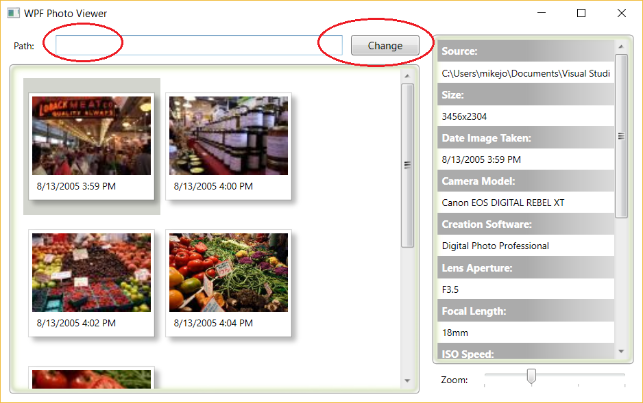

# Inspect data and exceptions in the Visual Studio debugger

The Visual Studio debugger has many features that allow you to inspect variables and other data to help you find bugs. We will take a look at a few of those features in this topic.

If you have not completed the first half of this tutorial, follow steps in [Start the debugger and navigate code](../debugger/getting-started-with-the-debugger.md) to get your app up and running.

Although the demo app is C#, the features are applicable to C++, Visual Basic, JavaScript, and other languages supported by Visual Studio (except where noted).

## Prerequisites

You can either read along to see the features of the debugger or you can download the complete sample used in the feature tour and follow the steps yourself. To download the sample and follow along, go to [Photo Viewer Demo](https://code.msdn.microsoft.com/windowsdesktop/WPF-Photo-Viewer-Demo-be75662a).

## Inspect variables with data tips

1. Open Data.cs in the Photo Viewer Demo app, right-click the `private void Update` function declaration and choose **Run to Cursor** (stop the app first if it is already running).

    This will pause the app with the debugger attached. This allows us to examine its state.

2. Hover over the `Add` method call and click the **Run to Click** button .

3. Now, hover over the File object (`f`) and you see its default property value, the file name `market 031.jpg`.

     

4. Expand the object to see all its properties, such as the `FullPath` property.

    Often, when debugging, you want a quick way to check property values on objects, and the data tips are a good way to do it.

    > [!TIP]
    > In most supported languages, you can edit code in the middle of a debugger session if you find something you want to change. For more info, see [Edit and Continue](../debugger/edit-and-continue.md). To use that feature in this app, however, we would first need to update the app's version of the .NET Framework.

## Inspect variables with the Autos and Locals windows

1. Look at the **Autos** window at the bottom of the code editor.

     

    In the **Autos** window, you see variables and their current value. The **Autos** window shows all variables used on the current line or the preceding line (In C++, the window shows variables in the preceding three lines of code. Check documentation for language-specific behavior).

    > [!NOTE]
    > In JavaScript, the **Locals** window is supported but not the **Autos** window.

2. Next, look at the **Locals** window.

    The **Locals** window shows you the variables that are in the current scope.

    

    Currently, the `this` object and the File object (`f`) are in the current scope. For more info, see [Inspect Variables in the Autos and Locals Windows](../debugger/autos-and-locals-windows.md).

## Set a watch

1. In the main code editor window, right-click the File object (`f`) and choose **Add Watch**.

    You can use a **Watch** window to specify a variable (or an expression) that you want to keep an eye on.

    Now, you have a watch set on the `File` object, and you can see its value change as you move through the debugger. Unlike the other variable windows, the **Watch** window always shows the variables that you are watching (they're grayed out when out of scope).

2. On the `Add` method, click the green  button again (or press F11 a few times) to advance through the `foreach` loop.

    

    You might also see the first picture get added to the main window of the running sample app, but this happens on a different app thread, so images may not be visible yet.

    For more info, see [Set a Watch using the Watch and QuickWatch Windows](../debugger/watch-and-quickwatch-windows.md)

## Examine an exception

1. In the running app window, delete the text in the **Path** input box and select the **Change** button.

     

     The app throws an exception, and the debugger takes you to the line of code that threw the exception.
     
     

     Here, the **Exception Helper** shows you a `System.ArgumentException` and an error message that says that the path is not a legal form. So, we know the error occurred on a method or function argument.

     In this example, the `DirectoryInfo` call gave the error on the empty string stored in the `value` variable. (Hover over `value` to see the empty string.)

     The Exception Helper is a great feature that can help you debug errors. You can also do things like view error details and add a watch from the Exception Helper. Or, if needed, you can change conditions for throwing the particular exception.

    >  [!NOTE] 
    > The Exception Helper replaces the Exception Assistant in [!include[vs_dev15](../misc/includes/vs_dev15_md.md)].

2. Expand the **Exception Settings** node to see more options on how to handle this exception type, but you don't need to change anything for this tour!

3. Press F5 to continue the app.

To learn more about the features of the debugger, see [Debugger Tips and Tricks](../debugger/debugger-tips-and-tricks.md).

## See Also  
 [Debugging in Visual Studio](../debugger/index.md)
 [Debugger Feature Tour](../debugger/debugger-feature-tour.md)
