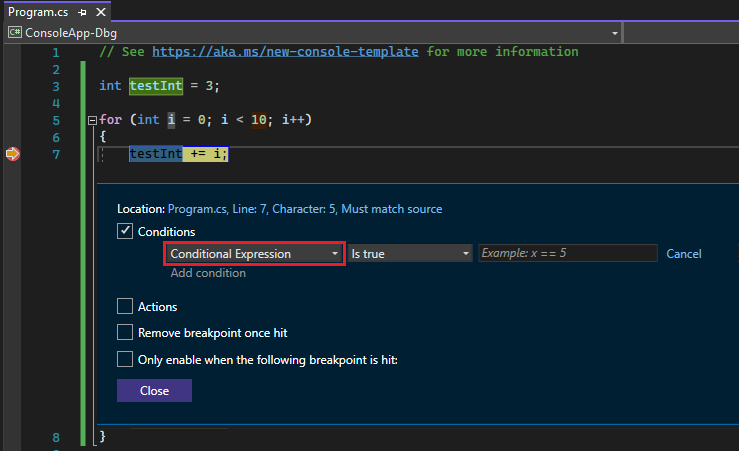
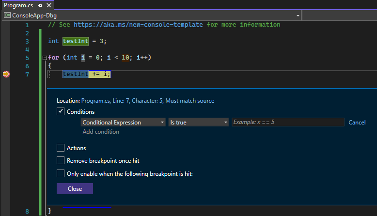
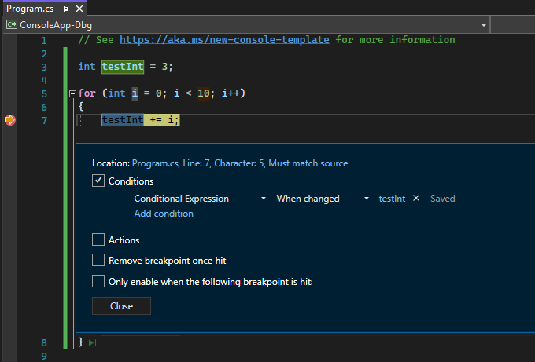
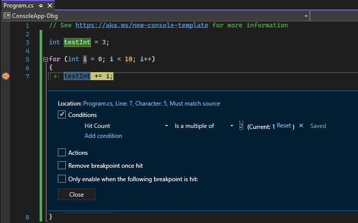
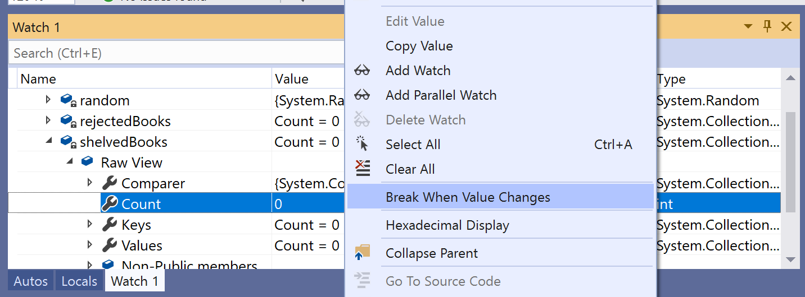
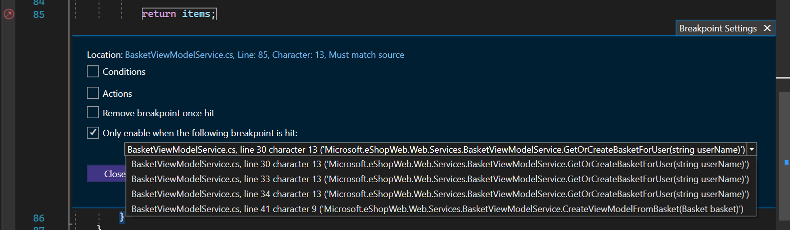
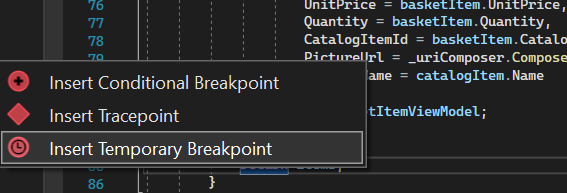

# Use the right type of breakpoint

This article shows how to use different types of breakpoints in Visual Studio to improve debugging efficiency. It covers various scenarios where breakpoints can be applied, such as pausing code execution, logging information, and tracking changes in variable states. The article explains how to set conditional breakpoints, tracepoints, data breakpoints, dependent breakpoints, and temporary breakpoints. It also includes detailed instructions on setting function breakpoints. This guide is essential for developers looking to leverage breakpoints for effective debugging in Visual Studio.

If you're unfamiliar with using breakpoints in Visual Studio, see [Get started with breakpoints](get-started-with-breakpoints.md) before going through this article.

For the best experience with this documentation, choose your preferred development language or runtime from the list at the top of the article.

::: zone pivot="programming-language-dotnet,programming-language-dotnetf,programming-language-cpp,programming-language-all"
## Scenarios

The following table shows common debugging scenarios for breakpoints and the recommended breakpoint type for the scenario.

| Scenario | Description   |
|----------|---------------|
| How do I pause running code to inspect a line of code that may contain a bug? | Set a breakpoint. For more information, see [Get started with breakpoints](get-started-with-breakpoints.md). |
| Does my variable have an unexpected value? Or, do I want to inspect my app when it reaches a specific state? | Try a conditional breakpoint to control where and when a breakpoint gets activated by using conditional logic. Right-click on a breakpoint to add conditions. Set the condition to be true when the variable equals the unexpected value. For more information, see [Breakpoint conditions](#breakpoint-conditions). |
| How do I log information to the Output window under configurable conditions without modifying or stopping my code? | Tracepoints allow you to log information to the Output window under configurable conditions without modifying or stopping your code. For more information, see [Use tracepoints in the Visual Studio debugger](../debugger/using-tracepoints.md).|
| How do I know when the value of my variable changes? | For C++, set a [data breakpoint](#BKMK_set_a_data_breakpoint_native_cplusplus). <br> For apps using .NET Core 3 and later, you can also set a [data breakpoint](#BKMK_set_a_data_breakpoint_managed). <br> Otherwise, for C# and F# only, you can [track an object ID with a conditional breakpoint](#using-object-ids-in-breakpoint-conditions-c-and-f). |
| How do I break execution only if another breakpoint is hit?  | Set a Dependent Breakpoint that breaks execution only if another breakpoint is first hit. For more information, see [Dependent Breakpoint](#BKMK_set_a_dependent_breakpoint).  |
| Can I hit a breakpoint only once? | Set a temporary breakpoint which lets you break the code only once. For more information, see [Temporary Breakpoint](#BKMK_set_a_temporary_breakpoint).  |
| Can I pause code inside a loop at a certain iteration? | Set a Dependent breakpoint that breaks execution only if another breakpoint is first hit. For more information, see [Hit count](#set-a-hit-count-condition). |
| Can I pause code at the start of a function when I know the function name but not its location? | You can do this with a function breakpoint. For more information, see [Set function breakpoints](#BKMK_Set_a_breakpoint_in_a_source_file). |
| Can I pause code at the start of multiple functions with the same name? | When you have multiple functions with the same name (overloaded functions or functions in different projects), you can use a [function breakpoint](#BKMK_Set_a_breakpoint_in_a_source_file). |
::: zone-end

## <a name="BKMK_Print_to_the_Output_window_with_tracepoints"></a> Breakpoint actions and tracepoints

A *tracepoint* is a breakpoint that prints a message to the **Output** window. A tracepoint can act like a temporary trace statement in the programming language and does not pause the execution of code. You create a tracepoint by setting a special action in the **Breakpoint Settings** window. For detailed instructions, see [Use tracepoints in the Visual Studio debugger](../debugger/using-tracepoints.md).

## Breakpoint conditions

You can control when and where a breakpoint executes by setting conditions. The condition can be any valid expression that the debugger recognizes. (For more information about valid expressions, see [Expressions in the debugger](../debugger/expressions-in-the-debugger.md).)

**To set a breakpoint condition:**

1. Right-click the breakpoint symbol and select **Conditions** (or press **Alt** + **F9**, **C**). Or hover over the breakpoint symbol, select the **Settings** icon, and then select **Conditions** in the **Breakpoint Settings** window.

   ::: moniker range=">= vs-2022"
   You can also right-click in the far left margin next to a line of code and select **Insert Conditional Breakpoint**  from the context menu to set a new conditional breakpoint. 
   ::: moniker-end

   You can also set conditions in the **Breakpoints** window by right-clicking a breakpoint and selecting **Settings**, and then selecting **Conditions**

   ::: moniker range=">= vs-2022"
   
   ::: moniker-end
   ::: moniker range="<= vs-2019"
   
   ::: moniker-end

2. In the dropdown, select **Conditional Expression**, **Hit Count**, or **Filter**, and set the value accordingly.

3. Select **Close** or press **Ctrl**+**Enter** to close the **Breakpoint Settings** window. Or, from the **Breakpoints** window, select **OK** to close the dialog.

Breakpoints with conditions set appear with a **+** symbol in the source code and **Breakpoints** windows.

<a name="BKMK_Specify_a_breakpoint_condition_using_a_code_expression"></a>
### Create a conditional expression

When you select **Conditional Expression**, you can choose between two conditions: **Is true** or **When changed**. Choose **Is true** to break when the expression is satisfied, or **When changed** to break when the value of the expression has changed.

In the following example, the breakpoint is hit only when the value of `testInt` is **4**:

::: moniker range=">= vs-2022"

::: moniker-end
::: moniker range="<= vs-2019"

::: moniker-end

In the following example, the breakpoint is hit only when the value of `testInt` changes:

::: moniker range=">= vs-2022"

::: moniker-end
::: moniker range="<= vs-2019"

::: moniker-end

If you set a breakpoint condition with invalid syntax, a warning message appears. If you specify a breakpoint condition with valid syntax but invalid semantics, a warning message appears the first time the breakpoint is hit. In either case, the debugger breaks when it hits the invalid breakpoint. The breakpoint is skipped only if the condition is valid and evaluates to `false`.

>[!NOTE]
> For the **When changed** field, the debugger doesn't consider the first evaluation of the condition to be a change, so doesn't hit the breakpoint on the first evaluation.

::: zone pivot="programming-language-dotnet,programming-language-dotnetf"
### <a name="using-object-ids-in-breakpoint-conditions-c-and-f"></a> Use Object IDs in conditional expressions (C# and F# only)

 There are times when you want to observe the behavior of a specific object. For example, you might want to find out why an object was inserted into a collection more than once. In C# and F#, you can create object IDs for specific instances of [reference types](/dotnet/csharp/language-reference/keywords/reference-types), and use them in breakpoint conditions. The object ID is generated by the common language runtime (CLR) debugging services and associated with the object.

**To create an Object ID:**

1. Set a breakpoint in the code some place after the object has been created.

2. Start debugging, and when execution pauses at the breakpoint, select **Debug** > **Windows** > **Locals** (or press **Ctrl** + **Alt** + **V**, **L**) to open the **Locals** window.

   Find the specific object instance in the **Locals** window, right-click it, and select **Make Object ID**.

   You should see a **$** plus a number in the **Locals** window. This is the object ID.

3. Add a new breakpoint at the point you want to investigate; for example, when the object is to be added to the collection. Right-click the breakpoint and select **Conditions**.

4. Use the Object ID in the **Conditional Expression** field. For example, if the variable `item` is the object to be added to the collection, select **Is true** and type **item == $\<n>**, where \<n> is the object ID number.

   Execution will break at the point when that object is to be added to the collection.

   To delete the Object ID, right-click the variable in the **Locals** window and select **Delete Object ID**.

> [!NOTE]
> Object IDs create weak references, and do not prevent the object from being garbage collected. They are valid only for the current debugging session.
::: zone-end

### Set a hit count condition

If you suspect that a loop in your code starts misbehaving after a certain number of iterations, you can set a breakpoint to stop execution after that number of hits, rather than having to repeatedly press **F5** to reach that iteration.

Under **Conditions** in the **Breakpoint Settings** window, select **Hit Count**, and then specify the number of iterations. In the following example, the breakpoint is set to hit on every other iteration:

::: moniker range=">= vs-2022"

::: moniker-end
::: moniker range="<= vs-2019"

::: moniker-end

### Set a filter condition

You can restrict a breakpoint to fire only on specified devices, or in specified processes and threads.

Under **Conditions** in the **Breakpoint Settings** window, select **Filter**, and then enter one or more of the following expressions:

- MachineName = "name"
- ProcessId = value
- ProcessName = "name"
- ThreadId = value
- ThreadName = "name"

Enclose string values in double quotes. You can combine clauses using `&` (AND), `||` (OR), `!` (NOT), and parentheses.

## <a name="BKMK_Set_a_breakpoint_in_a_source_file"></a> Set function breakpoints

You can break execution when a function is called. This is useful, for example, when you know the function name but not its location. It is also useful if you have functions with the same name and you want to break on them all (such as overloaded functions or functions in different projects).

**To set a function breakpoint:**

1. Select **Debug** > **New Breakpoint** > **Function Breakpoint**, or press **Ctrl** + **K**, **B**.

   You can also select **New** > **Function Breakpoint** in the **Breakpoints** window.

1. In the **New Function Breakpoint** dialog, enter the function name in the **Function Name** box.

   To narrow the function specification:

   - Use the fully qualified function name.

     Example:  `Namespace1.ClassX.MethodA()`

   - Add the parameter types of an overloaded function.

     Example:  `MethodA(int, string)`

   - Use the '!' symbol to specify the module.

     Example: `App1.dll!MethodA`

   - Use the context operator in native C++.

     `{function, , [module]} [+<line offset from start of method>]`

     Example: `{MethodA, , App1.dll}+2`

1. In the **Language** dropdown, choose the language of the function.

1. Select **OK**.

::: zone pivot="programming-language-cpp"
### Set a function breakpoint using a memory address (native C++ only)

 You can use the address of an object to set a function breakpoint on a method called by a specific instance of a class.  For example, given an addressable object of type `my_class`, you can set a function breakpoint on the `my_method` method that instance calls.

1. Set a breakpoint somewhere after the instance of the class is instantiated.

2. Find the address of the instance (for example, `0xcccccccc`).

3. Select **Debug** > **New Breakpoint** > **Function Breakpoint**, or press **Ctrl** + **K**, **B**.

4. Add the following to the **Function Name** box, and select **C++** language.

   ```cpp
   ((my_class *) 0xcccccccc)->my_method
   ```
::: zone-end
::: moniker range=">= vs-2019"

::: zone pivot="programming-language-dotnet"
## <a name="BKMK_set_a_data_breakpoint_managed"></a>Set data breakpoints (.NET Core 3.x or .NET 5+)

Data breakpoints break execution when a specific object's property changes.

To set a data breakpoint:

1. In a .NET Core or .NET 5+ project, start debugging, and wait until a breakpoint is reached.

2. In the **Autos**, **Watch**, or **Locals** window, right-click a property and select **Break when value changes** in the context menu.

    

Data breakpoints for .NET Core and .NET 5+ won't work for:

- Properties that are not expandable in the tooltip, Locals, Autos, or Watch window
- Static variables
- Classes with the DebuggerTypeProxy Attribute
- Fields inside of structs

For the maximum number that you can set, see [Data breakpoint hardware limits](#data-breakpoint-hardware-limits).
::: zone-end
::: moniker-end

::: zone pivot="programming-language-cpp"
## <a name="BKMK_set_a_data_breakpoint_native_cplusplus"></a>Set data breakpoints (native C++ only)

 Data breakpoints break execution when a value stored at a specified memory address changes. If the value is read but not changed, execution doesn't break.

To set a data breakpoint:

1. In a C++ project, start debugging, and wait until a breakpoint is reached. On the **Debug** menu, choose **New Breakpoint** > **Data Breakpoint**.

    You can also select **New** > **Data Breakpoint** in the **Breakpoints** window or right-click an item in the **Autos**, **Watch**, or **Locals** window and select **Break when value changes** in the context menu.

2. In the **Address** box, type a memory address, or an expression that evaluates to a memory address. For example, type `&avar` to break when the contents of the variable `avar` changes.

3. In the **Byte Count** dropdown, select the number of bytes you want the debugger to watch. For example, if you select **4**, the debugger will watch the four bytes starting at `&avar` and break if any of those bytes change value.

Data breakpoints don't work under the following conditions:
- A process that is not being debugged writes to the memory location.
- The memory location is shared between two or more processes.
- The memory location is updated within the kernel. For example, if memory is passed to the 32-bit Windows `ReadFile` function, the memory will be updated from kernel mode, so the debugger won't break on the update.
- Where the watch expression is larger than 4 bytes on 32-bit hardware and 8 bytes on 64-bit hardware. This is a limitation of the x86 architecture.

> [!NOTE]
> - Data breakpoints depend on specific memory addresses. The address of a variable changes from one debugging session to the next, so data breakpoints are automatically disabled at the end of each debugging session.
>
> - If you set a data breakpoint on a local variable, the breakpoint remains enabled when the function ends, but the memory address is no longer applicable, so the behavior of the breakpoint is unpredictable. If you set a data breakpoint on a local variable, you should delete or disable the breakpoint before the function ends.
::: zone-end

::: zone pivot="programming-language-dotnet,programming-language-cpp"
## Data breakpoint hardware limits

The Windows kernel and the underlying hardware have the following limits when setting data breakpoints. The limit refers to the maximum number of data breakpoints that you can set.

|Processor architecture|Data breakpoint limit|
|-|-|
|x64 and x86|4|
|ARM64|2|
|ARM|1|
::: zone-end
::: moniker range=">= vs-2022"
## <a name="BKMK_set_a_dependent_breakpoint"></a>Set a dependent breakpoint

Dependent breakpoints break execution only if another breakpoint is first hit. So, in a complex scenario such as  debugging a multi-threaded application, you can configure the additional breakpoints after another breakpoint is first hit. This can make debugging code in common paths such as game loop or a utility API much easier because a breakpoint in those functions can be configured to enable only if the function is invoked from a specific part of your application.

**To set a dependent breakpoint:**

1. Hover over the breakpoint symbol, choose the **Settings** icon, and then select **Only enable when the following breakpoint is hit** in the Breakpoint Settings window.

2. In the dropdown, select the prerequisite breakpoint you want your current breakpoint to be dependent on.

Choose **Close** or press **Ctrl+Enter** to close the Breakpoint Settings window. Or, from the Breakpoints window, choose **OK** to close the dialog.


You can also use the right-click context menu to set the dependent breakpoint.

1. Right-click in the far left margin next to a line of code and select **Insert Dependent Breakpoint** from the context menu.

   

- Dependent breakpoints don't work if there is only a single breakpoint in your application. 
- Dependent breakpoints are converted to normal line breakpoint if the prerequisite breakpoint is deleted. 

## <a name="BKMK_set_a_temporary_breakpoint"></a>Set a Temporary breakpoint

This breakpoint lets you break the code only once. When debugging, the Visual Studio debugger only pauses the running application once for this breakpoint and then removes it immediately after it has been hit.

**To set a temporary breakpoint:**

1. Hover over the breakpoint symbol, choose the **Settings** icon, and then select **Remove breakpoint once hit** in the Breakpoint Settings window.
2. Choose **Close** or press **Ctrl+Enter** to close the Breakpoint Settings window. Or, from the Breakpoints window, choose **OK** to close the dialog.

   

You can also use the right-click context menu to set the temporary breakpoint.

1. Right-click in the far left margin next to a line of code and select **Insert Temporary Breakpoint** from the context menu.

   

Or, simply use the shortcut **F9 + Shift + Alt, T** and  set the temporary breakpoint on line desired.
::: moniker-end

## Related content

- [What is debugging?](../debugger/what-is-debugging.md)
- [Write better C# code using Visual Studio](../debugger/write-better-code-with-visual-studio.md)
- [First look at debugging](../debugger/debugger-feature-tour.md)
- [Troubleshoot breakpoints in the Visual Studio debugger](/troubleshoot/developer/visualstudio/debuggers/troubleshooting-breakpoints)
