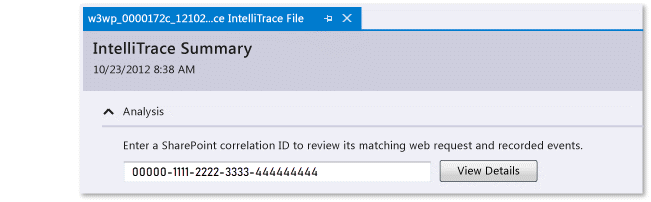

# Using saved IntelliTrace data (C#, Visual Basic, C++)

Go to specific points in your application's execution when you start debugging from an IntelliTrace log (.iTrace) file. This file can contain performance events, exceptions, threads, test steps, modules, and other system info that IntelliTrace records while your app runs.

 Make sure that you have:

- Matching source files and symbol (.pdb) files for your application code. Otherwise, Visual Studio can't resolve the source locations and shows the message "Symbols not found." See [Specify Symbol (.pdb) and Source Files](../debugger/specify-symbol-dot-pdb-and-source-files-in-the-visual-studio-debugger.md) and [Diagnose problems after deployment](../debugger/diagnose-problems-after-deployment.md).

- Visual Studio Enterprise (but not Professional or Community editions) on your development computer or another computer to open .iTrace files

- An .iTrace file from one of these sources:

    |**Source**|**See**|
    |----------------|-------------|
    |An IntelliTrace session in Visual Studio Enterprise (but not Professional or Community editions)|[IntelliTrace Features](../debugger/intellitrace-features.md)|
    |Microsoft Monitoring Agent, either alone or with System Center 2012 R2 Operations Manager, for ASP.NET web apps and SharePoint applications running in deployment|-   [Diagnose problems after deployment](../debugger/diagnose-problems-after-deployment.md) -   [What's New for System Center 2012 R2 Operations Manager](/previous-versions/system-center/system-center-2012-R2/dn249700(v=sc.12))|

##  What do you want to do?

- [Open an IntelliTrace log](#Open)

- [Understand the IntelliTrace log](#Understand)

- [Start debugging from an IntelliTrace log](#StartDebugging)

##  Open an IntelliTrace log
 On a computer with Visual Studio Enterprise, open the .iTrace file.

- Double-click the .iTrace file outside Visual Studio, or open the file from inside Visual Studio.

     \- or -

- If the .iTrace file is attached to a Team Foundation Server work item, follow these steps in the work item:

  - Under **All Links**, find the .iTrace file. Open it.

    \- or -

  - Under **Repro Steps**, choose the **IntelliTrace** link.

> [!TIP]
> If you closed the IntelliTrace file during debugging, you can reopen it easily. Go to the **Debug** menu, choose **IntelliTrace**, **Show Log Summary**. You can also choose **Show Log Summary** in the **IntelliTrace** window. This is available only while debugging with IntelliTrace.

##  Understand the IntelliTrace log
 Some of the following sections in the .iTrace file appear only if you collected data from a particular source, for example, from SharePoint applications.

|**Section**|**Contains**|**Collection Source**|
|-----------------|------------------|---------------------------|
|[Performance Violations](#Performance)|Performance events with function calls that exceed the configured threshold|Microsoft Monitoring Agent, either standalone collector or with System Center 2012 R2 Operations Manager for ASP.NET web apps hosted on IIS|
|[Exception Data](#ExceptionData)|Exceptions, including the full call stack for each exception|All sources|
|[Analysis](#Analysis)|For SharePoint 2010 and SharePoint 2013 applications only. Diagnose IntelliTrace and SharePoint events, such as debugger events, ULS events, unhandled exceptions, and other data that the Microsoft Monitoring Agent recorded.|Microsoft Monitoring Agent, either standalone collector or with System Center 2012 R2 Operations Manager|
|[System Info](#SystemInfo)|Settings and specifications of the host system|All sources|
|[Threads List](#ThreadsList)|Threads that ran during collection|All sources|
|[Modules](#Modules)|Modules that the target process loaded in the order that they loaded.|All sources|
|[Web Request](#Modules)|Web request data for production IIS web applications and SharePoint 2010 and SharePoint 2013|Microsoft Monitoring Agent and the standalone collector|

 Here's some tips to help you find information in each section:

- Choose a column header to sort data.

- Use the search box to filter data. Plain text search works across all columns except the time columns. You can also filter searches to a specific column with one filter per column. Type the column name with no spaces, a colon (**:**), and the search value. Follow this with a semicolon (**;**) to add another column and search value.

     For example, to find performance events that have the word "slow" in the **Description** column, type:

     `Description:slow`

##  Start debugging from an IntelliTrace log

###  Performance Violations
 Review the performance events that were recorded for your app. You can hide those events that don't happen often.

##### To start debugging from a performance event

1. Under **Performance Violations**, review the recorded performance events, their total execution times, and other event information. Then dig deeper into the methods that were called during a specific performance event.

     

     You can also just double-click the event.

2. On the event page, review the execution times for these calls. Find a slow call in the execution tree.

     The slowest calls appear in their own section when you have multiple calls, nested or otherwise.

3. Expand that call to review any nested calls and parameter values that were recorded at that point in time.

     (Keyboard: To show or hide a nested call, press the **Right Arrow** or **Left Arrow** key respectively. To show and hide parameter values for a nested call, press the **Space** key.)

     Start debugging from the call.

     

     You can also just double-click the call or press the **Enter** key.

     If the method is in your application code, Visual Studio goes to that method.

     

     Now you can review other recorded values, the call stack, step through your code, or use the **IntelliTrace** window to [move backwards or forwards "in time" between other methods](../debugger/intellitrace.md) that were called during this performance event.

###  Exception Data
 Review the exceptions that were thrown and recorded for your app. You can group exceptions that have the same type and call stack so that you see only the most recent exception.

##### To start debugging from an exception

1. Under **Exception Data**, review the recorded exception events, their types, messages, and when the exceptions happened. To dig deeper into the code, start debugging from the most recent event in a group of exceptions.

     

     You can also just double-click the event. If the events aren't grouped, choose **Debug This Event**.

     If the exception happened in your application code, Visual Studio goes to where the exception happened.

     

     Now you can review other recorded values, the call stack, or use the **IntelliTrace** window to [move backwards or forwards "in time" between other recorded events](../debugger/intellitrace.md), related code, and the values recorded at those points in time.

    |**Column**|**Shows the**|
    |----------------|-------------------|
    |**Type**|.NET type of the exception|
    |**Newest Message** for grouped exceptions or **Message** for ungrouped exceptions|The message provided by the exception|
    |**Count** for grouped exceptions|The number of times the exception was thrown|
    |**Thread ID** for ungrouped exceptions|ID of the thread that threw the exception|
    |**Newest Event Time** or **Event Time**|Time stamp recorded when the exception was thrown|
    |**Call Stack**|Call stack for an exception.   To see the call stack, choose an exception in the list. The call stack appears below the exception list.|

###  Analysis
 Diagnose problems with SharePoint 2010 and SharePoint 2013 applications by using a SharePoint correlation ID or review any unhandled exceptions that Microsoft Monitoring Agent found.

- Use a SharePoint correlation ID to find its matching web request and events. Choose an event and then start debugging at the point where and when the event happened.

- If Microsoft Monitoring Agent found unhandled exceptions, choose an exception and then start debugging at the point where and when the exception happened.

##### Start debugging with a SharePoint correlation ID

1. Copy the SharePoint correlation ID from its source.

    For example:

    

2. Open the .iTrace file, then go to **Analysis** and enter the SharePoint correlation ID to review the matching web request and recorded events.

    

3. Under **Request Events**, examine the events. Starting from the top, events appear in the order that they happened.

   1. Choose an event to see its details.

   2. Choose **Start Debugging** to start debugging at the point where the event happened.

      

   You can see these kinds of SharePoint events along with IntelliTrace events:

- **User profile events**

     These events happen when SharePoint loads a user profile and when user profile properties are read or changed.

- **Unified Logging System (ULS) events**

     Microsoft Monitoring Agent records a subset of SharePoint ULS events and these fields:

    |**IntelliTrace field**|**SharePoint ULS field**|
    |----------------------------|------------------------------|
    |**ID**|**EventID**|
    |**Level**|**Level**|
    |**Category ID**|**Category ID**|
    |**Category**|**Category**|
    |**Area**|**Product**|
    |**Output**|**Message**|
    |**Correlation ID**|**Correlation ID**|

##### Start debugging from an unhandled exception

1. Choose a SharePoint correlation ID for an exception. Exceptions are grouped by type and call stack.

2. (Optional) Expand **Call Stack** to see the call stack for a group of exceptions.

3. Choose **Debug Exception** to start debugging at the point where and when the exception happened.

    

   For a walkthrough, see [Walkthrough: Debugging a SharePoint Application by Using IntelliTrace](../sharepoint/walkthrough-debugging-a-sharepoint-application-by-using-intellitrace.md). For the kinds of data that the agent records, see [IntelliTrace Features](../debugger/intellitrace-features.md).

###  Threads List
 Examine the recorded threads that ran in the target process. You can start debugging from the first valid IntelliTrace event in a selected thread.

##### To start debugging from a specific thread

1. Under **Threads List**, choose a thread.

2. At the bottom of **Threads List**, choose **Start Debugging**. You can also double-click a thread.

    To start debugging from where the app begins, double-click **Main Thread**. See [IntelliTrace Features](../debugger/intellitrace-features.md).

   Thread data that the user creates might be more useful than threads that a server creates and manages for IIS-hosted Web apps.

|**Column**|**Shows the**|
|----------------|-------------------|
|**ID**|Thread ID number|
|**Name**|Thread name. Unnamed threads appear as "\<No Name>".|
|**Start Time**|Time the thread was created|
|**End Time**|Time the thread was completed|

##### To start debugging from a specific test step

1. Expand **Test Steps Grid**. Choose a test step.

2. At the bottom of **Test Steps Grid**, choose **Start Debugging**. You can also double-click a test step.

     This starts debugging from the first valid IntelliTrace event after the selected test step.

     When test data exists, IntelliTrace tries to resolve the associated Team Foundation Server build that was used to perform the test run. If the build is found, the associated symbols for the app are resolved automatically.

|**Field**|**Shows the**|
|---------------|-------------------|
|**Test Session**|Test sessions that were recorded. Typically, there is only one. This list is empty if test data was created using a manual exploratory test.|
|**Test Case**|Test cases from the selected test session. This list is empty if test data was created using a manual exploratory test.|
|**Test Steps Grid**|Test steps that were recorded with the test result of pass or fail|

###  System Info
 This section shows you details about the system that hosted the app, for example, hardware, operating system, environmental and process-specific information.

###  Modules
 This section shows you the modules that the target process loaded. Modules appear in the order that they loaded.

|**Column**|**Shows the**|
|----------------|-------------------|
|**Module Name**|Module file name|
|**Module Path**|Disk location where the module was loaded|
|**Module ID**|Unique identifier of the module that is version-specific and contributes to the matching symbol (PDB) files. See [Finding symbol (.pdb) files and source files](specify-symbol-dot-pdb-and-source-files-in-the-visual-studio-debugger.md).|

### Where can I get more information?
 [Using the IntelliTrace stand-alone collector](../debugger/using-the-intellitrace-stand-alone-collector.md)

 [IntelliTrace Features](../debugger/intellitrace-features.md)

 [Collect more diagnostic data in manual tests](/azure/devops/test/collect-diagnostic-data)

 [IntelliTrace](../debugger/intellitrace.md)

#### Forums
 [Visual Studio Debugger](https://social.msdn.microsoft.com/Forums/en-US/home)
