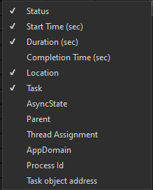
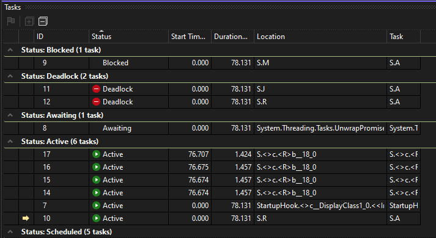
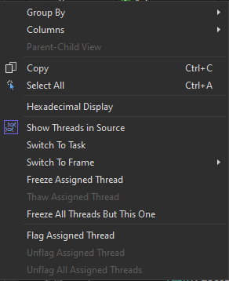

# Using the Tasks Window (C#, Visual Basic, C++)

The **Tasks** window resembles the **Threads** window, except that it shows information about <xref:System.Threading.Tasks.Task?displayProperty=fullName> or [task_handle](/cpp/parallel/concrt/reference/task-group-class) objects instead of each thread. Like threads, tasks represent asynchronous operations that can run concurrently; however, multiple tasks may run on the same thread.

In managed code, you can use the **Tasks** window when you work with <xref:System.Threading.Tasks.Task?displayProperty=fullName> objects or with the **await** and **async** keywords (**Await** and **Async** in VisualBasic). For more information about tasks in managed code, see  [Parallel Programming](/dotnet/standard/parallel-programming/index).

In native code, you can use the **Tasks** window when you work with [task groups](/cpp/parallel/concrt/task-parallelism-concurrency-runtime), [parallel algorithms](/cpp/parallel/concrt/parallel-algorithms), [asynchronous agents](/cpp/parallel/concrt/asynchronous-agents), and [lightweight tasks](/cpp/parallel/concrt/task-scheduler-concurrency-runtime). For more information about tasks in native code, see [Concurrency Runtime](/cpp/parallel/concrt/concurrency-runtime).

You can use the **Tasks** window whenever you break into the debugger. You can access it on the **Debug** menu by clicking **Windows** and then clicking **Tasks**. The following illustration shows the **Tasks** window in its default mode.

::: moniker range=">=vs-2022"

::: moniker-end
::: moniker range="vs-2019"

::: moniker-end

> [!NOTE]
> In managed code, a <xref:System.Threading.Tasks.Task> that has a status of [TaskStatus.Created](<xref:System.Threading.Tasks.TaskStatus.Created>), [TaskStatus.WaitingForActivation](<xref:System.Threading.Tasks.TaskStatus.WaitingForActivation>), or [TaskStatus.WaitingToRun](<xref:System.Threading.Tasks.TaskStatus.WaitingToRun>) might not be displayed in the **Tasks** window when managed threads are in a sleep or join state.

## Tasks Column Information

The columns in the **Tasks** window show the following information.

|Column Name|Description|
|-----------------|-----------------|
|**Flags**|Shows which tasks are flagged and lets you flag or unflag a task.|
|**Icons**| A yellow arrow indicates the current task. The current task is the top-most task on the current thread.    A green arrow indicates the current debugger context (following a switch to task in the debugger).  [White arrow](media/icon-parallel-white-arrow.png) A white arrow indicates the breaking task, that is, the one that was current when the debugger was invoked.    The pause icon indicates a task that has been frozen by the user. You can freeze and unfreeze a task by right-clicking it in the list.|
|**ID**|A system-provided number for the task. In native code, this is the address of the task.|
|**Status**|The current state (scheduled, active, blocked, deadlocked, awaiting, or completed) of the task.    Scheduled. A scheduled task is one that has not yet been run and, therefore, doesn't yet have a call stack, assigned thread, or related information.    Active. An active task is one that was executing code before breaking in the debugger.    Blocked. A blocked task is one that is blocked because it's waiting on an event to be signaled, a lock to be released, or another task to finish.     Awaiting. A non-blocking, waiting task that uses the async/await pattern.    Deadlocked. A deadlocked task is a waiting task whose thread is deadlocked with another thread.   Hover over the **Status** cell for a deadlocked or awaiting task to see more information about the block. **Warning:**  The **Tasks** window reports deadlock only for a blocked task that uses a synchronization primitive that is supported by Wait Chain Traversal (WCT). For example, for a deadlocked <xref:System.Threading.Tasks.Task> object, which uses WCT, the debugger reports **Awaiting-deadlocked**. For a deadlocked task that is managed by the Concurrency Runtime, which doesn't use WCT, the debugger reports **Waiting**. For more information about WCT, see [Wait Chain Traversal](/windows/desktop/Debug/wait-chain-traversal).|
|**Start Time**|The time at which the task became active.|
|**Duration**|The number of seconds that the task has been active.|
|**Completion Time**|The time at which the task completed.|
|**Location**|The current location in the call stack of the task. Hover over this cell to see the entire call stack for the task. Scheduled tasks don't have a value in this column.|
|**Task**|The initial method and any arguments that were passed to the task when it was created.|
|**AsyncState**|For managed code, the task status. By default, this column is hidden. To display this column, open the context menu for one of the column headers. Choose **Columns**, **AsyncState**.|
|**Parent**|The ID of the task that created this task. If this is blank, the task has no parent. This is only applicable for managed programs.|
|**Thread Assignment**|The ID and name of the thread on which the task is running.|
|**AppDomain**|For managed code, the application domain in which the task is executing.|
|**task_group**|For native code, the address of the [task_group](/cpp/parallel/concrt/reference/task-group-class) object that scheduled the task. For asynchronous agents and lightweight tasks, this column is set to 0.|
|**Process**|The ID of the process that the task is running on.|

 You can add columns to the view by right-clicking a column heading and then selecting the columns you want. (Remove columns by clearing the selections.) You can also reorder columns by dragging them left or right. The column shortcut menu is shown in the following illustration.

 ::: moniker range=">=vs-2022"
 
 ::: moniker-end
 ::: moniker range="vs-2019"
 
 ::: moniker-end

## Sorting Tasks

 To sort tasks by column criteria, click the column header. For example, by clicking the **ID** column header, you can sort the tasks by task ID: 1,2,3,4,5 and so on. To reverse the sort order, click the column header again. The current sort column and sort order is indicated by an arrow on the column.

## Grouping Tasks

 You can group tasks based on any column in the list view. For example, by right-clicking the **Status** column header and then clicking **Group by** > **[*status*]**, you can group all tasks that have the same status. For example, you could quickly see awaiting tasks so that you could focus on why they're blocked. You can also collapse a group that isn't of interest during the debug session. In the same manner, you can group by the other columns. A group can be (un)flagged just by clicking the button next to the group header. The following illustration shows the **Tasks** window in grouped mode.

 ::: moniker range=">=vs-2022"
 
 ::: moniker-end
 ::: moniker range="vs-2019"
 
 ::: moniker-end

## Parent Child View

 (This view is available for managed code only.) By right-clicking the **Status** column header and then clicking **Group by** > **Parent**, you can change the list of tasks to a hierarchical view, in which every child task is a sub-node that can be displayed or hidden under its parent.

## Flagging Tasks

 You can flag the thread the task on which a task is running by selecting the task list item and then choosing **Flag Assigned Thread** from the context menu, or by clicking the flag icon in the first column. If you flag several tasks, you can then sort on the flag column to bring all the flagged tasks to the top so that you can focus just on them. You can also use the **Parallel Stacks** window to view only flagged tasks. This lets you filter out tasks that you aren't interested in for debugging. Flags aren't persisted between debugging sessions.

## Freezing and Thawing Tasks

 You can freeze the thread on which a task is running by right-clicking the task list item and then clicking **Freeze Assigned Thread**. (If a task is already frozen, the command is **Thaw Assigned Thread**.) When you freeze a thread, that thread will not execute when you step through code after the current breakpoint. The **Freeze All Threads But This One** command freezes all threads except the one that is executing the task list item.

 The following illustration shows the other menu items for each task.

 ::: moniker range=">=vs-2022"
 
 ::: moniker-end
 ::: moniker range="vs-2019"
 
 ::: moniker-end

## Switching the Active Task or Frame

The **Switch to Task** command makes the current task the active task. The **Switch to Frame** command makes the selected stack frame the active stack frame. The debugger context switches to the current task or the selected stack frame.

## Related content

- [First look at the debugger](../debugger/debugger-feature-tour.md)
- [Debugging Managed Code](../debugger/debugging-managed-code.md)
- [Parallel Programming](/dotnet/standard/parallel-programming/index)
- [Concurrency Runtime](/cpp/parallel/concrt/concurrency-runtime)
- [Using the Parallel Stacks Window](../debugger/using-the-parallel-stacks-window.md)
- [Walkthrough: Debugging a Parallel Application](../debugger/walkthrough-debugging-a-parallel-application.md)