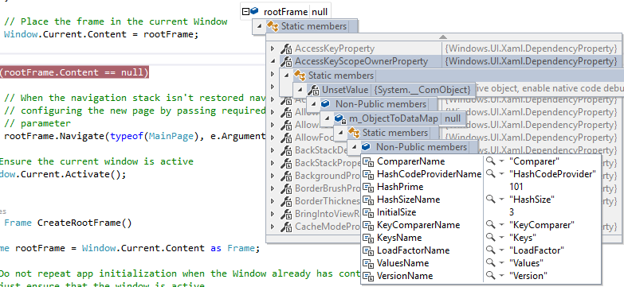

# View data values in DataTips in the code editor

 [!INCLUDE [Visual Studio](~/includes/applies-to-version/vs-windows-only.md)]r

Data tips provide a convenient way to view information about variables in your program during debugging. Data tips work only in break mode and only with variables that are in the current scope of execution. If this is the first time that you've tried to debug code, you may want to read [Debugging for absolute beginners](../debugger/debugging-absolute-beginners.md) and [Debugging techniques and tools](../debugger/write-better-code-with-visual-studio.md) before going through this article.

## Work with data tips

Data tips appear only in break mode, and only on variables that are in the current scope of execution.

### Display a data tip

1. Set a breakpoint in your code, and start debugging by pressing **F5** or selecting **Debug** > **Start Debugging**.

1. When paused at the breakpoint, hover over any variable in the current scope. A data tip appears, showing the name and current value of the variable.

### Make a data tip transparent

To make a data tip transparent to see code that is underneath it, while in the data tip, press **Ctrl**. The data tip stays transparent as long as you hold down the **Ctrl** key. This doesn't work for pinned or floating data tips.

::: moniker range=">= vs-2022"
### Keep a data tip expanded

Starting in Visual Studio 2022 Update 1, when you expand a data tip, you can keep it expanded until you click elsewhere. This is called a *sticky data tip*. To enable this feature, select **Tools** > **Options** > **Debugging**, and then in the **General** tab, select **Keep expanded data tips open until clicked away**.
::: moniker-end

### Pin a data tip

To pin a data tip so that it stays open, select the pushpin **Pin to source** icon.

You can move a pinned data tip by dragging it around the code window. A pushpin icon appears in the gutter next to the line the data tip is pinned to.

>[!NOTE]
>Data tips are always evaluated in the context where execution is suspended, not the current cursor or data tip location. If you hover over a variable in another function that has the same name as a variable in the current context, the value of the variable in the current context is displayed.

### Unpin a data tip from source

To float a pinned data tip, hover over the data tip and select the pushpin icon from the context menu.

The pushpin icon changes to the unpinned position, and the data tip now floats or can be dragged above all open windows. Floating data tips close when the debugging session ends.

### Repin a data tip

To repin a floating data tip to source, hover over it in the code editor and select the pushpin icon. The pushpin icon changes to the pinned position, and the data tip is again pinned only to the code window.

If a data tip is floating over a non-source code window, the pushpin icon is unavailable, and the data tip cannot be repinned. To access the pushpin icon, return the data tip to the code editor window by dragging it or giving the code window focus.

### Close a data tip

To close a data tip, hover over the data tip and select the close (**x**) icon from the context menu.

### Close all data tips

To close all data tips, on the **Debug** menu, select **Clear All data tips**.

### Close all data tips for a specific file

To close all data tips for a specific file, on the **Debug** menu, select **Clear All data tips Pinned to \<Filename>**.

## Expand and edit information
You can use data tips to expand an array, a structure, or an object to view its members. You can also edit the value of a variable from a data tip.

### Expand a variable

To expand an object in a data tip to see its elements, hover over the expand arrows before the item names to display the elements in tree form. For a pinned data tip, select the **+** before the variable name and then expand the tree.

You can use the mouse or the arrow keys on the keyboard to move up and down in the expanded view.

You can also pin expanded items to the pinned data tip by hovering over them and selecting their pushpin icons. The elements then appear in the pinned data tip after the tree is collapsed.

### Edit the value of a variable

To edit the value of a variable or element in a data tip, select the value, type a new value, and press **Enter**. Selection is disabled for read-only values.

::: moniker range=">= vs-2019"

## Pin Properties in data tips

> [!NOTE]
> This feature is supported for .NET Core 3.0 or higher.

You can quickly inspect objects by their properties in data tips with the **Pinnable Properties** tool.  To use this tool, hover over a property and select the pin icon that appears or right-click and select the **Pin Member as Favorite** option in the resulting context menu.  This bubbles up that property to the top of the object’s property list, and the property name and value is displayed in the right column of the data tip.  To unpin a property, select the pin icon again or select the **Unpin Member as Favorite** option in the context menu.

You can also toggle property names and filter out non-pinned properties when viewing the object’s property list in a data tip.  You can access either option by right-clicking a row containing a property and selecting the **Show only pinned members** or **Hide pinned member names in values** options in the context menu.

::: moniker-end

## Visualize complex data types

A magnifying glass icon next to a variable or element in a data tip means that one or more [visualizers](../debugger/create-custom-visualizers-of-data.md), such as the [Text Visualizer](../debugger/string-visualizer-dialog-box.md), are available for the variable. Visualizers display information in a more meaningful, sometimes graphical, manner.

To view the element using the default visualizer for the data type, select the magnifying glass icon . Select the arrow next to the magnifying glass icon to select from a list of visualizers for the data type.

## Add a variable to a Watch window

If you want to continue to watch a variable, you can add it to a **Watch** window from a data tip. Right-click the variable in the data tip, and select **Add Watch**.

The variable appears in the **Watch** window. If your Visual Studio edition supports more than one **Watch** window, the variable appears in **Watch 1**.

## Import and export data tips

You can export data tips to an XML file, which you can share or edit using a text editor. You can also import a data tip XML file you have received or edited.

**To export data tips:**

1. Select **Debug** > **Export DataTips**.

1. In the **Export DataTips** dialog box, navigate to the location to save the XML file, type a name for the file, and then select **Save**.

**To import data tips:**

1. Select **Debug** > **Import DataTips**.

1. In the **Import data tips** dialog box, select the data tips XML file you want to open, and then select **Open**.

## See also
- [What is debugging?](../debugger/what-is-debugging.md)
- [Debugging techniques and tools](../debugger/write-better-code-with-visual-studio.md)
- [First look at debugging](../debugger/debugger-feature-tour.md)
- [Viewing Data in the Debugger](../debugger/viewing-data-in-the-debugger.md)
- [Watch and QuickWatch Windows](../debugger/watch-and-quickwatch-windows.md)
- [Create Custom Visualizers](../debugger/create-custom-visualizers-of-data.md)
