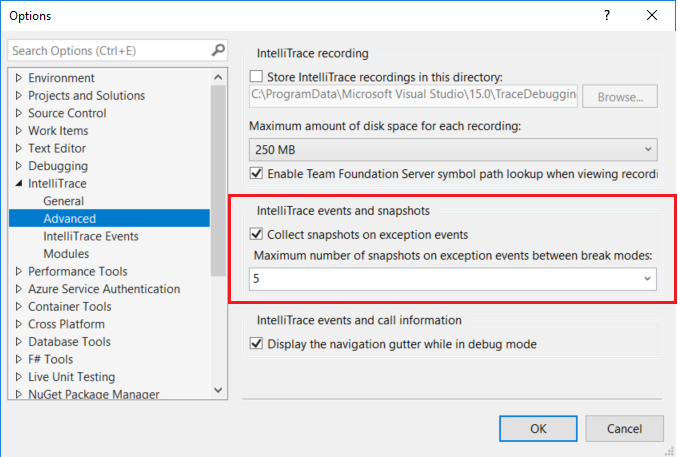
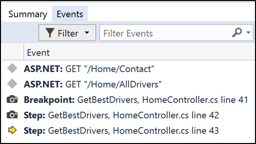
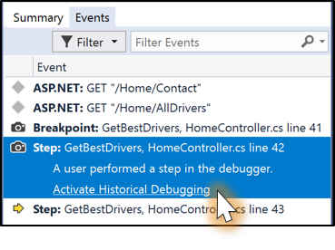
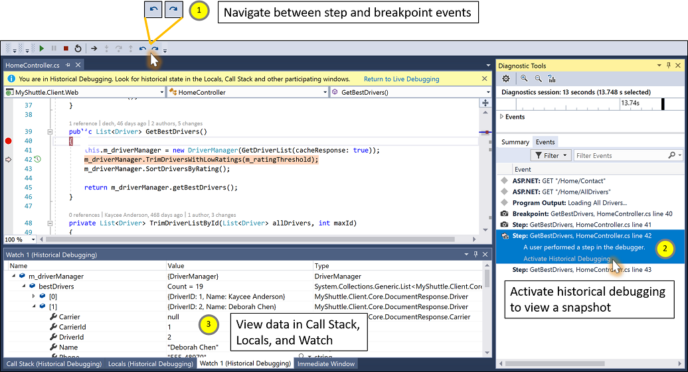

# Inspect previous app states using IntelliTrace step-back in Visual Studio (Visual Studio Enterprise)

IntelliTrace step-back automatically takes a snapshot of your application at every breakpoint and debugger step event. The recorded snapshots enable you to go back to previous breakpoints or steps and view the state of the application as it was in the past. IntelliTrace step-back can save you time when you want to see the previous application state but don't want to restart debugging or recreate the desired app state.

IntelliTrace step-back is available starting in Visual Studio Enterprise 2017 version 15.5 and higher, and it requires Windows 10 Anniversary Update or above. The feature is currently supported for debugging ASP.NET, WinForms, WPF, managed console apps, and managed class libraries. Starting with Visual Studio 2017 Enterprise version 15.7, the feature is also supported for ASP.NET Core and .NET Core. Starting with Visual Studio 2017 Enterprise version 15.9 Preview 2, the feature is also supported for native apps targeting Windows. Debugging UWP applications is not currently supported.

In this tutorial, you will:

> [!div class="checklist"]
> * Enable IntelliTrace events and snapshots
> * Navigate events using step-back and step-forward commands
> * View event snapshots

## Enable IntelliTrace events and snapshots mode

1. Open your project in Visual Studio Enterprise.

1. Open **Tools** > **Options** > **IntelliTrace** settings, and select the option **IntelliTrace events and snapshots**.

    Starting in Visual Studio 2017 Enterprise version 15.9 Preview 2, this option is **IntelliTrace snapshots (managed and native)**.

    

1. If you want to configure options for viewing snapshots on exceptions, choose **IntelliTrace** > **Advanced** from the **Options** dialog box.

    These options are available starting in Visual Studio 2017 Enterprise version 15.7.

    

    When you enable events and snapshots, taking snapshots on exceptions is also enabled by default. You can disable snapshots on exceptions by deselecting **Collect snapshots on exception events**. When this feature is enabled, snapshots are taken for unhandled exceptions. For handled exceptions, snapshots are taken only if the exception is thrown and if it is not a re-throw of an previously-thrown exception. You can set a maximum number of snapshots on exceptions by selecting a value from the drop-down list. The maximum applies for each time that your app enters break mode (such as when your app hits a breakpoint).

    > [!NOTE]
    > Snapshots are taken only for exception events that IntelliTrace records. For managed code, you can specify what events IntelliTrace records by selecting **Tools** > **Options** > **IntelliTrace Events**.

1. In your project, set one or more breakpoints and start debugging (press **F5**), or start debugging by stepping through your code (**F10** or **F11**).

    IntelliTrace takes a snapshot of the application's process on each debugger step, breakpoint event, and unhandled exception event. These events are recorded in the **Events** tab in the **Diagnostic Tools** window, along with other IntelliTrace events. To open this window, choose **Debug** > **Windows** > **Show Diagnostic Tools**.

    A camera icon appears next to the events for which snapshots are available.

    

    For performance reasons, snapshots are not taken when you step very quickly. If no camera icon appears next to the step, try stepping more slowly.

## Navigate and view snapshots

1. Navigate between events by using the **Step Backward (Alt + [)** and **Step Forward (Alt + ])** buttons in the Debug toolbar.

    These buttons navigate the events that appear in the **Events** tab in the **Diagnostic Tools window**. Stepping backward or forward to an event automatically activates [historical debugging](../debugger/historical-debugging.md) on the selected event.

    

    When you step back or step forward, Visual Studio enters historical debugging mode. In this mode, the debugger's context switches to the time when the selected event was recorded. Visual Studio also moves the pointer to the corresponding line of code in the source window.

    From this view, you can inspect the values in the **Call Stack**, **Locals**, **Autos**, and **Watch** windows. You can also hover over variables to view DataTips and perform expression evaluation in the **Immediate** window. The data you see is from the snapshot of the application's process taken at that point in time.

    So, for example, if you've hit a breakpoint and taken a Step (**F10**), the **Step Backward** button puts Visual Studio in historical mode at the line of code corresponding to the breakpoint.

    

2. To return to live execution, choose **Continue (F5)** or click the **Return to Live Debugging** link in the infobar.

3. You can also view a snapshot from the **Events** tab. To do this, select an event with a snapshot and click **Activate Historical Debugging**.

    

    Unlike the **Set Next Statement** command, viewing a snapshot doesn’t rerun your code; it gives you a static view of the state of the application at a point in time that has occurred in the past.

    

    To learn more about how to inspect variables in Visual Studio, see [First look at the debugger](../debugger/debugger-feature-tour.md)

## Frequently Asked Questions

#### How is IntelliTrace step-back different from IntelliTrace events only mode?

IntelliTrace in events only mode does allow you to activate historical debugging on debugger steps and breakpoints. However, IntelliTrace only captures data in the **Locals** and **Autos** windows if the windows are open, and it only captures data that is expanded and in view. In events only mode, you often do not have a complete view of the variables and complex objects. Additionally, expression evaluation and viewing data in the **Watch** window is not supported.

In events and snapshots mode, IntelliTrace captures the entire snapshot of the application's process, including complex objects. At a line of code, you can see the same information as if you were stopped at a breakpoint (and it does not matter whether you previously expanded the information). Expression evaluation is also supported when viewing a snapshot.  

#### What is the performance impact of this feature? 

The impact on overall stepping performance depends on your application. The overhead of taking a snapshot is around 30 ms. When a snapshot is taken, the app’s process is forked and the forked copy is suspended. When you view a snapshot, Visual Studio is attaching to the forked copy of the process. For each snapshot, Visual Studio copies only the page table and sets pages to copy-on-write. If objects on the heap change between debugger steps with associated snapshots, the respective page table is then copied, resulting in minimal memory cost. If Visual Studio detects that there is not enough memory to take a snapshot, it does not take one.

## Known Issues
* If you are using IntelliTrace events and snapshots mode on versions of Windows older than Windows 10 Fall Creators Update (RS3), and if the debug platform target of the application is set to x86, IntelliTrace does not take snapshots.

    Workarounds:
  * If you are on the Windows 10 Anniversary Update (RS1) and below version 10.0.14393.2273, [install KB4103720](https://support.microsoft.com/help/4103720/windows-10-update-kb4103720).
  * If you are on the Windows 10 Creators Update (RS2) and below version 10.0.15063.1112, [install KB4103722](https://support.microsoft.com/help/4103722/windows-10-update-4103722).
  * Install or upgrade to Windows 10 Fall Creators Update (RS3).
  * Alternatively:
    1. Install the VC++ 2015.3 v140 toolset for desktop (x86, x64) component from the Visual Studio installer.
    2. Build the target application.
    3. From the command line, use the editbin tool to set the `Largeaddressaware` flag for the target executable. For example, you might use this command (after updating the path):
       "C:\Program Files (x86)\Microsoft Visual Studio\Preview\Enterprise\VC\Tools\MSVC\14.12.25718\bin\Hostx86\x86\editbin.exe" /Largeaddressaware "C:\Path\To\Application\app.exe".
    1. To start debugging, press **F5**. Now, snapshots are taken on debugger steps and breakpoints.

       > [!Note]
       > The `Largeaddressaware` flag must be set each time that the executable is rebuilt with changes.

* When a snapshot of the application's process is taken on an application that uses a persisted memory-mapped file, the process with the snapshot holds an exclusive lock on the memory-mapped file (even after the parent process has released its lock). Other processes are still able to read, but not write, to the memory-mapped file.

  Workaround:
  * Clear all snapshots by ending the debugging session.

* When debugging an application whose process has a high number of unique memory regions, such as an application that loads a large number of DLLs, stepping performance with snapshots enabled may be impacted. This issue will be addressed in a future version of Windows. If you are experiencing this issue, reach out to us at stepback@microsoft.com.

* When saving a file with **Debug > IntelliTrace > Save IntelliTrace session** under events and snapshots mode, the additional data captured from snapshots is not available in the .itrace file. On breakpoint and step events, you see the same information as if you had saved the file in IntelliTrace events only mode.

## Next steps

In this tutorial, you've learned how to use IntelliTrace step-back. You may want to learn more about other IntelliTrace features.

> [!div class="nextstepaction"]
> [IntelliTrace features](../debugger/intellitrace-features.md)
