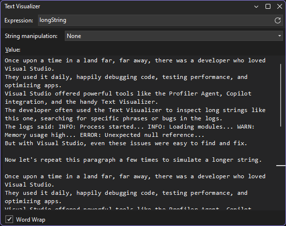
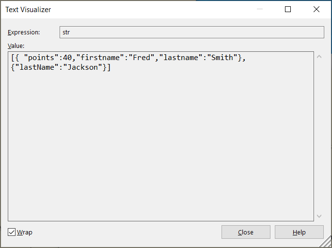
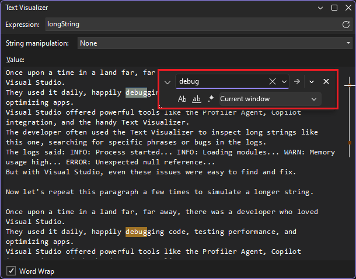
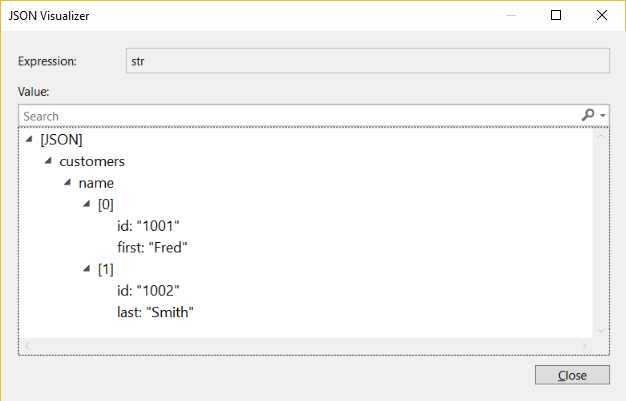
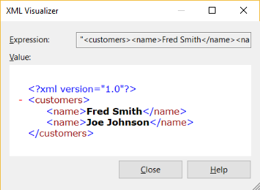
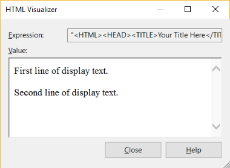

# View strings in a string visualizer in Visual Studio

While you are debugging in Visual Studio, you can view strings with the built-in string visualizer. The string visualizer shows strings that are too long for a data tip or debugger window. It can also help you identify malformed strings.

The built-in string visualizers include plain text, XML, HTML, and JSON options. You can also open built-in tabular visualizers for several .NET types, such as [DataSet and IEnumerable](../debugger/view-data-in-tabular-visualizer.md)) objects, from the **Autos** or other debugger windows.

> [!NOTE]
> If you need to inspect XAML or WPF UI elements in a visualizer, see or [Inspect XAML properties while debugging](../xaml-tools/inspect-xaml-properties-while-debugging.md) or [How to use the WPF tree visualizer](../debugger/how-to-use-the-wpf-tree-visualizer.md).

## Open a string visualizer

To open the string visualizer, you must be paused during debugging. Hover over a variable that has a Text, XML, HTML, or JSON string value, and select the magnifying glass icon .

::: moniker range=">= vs-2022"

::: moniker-end
::: moniker range="vs-2019"

::: moniker-end

In the string visualizer window, the **Expression** field shows the variable or expression you're hovering over, and the **Value** field shows the string value.

A blank **Value** means that the chosen visualizer can't recognize the string. For example, the **XML Visualizer** shows a blank **Value** for a text string with no XML tags, or a JSON string.

## View Text  visualizer 

The text visualizer shows textual data more conveniently. You can also use **Text Visualizer** to view strings that the chosen visualizer can't recognize.
In addition, **Text Visualizer** provides tooling and string manipulation options and allows you to decode the following text with ease.

- Base64 Encode
- Base64 Decode
- URL Encode
- URL Decode
- JWT Decode

Select the **String manipulation** dropdown list and choose the desired option to decode your data.

::: moniker range=">=visualstudio"

::: moniker-end
::: moniker range="<= vs-2022"

::: moniker-end

::: moniker range=">=visualstudio"
To search for a sub-string in the text visualizer, press **Ctrl + F** to open the search box. Your search terms are highlighted throughout the string, making it easier to see important text, errors, or patterns.

If you need to read content behind the search box, hold down **Ctrl** and the search box becomes transparent.
::: moniker-end

### View JSON string data

A well-formed JSON string appears similar to the following illustration in the JSON visualizer. Malformed JSON may display an error icon (or blank if unrecognized). To identify the JSON error, copy and paste the string into a JSON linting tool such as [JSLint](https://www.jslint.com/).

### View XML string data

A well-formed XML string appears similar to the following illustration in the XML visualizer. Malformed XML may display without the XML tags, or blank if unrecognized.

### View HTML string data

A well-formed HTML string appears as if rendered in a browser, as shown in the following illustration. Malformed HTML may display as plain text.

## Related content

- [Create custom visualizers (C#, Visual Basic)](../debugger/create-custom-visualizers-of-data.md)