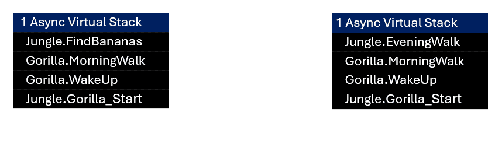
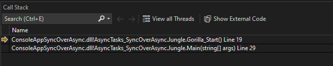
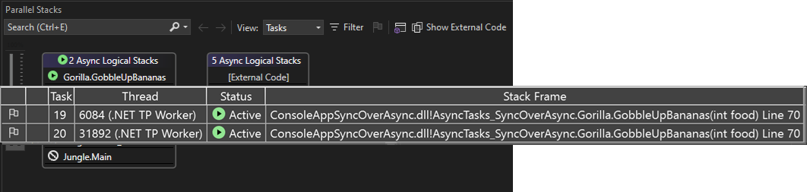
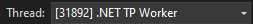
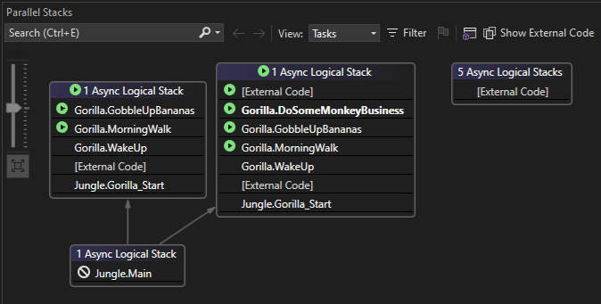
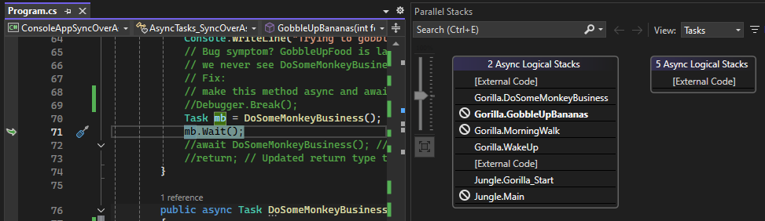
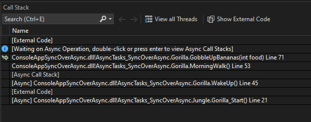
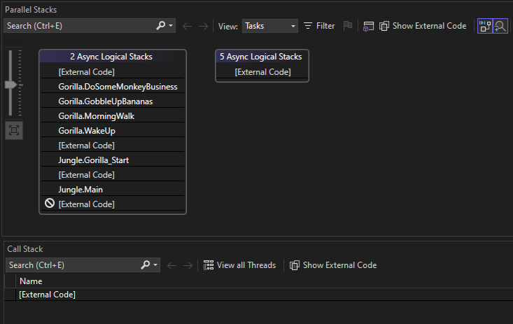

# Debug an async application

This tutorial shows how to use the Tasks view of **Parallel Stacks** window to debug a C# async application. This window helps you understand and verify the run-time behavior of code that uses the async/await pattern, also called the [Task-based asynchronous pattern (TAP)](/dotnet/standard/asynchronous-programming-patterns/task-based-asynchronous-pattern-tap).

For apps using the [Task Parallel Library (TPL)](/dotnet/standard/parallel-programming/task-parallel-library-tpl) but not the async/await pattern, or for C++ apps using the [Concurrency Runtime](/cpp/parallel/concrt/concurrency-runtime), use the **Threads** view in the **Parallel Stacks** window for debugging. For more information, see [Debug a deadlock](../debugger/how-to-use-the-threads-window.md) and [View threads and tasks in the Parallel Stacks window](../debugger/using-the-parallel-stacks-window.md).

The Tasks view helps you to:

- View call stack visualizations for apps that use the async/await pattern. In these scenarios, the Tasks view provides a more complete picture of your app state.

- Identify async code that is scheduled to run but isn't yet running. For example, an HTTP request that has not returned any data is more likely to show up in the Tasks view instead of the Threads view, which helps you to isolate the problem.

- Help identify issues such as the sync-over-async pattern along with hints related to potential issues such as blocked or waiting tasks. The [sync-over-async code pattern](https://devblogs.microsoft.com/pfxteam/should-i-expose-synchronous-wrappers-for-asynchronous-methods/) refers to code that is calling asynchronous methods in a synchronous fashion, which is known to block threads and is the most common cause of thread pool starvation.

## Async call stacks

The Tasks view in Parallel Stacks provides a visualization for async call stacks, so you can see what's happening (or supposed to happen) in your application.

Here are a few important points to remember when interpreting data in the Tasks view.

- Async call stacks are logical or virtual call stacks, not physical call stacks representing the stack. When working with async code (for example, using the `await` keyword), the debugger provides a view of the "async call stacks", or "virtual call stacks". Async call stacks are different from thread-based call stacks, or "physical stacks", because async call stacks aren't necessarily running currently on any physical thread. Instead, the async call stacks are continuations or "promises" of code that will run in the future, asynchronously. The call stacks are created using [continuations](/dotnet/standard/parallel-programming/chaining-tasks-by-using-continuation-tasks).

- Async code that is scheduled but not currently running doesn't appear on the physical call stack, but should appear on the async call stack in the Tasks view. If you're blocking threads using methods such as `.Wait` or `.Result`, you may see the code in the physical call stack instead.

- Async virtual call stacks aren't always intuitive, due to branching that results from the use of method calls such as `.WaitAny` or `.WaitAll`.

- The **Call Stack** window may be useful in combination with the Tasks view, since it shows the physical call stack for the current executing thread.

- Identical sections of the virtual call stack are grouped together to simplify the visualization for complex apps.

  The following conceptual animation shows how grouping is applied to virtual call stacks. Only identical segments of a virtual call stack are grouped. Hover over a grouped call stack to idenitfy the threads that are running the tasks.

  

## C# sample

The sample code in this walkthrough is for an application that simulates a day in the life of a gorilla. The purpose of the exercise is to understand how to use the Tasks view of the Parallel Stacks window to debug an async application.

The sample includes an example of using the sync-over-async antipattern, which can result in thread pool starvation.

To make the call stack intuitive, the sample app performs the following sequential steps:

1. Creates an object representing a gorilla.
1. Gorilla wakes up.
1. Gorilla goes on a morning walk.
1. Gorilla finds bananas in the jungle.
1. Gorilla eats.
1. Gorilla engages in monkey business.

## Create the sample project

1. Open Visual Studio and create a new project.

   If the start window isn't open, choose **File** > **Start Window**.

   On the start window, choose **New project**.

   On the **Create a new project** window, enter or type *console* in the search box. Next, choose **C#** from the Language list, and then choose **Windows** from the Platform list.

   After you apply the language and platform filters, choose the **Console App** for .NET, and then choose **Next**.

   > [!NOTE]
   > If you don't see the correct template, go to **Tools** > **Get Tools and Features...**, which opens the Visual Studio Installer. Choose the **.NET desktop development** workload, then choose **Modify**.

   In the **Configure your new project** window, type a name or use the default name in the **Project name** box. Then, choose **Next**.

   For .NET, choose either the recommended target framework or .NET 8, and then choose **Create**.

   A new console project appears. After the project has been created, a source file appears.

1. Open the *.cs* code file in the project. Delete its contents to create an empty code file.

1. Paste the following code for your chosen language into the empty code file.

   ```csharp
   using System.Diagnostics;

   namespace AsyncTasks_SyncOverAsync
   {
        class Jungle
        {
            public static async Task<int> FindBananas()
            {
                await Task.Delay(1000);
                Console.WriteLine("Got bananas.");
                return 0;
            }
    
            static async Task Gorilla_Start()
            {
                Debugger.Break();
                Gorilla koko = new Gorilla();
                int result = await Task.Run(koko.WakeUp);
            }
    
            static async Task Main(string[] args)
            {
                List<Task> tasks = new List<Task>();
                for (int i = 0; i < 2; i++)
                {
                    Task task = Gorilla_Start();
                    tasks.Add(task);
    
                }
                await Task.WhenAll(tasks);
    
            }
        }
    
        class Gorilla
        {
    
            public async Task<int> WakeUp()
            {
                int myResult = await MorningWalk();
    
                return myResult;
            }
    
            public async Task<int> MorningWalk()
            {
                int myResult = await Jungle.FindBananas();
                GobbleUpBananas(myResult);
    
                return myResult;
            }
    
            /// <summary>
            /// Calls a .Wait.
            /// </summary>
            public void GobbleUpBananas(int food)
            {
                Console.WriteLine("Trying to gobble up food synchronously...");
    
                Task mb = DoSomeMonkeyBusiness();
                mb.Wait();
    
            }
    
            public async Task DoSomeMonkeyBusiness()
            {
                Debugger.Break();
                while (!System.Diagnostics.Debugger.IsAttached)
                {
                    Thread.Sleep(100);
                }
    
                await Task.Delay(30000);
                Console.WriteLine("Monkey business done");
            }
        }
   }
   ```
   

   After you update the code file, save your changes and build the solution.

1. On the **File** menu, select **Save All**.

1. On the **Build** menu, select **Build Solution**.

## Use the Tasks View of the Parallel Stacks window

1. On the **Debug** menu, select **Start Debugging** (or **F5**) and wait for the first `Debugger.Break()` to be hit.

1. Press **F5** once, and the debugger pauses again on the same `Debugger.Break()` line.

   This pauses in the second call to `Gorilla_Start`, which occurs within a second async task.

1. Select **Debug > Windows > Parallel Stacks** to open the Parallel Stacks window, and then select **Tasks** from the **View** dropdown in the window.

   

   Notice the labels for the async call stacks describe **2 Async Logical Stacks**. When you last pressed **F5**, you started another task. For simplification in complex apps, identical async call stacks are grouped together into a single visual representation. This provides more complete information, especially in scenarios with many tasks.

   In contrast to the Tasks view, the **Call Stack** window shows the call stack for the current thread only, not for multiple tasks. It is often helpful to view both of them together for a more complete picture of the app state.

   

   > [!TIP]
   > The Call Stack window can show you information such as a deadlock, using the description `Async cycle`.

   During debugging, you can toggle whether external code is displayed. To toggle the feature, right-click the **Name** table header of the **Call Stack** window, and then select or clear **Show External Code**. If you show external code, you can still use this walkthrough, but your results might differ from the illustrations.

1. Press **F5** again, and the debugger pauses in the `DoSomeMonkeyBusiness` method.

   

   This view shows a more complete async call stack after more async methods were added to the internal continuation chain, which occurs when using `await` and similar methods. `DoSomeMonkeyBusiness` may or may not be present at the top of the async call stack because it is an async method but has not yet been added to the continuation chain. We will explore why this is the case in the steps that follow.

   This view also shows the blocked icon for `Jungle.Main` . This is informative, but does not usually indicate a problem. A blocked task is one that is blocked because it's waiting on another task to finish, an event to be signaled, or a lock to be released.

1. Hover over the `GobbleUpBananas` method to get information about the two threads that are running the tasks.

   

   The current thread also appears in the **Thread** list in the Debug toolbar.

   

   You can use the **Thread** list to switch the debugger context to a different thread.

1. Press **F5** again and the debugger pauses in the `DoSomeMonkeyBusiness` method for the second task.

    

   Depending on the timing of task execution, at this point you see either separate or grouped async call stacks.
   
   In the preceding illustration, the async call stacks for the two tasks are separate because they aren't identical.

1. Press **F5** again, and you will see a long delay occur and the Tasks view doesn't show any async call stack information.

   The delay is caused by a long-running task. For purposes of this example, it simulates a long-running task such as a web request, which may result in a case of thread pool starvation. Nothing appears in the Tasks view because even though tasks may be blocked you aren't currently paused in the debugger.

   > [!TIP]
   > The **Break All** button is a good way to get call stack information if a deadlock occurs or all tasks and threads are currently blocked.

1. At the top of the IDE in the Debug toolbar, select the **Break All** button (pause icon), **Ctrl + Alt + Break**.

    
 
   Near the top of the async call stack in the Tasks view, you see that `GobbleUpBananas` is blocked. In fact, two tasks are blocked at the same point. A blocked task isn't necessarily unexpected and does not necessarily mean there's a problem. However, the observed delay in execution indicates a problem, and the call stack information here shows the location of the problem.
  
   In the left side of preceding screenshot, the curled green arrow indicates the current debugger context. The two tasks are blocked on `mb.Wait()` in the `GobbleUpBananas` method.

   The Call Stack window also shows that the current thread is blocked.

    

   The call to `Wait()` blocks the threads within the synchronous call to `GobbleUpBananas`. This is an example of the sync-over-async antipattern, and if this occurred on a UI thread or under large processing workloads it would typically be addressed with a code fix using `await`. For more information, see [Debug thread pool starvation](/dotnet/core/diagnostics/debug-threadpool-starvation). To use profiling tools to debug thread pool starvation, see [Case study: Isolate a performance issue](../profiling/isolate-performance-issue.md).

   Also of interest, `DoSomeMonkeyBusiness` does not appear on the call stack. It is currently scheduled, not running, so it only appears in the async call stack in the Tasks view.

   > [!TIP]
   > The debugger breaks into code on a per-thread basis. For example, this means that if you press **F5** to continue execution, and the app hits the next breakpoint, it may break into code on a different thread. If you need to manage this for debugging purposes, you can add additional breakpoints, add conditional breakpoints, or use **Break All**. For more information about this behavior, see [Follow a single thread with conditional breakpoints](../debugger/get-started-debugging-multithreaded-apps.md#bkmk_follow_a_thread).

## Fix the sample code

1. Replace the `GobbleUpBananas` method with the following code.

   ```csharp
    public async Task GobbleUpBananas(int food) // Previously returned void.
    {
        Console.WriteLine("Trying to gobble up food...");
 
        //Task mb = DoSomeMonkeyBusiness();
        //mb.Wait();
        await DoSomeMonkeyBusiness();
    }
   ```

1. In the `MorningWalk` method, call GobbleUpBananas using `await`.

   ```csharp
   await GobbleUpBananas(myResult);
   ```

1. Select the **Restart** button (**Ctrl + Shift + F5**), and then press F5 several times until the app appears to "hang".

1. Press **Break All**.

   This time, `GobbleUpBananas` runs asynchronously. When you break, you see the async call stack.

    

   The Call Stack window is empty except for the `ExternalCode` entry. 

   The code editor doesn't show us anything, except it provides a message indicating that all threads are executing external code.

   However, the Tasks view does provide useful information. `DoSomeMonkeyBusiness` is at the top of the async call stack, as expected. This correctly tells us where the long-running method is located. This is helpful to isolate async/await issues when the physical call stack in the Call Stack window isn't providing enough details.

## Summary

This walkthrough demonstrated the **Parallel Stacks** debugger window. Use this window on apps that use the async/await pattern.

## Related content

- [Debug a deadlock](../debugger/how-to-use-the-threads-window.md)
- [First look at the debugger](../debugger/debugger-feature-tour.md)
- [Parallel Programming](/dotnet/standard/parallel-programming/index)
- [Concurrency Runtime](/cpp/parallel/concrt/concurrency-runtime)
- [Using the Parallel Stacks Window](../debugger/using-the-parallel-stacks-window.md)
- [Using the Tasks Window](../debugger/using-the-tasks-window.md)
