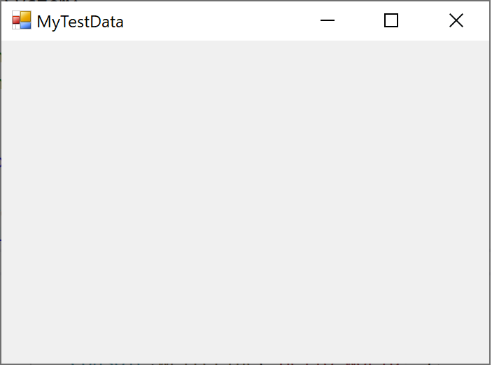

# Walkthrough: Writing a Visualizer in C\#

> [!IMPORTANT]
> Starting with Visual Studio 2022 version 17.9, visualizers can now be written in .NET 6.0+ that run out-of-process using the new VisualStudio.Extensibility model. For extensions created using the new model, see the documentation at [Create Visual Studio debugger visualizers](../extensibility/visualstudio.extensibility/debugger-visualizer/debugger-visualizers.md) instead. If you need to support older versions of Visual Studio or want to ship your custom visualizers as part of a library DLL, then use the information in this article, which applies only to the older model of extension development (VSSDK).

This walkthrough shows how to write a simple visualizer by using C#. The visualizer you create in this walkthrough displays the contents of a string using a Windows Form. This simple string visualizer isn't especially useful in itself, but it shows the basic steps that you must follow to create more useful visualizers for other data types.

> [!NOTE]
> The dialog boxes and menu commands you see might differ from those described in Help, depending on your active settings or edition. To change your settings, go to the **Tools** menu and choose **Import and Export Settings**. For more information, see [Reset settings](../ide/personalizing-the-visual-studio-ide.md#reset-all-settings).

Visualizer code must be placed in a DLL file that the debugger reads. Therefore, the first step is to create a Class Library project for the DLL.

## Create a visualizer manually

Complete the following tasks to create a visualizer.

### Create a class library project

1. To create a new class library project, select **File** > **New** > **Project**.

1. In the language drop-down, select **C#**.

1. In the search box, enter **class library**. Select **Class Library (.NET Framework)** and then select **Next**.

1. In the dialog box, enter the name `MyFirstVisualizer`, and then select **Create**.

For the visualizer project, make sure you select a .NET Framework class library and not .NET. Although the visualizer needs to be .NET Framework, the calling app can be .NET.

After you create the class library, you must add a reference to the `Microsoft.VisualStudio.DebuggerVisualizers.DLL` file so you can use the classes defined there. Before you add the reference, you must rename some classes to use meaningful names.

### Rename Class1.cs and add Microsoft.VisualStudio.DebuggerVisualizers

1. In **Solution Explorer**, right-click Class1.cs and select **Rename** on the context menu.

1. Change the name from Class1.cs to something meaningful, such as DebuggerSide.cs.

   > [!NOTE]
   > Visual Studio automatically changes the class declaration in DebuggerSide.cs to match the new file name. If you see a prompt to complete the action, select **Yes**.

1. In **Solution Explorer**, right-click **References** and choose **Add Reference** on the shortcut menu.

1. In the **Add Reference** dialog box, on the **Browse** tab, select **Browse** and find the Microsoft.VisualStudio.DebuggerVisualizers.DLL.

   You can find the DLL in *\<Visual Studio Install Directory>\Common7\IDE\PublicAssemblies* subdirectory of Visual Studio's installation directory.

1. Select **OK**.

1. In DebuggerSide.cs, add the following to the `using` directives:

   ```csharp
   using Microsoft.VisualStudio.DebuggerVisualizers;
   ```

Now you're ready to create the debugger-side code. This code runs within the debugger to display the information that you want to visualize. First, you have to change the declaration of the `DebuggerSide` object to configure inheritance from the base class `DialogDebuggerVisualizer`.

### Inherit from DialogDebuggerVisualizer

1. In DebuggerSide.cs, go to the following line of code:

   ```csharp
   public class DebuggerSide
   ```

1. Change the code to:

   ```csharp
   public class DebuggerSide : DialogDebuggerVisualizer
   ```

1. Add an empty constructor so that you can pass to the base class' constructor the serialization policy that will be used to communicate between the visualizer components.

   ```csharp
   public DebuggerSide() : base(FormatterPolicy.NewtonsoftJson) // or FormatterPolicy.Json
   {
   }
   ```

   > [!NOTE]
   > Due to the security issues described in [Special debugger side considerations for .NET 5.0+](./create-custom-visualizers-of-data.md#special-debugger-side-considerations-for-net-50), starting with Visual Studio 2022 version 17.11, visualizers won't be able to specify the `Legacy` formatter policy.

1. `DialogDebuggerVisualizer` has one abstract method (`Show`) that you must override.

#### Override the DialogDebuggerVisualizer.Show method

In `public class DebuggerSide`, add the following **method:**

```csharp
protected override void Show(IDialogVisualizerService windowService, IVisualizerObjectProvider objectProvider)
{
}
```

The `Show` method contains the code that actually creates the visualizer dialog box or other user interface and displays the information that has been passed to the visualizer from the debugger. You must add the code that creates the dialog box and displays the information. In this walkthrough, you use a Windows Forms message box. First, you must add a reference and `using` directive for System.Windows.Forms.

### Add System.Windows.Forms

1. In **Solution Explorer**, right-click **References** and choose **Add Reference** on the shortcut menu.

1. In the **Add Reference** dialog box, on the **Browse** tab, select **Browse**, and find the System.Windows.Forms.DLL.

   You can find the DLL in *C:\Windows\Microsoft.NET\Framework\v4.0.30319*.

1. Select **OK**.

1. In DebuggerSide.cs, add the following to the `using` directives:

   ```csharp
   using System.Windows.Forms;
   ```

Now, you add some code to create and show the user interface for your visualizer. Because this sample is your first visualizer, you can keep the user interface simple and use a Message Box.

### Show the Visualizer Output in a dialog box

1. In the `Show` method, add the following line of code:

   ```csharp
   MessageBox.Show(objectProvider.GetObject().ToString());
   ```

   This example code doesn't include error handling. You should include error handling in a real visualizer or any other type of application.

1. On the **Build** menu, choose **Build MyFirstVisualizer**. The project should build successfully. Correct any build errors before continuing.

The debugger side code is now complete. There's one more step, however; the attribute that tells the debuggee side which collection of classes comprises the visualizer.

### Add the type to visualize for the debuggee-side code

In the debugger-side code, you specify the type to visualize (the object source) for the debuggee using the <xref:System.Diagnostics.DebuggerVisualizerAttribute> attribute. The `Target` property sets the type to visualize.

1. Add the following attribute code to DebuggerSide.cs, after the `using` directives but before `namespace MyFirstVisualizer`:

   ```csharp
   [assembly:System.Diagnostics.DebuggerVisualizer(
   typeof(MyFirstVisualizer.DebuggerSide),
   typeof(VisualizerObjectSource),
   Target = typeof(System.String),
   Description = "My First Visualizer")]
   ```

1. On the **Build** menu, choose **Build MyFirstVisualizer**. The project should build successfully. Correct any build errors before continuing.

   At this point, your first visualizer is finished. If you have followed the steps correctly, you can build the visualizer and install it into Visual Studio. Before you install a visualizer into Visual Studio, however, you should test it to make sure that it runs correctly. You now create a test harness to run the visualizer without installing it into Visual Studio.

### Add a Test Method to show the visualizer

1. Add the following method to class `public DebuggerSide`:

   ```csharp
   public static void TestShowVisualizer(object objectToVisualize)
   {
      VisualizerDevelopmentHost visualizerHost = new VisualizerDevelopmentHost(objectToVisualize, typeof(DebuggerSide));
      visualizerHost.ShowVisualizer();
   }
   ```

1. On the **Build** menu, choose **Build MyFirstVisualizer**. The project should build successfully. Correct any build errors before continuing.

   Next, you must create an executable project to call your visualizer DLL. For simplicity, use a Console Application project.

### Add a console application project to the solution

1. In Solution Explorer, right-click the solution, choose **Add**, and then select **New Project**.

1. Choose **File** > **New** > **Project**. In the language drop-down, choose **C#**. In the search box, type **console app**, and then choose either **Console App (.NET Framework)** or **Console Application** for .NET. Select **Next**. In the dialog box that appears, type the name `MyTestConsole`, and then select **Create**.

> [!NOTE]
> If you want to easily test the visualizer using a test harness, create a .NET Framework console app. You can create a .NET console app instead, but the test harness described later is not yet supported for .NET, so you will need to install the visualizer to test it. For a .NET console app, first create the console app here, add the required DLL and project references, and then follow steps described in [Add a debuggee-side data object](#add-a-debuggee-side-data-object). For ASP.NET Core scenarios, see [Special debugger side considerations for .NET 5.0+](../debugger/create-custom-visualizers-of-data.md#special-debugger-side-considerations-for-net-50).

Now, you must add the necessary references so MyTestConsole can call MyFirstVisualizer.

### Add necessary references to MyTestConsole

1. In **Solution Explorer**, right-click **MyTestConsole** and choose **Add Reference** on the shortcut menu.

1. In the **Add Reference** dialog box, open the **Browse** tab and select Microsoft.VisualStudio.DebuggerVisualizers.DLL.

1. Select **OK**.

1. Right-click **MyTestConsole** and choose **Add Reference** again.

1. In the **Add Reference** dialog box, open the **Projects** tab and select MyFirstVisualizer.

1. Select **OK**.

Now, you add the code to finish the test harness.

### Add code to MyTestConsole

1. In **Solution Explorer**, right-click Program.cs and choose **Rename** on the shortcut menu.

1. Edit the name from Program.cs to something more meaningful, such as TestConsole.cs.

   > [!NOTE]
   > Visual Studio automatically changes the class declaration in TestConsole.cs to match the new file name.

1. In TestConsole.cs, add the following code to the `using` directives:

   ```csharp
   using MyFirstVisualizer;
   ```

1. In method `Main`, add the following code:

   ```csharp
   String myString = "Hello, World";
   DebuggerSide.TestShowVisualizer(myString);
   ```

Now, you're ready to test your first visualizer.

### Test the visualizer

1. In **Solution Explorer**, right-click **MyTestConsole** and choose **Set as Startup Project** on the shortcut menu.

1. On the **Debug** menu, choose **Start**.

   The console application starts and the Visualizer appears and displays the string, "Hello, World."

Congratulations. You have built and tested your first visualizer!

If you want to use your visualizer in Visual Studio rather than just calling it from the test harness, you have to install it. For more information, see [How to: Install a Visualizer](../debugger/how-to-install-a-visualizer.md).

## Add a debuggee-side data object

In this section, you switch from the `System.String` data object to a custom data object.  

1. In Solution Explorer, right-click the solution, choose **Add**, and then select **New Project**. In the language drop-down, choose **C#**. In the search box, type **class library**, and then choose either **Class Library (.NET Framework)** or **Class Library** for .NET Standard.

   >[!NOTE]
   >If you are using a .NET Framework test console app, make sure you create a .NET Framework class library project.

1. Select **Next**. In the dialog box that appears, type the name `MyDataObject`, and then select **Create**.

1. (.NET Standard class library only) In Solution Explorer, right-click the project and choose **Edit Project File**. Change the `<TargetFramework>` value to `netstandard2.0`.

   ```xml
   <TargetFramework>netstandard2.0</TargetFramework>
   ```

1. Inside the `MyDataObject` namespace, replace the default code with the following code.

   ```csharp
   [Serializable] 
   public class CustomDataObject
   {
      public CustomDataObject()
      {
         this.MyData = "MyTestData";
      }
      public string MyData { get; set; }
   }
   ```

   For a read-only visualizer, such as in this example, it isn't necessary to implement methods of [VisualizerObjectSource](/dotnet/api/microsoft.visualstudio.debuggervisualizers.visualizerobjectsource).

   Next, update the MyFirstVisualizer project to use the new data object.

1. In Solution Explorer under the MyFirstVisualizer project, right-click the **References** node and choose **Add Reference**.

1. Under **Projects**, select the **MyDataObject** project.

1. In the attribute code of DebuggerSide.cs, update the Target value, changing `System.String` to `MyDataObject.CustomDataObject`.

   ```csharp
   Target = typeof(MyDataObject.CustomDataObject),
   ```

1. In the MyFirstVisualizer project, replace the code for the `Show` method with the following code.

   ```csharp
   var data = objectProvider.GetObject() as MyDataObject.CustomDataObject;

   // You can replace displayForm with your own custom Form or Control.  
   Form displayForm = new Form();
   displayForm.Text = data.MyData;
   windowService.ShowDialog(displayForm);
   ```

   The preceding code uses a property of the data object to show in the Form's title.

   Next, update the console app to use the custom data object.

1. In Solution Explorer under the MyTestConsole project, right-click the **References** or **Dependencies** node, and add a project reference to `MyDataObject`.

1. In Program.cs, replace the code in the `Main` method with the following code.

   ```csharp
   // String myString = "Hello, World";
   CustomDataObject customDataObject = new CustomDataObject();

   DebuggerSide.TestShowVisualizer(customDataObject);
   ```

1. (.NET console app) Enclose the call to `TestShowVisualizer` in a try-catch statement, since the test harness is unsupported.

   ```csharp
   try
   {
         DebuggerSide.TestShowVisualizer(customDataObject);
   }
   catch (Exception) {
   }
   ```

   The console app needs a runtime reference to the visualizer. You can maintain the reference by keeping the preceding code instead of commenting it out.

1. For a .NET Framework console app, you can run the test harness (press **F5**), or you can follow instructions in [How to: Install a Visualizer](../debugger/how-to-install-a-visualizer.md).

   If you run the app using the test harness, the app shows the Windows Form.

1. For a .NET console app, copy the `MyFirstVisualizer.dll` and the `MyDataObject.dll` to the folders described in [How to: Install a Visualizer](../debugger/how-to-install-a-visualizer.md).

1. After installing the visualizer, set a breakpoint, run the console app, and hover over `customDataObject`. If everything is set up correctly, you should see the magnifying glass icon .

   :::image type="content" source="../debugger/media/vs-2019/visualizer-csharp-data-object.png" alt-text="Visualizer magnifying glass icon.":::

   When you choose **MyFirstVisualizer** from the magnifying glass, you see the Form with the data object text in the title.

   

## Related content

- [Visualizer Architecture](../debugger/visualizer-architecture.md)
- [How to: Install a Visualizer](../debugger/how-to-install-a-visualizer.md)
- [Create Custom Visualizers](../debugger/create-custom-visualizers-of-data.md)
