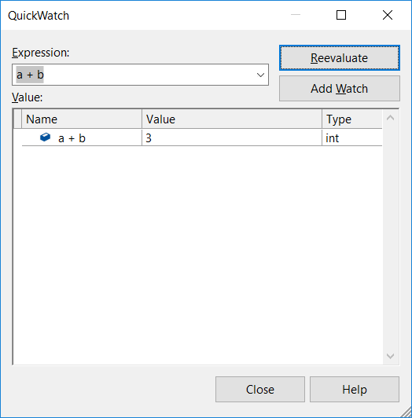

# Watch variables with Watch windows and QuickWatch in Visual Studio

While you're debugging, you can use **Watch** windows and **QuickWatch** to watch variables and expressions. The **Watch** windows can display several variables, while **QuickWatch** displays a single variable at a time.

## Observe variables with a Watch window

You can observe more than one variable in a **Watch** window. For example, to set a watch on the values of `a`, `b`, and `c` in the following code:

```C++
int main()
{
    int a, b, c;
    a = 1;
    b = 2;
    c = 0;

    for (int i = 0; i < 10; i++)
    {
        a++;
        b *= 2;
        c = a + b;
    }

    return 0;
}

```

1. Set a breakpoint on the `c = a + b;` line by selecting **Debug** > **Toggle Breakpoint** or pressing **F9**.
   
1. Select **Start Debugging** or press **F5**. Execution pauses at the breakpoint.
   
1. Open a **Watch** window by selecting **Debug** > **Windows** > **Watch** > **Watch 1**, or pressing **Ctrl**+**Alt**+**W** > **1**.
   
1. In the **Watch** window, select an empty row, and type variable `a`. Do the same for variables `b` and `c`.
   
   
   
1. Continue debugging by selecting **Debug** > **Step Into** or pressing **F11** as needed to advance. The variable values should change as you iterate through the `for` loop.
   
>[!NOTE]
>If you're programming in native code, you may sometimes need to qualify the context of a variable name or an expression that has a variable name. The context is the function, source file, and module where a variable is located. If you have to qualify the context, use the context operator syntax. For more information, see [Context operator (C++)](../debugger/context-operator-cpp.md).

## Observe expressions with the Watch window

You can observe more than one variable in a **Watch** window. For example, to set a watch on the values of `a`, `b`, and `c` in the following code:

You can observe any valid expression recognized by the debugger in a **Watch** window.

For example, for the code in the preceding section, you can get the average of the three values by using this expression:


The rules for evaluating expressions in the **Watch** window are generally the same as the rules for evaluating expressions in your code language. If an expression has a syntax error, expect the same compiler error as in the code editor. For example:


### <a name="bkmk_refreshWatch"></a> Refresh watch values

A refresh icon (circular arrow) might appear in the **Watch** window when an expression is evaluated. The refresh icon shows an error or a value that is out of date. You can usually refresh the value by selecting the icon, but you may not want to, depending on why the value wasn't evaluated.

For example, clear the **Tools** > **Options** > **Debugging** > **General** > **Enable property evaluation and other implicit function calls** option. Then set a watch on the `Count` property of the list in the following code:

```csharp
static void Main(string[] args)
{
    List<string> list = new List<string>();
    list.Add("hello");
    list.Add("goodbye");
}

```

In the **Watch** window, you should see something like the following image:


Hover over the refresh icon for a tooltip about why the expression wasn't evaluated, such as:

- An error occurred as the expression was being evaluated. For example, a timeout might have occurred, or a variable might have been out of scope.

- The expression has a function call, which could trigger a side effect in the app. See [Side effects and expressions](#bkmk_sideEffects).

- Automatic evaluation of properties and implicit function calls is disabled in **Tools** > **Options** > **Debugging** > **General** > **Enable property evaluation and other implicit function calls**. 

To refresh the value, select the refresh icon or press the spacebar. The debugger tries to reevaluate the expression. 

If the refresh icon appeared because automatic evaluation of properties and other implicit function calls was turned off, enable it by selecting **Tools** > **Options** > **Debugging** > **General** > **Enable property evaluation and other implicit function calls**. 

>[!NOTE]
>A circle with two wavy lines icon may appear. This icon means the debugger doesn't evaluate the expression because of a potential cross-thread dependency. Evaluating the code requires other threads in your app to run temporarily, but when you are in break mode, all threads in your app are usually stopped. Allowing other threads to run temporarily can have unexpected effects on the state of your app and cause the debugger to ignore events such as breakpoints and exceptions thrown on those threads.

### <a name="bkmk_sideEffects"></a> Expression side effects 

Evaluating some expressions can change the value of a variable or otherwise affect the state of your app. For example, evaluating the following expression changes the value of `var1`:

```csharp
var1 = var2
```

This is a [side effect](https://en.wikipedia.org/wiki/Side_effect_\(computer_science\)). Side effects can make debugging more difficult by changing the way your app operates.

An expression with side effects is evaluated only once, when you first enter it. Further evaluations are disabled. You can force evaluation by selecting the refresh icon that appears next to the value.

One way to avoid side effects is to turn off automatic function evaluation by clearing **Tools** > **Options** > **Debugging** > **General** > **Enable property evaluation and other implicit function calls**.

For C# only, when evaluation of properties or implicit function calls is turned off, you can force evaluation by using the **ac** format modifier. See [Format specifiers in C#](../debugger/format-specifiers-in-csharp.md).

### <a name="bkmk_objectIds"></a> Use object IDs in the Watch window (C# and Visual Basic)

Occasionally you want to observe the behavior of a specific object. For example, you might want to track an object referred to by a local variable after that variable has gone out of scope. In C# and Visual Basic, you can create object IDs for specific instances of reference types and use them in the **Watch** window and in breakpoint conditions. The object ID is generated by the common language runtime (CLR) debugging services and associated with the object.

> [!NOTE]
> Object IDs create weak references that don't prevent the object from being garbage collected. They are valid only for the current debugging session.

In the following code, one method creates a `Person` using a local variable, but you want to find out what the `Person`'s name is in a different method:

```csharp
class Person
{
    public Person(string name)
    {
        Name = name;
    }
    public string Name { get; set; }
}

public class Program
{
    static List<Person> _people = new List<Person>();
    public static void Main(string[] args)
    {
        MakePerson();
        DoSomething();
    }

    private static void MakePerson()
    {
        var p = new Person("Bob");
        _people.Add(p);
    }

    private static void DoSomething()
    {
        // more processing
         Console.WriteLine("done");
    }
}

```

You can add a reference to that `Person` object in the **Watch** window as follows:

1. Select a line in the code that occurs the object has been created.

2. Set a breakpoint (by choosing **Debug** > **Toggle Breakpoint** or pressing F9).

3. Start debugging.

4. When execution stops at the breakpoint, open the **Locals** window (by choosing **Debug** > **Windows** > **Locals**), right-click the variable, and select **Make Object ID**.

   You should see a dollar sign (**$**) plus a number in the **Locals** window, which is the object ID.

   > [!NOTE]
   > If you want to see the object's properties, such as `Person.Name`, you must enable property evaluation by choosing **Tools** > **Options** > **Debugging** > **General**, then setting **Enable property evaluation and other implicit function calls**.

5. Add the object ID to the **Watch** window by right-clicking the dollar sign and number, then choosing **Add Watch**.

6. Set a breakpoint where you want to observe the object's behavior.  In the preceding code, that would be in the `DoSomething()` method.

7. Continue debugging. When execution stops in the `DoSomething()` method, the **Watch** window displays the `Person` object.

### Use registers in the Watch window (C++ only)

You can add register names and variable names using **$\<register&nbsp;name>** or **@\<register&nbsp;name>** while debugging native code. For more information, see [Pseudovariables](../debugger/pseudovariables.md).

## Dynamic View and the Watch window

Some scripting languages (for example, JavaScript or Python) use dynamic or [duck typing](https://en.wikipedia.org/wiki/Duck_typing). .NET languages (version 4.0 and later) support objects that are difficult to observe using the normal debugging windows, because they may have runtime properties and methods that can't be displayed.

The **Watch** window can display a dynamic object, which is created from a type that implements the <xref:System.Dynamic.IDynamicMetaObjectProvider> interface. This node shows the dynamic members of the dynamic object, but doesn't allow editing of the member values. To display this object, the debugger adds a **Dynamic View** child node of the object name in the **Autos** window. To open the **Autos** window, select **Debug** > **Windows** > **Autos** during debugging. 

**Dynamic View** also enhances debugging for COM objects. When the debugger gets to a COM object wrapped in **System.__ComObject**, it adds a **Dynamic View** node for the object.

To refresh **Dynamic View** values, select the refresh icon. See [Refresh watch values](#bkmk_refreshWatch) for details.

To display only the **Dynamic View** for an object, use the **dynamic** format specifier in the **Watch** window:

- C#: `ObjectName, dynamic`
- Visual Basic: `$dynamic, ObjectName`

>[!NOTE]
>- Evaluating the members of a **Dynamic View** can have [side effects](https://en.wikipedia.org/wiki/Side_effect_\(computer_science\)). 
>- For C#, the debugger doesn't automatically reevaluate the values shown in the **Dynamic View** when you step to a new line of code. 
>- For Visual Basic, expressions added through the **Dynamic View** are automatically refreshed.

**To insert a new watch variable that casts an object to a dynamic object:**
  
1. Right-click any child of a **Dynamic View**.
2. Choose **Add Watch**. Then `object.name` becomes `((dynamic) object).name`.

## Observe a single variable or expression with QuickWatch

You can use the **QuickWatch** window to observe a single variable. 

For example, to observe the `a` variable in the following code:

```csharp
static void Main(string[] args)
{
    int a, b;
    a = 1;
    b = 2;
    for (int i = 0; i < 10; i++)
    {
        a = a + b;
    }
}
```


1. Set a breakpoint on the `a = a + b;` line.

2. Start debugging. Execution stops at the breakpoint.

3. Select the variable `a`.

4. Select **Debug** > **QuickWatch** or press **Shift**+**F9**. The **QuickWatch** window appears. The `a` variable is in the **Expression** box with a **Value** of **1**.

   

   To evaluate an expression using the variable, type an expression such as `a + b` in the **Expression** box, and select **Reevaluate**.

   

   To add the variable or expression from **QuickWatch** to the **Watch** window, choose **Add Watch**.

5. **QuickWatch** is a modal dialog, so you can't continue debugging as long as it is open. Select **Close** to close the **QuickWatch** window and continue debugging. You can now observe the variable in the **Watch** window.

## See also

[Debugger windows](../debugger/debugger-windows.md)
