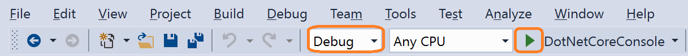
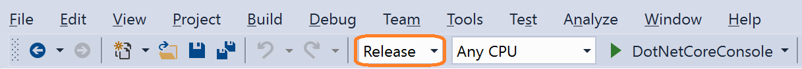

# What is debugging?

The Visual Studio debugger is a powerful tool. Before we show how to use it, we want to talk about some terms such as *debug mode*, *debugger*, and *debugging*. This way, when we talk later about finding and fixing bugs, we all mean the same thing.

## Debug mode vs. running your app

When you run your app in Visual Studio for the first time, you may start it by pressing the green arrow button  in the toolbar. By default, the **Debug** value appears in the drop-down to the left. If you are new to Visual Studio, this can leave the impression that debugging your app has something to do with running your app--which it does--but these are fundamentally two very different tasks.

If you have a project open, choose the drop-down selector where it says **Debug** and choose **Release** instead.

When you switch this setting, you change your project from a debug configuration to a release configuration. Visual Studio projects have separate release and debug configurations for your program. You build the debug version for debugging and the release version for the final release distribution. A release build is optimized for performance, but a debug build is better for debugging.

When you start the app (press the green arrow or **F5**) for a debug configuration, you start the app in *debug mode*. This enables a full set of debugging features that you can use to help find bugs in your app.

## Debugger vs. debugging

The term *debugging* is pretty general, and can mean a lot of different things. In the most literal usage of the word, it means removing bugs from your code. Now, there are a lot of ways to do this. For example, you might debug by scanning your code looking for typos, or by using a code analyzer. You might debug code by using a performance profiler. Or, you might debug by using a *debugger*.

A debugger is a very specialized developer tool. A debugger attaches to your running app and allows you to inspect your code. So, when you run a debug configuration, your app runs in debug mode, which means you are running your app with a debugger attached. In the debugging documentation for Visual Studio, this is typically what we mean when we say "debugging".

## When to use a debugger

The debugger is an essential tool to find and fix bugs in your apps. However, context is king, and it is important to leverage all the tools at your disposable to help you quickly eliminate bugs or errors. Sometimes, the right "tool" might be a better coding practice. By learning when to use the debugger vs. some other tool, you will also learn how to use the debugger more effectively. If you already know you need to learn about the debugger, see [Debugging for absolute beginners](../debugger/debugging-absolute-beginners.md). Otherwise, follow the link in the next section.

## Next steps

In this article, you've learned a few general debugging concepts. Next, you can start learning how to debug with Visual Studio and how to write code with less bugs.

> [!div class="nextstepaction"]
> [Write better code using Visual Studio](../debugger/write-better-code-using-visual-studio.md)
