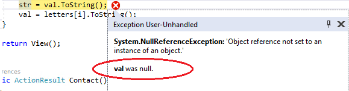
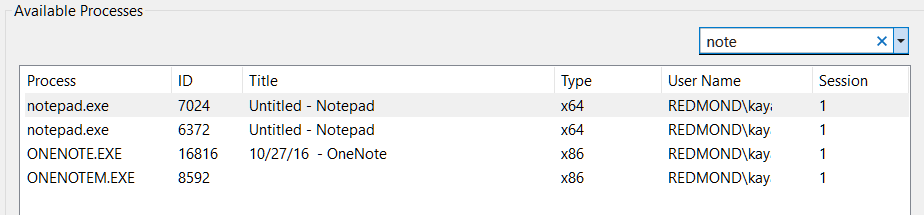

# What's New for the Debugger in Visual Studio 2017

The debugger includes these new features:

- New in version 15.5, the **Snapshot Debugger** takes a snapshot of your in-production apps when code that you are interested in executes. To instruct the debugger to take a snapshot, you set snappoints and logpoints in your code. The debugger lets you see exactly what went wrong, without impacting traffic of your production application. The Snapshot Debugger can help you dramatically reduce the time it takes to resolve issues that occur in production environments.

    Snapshot collection is available for the following web apps running in Azure App Service:

  * ASP.NET applications running on .NET Framework 4.6.1 or later.
  * ASP.NET Core applications running on .NET Core 2.0 or later on Windows.

    For more information, see [Debug live ASP.NET apps using the Snapshot Debugger](../debugger/debug-live-azure-applications.md).

- New in version 15.5 in Visual Studio Enterprise only, **IntelliTrace step-back** automatically takes a snapshot of your application at every breakpoint and debugger step event. The recorded snapshots enable you to go back to previous breakpoints or steps and view the state of the application as it was in the past. IntelliTrace step-back can save you time when you want to see the previous application state but don't want to restart debugging or recreate the desired app state.

    You can navigate and view snapshots by using the **Step Backward** and **Step Forward** buttons in the Debug toolbar. These buttons navigate the events that appear in the **Events** tab in the **Diagnostic Tools** window.

    

    For more information, see the [Inspect previous app states using IntelliTrace](view-historical-application-state.md) page.

- The **Exception Helper** replaces the Exception Assistant and appears in a non-modal dialog box where the error occurred. The **Exception Helper** provides quicker access to any inner exceptions, additional analysis by the debugger (if available), and immediate access to the **Exception Settings** for the exception. The Exception Helper can also be dragged to a floating view if it is blocking something that you need to see.

    For example, a **NullReferenceException** now shows the variable that has the null reference (extra information).

    

    For more information, see the [Using the New Exception Helper in Visual Studio](https://devblogs.microsoft.com/devops/using-the-new-exception-helper-in-visual-studio-15-preview/) blog post.

- You can now run to a line of code while paused in the debugger by selecting the **Run execution to here** green arrow icon (you see the icon while hovering over a line of code). This eliminates the need to set temporary breakpoints.

    

- You can set conditions on exceptions in the **Exception Settings** dialog box (You can do this by using the **Edit condition** icon in the Exception Settings dialog box or by using the right-click menu on the exception.) Currently supported conditions include the module name(s) to include or exclude for the exception.

    

- Attach to Process dialog box includes a new search feature that can help you more quickly identify the process that you need to attach to.

    

For more information on these new features, see the [Release Notes for [!include[vs_dev15](../misc/includes/vs_dev15_md.md)]](/visualstudio/releasenotes/vs2017-relnotes).

## See also

- [Debugging in Visual Studio](../debugger/index.yml)
- [First look at the debugger](../debugger/debugger-feature-tour.md)