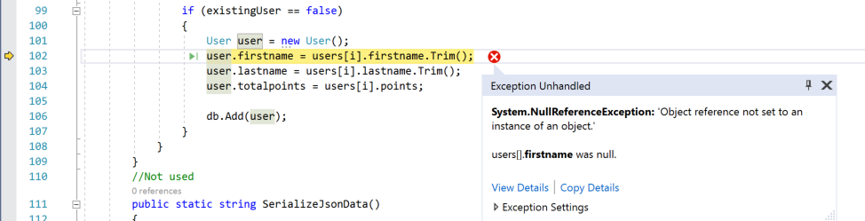

# Write better C# code using Visual Studio

Debugging code can be a time-consuming--and sometimes frustrating--task. It takes time to learn how to debug effectively. A powerful IDE like Visual Studio can make your job a lot easier. An IDE can help you debug your code more quickly, and not just that, but it can also help you write better code with less bugs. Our aim in this article is to give you a holistic view of the debugging process, so you will know when to use the code analyzer, when to use the debugger, and when to use other tools.

In this article, we talk about leveraging the IDE to make your debugging sessions more productive. We touch on several tasks, such as:

* Prepare your code for debugging by leveraging the IDE's code analyzer

* How to fix exceptions (run-time errors)

* How to minimize bugs by coding for intent

* When to use the debugger

To demonstrate these tasks, we show a few of the most common types of errors and bugs that you will encounter when trying to debug your apps.

## Follow along using the sample app

If you prefer, you can create a .NET Framework or .NET Core console app that contains the exact bugs and errors that we describe here, and you can follow along and make the fixes yourself.

To create the app, open Visual Studio and choose **File > New Project**. Under **Visual C#**, choose **Windows Desktop** or **.NET Core**, and then in the middle pane choose a **Console App**. Type a name like **Console_Parse_JSON** and click **OK**. Visual Studio creates the project. Paste the [sample code](#sample-code) into the project's *Program.cs* file.

> [!NOTE]
> If you don't see the **Console Application** project template, click the **Open Visual Studio Installer** link in the left pane of the **New Project** dialog box. The Visual Studio Installer launches. Choose the *.NET desktop development** or **.NET Core cross-platform development** workload, then choose **Modify**.

## Find the red and green squiggles!

Before you try to start your app and run the debugger, check the code in the code editor for red and green squiggles. These represent errors and warnings that are identified by the IDE's code analyzer. The red squiggles are compile-time errors, which you must fix before you can run the code. The green squiggles are warnings. Although you can run your app without fixing the warnings, they can be a source of bugs and you can often save yourself time and trouble by investigating them. These warnings and errors also show up in the **Error List** window, if you prefer a list view.

In the sample app, we see several red squiggles that we need to fix, and one green one that we will look at. Here is the first error.


To fix this error, we will look at another feature of the IDE, represented by the light bulb icon.

## Check the light bulb!

The first red squiggle represents a compile-time error. Hover over it and you see the message ```The name `Encoding` does not exist in the current context```.

Notice that this error shows a light bulb icon to the lower left. Along with the screwdriver icon, the light bulb icon represents Quick Actions that can help you fix or refactor code inline. Use the first suggested fix to resolve this by clicking **using System.Text**.


When you click this item, Visual Studio adds the `using System.Text` statement at the top of the *Program.cs* file, and the red squiggle disappears. (When you're not sure what a suggested fix will do, choose the **Preview changes** link before applying the fix.)

This is a very common error that you usually fix by adding a new `using` statement to your code. Another common, similar error to this one is ```The type or namespace `Name` cannot be found.``` This error may indicate a missing assembly reference (right-click the project, choose **Add** > **Reference**) or a missing library that you need to add using NuGet (right-click the project and choose **Manage NuGet Packages**).

## Fix the squiggles

There are a few more squiggles to look at in this code. Here, we see a common type conversion error. By reading the message shown in the IDE, we see that the code is trying to convert a string to an int, which is not supported.


Because the code analyzer can't identify your intent, there are no light bulbs to help you out this time. To fix this error, you need to know the intent of the code. Here, it's not too hard to see that `points` should be a numeric (integer) value, since you are trying to add `points` to `totalpoints`.

To fix this, change the `points` member of the `User` class from this:

```c#
[DataMember]
internal string points;
```

to this:

```c#
[DataMember]
internal int points;
```

The red squiggly lines in the code editor go away.

Next, we take a look at the green squiggly in the declaration of the `points` data member. The code analyzer tells us that the variable is never assigned a value.


Typically, this represents a problem that needs to be fixed. However, we are using the `points` variable to store data temporarily during the deserialization of the JSON data, and then adding that value to the `totalpoints` data member. In this case, we can ignore the warning.

## Fix an exception

When you have fixed all the red squiggles and fixed--or at least investigated--all the green squiggles, you are ready to start the debugger and run the app.

Press **F5** (**Debug > Start Debugging**) or the **Start Debugging** button  in the Debug Toolbar.

At this point, the sample app throws a `SerializationException` exception (a runtime error). That is, the app chokes on the data that it is trying to serialize. Because we started the app in debug mode (debugger attached), the debugger's Exception Helper takes us right to the code that threw the exception and gives us a helpful error message.


The error message instructs us that the value `4o` cannot be parsed as an integer. So, in this example, we know the data is bad: `4o` should be `40`. However, if we are not in control of the data in a real scenario (say we are getting it from a web service), what do we do about it? How do we fix this?

When you hit an exception, you need to ask--and answer--a couple of questions:

* Is this exception just a bug that you can fix? Or,

* Is this exception something that your users might encounter?

If it's the former, fix the bug. (In the sample app, that means fix the bad data.) If it's the latter, you need to handle the exception in your code using a `try/catch` block. If the user might encounter the exception, replace the following code:

```c#
users = ser.ReadObject(ms) as User[];
```

with this code:

```c#
try
{
    users = ser.ReadObject(ms) as User[];
}
catch (SerializationException)
{
    Console.WriteLine("Give user some info or instructions, if necessary");
    // Take appropriate action for your app
}
```

A `try/catch` block has some performance cost, so you will only want to use them where you really need them, that is, where they might occur in the release version of the app. In many cases, you can handle an exception appropriately and the user will never need to know about it.

Here are a couple of important tips for error handling:

* Avoid using an empty catch block, like `catch (Exception) {}`, which does not take appropriate action to expose or handle an error. An empty or ineffective catch block can hide exceptions and can make your code more difficult to debug instead of easier.

* Use the `try/catch` block around the specific function that throws the exception (`ReadObject`, in the sample app). If you use it around a larger chunk of code, you end up hiding the location of the error. For example, don't use the `try/catch` block around the call to the parent function `ReadToObject`, shown here, or you won't know where exactly the exception occurred.

    ```c#
    // Not good
    try
    {
        User[] users = ReadToObject(data);
    }
    catch (Exception)
    {
    }
    ```

* Check the documentation to see what method throws the exception and what other exceptions it might throw. This can be critical information for debugging your apps.

For the sample app, fix the `SerializationException` in the `GetJsonData` method by changing `4o` to `40`.

## Clarify your code intent by using assert

Now that you have fixed the exception, run the app again.

Click the **Restart**  button in the Debug Toolbar (**Ctrl** + **Shift** + **F5**). This restarts the app in fewer steps.

This time, the app throws another exception, a fairly common `NullReferenceException`.



**firstname**, in bold, has the `null` value that caused the error. **firstname** is just a variable referencing a property we defined in our code, not a library method that throws a particular exception, so there is no good reason to use a `try/catch` block for this common exception. Let's review other options by asking the same questions as before. (Is this a bug? Might users encounter this exception?)

If we think it might be a fixable bug, we have several options. We need to make sure the code responds correctly to the `null` value. There are several ways to do this. A useful method, often underutilized, is to use an `assert` statement. By adding the following code, we include a runtime check to make sure that `firstname` is not `null`.

```c#
// To use assert, add a using statement for System.Diagnostics at the start of the file.
Debug.Assert(users[i].firstname != null);
Debug.Assert(users[i].lastname != null);
if (existingUser == false)
{
    User user = new User();
    user.firstname = users[i].firstname.Trim();
    user.lastname = users[i].lastname.Trim();
```

By adding `assert` statements, which are frequently implemented in unit tests, you can quickly specify the intent of your code during the development process. By specifying intent, you enforce your requirements. This is a simple and handy way that you can use to surface bugs during development.

When you add the `assert` statements and re-run the code (click the **Restart**  button), the debugger pauses on the `assert` statement, as expected, because the expression evaluates to `false`. (The `assert` code is active only in a Debug build.) 


While `assert` is great for debugging, at some point you may find you need to fix the code for the release version. An option to fix this code is to get rid of the `Trim()` method call. If you don't need to call `Trim()`, your user will never see the `NullReferenceExceoption`. But, let's say you decide that you want to keep the `Trim()` method call to eliminate whitespace, and that the user might encounter the exception. In that case, you must refactor code to make sure that your app doesn't throw a fatal exception. So, to fix this code, you replace the following statement:

```c#
user.firstname = users[i].firstname.Trim();
```

with this code:

```c#
if(users[i].firstname != null)
{
    user.firstname = users[i].firstname.Trim();
}
else
{
    user.firstname = users[i].firstname;
}
```

During the debugging process, it might be best to keep the `assert` statement instead of making the fix, assuming you want to be alerted whenever `firstname` is null. That will help you debug issues more quickly.

Typically, you want to add code to clarify intent at the entry point of a function or method. We are currently looking at the `UpdateRecords` method in the sample app. In this method, you know you are in trouble if either of the method arguments is null, so check them with an `assert` statement.

```c#
public static void UpdateRecords(List<User> db, User[] users)
{
    Debug.Assert(db != null);
    Debug.Assert(users != null);
```

## Inspect your code in the debugger

OK, now that you've fixed everything that's wrong with the sample app, you can move onto bigger and better things!

We showed you the Exception Helper, but the debugger is a much more powerful tool that also lets you step through your code and inspect it's app state. These more powerful functions are useful in a couple of key scenarios:

* You want to examine your code and see what it is doing at run-time, to make sure it is behaving in the way you expect.

* You need another tool to help you find bugs that are harder to identify.

To learn how to use the debugger, see [Debugging for absolute beginners](../debugger/debugging-absolute-beginners.md)

> [!TIP]
> When writing code, start small, and start with code that works! (Good sample code is helpful here.) Sometimes, it is easier to fix a large or complicated set of code by starting with a small piece of code that demonstrates the core task you are trying to achieve. Then, you can modify or add code incrementally, testing at each point for errors.

## Fix performance issues

Bugs of another kind include inefficient code that causes your app to run slowly or to use too much memory. Generally, optimizing performance is something you do later in your app development. However, you can run into performance issues early (for example, some part of your app is running really slow), and you may need to test your app with the profiling tools early on. For more information about profiling tools such as the CPU Usage tool and the Memory Analyzer, see [First look at the profiling tools](../profiling/profiling-feature-tour.md).

## <a name="sample-code"></a> Sample code

The following code has some bugs that you can fix using the Visual Studio IDE. The app here is a simple app that simulates getting JSON data from some operation, deserializing the data to an object, and updating a simple in-memory database with the new data.

```c#
using System;
using System.Collections.Generic;
using System.Runtime.Serialization.Json;
using System.Runtime.Serialization;
using System.IO;

namespace Console_Parse_JSON_DotNetCore
{
    class Program
    {
        static void Main(string[] args)
        {
            var localDB = LoadRecords();
            string data = GetJsonData();

            User[] users = ReadToObject(data);

            UpdateRecords(localDB, users);

            for (int i = 0; i < users.Length; i++)
            {
                List<User> result = localDB.FindAll(delegate (User u) { return u.lastname == users[i].lastname; });
                foreach (var item in result)
                {
                    Console.WriteLine($"Matching Record, got name={item.firstname}, lastname={item.lastname}, age={item.totalpoints}");
                }
            }

            Console.ReadKey();
        }

        // Deserialize a JSON stream to a User object.  
        public static User[] ReadToObject(string json)
        {
            User deserializedUser = new User();
            User[] users = { };
            MemoryStream ms = new MemoryStream(Encoding.UTF8.GetBytes(json));
            DataContractJsonSerializer ser = new DataContractJsonSerializer(users.GetType());

            users = ser.ReadObject(ms) as User[];

            ms.Close();
            return users;
        }

        // Simulated operation that returns JSON data.
        public static string GetJsonData()
        {
            string str = "[{ \"points\":4o,\"firstname\":\"Fred\",\"lastname\":\"Smith\"},{\"lastName\":\"Jackson\"}]";
            return str;
        }

        public static List<User> LoadRecords()
        {
            var db = new List<User> { };
            User user1 = new User();
            user1.firstname = "Joe";
            user1.lastname = "Smith";
            user1.totalpoints = 41;

            db.Add(user1);

            User user2 = new User();
            user2.firstname = "Pete";
            user2.lastname = "Peterson";
            user2.totalpoints = 30;

            db.Add(user2);

            return db;
        }
        public static void UpdateRecords(List<User> db, User[] users)
        {
            bool existingUser = false;

            for (int i = 0; i < users.Length; i++)
            {
                foreach (var item in db)
                {
                    if (item.lastname == users[i].lastname && item.firstname == users[i].firstname)
                    {
                        existingUser = true;
                        item.totalpoints += users[i].points;

                    }
                }
                if (existingUser == false)
                {
                    User user = new User();
                    user.firstname = users[i].firstname.Trim();
                    user.lastname = users[i].lastname.Trim();
                    user.totalpoints = users[i].points;

                    db.Add(user);
                }
            }
        }
    }

    [DataContract]
    internal class User
    {
        [DataMember]
        internal string firstname;

        [DataMember]
        internal string lastname;

        [DataMember]
        // internal double points;
        internal string points;

        [DataMember]
        internal int totalpoints;
    }
}
```

## Next steps

In this article, you've learned how to avoid and fix many common bugs in your code and when to use the debugger. Next, learn more about using the Visual Studio debugger to fix bugs.

> [!div class="nextstepaction"]
> [Debugging for absolute beginners](../debugger/debugging-absolute-beginners.md)
