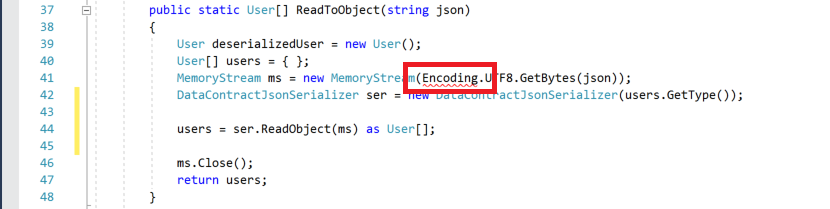
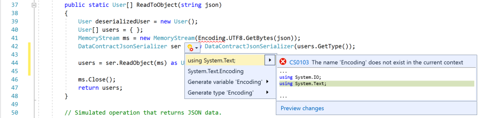
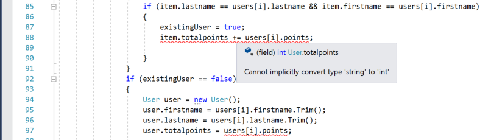
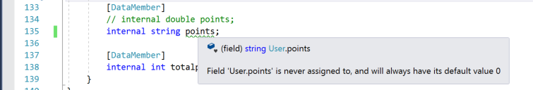
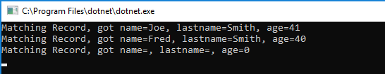
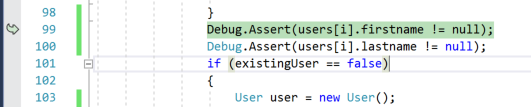

# Debugging techniques and tools to help you write better code

Fixing bugs and errors in your code can be a time-consuming and sometimes frustrating task. It takes time to learn how to debug effectively. A powerful IDE like Visual Studio can make your job a lot easier. An IDE can help you fix errors and debug your code more quickly, and help you write better code with fewer bugs. This article provides a holistic view of the "bug-fixing" process, so you can know when to use the code analyzer, when to use the debugger, how to fix exceptions, and how to code for intent. If you already know that you need to use the debugger, see [First look at the debugger](../debugger/debugger-feature-tour.md).

In this article, you learn how to work with the IDE to make your coding sessions more productive. We touch on several tasks, such as:

* Prepare your code for debugging by using the IDE's code analyzer

* How to fix exceptions (run-time errors)

* How to minimize bugs by coding for intent (using assert)

* When to use the debugger

To demonstrate these tasks, we show a few of the most common types of errors and bugs that you might encounter when trying to debug your apps. Although the sample code is C#, the conceptual information is usually applicable to C++, Visual Basic, JavaScript, and other languages supported by Visual Studio (except where noted). The screenshots are in C#.

## Create a sample app with some bugs and errors in it

The following code has some bugs that you can fix using the Visual Studio IDE. This application is a simple app that simulates getting JSON data from some operation, deserializing the data to an object, and updating a simple list with the new data.

To create the app, you must have Visual Studio installed and the **.NET desktop development** workload installed.

- If you haven't already installed Visual Studio, go to the [Visual Studio downloads](https://visualstudio.microsoft.com/downloads/?cid=learn-onpage-download-cta) page to install it for free.

- If you need to install the workload but already have Visual Studio, select **Tools** > **Get Tools and Features**. The Visual Studio Installer launches. Choose the **.NET desktop development** workload, then choose **Modify**.

Follow these steps to create the application:

1. Open Visual Studio. On the start window, select **Create a new project**.

1. In the search box, enter **console** and then one of the **Console App** options for .NET.

1. Select **Next**.

1. Enter a project name like **Console_Parse_JSON**, and then select **Next** or **Create**, as applicable.

    Choose either the recommended target framework or .NET 8, and then choose **Create**.

    If you don't see the **Console App** for .NET project template, go to **Tools** > **Get Tools and Features**, which opens the Visual Studio Installer. Choose the **.NET desktop development** workload, then choose **Modify**.

    Visual Studio creates the console project, which appears in Solution Explorer in the right pane.

When the project is ready, replace the default code in the project's *Program.cs* file with the following sample code:

```csharp
using System;
using System.Collections.Generic;
using System.Runtime.Serialization.Json;
using System.Runtime.Serialization;
using System.IO;

namespace Console_Parse_JSON
{
    class Program
    {
        static void Main(string[] args)
        {
            var localDB = LoadRecords();
            string data = GetJsonData();

            User[] users = ReadToObject(data);

            UpdateRecords(localDB, users);

            for (int i = 0; i < users.Length; i++)
            {
                List<User> result = localDB.FindAll(delegate (User u) {
                    return u.lastname == users[i].lastname;
                    });
                foreach (var item in result)
                {
                    Console.WriteLine($"Matching Record, got name={item.firstname}, lastname={item.lastname}, age={item.totalpoints}");
                }
            }

            Console.ReadKey();
        }

        // Deserialize a JSON stream to a User object.
        public static User[] ReadToObject(string json)
        {
            User deserializedUser = new User();
            User[] users = { };
            MemoryStream ms = new MemoryStream(Encoding.UTF8.GetBytes(json));
            DataContractJsonSerializer ser = new DataContractJsonSerializer(users.GetType());

            users = ser.ReadObject(ms) as User[];

            ms.Close();
            return users;
        }

        // Simulated operation that returns JSON data.
        public static string GetJsonData()
        {
            string str = "[{ \"points\":4o,\"firstname\":\"Fred\",\"lastname\":\"Smith\"},{\"lastName\":\"Jackson\"}]";
            return str;
        }

        public static List<User> LoadRecords()
        {
            var db = new List<User> { };
            User user1 = new User();
            user1.firstname = "Joe";
            user1.lastname = "Smith";
            user1.totalpoints = 41;

            db.Add(user1);

            User user2 = new User();
            user2.firstname = "Pete";
            user2.lastname = "Peterson";
            user2.totalpoints = 30;

            db.Add(user2);

            return db;
        }
        public static void UpdateRecords(List<User> db, User[] users)
        {
            bool existingUser = false;

            for (int i = 0; i < users.Length; i++)
            {
                foreach (var item in db)
                {
                    if (item.lastname == users[i].lastname && item.firstname == users[i].firstname)
                    {
                        existingUser = true;
                        item.totalpoints += users[i].points;

                    }
                }
                if (existingUser == false)
                {
                    User user = new User();
                    user.firstname = users[i].firstname;
                    user.lastname = users[i].lastname;
                    user.totalpoints = users[i].points;

                    db.Add(user);
                }
            }
        }
    }

    [DataContract]
    internal class User
    {
        [DataMember]
        internal string firstname;

        [DataMember]
        internal string lastname;

        [DataMember]
        // internal double points;
        internal string points;

        [DataMember]
        internal int totalpoints;
    }
}
```

## Find the red and green squiggles!

Before you try to start the sample app and run the debugger, check the code in the code editor for red and green squiggles. These represent errors and warnings identified by the IDE's code analyzer. The red squiggles are compile-time errors, which you must fix before you can run the code. The green squiggles are warnings. Although you can often run your app without fixing the warnings, they can be a source of bugs and you often save yourself time and trouble by investigating them. These warnings and errors also show up in the **Error List** window, if you prefer a list view.

In the sample app, you see several red squiggles that you need to fix, and a green one that you need to investigate. Here's the first error.



To fix this error, you can look at another feature of the IDE, represented by the light bulb icon.

## Check the light bulb!

The first red squiggle represents a compile-time error. Hover over it and you see the message ```The name `Encoding` does not exist in the current context```.

Notice that this error shows a light bulb icon to the lower left. Along with the screwdriver icon , the light bulb icon  represents Quick Actions that can help you fix or refactor code inline. The light bulb represents issues that you *should* fix. The screwdriver is for issues that you might choose to fix. Use the first suggested fix to resolve this error by clicking **using System.Text** on the left.



When you select this item, Visual Studio adds the `using System.Text` statement at the top of the *Program.cs* file, and the red squiggle disappears. (When you're unsure about changes applied by a suggested fix, choose the **Preview changes** link on the right before applying the fix.)

The preceding error is a common one that you usually fix by adding a new `using` statement to your code. There are several common, similar errors to this one such as `The type or namespace "Name" cannot be found.` These kinds of errors might indicate a missing assembly reference (right-click the project, choose **Add** > **Reference**), a misspelled name, or a missing library that you need to add (for C#, right-click the project and choose **Manage NuGet Packages**).

## Fix the remaining errors and warnings

There are a few more squiggles to look at in this code. Here, you see a common type conversion error. When you hover over the squiggle, you see that the code is trying to convert a string to an int, which isn't supported unless you add explicit code to make the conversion.



Because the code analyzer can't guess your intent, there are no light bulbs to help you out this time. To fix this error, you need to know the intent of the code. In this example, it's not too hard to see that `points` should be a numeric (integer) value, since you're trying to add `points` to `totalpoints`.

To fix this error, change the `points` member of the `User` class from this:

```csharp
[DataMember]
internal string points;
```

to this:

```csharp
[DataMember]
internal int points;
```

The red squiggly lines in the code editor go away.

Next, hover over the green squiggle in the declaration of the `points` data member. The code analyzer tells you the variable is never assigned a value.



Typically, this represents a problem that needs to be fixed. However, in the sample app you are in fact storing data in the `points` variable during the deserialization process, and then adding that value to the `totalpoints` data member. In this example, you know the intent of the code and can safely ignore the warning. However, if you want to eliminate the warning, you can replace the following code:

```csharp
item.totalpoints = users[i].points;
```

with this:

```csharp
item.points = users[i].points;
item.totalpoints += users[i].points;
```

The green squiggle goes away.

## Fix an exception

When you have fixed all the red squiggles and resolved--or at least investigated--all the green squiggles, you're ready to start the debugger and run the app.

Press **F5** (**Debug > Start Debugging**) or the **Start Debugging** button  in the Debug toolbar.

At this point, the sample app throws a `SerializationException` exception (a runtime error). That is, the app chokes on the data that it's trying to serialize. Because you started the app in debug mode (debugger attached), the debugger's Exception Helper takes you right to the code that threw the exception and gives you a helpful error message.


The error message instructs you that the value `4o` can't be parsed as an integer. So, in this example, you know the data is bad: `4o` should be `40`. However, if you aren't in control of the data in a real scenario (say you're getting it from a web service), what do you do about it? How do you fix this?

When you hit an exception, you need to ask (and answer) a couple of questions:

* Is this exception just a bug that you can fix? Or,

* Is this exception something that your users might encounter?

If it's the former, fix the bug. (In the sample app, then you need to fix the bad data.) If it's the latter, you might need to handle the exception in your code using a `try/catch` block (we look at other possible strategies in the next section). In the sample app, replace the following code:

```csharp
users = ser.ReadObject(ms) as User[];
```

with this code:

```csharp
try
{
    users = ser.ReadObject(ms) as User[];
}
catch (SerializationException)
{
    Console.WriteLine("Give user some info or instructions, if necessary");
    // Take appropriate action for your app
}
```

A `try/catch` block has some performance cost, so you'll only want to use them when you really need them, that is, where (a) they might occur in the release version of the app, and where (b) the documentation for the method indicates that you should check for the exception (assuming the documentation is complete!). In many cases, you can handle an exception appropriately and the user will never need to know about it.

Here are a couple of important tips for exception handling:

* Avoid using an empty catch block, like `catch (Exception) {}`, which doesn't take appropriate action to expose or handle an error. An empty or noninformative catch block can hide exceptions and can make your code more difficult to debug instead of easier.

* Use the `try/catch` block around the specific function that throws the exception (`ReadObject`, in the sample app). If you use it around a larger chunk of code, you end up hiding the location of the error. For example, don't use the `try/catch` block around the call to the parent function `ReadToObject`, shown here, or you won't know exactly where the exception occurred.

    ```csharp
    // Don't do this
    try
    {
        User[] users = ReadToObject(data);
    }
    catch (SerializationException)
    {
    }
    ```

* For unfamiliar functions that you include in your app, especially functions that interact with external data (such as a web request), check the documentation to see what exceptions the function is likely to throw. This can be critical information for proper error handling and for debugging your app.

For the sample app, fix the `SerializationException` in the `GetJsonData` method by changing `4o` to `40`.

::: moniker range=">= vs-2022"
> [!TIP]
> If you have [Copilot](../ide/visual-studio-github-copilot-extension.md), you can get AI assistance while you're debugging exceptions. Just look for the **Ask Copilot**  button. For more information, see [Debug with Copilot](../debugger/debug-with-copilot.md).
::: moniker-end

## Clarify your code intent by using assert

Select the **Restart**  button in the Debug Toolbar (**Ctrl** + **Shift** + **F5**). This restarts the app in fewer steps. You see the following output in the console window.



You can see something in this output isn't right. The **name** and **lastname** values for the third record are blank!

This is a good time to talk about a helpful coding practice, often underutilized, which is to use `assert` statements in your functions. By adding the following code, you include a runtime check to make sure that `firstname` and `lastname` aren't `null`. Replace the following code in the `UpdateRecords` method:

```csharp
if (existingUser == false)
{
    User user = new User();
    user.firstname = users[i].firstname;
    user.lastname = users[i].lastname;
```

with this:

```csharp
// Also, add a using statement for System.Diagnostics at the start of the file.
Debug.Assert(users[i].firstname != null);
Debug.Assert(users[i].lastname != null);
if (existingUser == false)
{
    User user = new User();
    user.firstname = users[i].firstname;
    user.lastname = users[i].lastname;
```

By adding `assert` statements like this to your functions during the development process, you can help specify the intent of your code. In the preceding example, we specify the following items:

* A valid string is required for the first name
* A valid string is required for the last name

By specifying intent in this way, you enforce your requirements. This is a simple and handy method that you can use to surface bugs during development. (`assert` statements are also used as the main element in unit tests.)

Select the **Restart**  button in the Debug Toolbar (**Ctrl** + **Shift** + **F5**).

> [!NOTE]
> The `assert` code is active only in a Debug build.

When you restart, the debugger pauses on the `assert` statement, because the expression `users[i].firstname != null` evaluates to `false` instead of `true`.



The `assert` error tells you that there's a problem that you need to investigate. `assert` can cover many scenarios where you don't necessarily see an exception. In this example, the user doesn't see an exception, and a `null` value gets added as `firstname` in your list of records. This condition might cause problems later on (such as you see in the console output) and might be harder to debug.

> [!NOTE]
> In scenarios where you call a method on the `null` value, a `NullReferenceException` results. You normally want to avoid using a `try/catch` block for a general exception, that is, an exception that is not tied to the specific library function. Any object can throw a `NullReferenceException`. Check the documentation for the library function if you are not sure.

During the debugging process, it's good to keep a particular `assert` statement until you know you need to replace it with an actual code fix. Let's say you decide that the user might encounter the exception in a release build of the app. In that case, you must refactor code to make sure that your app doesn't throw a fatal exception or result in some other error. So, to fix this code, replace the following code:

```csharp
if (existingUser == false)
{
    User user = new User();
```

with this code:

```csharp
if (existingUser == false && users[i].firstname != null && users[i].lastname != null)
{
    User user = new User();
```

By using this code, you fulfill your code requirements and make sure that a record with a `firstname` or `lastname` value of `null` isn't added to the data.

In this example, we added the two `assert` statements inside of a loop. Typically, when using `assert`, it's best to add `assert` statements at the entry point (beginning) of a function or method. You're currently looking at the `UpdateRecords` method in the sample app. In this method, you know you are in trouble if either of the method arguments is `null`, so check them both with an `assert` statement at the function's entry point.

```csharp
public static void UpdateRecords(List<User> db, User[] users)
{
    Debug.Assert(db != null);
    Debug.Assert(users != null);
```

For the preceding statements, your intent is that you load existing data (`db`) and retrieve new data (`users`) before updating anything.

You can use `assert` with any kind of expression that resolves to `true` or `false`. So, for example, you could add an `assert` statement like this.

```csharp
Debug.Assert(users[0].points > 0);
```

The preceding code is useful if you want to specify the following intent: a new point value greater than zero (0) is required to update the user's record.

## Inspect your code in the debugger

OK, now that you've fixed everything critical that's wrong with the sample app, you can move onto other important stuff!

We showed you the debugger's Exception Helper, but the debugger is a much more powerful tool that also lets you do other things like step through your code and inspect its variables. These more powerful capabilities are useful in many scenarios, especially the following scenarios:

* You're trying to isolate a runtime bug in your code, but are unable to do it using methods and tools previously discussed.

* You want to validate your code, that is, watch it while it runs to make sure it's behaving in the way you expect and doing what you want it to.

   It's instructive to watch your code while it runs. You can learn more about your code this way and can often identify bugs before they manifest any obvious symptoms.

To learn how to use the essential features of the debugger, see [Debugging for absolute beginners](../debugger/debugging-absolute-beginners.md).

## Fix performance issues

Bugs of another kind include inefficient code that causes your app to run slowly or to use too much memory. Generally, optimizing performance is something you do later in your app development. However, you can run into performance issues early (for example, you see that some part of your app is running slow), and you might need to test your app with the profiling tools early on. For more information about profiling tools such as the CPU Usage tool and the Memory Analyzer, see [First look at the profiling tools](../profiling/profiling-feature-tour.md).

## Related content

In this article, you've learned how to avoid and fix many common bugs in your code and when to use the debugger. Next, learn more about using the Visual Studio debugger to fix bugs.

> [!div class="nextstepaction"]
> [Debugging for absolute beginners](../debugger/debugging-absolute-beginners.md)
