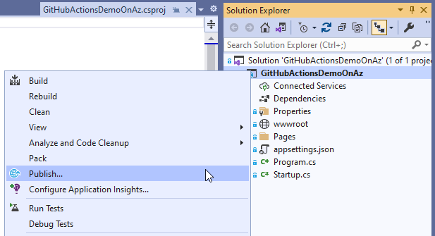
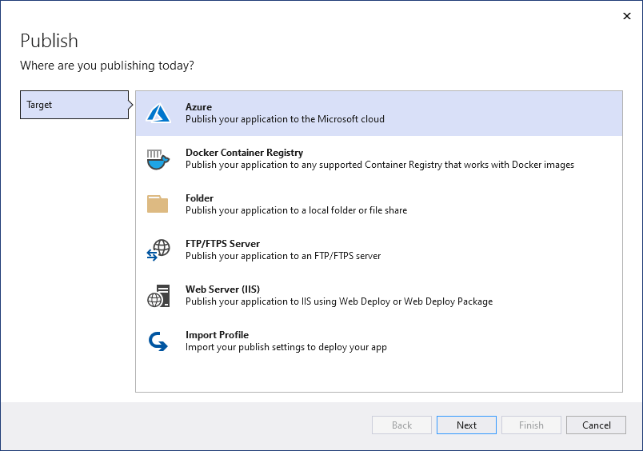
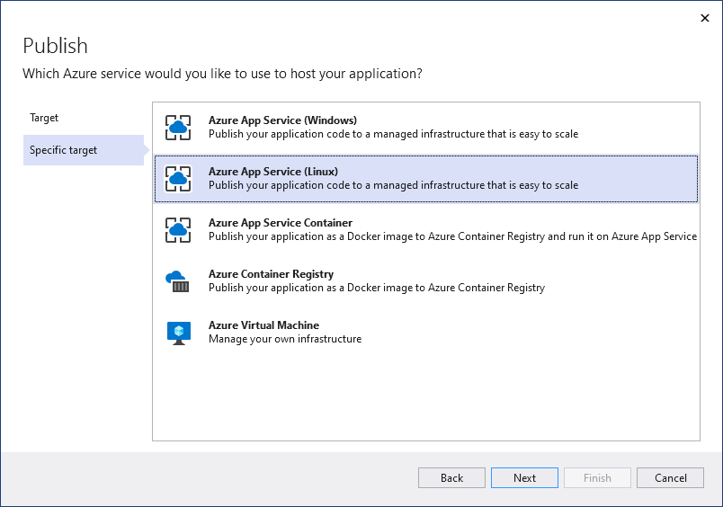
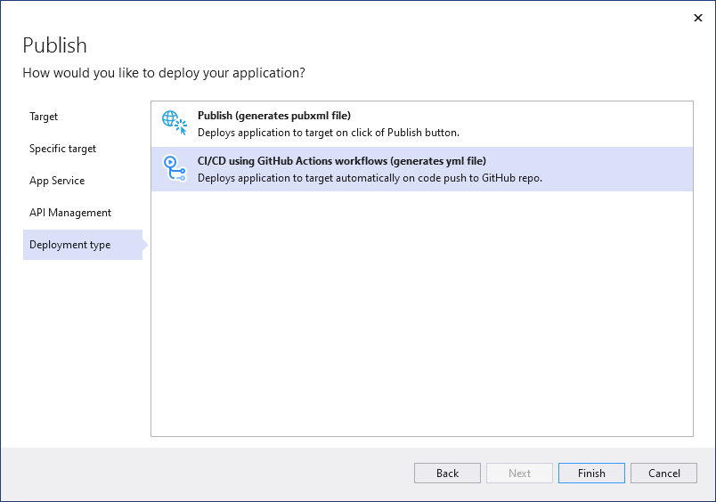
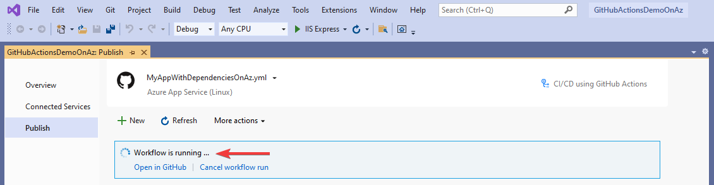
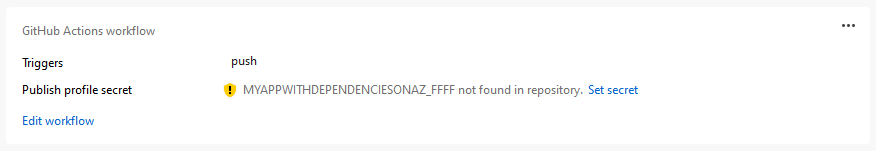
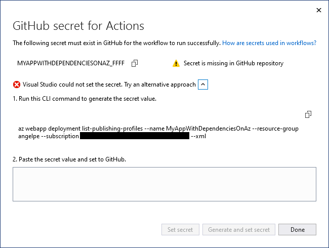

# Deploy your application to Azure using GitHub Actions workflows created by Visual Studio

Starting in Visual Studio 2019 version 16.11, you can create new GitHub Action workflows for .NET projects hosted on GitHub.com.

## How does it work?

In Solution Explorer, right-click your GitHub.com hosted project and choose **Publish**.

On the next screen, select **Azure** and then choose **Next**.

Depending on your [project type](#which-project-types-are-supported), you get a different list of Azure services to pick from. Pick one of the [supported Azure services](#which-azure-services-are-supported) that fits your needs.

On the final step of the wizard, select **CI/CD using GitHub Actions workflows (generates yml file)** and then choose **Finish**.

Visual Studio generates a new GitHub Actions workflow and asks you to commit it and push it to GitHub.com.

If you complete this step using the [built-in Git tooling](../version-control/git-with-visual-studio.md#git-changes-window), Visual Studio will detect the execution of the workflow.

## Setting the GitHub secrets

For the generated workflow to successfully deploy to Azure, it may require access to a [publish profile](/azure/app-service/deploy-github-actions?tabs=applevel#configure-the-github-secret) 

A successful deployment may also require access to a [service principal](/azure/app-service/deploy-github-actions?tabs=userlevel#configure-the-github-secret).

In all cases, Visual Studio tries to set the GitHub secret for you with the correct value. If it fails, it will let you know and give you the opportunity to try again.

If it fails to set the secret again, Visual Studio gives you the opportunity to get access to the secret manually, so you can complete the process through your repo's page on github.com.

## Which project types are supported?

* ASP.NET Core
* ASP.NET 5 and above
* Azure Functions

## Which Azure services are supported?

* Azure Web Apps
* Azure Functions
* Azure API Management
