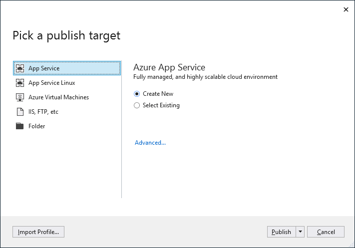

# Overview of deployment in Visual Studio

By deploying an application, service, or component, you distribute it for installation on other computers, devices, servers, or in the cloud. You choose the appropriate method in Visual Studio for the type of deployment that you need.

For many common app types, you can deploy your application right from Solution Explorer in Visual Studio. For a quick tour of this capability, see [First look at deployment](../deployment/deploying-applications-services-and-components.md).

## What publishing options are right for me?

From within Visual Studio, applications can be published directly to the following targets:

- [Azure App Service](#azure-app-service)
- [Azure Virtual Machines](#azure-virtual-machines)
- [File system](#file-system)
- [Custom targets (IIS, FTP, etc.)](#custom-targets-iis-ftp), which includes all arbitrary web servers.

On the **Publish** tab, you can select an existing publish profile, import an existing one, or create a new one using the options described here. For a tour of the publishing options in the IDE for different app types, see [First look at deployment](../deployment/deploying-applications-services-and-components.md).

## Azure App Service

[Azure App Service](/azure/app-service/app-service-web-overview) and [App Service on Linux](/azure/app-service/containers/app-service-linux-intro) help developers quickly create a variety of scalable web applications and services without maintaining infrastructure.

You determine how much computing power an App Service has by choosing a [pricing tier or plan](/azure/app-service/azure-web-sites-web-hosting-plans-in-depth-overview) for the containing App Service. You can have multiple Web apps (and other app types) share the same App Service without changing the pricing tier. For example, you can host development, staging, and production Web apps together on the same App Service.

An App Service runs on cloud-hosted virtual machines in Azure, but those virtual machines are managed for you. Each app in an App Service will be assigned a unique \*.azurewebsites.net URL; all pricing tiers other than Free allow assigning custom domain names to the site.

### When to choose Azure App Service

- You want to deploy a web application that's accessible through the Internet.
- You want to automatically scale your web application according to demand without needing to redeploy.
- You don't want to maintain server infrastructure (including software updates).
- You don't need any machine-level customizations on the servers that host your web application.

> If you want to use Azure App Service in your own datacenter or other on-premises computers, you can do so using the [Azure Stack](https://azure.microsoft.com/overview/azure-stack/).

For more information on publishing to App Service, see [Quickstart - Publish to Azure App Service](quickstart-deploy-to-azure.md) and [Quickstart - Publish ASP.NET Core to Linux](quickstart-deploy-to-linux.md).

## Azure Virtual Machines

[Azure Virtual Machines (VMs)](https://azure.microsoft.com/documentation/services/virtual-machines/) let you create and manage any number of computing resources in the cloud. By assuming responsibility for all software and updates on the VMs, you can customize them as much as desired as required by your application. You can access the virtual machines directly through Remote Desktop, and each one will maintain its assigned IP address as long as desired.

Scaling an application that's hosted on virtual machines involves spinning up additional VMs according to demand and then deploying the necessary software. This additional level of control lets you scale differently in different global regions. For example, if your application is serving employees in a variety of regional offices, you can scale your VMs according to the number of employees in those regions, potentially reducing costs.

For additional information, refer to the [detailed comparison](https://azure.microsoft.com/documentation/articles/choose-web-site-cloud-service-vm/) between Azure App Service, Azure Virtual Machines, and other Azure services that you can use as a deployment target using the Custom option in Visual Studio.

### When to choose Azure App Virtual Machines

- You want to deploy a web application that's accessible through the Internet, with full control over the lifetime of assigned IP addresses.
- You need machine-level customizations on your servers, which includes additional software such as a specialized database system, specific networking configurations, disk partitions, and so forth.
- You want a fine level of control over scaling of your web application.
- You need direct access to the servers hosting your application for any other reason.

> If you want to use Azure Virtual Machines in your own datacenter or other on-premises computers, you can do so using the [Azure Stack](https://azure.microsoft.com/overview/azure-stack/).

## File system

Deploying to the file system means to simply copy your application's files to a specific folder on your own computer. This is most often used for testing purposes, or to deploy the application for use by a limited number of people if the computer is also running a server. If the target folder is shared on a network, then deploying to the file system can make the web application files available to others who might then deploy it to specific servers.

Any local machines that are running a server can make your application available through the Internet or an Intranet depending on how it's configured and the networks to which it's connected. (If you do connect a computer directly to the Internet, be especially careful to protect it from external security threats.) Because you manage these machines, you're in complete control of the software and hardware configurations.

Note that if for any reason (such as machine access) you are not able to use cloud services like Azure App Service or Azure Virtual Machines, you can use the [Azure Stack](https://azure.microsoft.com/overview/azure-stack/) in your own datacenter. The Azure Stack allows you to manage and use computing resources through Azure App Service and Azure Virtual Machines while yet keeping everything on-premises.

### When to choose file system deployment

- You need only deploy the application to a file share from which others will deploy it to different servers.
- You need only a local test deployment.
- You want to examine and potentially modify the application files independently before sending them onto another deployment target.

For more information, see [Quickstart - Deploy to a local folder](quickstart-deploy-to-local-folder.md)

## Custom targets (IIS, FTP)

A custom target lets you deploy your application to a target other than Azure App Service, Azure Virtual Machines, or the local file system. It can deploy to a file system or any other server (Internet or Intranet) to which you have access, including those on other cloud services. It can work with web deploy (files or .ZIP) and FTP.

When choosing a custom target, Visual Studio prompts you for a profile name, and then collect additional **Connection** information including the target server or location, a site name, and credentials. You can control the following behaviors on the **Settings** tab:

- The configuration you want to deploy.
- Whether to remove existing files from the destination.
- Whether to precompile during publishing.
- Whether to exclude files in the App_Data folder from deployment.

You can create any number of Custom deployment profiles in Visual Studio, making it possible to manage profiles with different settings.

### When to choose custom deployment

- You're using cloud services on a provider other than Azure that can be accessed through URLs.
- You want to deploy using credentials other than the ones that you use within Visual Studio, or those tied directly to your Azure accounts.
- You want to delete files from the target each time you deploy.

For more information, see [Quickstart - Deploy to a web site](quickstart-deploy-to-a-web-site.md)

## Next steps

Tutorials:

- [Deploy a .NET Core application with the publish tool](/dotnet/core/deploying/deploy-with-vs?toc=/visualstudio/deployment/toc.json&bc=/visualstudio/deployment/_breadcrumb/toc.json)
- [Publish an ASP.NET core app to Azure](/aspnet/core/tutorials/publish-to-azure-webapp-using-vs?toc=/visualstudio/deployment/toc.json&bc=/visualstudio/deployment/_breadcrumb/toc.json)
- [Deployment in Visual C++](/cpp/windows/deployment-in-visual-cpp)
- [Deploy UWP apps](/windows/uwp/packaging/packaging-uwp-apps?toc=/visualstudio/deployment/toc.json&bc=/visualstudio/deployment/_breadcrumb/toc.json)
- [Publish a Node.js app to Azure using Web Deploy](https://github.com/Microsoft/nodejstools/wiki/Publish-to-Azure-Website-using-Web-Deploy?toc=/visualstudio/deployment/toc.json&bc=/visualstudio/deployment/_breadcrumb/toc.json)
- [Publish a Python app to Azure App Service](../python/publishing-python-web-applications-to-azure-from-visual-studio.md?toc=/visualstudio/deployment/toc.json&bc=/visualstudio/deployment/_breadcrumb/toc.json)
