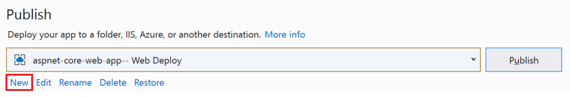
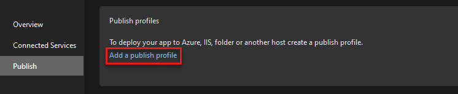
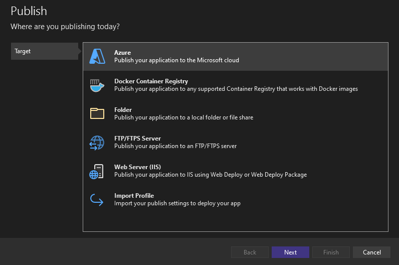
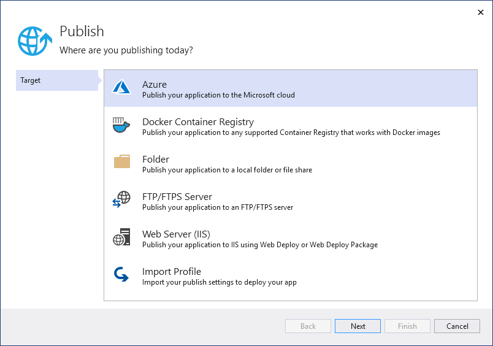
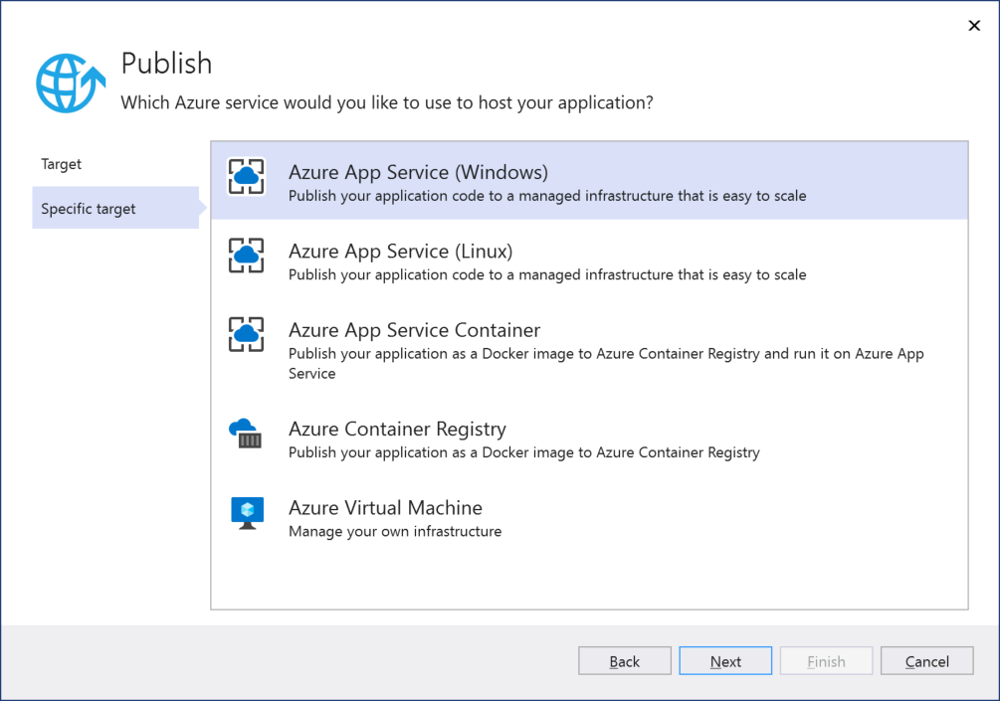
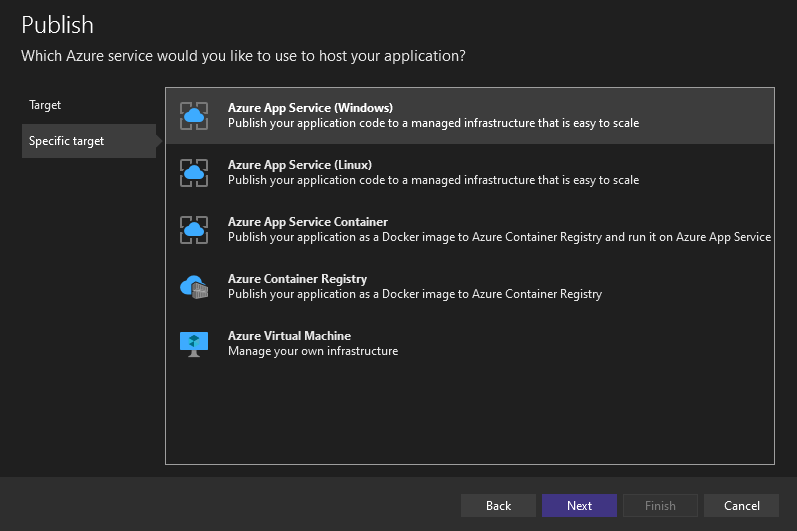

# Deploy your app to a folder, IIS, Azure, or another destination

By deploying an application, service, or component, you distribute it for installation on other computers, devices, servers, or in the cloud. You choose the appropriate method in Visual Studio for the type of deployment that you need.

Get help for your deployment task:

- Not sure what deployment option to choose? See [What publishing options are right for me?](#what-publishing-options-are-right-for-me)
- For help with deployment issues for Azure App Service or IIS, see [Troubleshoot ASP.NET Core on Azure App Service and IIS](/aspnet/core/test/troubleshoot-azure-iis).
- For help with configuring .NET deployment settings, see [Configure .NET deployment settings](#configure-net-deployment-settings).

- To deploy to a new target, if you have previously created a publish profile, select **New** from the **Publish** screen for the previously configured profile. The **Publish** tool appears.

::: moniker range="<=vs-2019"
   
::: moniker-end
::: moniker range=">=vs-2022"
   
::: moniker-end

   Then, choose a deployment option in the **Publish** tool. For information on your publishing options, see the following sections.

## What publishing options are right for me?

From within Visual Studio, applications can be published directly to the following targets:

- [Azure](#azure)
- [Docker Container Registry](#docker-container-registry)
- [DevTest Labs](#devtest-labs)
- [Folder](#folder)
- [FTP/FTPS server](#ftpftps-server)
- [Web server(IIS)](#web-server-iis)
- [Import profile](#import-profile)

The preceding options appear as shown in the following illustration when you create a new publish profile.

::: moniker range=">=vs-2022"

::: moniker-end
::: moniker range="vs-2019"

::: moniker-end

For a quick tour of more general application deployment options, see [First look at deployment](../deployment/deploying-applications-services-and-components.md).

## Azure 

When you choose Azure, you can choose between:

- [Azure App Service](#azure-app-service) running on Windows, Linux, or as a Docker image
- A Docker image deployed to [Azure Container Registry](#azure-container-registry)
- An [Azure Virtual Machine](#azure-virtual-machine)

::: moniker range="<=vs-2019"

::: moniker-end

::: moniker range=">=vs-2022"

::: moniker-end

### Azure Container Apps

[Azure Container Apps](/azure/container-apps/overview) helps developers create and manage containerized web applications and services.

While you can deploy a containerized app to Azure App Service, Azure Container Apps is optimized to use resources more efficiently for containerized apps, so there are cost savings as well as other benefits of using Azure Container Apps.

#### When to choose Azure Container Apps

- Your apps and services run in a container or multiple containers
- You need high availability and flexible scaling
- Your app is a good match for a microservices architectural pattern, with functionality broken into a set of modular single-task services implemented typically as [Azure Functions](/azure/azure-functions/functions-overview). For example, sets of single-task services that run as discrete jobs, respond to events, or that process requests from queues or triggers.
- You want the benefits of container orchestration (Kubernetes), but don't want to manage Kubernetes directly. (If you want deep control over the Kubernetes infrastructure that supports your containerized services, consider using [Azure Kubernetes Service (AKS)](/azure/aks/intro-kubernetes).

### Azure App Service

[Azure App Service](/azure/app-service/app-service-web-overview) helps developers quickly create scalable web applications and services without maintaining infrastructure. An App Service runs on cloud-hosted virtual machines in Azure, but those virtual machines are managed for you. Each app in an App Service will be assigned a unique \*.azurewebsites.net URL; all pricing tiers other than Free allow assigning custom domain names to the site.

You determine how much computing power an App Service has by choosing a [pricing tier or plan](/azure/app-service/azure-web-sites-web-hosting-plans-in-depth-overview) for the containing App Service. You can have multiple Web apps (and other app types) share the same App Service without changing the pricing tier. For example, you can host development, staging, and production Web apps together on the same App Service.

#### When to choose Azure App Service

- You want to deploy a web application that's accessible through the Internet.
- You want to automatically scale your web application according to demand without needing to redeploy.
- You don't want to maintain server infrastructure (including software updates).
- You don't need any machine-level customizations on the servers that host your web application.

> If you want to use Azure App Service in your own datacenter or other on-premises computers, you can do so using the [Azure Stack](https://azure.microsoft.com/overview/azure-stack/).

For more information on publishing to App Service, see:
- [Quickstart - Publish to Azure App Service](quickstart-deploy-aspnet-web-app.md)
- [Quickstart - Publish ASP.NET Core to Linux](quickstart-deploy-aspnet-web-app.md).
- [Publish an ASP.NET Core app to Azure App Service](/aspnet/core/tutorials/publish-to-azure-webapp-using-vs)
- [Troubleshoot ASP.NET Core on Azure App Service and IIS](/aspnet/core/test/troubleshoot-azure-iis).

### Azure WebJobs

Azure WebJobs is supported through App Service. See [Develop and deploy WebJobs using Visual Studio](/azure/app-service/webjobs-dotnet-deploy-vs).

#### When to choose Azure WebJobs

- You have a worker process, a computation that can run without user interaction.
- The job is on-demand, triggered by an event, or continuous.
- The job runs on Windows, or .NET Core on Linux (with Visual Studio 17.12 or later).

Another option for similar scenarios is Azure Functions. To choose the right option for you, see [Choose the right integration and automation services in Azure](/azure/azure-functions/functions-compare-logic-apps-ms-flow-webjobs).

### Azure Container Registry

[Azure Container Registry](/azure/container-registry/) allows you to build, store, and manage Docker container images and artifacts in a private registry for all types of container deployments.

#### When to choose Azure Container Registry

- When you have an existing Docker container development and deployment pipeline.
- When you want to build Docker container images in Azure.

For more information:

- [Deploy an ASP.NET container to a container registry](../containers/hosting-web-apps-in-docker.md)

### Azure Virtual Machine

[Azure Virtual Machines (VMs)](/azure/virtual-machines/) lets you create and manage any number of computing resources in the cloud. By assuming responsibility for all software and updates on the VMs, you can customize them as much as desired as required by your application. You can access the virtual machines directly through Remote Desktop, and each one will maintain its assigned IP address as long as desired.

Scaling an application that's hosted on virtual machines involves spinning up additional VMs according to demand and then deploying the necessary software. This additional level of control lets you scale differently in different global regions. For example, if your application is serving employees in a variety of regional offices, you can scale your VMs according to the number of employees in those regions, potentially reducing costs.

For additional information, see the [detailed comparison](/azure/architecture/guide/technology-choices/compute-decision-tree) between Azure App Service, Azure Virtual Machines, and other Azure services that you can use as a deployment target using the Custom option in Visual Studio.

#### When to choose Azure Virtual Machines

- You want to deploy a web application that's accessible through the Internet, with full control over the lifetime of assigned IP addresses.
- You need machine-level customizations on your servers, which include additional software such as a specialized database system, specific networking configurations, disk partitions, and so forth.
- You want a fine level of control over scaling of your web application.
- You need direct access to the servers hosting your application for any other reason.

> If you want to use Azure Virtual Machines in your own datacenter or other on-premises computers, you can do so using the [Azure Stack](https://azure.microsoft.com/overview/azure-stack/).

## Docker container registry

If your application is using Docker, you can publish your containerized application to a Docker container registry.

### When to choose Docker Container Registry

- You want to deploy a containerized application

For more information, see the following:

- [Deploy an ASP.NET container to a container registry](../containers/hosting-web-apps-in-docker.md)
- [Deploy to Docker Hub](../containers/deploy-docker-hub.md)

## DevTest Labs

Use the Folder deployment option in the Publish tool if you want to deploy to Azure DevTest Labs.

For complete steps, see [Publish app for testing on an Azure DevTest Labs VM](/azure/devtest-labs/test-app-azure). In the linked article, the folder publish steps apply to .NET Core/.NET 5+. The rest of the instructions apply to both .NET and .NET Framework. For .NET Framework ClickOnce apps, you can use the [Publish Wizard](../deployment/how-to-publish-a-clickonce-application-using-the-publish-wizard.md) to publish to a folder.

## Folder

Deploying to the file system means to copy your application's files to a specific folder on your own computer. Deploying to a folder is most often used for testing purposes, or to deploy the application for use by a limited number of people if the computer is also running a server. If the target folder is shared on a network, then deploying to the file system can make the web application files available to others who might then deploy it to specific servers.

Starting with Visual Studio 2019 16.8, the folder target includes the ability to publish a .NET Windows application using ClickOnce.

If you wish to publish a .NET Windows desktop project (.NET Core 3.1, .NET 5, and later) with ClickOnce, see [Deploy a .NET Windows application using ClickOnce](quickstart-deploy-using-clickonce-folder.md).

Any local machines that are running a server can make your application available through the Internet or an Intranet depending on how it's configured and the networks to which it's connected. (If you do connect a computer directly to the Internet, be especially careful to protect it from external security threats.) Because you manage these machines, you're in complete control of the software and hardware configurations.

If for any reason (such as machine access) you are not able to use cloud services like Azure App Service or Azure Virtual Machines, you can use the [Azure Stack](https://azure.microsoft.com/overview/azure-stack/) in your own datacenter. The Azure Stack allows you to manage and use computing resources through Azure App Service and Azure Virtual Machines while yet keeping everything on-premises.

### When to choose file system deployment

- You need only deploy the application to a file share from which others will deploy it to different servers.

- You want to deploy a .NET Windows Application using ClickOnce

- You need only a local test deployment.
- You want to examine and potentially modify the application files independently before sending them onto another deployment target.

For more information, see [Quickstart - Deploy to a local folder](quickstart-deploy-aspnet-web-app.md).

For more information on deploying a .NET Windows Application using ClickOnce, see [Deploy a .NET Windows application using ClickOnce](quickstart-deploy-using-clickonce-folder.md).

For additional help to choose your settings, see the following:

- [Framework-dependent vs. self-contained deployment](/dotnet/core/deploying/)
- [Target runtime identifiers (portable RID, et al)](/dotnet/core/rid-catalog)
- [Debug and release configurations](../ide/understanding-build-configurations.md)

## FTP/FTPS server

An FTP/FTPS server lets you deploy your application to a server other than Azure. It can deploy to a file system or any other server (Internet or Intranet) to which you have access, including those on other cloud services. It can work with web deploy (files or .ZIP) and FTP.

When choosing a FTP/FTPS server, Visual Studio prompts you for a profile name, and then collects additional **Connection** information including the target server or location, a site name, and credentials. You can control the following behaviors on the **Settings** tab:

- The configuration you want to deploy.
- Whether to remove existing files from the destination.
- Whether to precompile during publishing.
- Whether to exclude files in the App_Data folder from deployment.

You can create any number of FTP/FTPS deployment profiles in Visual Studio, making it possible to manage profiles with different settings.

### When to choose FTP/FTPS server deployment

- You're using cloud services on a provider other than Azure that can be accessed through URLs.
- You want to deploy using credentials other than the ones that you use within Visual Studio, or those tied directly to your Azure accounts.
- You want to delete files from the target each time you deploy.

## Web Server (IIS)

An IIS web server lets you deploy your application to a web server other than Azure. It can deploy to an IIS server (Internet or Intranet) to which you have access, including those on other cloud services. It can work with Web Deploy or a Web Deploy package.

When choosing an IIS web server, Visual Studio prompts you for a profile name, and then collects additional **Connection** information including the target server or location, a site name, and credentials. You can control the following behaviors on the **Settings** tab:

- The configuration you want to deploy.
- Whether to remove existing files from the destination.
- Whether to precompile during publishing.
- Whether to exclude files in the App_Data folder from deployment.

You can create any number of IIS web server deployment profiles in Visual Studio, making it possible to manage profiles with different settings.

### When to choose web server (IIS) deployment

- You're using IIS to publish a site or service that can be accessed through URLs.
- You want to deploy using credentials other than the ones that you use within Visual Studio, or those tied directly to your Azure accounts.
- You want to delete files from the target each time you deploy.

For more information, see [Quickstart - Deploy to a web site](quickstart-deploy-aspnet-web-app.md).

For help with troubleshooting ASP.NET Core on IIS, see [Troubleshoot ASP.NET Core on Azure App Service and IIS](/aspnet/core/test/troubleshoot-azure-iis).

## Import Profile

You can import a profile when publishing to IIS or Azure App Service. You can configure deployment using a *publish settings file* (*\*.publishsettings*). A publish settings file is created by IIS or Azure App Service, or it can be manually created, and then it can be imported into Visual Studio.

Use of a publish settings file can simplify deployment configuration and works better in a team environment versus manually configuring each deployment profile.

### When to choose import profile

- You're publishing to IIS and want to simplify deployment configuration.
- You're publishing to IIS or Azure App Service and want to speed up deployment configuration for reuse or for team members publishing to the same service.

For more information, see the following:

- [Import publish settings and deploy to IIS](tutorial-import-publish-settings-iis.md)
- [Import publish settings and deploy to Azure](tutorial-import-publish-settings-azure.md)

## Configure .NET deployment settings

For additional help to choose your settings, see the following:

- [Framework-dependent vs. self-contained deployment](/dotnet/core/deploying/)
- [Target runtime identifiers (portable RID, et al)](/dotnet/core/rid-catalog)
- [Debug and release configurations](../ide/understanding-build-configurations.md)

## Next steps

Tutorials:

- [Deploy a .NET Core application with the publish tool](/dotnet/core/deploying/deploy-with-vs?toc=/visualstudio/deployment/toc.json&bc=/visualstudio/deployment/_breadcrumb/toc.json)
- [Publish an ASP.NET core app to Azure](/aspnet/core/tutorials/publish-to-azure-webapp-using-vs?toc=/visualstudio/deployment/toc.json&bc=/visualstudio/deployment/_breadcrumb/toc.json)
- [Deployment in Visual C++](/cpp/windows/deployment-in-visual-cpp)
- [Deploy UWP apps](/windows/uwp/packaging/packaging-uwp-apps?toc=/visualstudio/deployment/toc.json&bc=/visualstudio/deployment/_breadcrumb/toc.json)
- [Publish a Node.js app to Azure using Web Deploy](https://github.com/Microsoft/nodejstools/wiki/Publish-to-Azure-Website-using-Web-Deploy?toc=/visualstudio/deployment/toc.json&bc=/visualstudio/deployment/_breadcrumb/toc.json)
