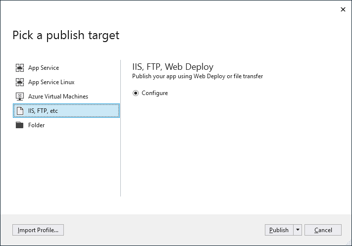

# First look at deployment in Visual Studio

By deploying an application, service, or component, you distribute it for installation on other computers, devices, or servers, or in the cloud. You choose the appropriate method in Visual Studio for the type of deployment that you need. (Many app types support other deployment tools such as command line deployment that are not described here.)

See the Quickstarts and Tutorials for step-by-step deployment instructions. For an overview of deployment options, see [What publishing options are right for me?](deploying-applications-services-and-components-resources.md#what-publishing-options-are-right-for-me).

## Deploy to local folder

Deployment to a local folder is typically used for testing, or to begin a staged deployment in which another tool is used for final deployment.

- **ASP.NET**, **ASP.NET Core**, **Node.js**, **Python**, and .**NET Core**: Use the Publish tool to deploy to a local folder. The exact options available depend on your app type. In Solution Explorer, right-click your project and choose **Publish**. (If you have not previously configured any publishing profiles, you must then click **Create new profile**.) Next, choose **Folder**. For more information, see [Deploy to a local folder](quickstart-deploy-to-local-folder.md).

    

- **Windows desktop** You can publish a Windows desktop application to a folder using ClickOnce deployment. Users can then install the application with a single click. For more information, see [Deploy a desktop app using ClickOnce](how-to-publish-a-clickonce-application-using-the-publish-wizard.md) (C# and Visual Basic). For C++/CLI, see [Deploy a native app using ClickOnce](/cpp/windows/clickonce-deployment-for-visual-cpp-applications) or, for C/C++, see [Deploy a native app using a Setup project](/cpp/windows/walkthrough-deploying-a-visual-cpp-application-by-using-a-setup-project).

## Publish to Azure

- **ASP.NET**, **ASP.NET Core**, **Python**, and **Node.js**: Publish to Azure App Service or Azure App Service Linux (using containers) using one of the following methods.

  - For continuous (or automated) deployment of apps, use Azure DevOps with [Azure Pipelines](/azure/devops/pipelines/get-started-yaml?view=azdevops).

  - For one-time (or manual) deployment of apps, use the **Publish** tool in Visual Studio.

  For deployment that provides more customized configuration of the server, you can also use the **Publish** tool to deploy apps to an Azure Virtual Machine.

  To use the **Publish** tool, right-click the project in Solution Explorer and choose **Publish**. (If you have previously configured any publishing profiles, you must then click **Create new profile**.) In the Publish dialog box, choose either **App Service** or **Azure Virtual Machines**, and then follow the configuration steps.

  

  Starting in Visual Studio 2017 version 15.7, you can deploy ASP.NET Core apps to **App Service for Linux**.

  For Python apps, also see [Python - Publishing to Azure App Service](../python/publishing-python-web-applications-to-azure-from-visual-studio.md?toc=/visualstudio/deployment/toc.json&bc=/visualstudio/deployment/_breadcrumb/toc.json).

  For a quick introduction, see [Publish to Azure](quickstart-deploy-to-azure.md) and [Publish to Linux](quickstart-deploy-to-linux.md). Also, see [Publish an ASP.NET Core app to Azure](/aspnet/core/tutorials/publish-to-azure-webapp-using-vs). For deployment using Git, see [Continuous deployment of ASP.NET Core to Azure with Git](/aspnet/core/publishing/azure-continuous-deployment).

  For information on importing a publish profile from Azure App Service to Visual Studio, see [Import publish settings and deploy to Azure](../deployment/tutorial-import-publish-settings-azure.md).

  > [!NOTE]
  > If you do not already have an Azure account, you can [sign up here](https://azure.microsoft.com/free/?ref=microsoft.com&utm_source=microsoft.com&utm_medium=doc&utm_campaign=visualstudio).

## Publish to Web or deploy to network share

- **ASP.NET**, **ASP.NET Core**, **Node.js**, and **Python**: You can use the Publish tool to deploy to a website using FTP or Web Deploy. For more information, see [Deploy to a web site](quickstart-deploy-to-a-web-site.md).

    In Solution Explorer, right-click the project and choose **Publish**. (If you have previously configured any publishing profiles, you must then click **Create new profile**.) In the Publish tool, choose the option you want and follow the configuration steps.

    

    For information on importing a publish profile in Visual Studio, see [Import publish settings and deploy to IIS](../deployment/tutorial-import-publish-settings-iis.md).

    You can also deploy ASP.NET applications and services in a number of other ways. For more information, see [Deploying ASP.NET web applications and services](/aspnet/mvc/overview/deployment/).

- **Windows desktop** You can publish a Windows desktop application to a web server or a network file share using ClickOnce deployment. Users can then install the application with a single click. For more information, see [Deploy a desktop app using ClickOnce](how-to-publish-a-clickonce-application-using-the-publish-wizard.md) (C# and Visual Basic). For C++/CLI, see [Deploy a native app using ClickOnce](/cpp/windows/clickonce-deployment-for-visual-cpp-applications) or, for C/C++, see [Deploy a native app using a Setup project](/cpp/windows/walkthrough-deploying-a-visual-cpp-application-by-using-a-setup-project).

## Publish to Microsoft Store

From Visual Studio, you can create app packages for deployment to Microsoft Store.

- **UWP**: You can package your app and deploy it using menu items. For more information, see [Package a UWP app by using Visual Studio](/windows/uwp/packaging/packaging-uwp-apps).

    

- **Windows desktop**: You can deploy to the Microsoft Store starting in Visual Studio 2017 version 15.4. To do this, start by creating a Windows Application Packaging Project. For more information, see [Package a desktop app for Microsoft Store](/windows/msix/desktop/desktop-to-uwp-packaging-dot-net).

    

## Deploy .NET packages to NuGet.org

To deploy bundled code into "packages" that contain compiled code (as DLLs) along with other content needed in the projects that consume these packages, you can use Visual Studio to create the NuGet package and a CLI tool to issue the final deployment command.

- [Create and publish a .NET Standard package](/nuget/quickstart/create-and-publish-a-package-using-visual-studio)
- [Create and publish a .NET Framework package](/nuget/quickstart/create-and-publish-a-package-using-visual-studio-net-framework)

## Deploy to a device (UWP)

If you are deploying a UWP app for testing on a device, see [Run UWP apps on a remote machine in Visual Studio](../debugger/run-windows-store-apps-on-a-remote-machine.md).

## Create an installer package (Windows desktop)

If you require more a complex installation of a desktop application than [ClickOnce](how-to-publish-a-clickonce-application-using-the-publish-wizard.md) can provide, you can create a Windows Installer package (MSI or EXE installation file) or a custom bootstrapper.

- An MSI-based installer package can be created using the [WiX Toolset Extension](https://marketplace.visualstudio.com/items?itemName=WixToolset.WiXToolset). This is a command-line toolset.

   ::: moniker range=">=vs-2019"
   For Visual Studio 2019, get the [WiX Toolset Visual Studio 2019 Extension](https://marketplace.visualstudio.com/items?itemName=WixToolset.WixToolsetVisualStudio2019Extension).
   ::: moniker-end

- An MSI or EXE installer package can be created using [InstallShield](https://www.flexerasoftware.com/producer/products/software-installation/installshield-software-installer/tab/requirements) from Flexera Software. InstallShield may be used with Visual Studio 2017 and later versions (Community Edition not supported). Note that InstallShield Limited Edition is no longer included with Visual Studio and is not supported in Visual Studio 2017 and later versions; check with [Flexera Software](https://info.flexerasoftware.com/IS-EVAL-InstallShield-Limited-Edition-Visual-Studio) about future availability.

- An MSI or EXE installer package can be created using a Setup project (vdproj). To use this option, install the [Visual Studio Installer Projects extension](https://marketplace.visualstudio.com/items?itemName=VisualStudioProductTeam.MicrosoftVisualStudio2017InstallerProjects#overview).

- You can also install prerequisite components for desktop applications by configuring a generic installer, which is known as a bootstrapper. For more information, see [Application Deployment Prerequisites](../deployment/application-deployment-prerequisites.md).

## Deploy to test lab

You can enable more sophisticated development and testing by deploying your applications into virtual environments. For more information, see [Test on a lab environment](../test/lab-management/using-a-lab-environment-for-your-application-lifecycle.md).

## Continuous deployment

You can use Azure Pipelines to enable continuous deployment of your app. For more information, see [Azure Pipelines](/azure/devops/pipelines/index?view=vsts) and [Deploy to Azure](/azure/devops/deploy-azure/index?view=vsts).

## Deploy a SQL database

- [Change target platform and publish a database project (SQL Server Data Tools (SSDT))](/sql/ssdt/how-to-change-target-platform-and-publish-a-database-project)

- [Deploy an Analysis Services Project (SSAS)](/sql/analysis-services/multidimensional-tutorial/lesson-2-5-deploying-an-analysis-services-project)

- [Deploy Integration Services (SSIS) projects and packages](/sql/integration-services/packages/deploy-integration-services-ssis-projects-and-packages)

- [Build and deploy to a local database](/sql/ssdt/how-to-build-and-deploy-to-a-local-database)

## Deployment for other app types

| App type | Deployment Scenario | Link |
| --- | --- | --- |
| **Office app** | You can publish an add-in for Office from Visual Studio. | [Deploy and publish your Office add-in](https://dev.office.com/docs/add-ins/publish/publish) |
| **WCF or OData service** | Other applications can use WCF RIA services that you deploy to a web server. | [Developing and deploying WCF Data Services](/dotnet/framework/data/wcf/developing-and-deploying-wcf-data-services) |
| **LightSwitch** | LightSwitch is no longer supported starting in Visual Studio 2017, but can still be deployed from Visual Studio 2015 and earlier. | [Deploying LightSwitch Applications](https://msdn.microsoft.com/Library/4818d933-295c-4ecc-9148-7ad9ca28dcdb) |

## Next steps

In this tutorial, you took a quick look at deployment options for different applications.

> [!div class="nextstepaction"]
> [What publishing options are right for me?](deploying-applications-services-and-components-resources.md#what-publishing-options-are-right-for-me)
