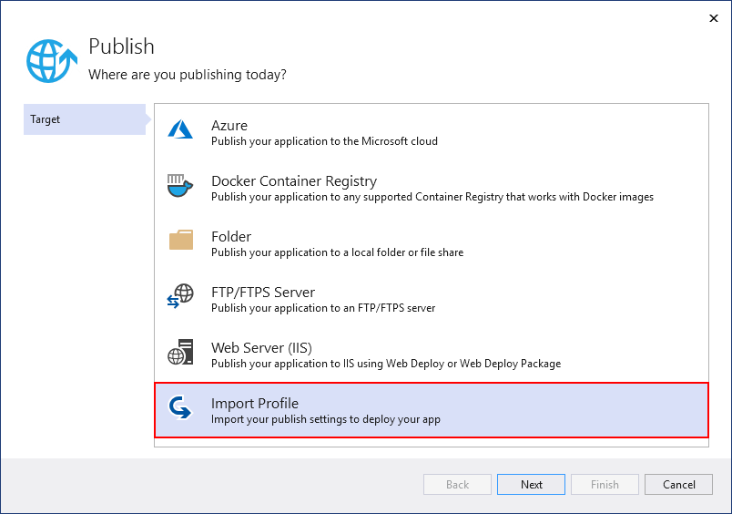

1. On the computer where you have the ASP.NET project open in Visual Studio, right-click the project in Solution Explorer, and choose **Publish**.

   If you previously configured any publishing profiles, the **Publish** pane appears. Click **New** or **Create new profile**.

1. Select the option to import a profile.

   In the **Publish** dialog box, click **Import Profile**.

   

1. Navigate to the location of the publish settings file that you created in the previous section.

1. In the **Import Publish Settings File** dialog, navigate to and select the profile that you created in the previous section, and click **Open**.

   Click **Finish** to save the publishing profile, and then click **Publish**.

   Visual Studio begins the deployment process, and the Output window shows progress and results.

   If you get any deployment errors, click **More Actions** > **Edit** to edit settings. Modify settings and click **Validate** to test new settings. If the host name isn't found, try the IP address instead of the host name in both the **Server** and **Destination URL** fields.

   
