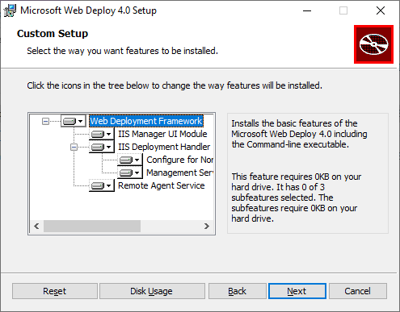

Web Deploy provides additional configuration features that enable the creation of the publish settings file from the UI.

> [!NOTE]
> The Web Platform Installer reached End-of-Life on 7/1/22. For more information, see [Web Platform Installer - End of support and sunsetting the product/application feed](https://blogs.iis.net/iisteam/web-platform-installer-end-of-support-feed). You can directly install Web Deploy 4.0 to create the publish settings file.

1. If you did not already install **IIS Management Scripts and Tools**, install it now.

    Go to **Select server roles** > **Web Server (IIS)** > **Management Tools**, and then select the **IIS Management Scripts and Tools** role, click **Next**, and then install the role.

    

    The scripts and tools are required to enable the generation of the publish settings file.

    Make sure you also install the **Management Service** and **IIS Management Console** (they may be already installed).

1. On Windows Server, [download Web Deploy 4.0](https://download.visualstudio.microsoft.com/download/pr/e1828da1-907a-46fe-a3cf-f3b9ea1c485c/035860f3c0d2bab0458e634685648385/webdeploy_amd64_en-us.msi).

1. Run the Web Deploy installation program, and make sure you select **Complete** installation instead of a typical installation.

   With a complete installation, you get the components you need to generate a publish settings file. (If you choose **Custom** instead, you can see the list of components, as shown in the following illustration.)

    

1. (Optional) Verify that Web Deploy is running correctly by opening  **Control Panel > System and Security > Windows Tools > Services**, and then make sure that:

    * **Web Deployment Agent Service** is running (the service name is different in older versions).

    * **Web Management Service** is running.

    If one of the agent services is not running, restart the **Web Deployment Agent Service**.

    If the Web Deployment Agent Service is not present at all, go to **Control Panel > Programs > Uninstall a program**, find **Microsoft Web Deploy \<version>**. Choose to **Change** the installation and make sure that you choose  **Will be installed to the local hard drive** for the Web Deploy components. Complete the change installation steps.