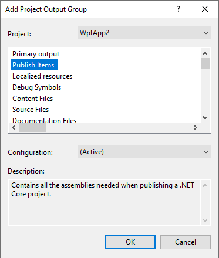
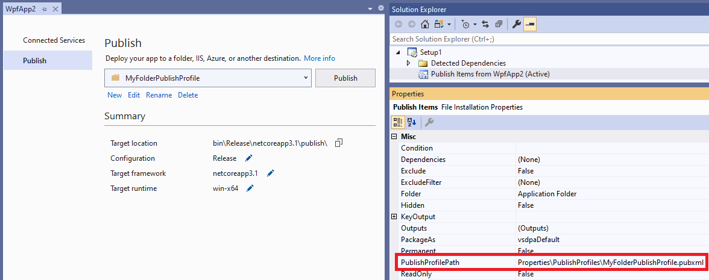
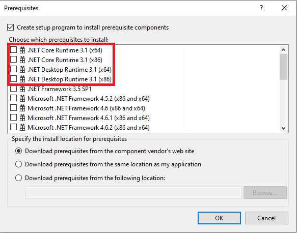

# Visual Studio Installer Projects Extension and .NET

Packaging applications as an MSI is often accomplished using the Visual Studio Installer Projects Extension.

This article applies to apps targeting .NET Core 3.1 and .NET 5 or later versions.

You can download the extension here:

::: moniker range=">= vs-2022"
[Visual Studio Installer Projects](https://marketplace.visualstudio.com/items?itemName=VisualStudioClient.MicrosoftVisualStudio2022InstallerProjects)
::: moniker-end
::: moniker range="vs-2019"
[Visual Studio Installer Projects](https://marketplace.visualstudio.com/items?itemName=VisualStudioClient.MicrosoftVisualStudio2017InstallerProjects)
::: moniker-end

## Update for .NET Core and .NET

.NET Core and .NET 5+ have two different models for publishing.

- Framework-dependent deployments

- Self-contained applications include the runtime.

To learn more about these deployment strategies, see [.NET application publishing overview](/dotnet/core/deploying/).

## Create a setup project

1. From Visual Studio, choose **Extensions** > **Manage Extensions**, and search for "Visual Studio Installer Projects". Or, download the extension directly from the Marketplace.

2. From the Start window, choose **Create a new project**, and then type "setup" in the search box. Choose a Setup project, and follow instructions.

   For a detailed example showing how to create and build a Setup project, see [Walkthrough: Deploying a Windows-based Application](/previous-versions/visualstudio/visual-studio-2010/k3bb4tfd(v=vs.100)).

   For general information on Setup projects (*.vsproj), see [Setup and Deployment projects](/previous-versions/visualstudio/visual-studio-2010/wx3b589t(v=vs.100)).

   For information on deployment properties, see [Deployment properties](/previous-versions/visualstudio/visual-studio-2010/seykw6dt(v=vs.100)).

### Workflow changes for .NET Core 3.1 and .NET 5 or later

- To get the correct output for .NET Core 3.1 and .NET 5.0 or later projects, select **Publish Items** instead of **Primary Output** in the **Add Project Output Group** dialog box.  To open this dialog, select **Add** > **Project Output...** from the Setup project's context menu.

  

- To create a self-contained installer, set the **PublishProfilePath** property on the **Publish Items** node in the Setup project, using the relative path of a publish profile with the correct properties set.

  ::: moniker range=">= vs-2022"
  :::image type="content" source="../deployment/media/vs-2022/installer-projects-net-core-publish-profile.png" border="false" alt-text="Screenshot that shows setting the publish profile on the Publish Items project output item." lightbox="../deployment/media/vs-2022/installer-projects-net-core-publish-profile.png":::
  ::: moniker-end
  ::: moniker range="vs-2019"
  
  ::: moniker-end

  Before you can set this property, create a publish profile from the application project by choosing **Publish** from the application project's context menu in Solution Explorer, and deploy the application to a folder.

>[!NOTE]
>This workflow is not supported for ASP.NET Core applications, only Windows Desktop applications.

### Prerequisites

If you would like your installer to be able to install the necessary runtime for a framework-dependent .NET Core 3.1 or .NET 5.0+ app, you can do this using [prerequisites](../deployment/application-deployment-prerequisites.md).  From the properties dialog of your installer project, open the **Prerequisites...** dialog and you'll see the following entries:

The **.NET Core Runtime...** option should be selected for console applications, **.NET Desktop Runtime...** should be selected for WPF and WinForms applications.

>[!NOTE]
>These items are present starting with the Visual Studio 2019 Update 7 release.

## Related content

- [Prerequisites Dialog Box](/visualstudio/deployment/how-to-install-prerequisites-with-a-clickonce-application)
- [Application Deployment Prerequisites](../deployment/application-deployment-prerequisites.md)
