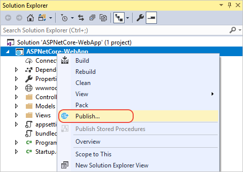
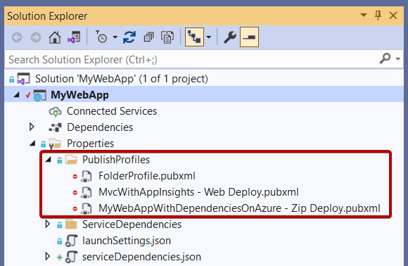
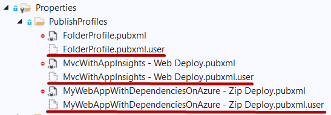
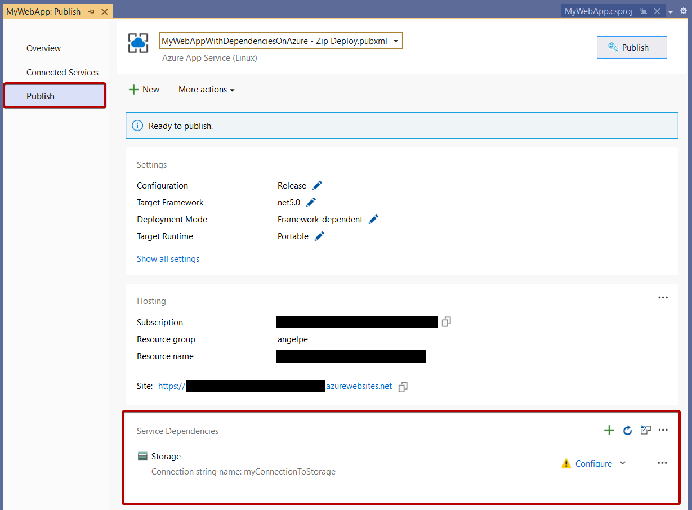

# Overview of Publish

For ASP.NET, .NET Core, and Python apps, you can use the Publish tool to deploy your applications.

## What is Publish?

The Publish tool helps you deploy your application to various destinations. Get started by right-clicking your project in Solution Explorer and selecting **Publish** from the context menu. If you haven't published the project previously, you're asked to choose what service you want to publish to, which could be an IIS server, an Azure service like App Service, a Docker container registry, or an FTP server.

The deployment options are covered elsewhere in the documentation. See [A first look at deployment](./deploying-applications-services-and-components.md).

If you've already published the project, you'll see the **Publish** screen, which provides links to the deployed resources, information about the deployment, and a **Publish** button to republish the application. You can also use the **New** button to go through the publish process again, which creates a new publish profile. Publish uses *profiles* (`.pubxml` files) to allow for multiple project configurations and multiple publish targets for a single project.

Under **More actions**, you can find options to delete the publish profile, edit settings, or restore it.

## Publish profile files (.pubxml files)

The contents of the profile are XML and based on MSBuild.

The Publish profile keeps credentials in a separate, hidden by default file that doesn’t get checked-in.

You can always import publish profiles [from IIS](../deployment/tutorial-import-publish-settings-iis.md#create-the-publish-settings-file-in-iis-on-windows-server) and [Azure App Service](../deployment/tutorial-import-publish-settings-azure.md#create-the-publish-settings-file-in-azure-app-service)

## Visual Studio can help you manage dependencies to Azure services

When you use the Publish tool to deploy your application to Azure, you get the opportunity to configure dependencies to Azure services.

The idea is that you may want to connect to a different SQL database or a different Storage account or a different Key Vault for different environments like testing, QA, pre-prod, and so forth. See [Visual Studio Connected Services](../azure/overview-connected-services.md).

## Next steps

For the Publish tool:

- [Publish an ASP.NET web app](../deployment/quickstart-deploy-aspnet-web-app.md)
- [Publish your web app](/azure/app-service/quickstart-dotnetcore?tabs=net60&pivots=development-environment-vs#publish-your-web-app)
