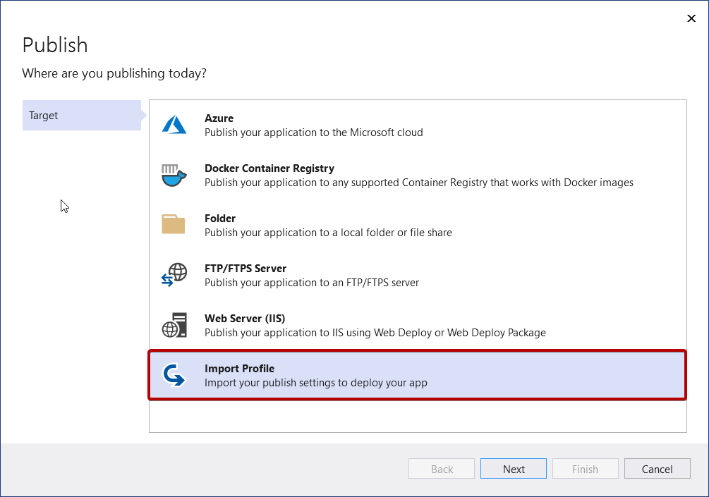

# Overview of Publish

For ASP.NET, .NET Core, and Python apps, you can use the Publish tool to deploy your applications.

## What is Publish?

The Publish tool helps you deploy your application to various destinations. Get started by right-clicking your project in Solution Explorer and selecting **Publish** from the context menu.

## How does it work?

Publish uses *profiles* (.pubxml files) to allow for multiple project configurations and multiple publish targets for a single project.

The contents of the profile are XML and based on MSBuild.

The Publish profile keeps credentials in a separate, hidden by default file that doesn’t get checked-in.

You can always import publish profiles [from IIS](./how-to-get-publish-profile-from-iis.md) and [Azure App Service](./how-to-get-publish-profile-from-azure-app-service.md)

## Visual Studio can help you manage dependencies to Azure services

When you use Publish to deploy your application to Azure, you get the opportunity to configure dependencies to Azure services.

The idea is that you may want to connect to a different SQL database or a different Storage account or a different Key Vault for different environments like testing, QA, pre-prod, and so forth.
