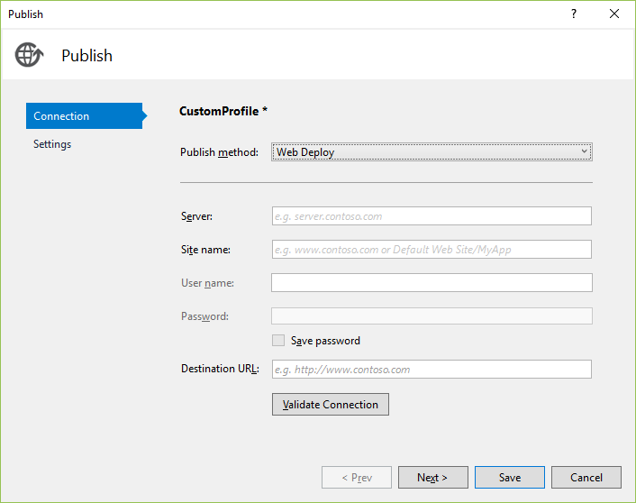
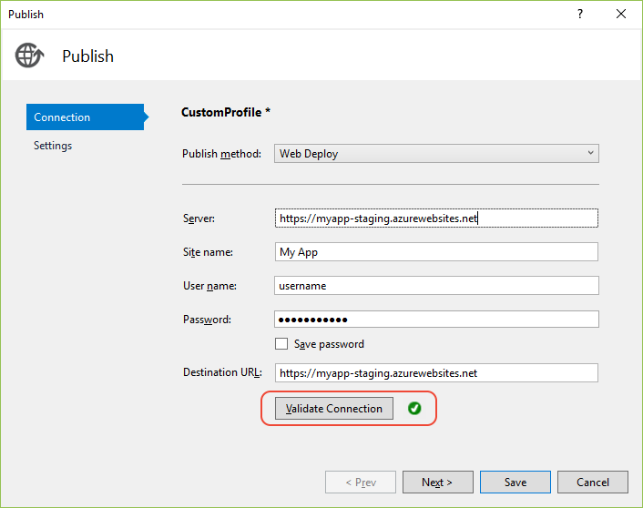

# Publish a Web app to a web site using Visual Studio

You can use the **Publish** tool to publish ASP.NET, ASP.NET Core, .NET Core, and Python apps to a website from Visual Studio. For Node.js, the steps are supported but the user interface is different.

[!INCLUDE [quickstart-prereqs](includes/quickstart-prereqs.md)]

> [!NOTE]
> If you need to publish a Windows desktop application to a network file share, see [Deploy a desktop app using ClickOnce](how-to-publish-a-clickonce-application-using-the-publish-wizard.md) (C# or Visual Basic). For C++/CLI, see [Deploy a native app using ClickOnce](/cpp/windows/clickonce-deployment-for-visual-cpp-applications) or, for C/C++, see [Deploy a native app using a Setup project](/cpp/windows/walkthrough-deploying-a-visual-cpp-application-by-using-a-setup-project).

## Publish to a Web site

1. In Solution Explorer, right-click the project and choose **Publish** (or use the **Build** > **Publish** menu item).

    

1. If you have previously configured any publishing profiles, the **Publish** pane appears. Select **Create new profile**.

1. In the **Pick a publish target** dialog box, choose **IIS, FTP, etc**.

    

1. Select **Publish**. The profile publish settings dialog box opens.

    

1. In the **Publish method** field, choose a method such as **Web Deploy** or **FTP**. The settings that you see next correspond to your publishing method. Web Deploy simplifies deployment of Web applications and Web sites to IIS servers, and must be installed as an application on the server. Use the [Web platform installer](https://www.microsoft.com/web/downloads/platform.aspx) to install it.

1. Configure required settings for the publish method and select **Validate Connection**. If the server or target is available and your settings are correct, a message that indicates the connection is validated, and you're ready to publish.

    

1. Select **Settings** to configure other deployment settings, such as whether to deploy a Debug or Release configuration, and then select **Save**. If you're debugging remotely, a Debug configuration is required.

1. To publish, select **Publish**. The Output window shows deployment progress and results.

## Next steps

In this quickstart, you learned how to use Visual Studio to create a publishing profile. You can also configure a publishing profile by importing publish settings.

> [!div class="nextstepaction"]
> [Import publish settings and deploy to IIS](tutorial-import-publish-settings-iis.md)
