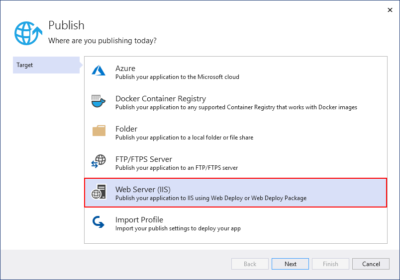

# Publish a Web app to a web site using Visual Studio

You can use the **Publish** tool to publish ASP.NET, ASP.NET Core, .NET Core, and Python apps to a website from Visual Studio. For Node.js, the steps are supported but the user interface is different.

[!INCLUDE [quickstart-prereqs](includes/quickstart-prereqs.md)]

> [!NOTE]
> If you need to publish a Windows desktop application to a network file share, see [Deploy a desktop app using ClickOnce](how-to-publish-a-clickonce-application-using-the-publish-wizard.md) (C# or Visual Basic). For C++/CLR, see [Deploy a native app using ClickOnce](/cpp/windows/clickonce-deployment-for-visual-cpp-applications) or, for C/C++, see [Deploy a native app using a Setup project](/cpp/windows/walkthrough-deploying-a-visual-cpp-application-by-using-a-setup-project).

## Publish to a Web site

1. In Solution Explorer, right-click the project and choose **Publish** (or use the **Build** > **Publish** menu item).

    

1. If you have previously configured any publishing profiles, the **Publish** pane appears. Select **New**.

1. In the **Publish** window, choose **Web Server (IIS)**.

    

1. Choose **Web Deploy** as the deployment method. Web Deploy simplifies deployment of Web applications and Web sites to IIS servers, and must be installed as an application on the server. Use the [Web platform installer](https://www.microsoft.com/web/downloads/platform.aspx) to install it.

    

1. Configure the required settings for the publish method and select **Finish**. 

    

1. To publish, select **Publish** in the summary page. The Output window shows deployment progress and results.

   If you need help troubleshooting ASP.NET Core on IIS, see [Troubleshoot ASP.NET Core on Azure App Service and IIS](/aspnet/core/test/troubleshoot-azure-iis).

## Next steps

In this quickstart, you learned how to use Visual Studio to create a publishing profile. You can also configure a publishing profile by importing publish settings.

> [!div class="nextstepaction"]
> [Import publish settings and deploy to IIS](tutorial-import-publish-settings-iis.md)
