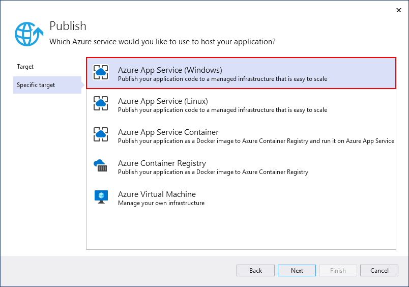
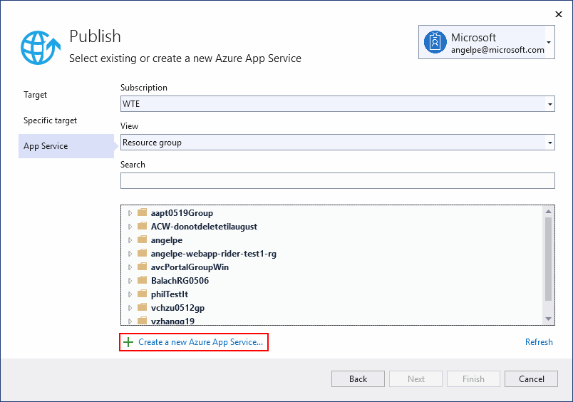
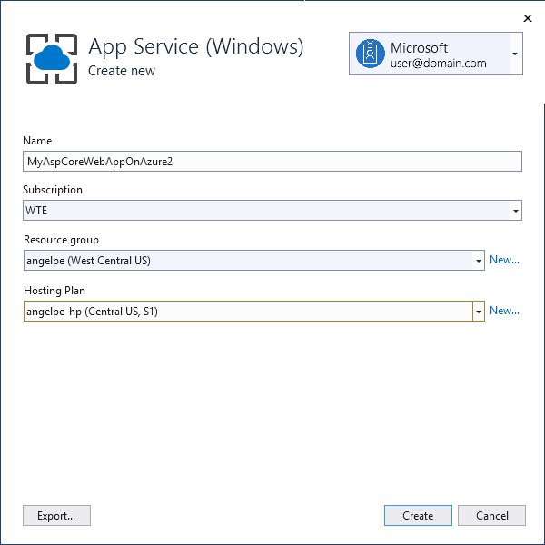
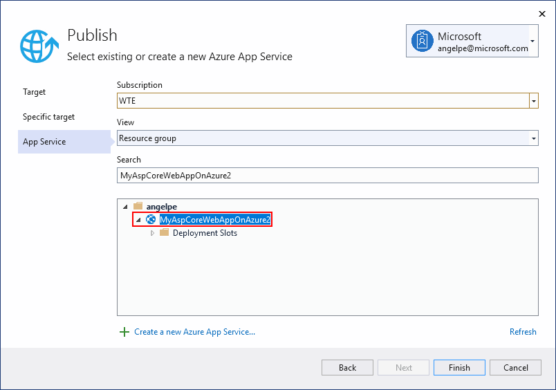
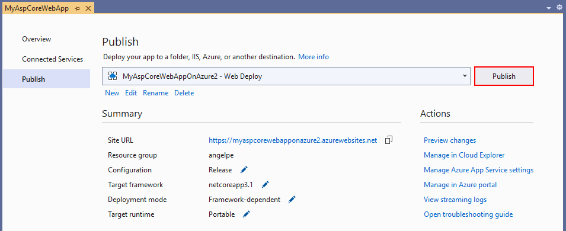

# Publish a Web app to Azure App Service using Visual Studio

For ASP.NET, ASP.NET Core, Node.js, and .NET Core apps, publish to Azure App Service or Azure App Service Linux (using containers) using one of the following methods.

* For continuous (or automated) deployment of apps, use Azure DevOps with [Azure Pipelines](/azure/devops/pipelines/get-started-yaml?view=azdevops&preserve-view=true).

* For one-time (or manual) deployment of apps, use the **Publish** tool in Visual Studio to deploy ASP.NET, ASP.NET Core, Node.js, and .NET Core apps to Azure App Service or [App Service for Linux](../deployment/quickstart-deploy-to-linux.md) (using containers). For Python apps, follow the steps on [Python - Publish to Azure App Service](../python/publishing-python-web-applications-to-azure-from-visual-studio.md).

This article describes how to use the **Publish** tool for one-time deployment.

[!INCLUDE [quickstart-prereqs-azure](includes/quickstart-prereqs-azure.md)]

## Publish to Azure App Service on Windows

1. In Solution Explorer, right-click the project node and choose **Publish** (or use the **Build** > **Publish** menu item).

    

1. If you have previously configured any publishing profiles, the **Publish** window appears. Select **New**.

1. In the **Publish** window, select **Azure**.

    

1. Select **Azure App Service (Windows)** and **Next**.

    

1. Sign in with your Azure account, if necessary. Select **Create a new Azure App Service...**

    

1. In the **Create Azure App Service (Windows)** dialog, the **App Name**, **Resource Group**, and **App Service Plan** entry fields are populated. You can keep these names or change them. When ready, select **Create**.

    

1. In the **Publish** dialog, the newly created instance has been automatically selected. When ready, select **Finish**.

    

1. Select **Publish**. Visual Studio deploys the app to your Azure App Service, and the web app loads in your browser. The project properties **Publish** pane shows the site URL and other details.

    

## Clean up resources

In the preceding steps, you created Azure resources in a resource group. If you don't expect to need these resources in the future, you can delete them by deleting the resource group.
From the left menu in the Azure portal, select **Resource groups** and then select **myResourceGroup**.
On the resource group page, make sure that the listed resources are the ones you want to delete.
Select **Delete**, type **myResourceGroup** in the text box, and then select **Delete**.

## Next steps

In this quickstart, you learned how to use Visual Studio to create a publishing profile for deployment to Azure. You can also configure a publishing profile by importing publish settings from Azure App Service.

> [!div class="nextstepaction"]
> [Import publish settings and deploy to Azure](tutorial-import-publish-settings-azure.md)
