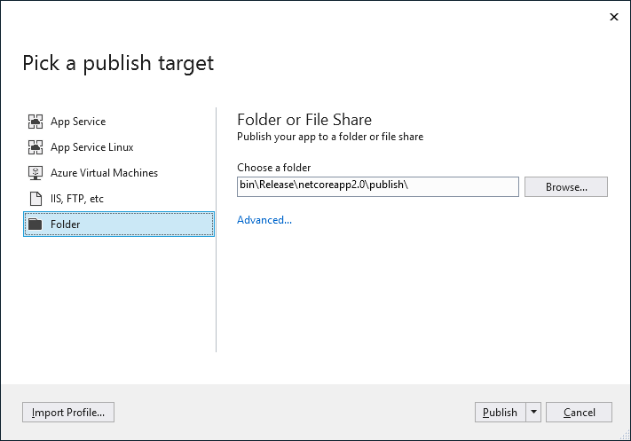
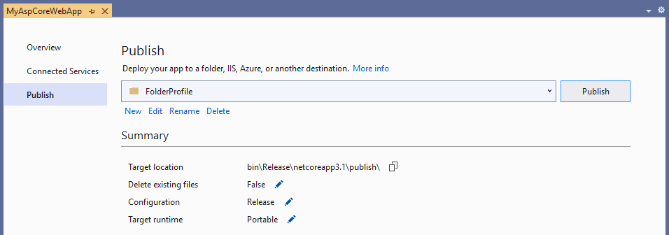
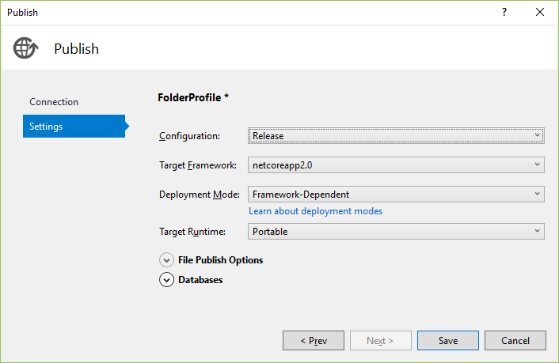

# Deploy an app to a local folder using Visual Studio

You can use the **Publish** tool to publish ASP.NET, ASP.NET Core, .NET Core, and Python apps to a local folder from Visual Studio. For Node.js, the steps are supported but the user interface is different.

[!INCLUDE [quickstart-prereqs](includes/quickstart-prereqs.md)]

> [!NOTE]
> If you need to publish a Windows desktop application to a local folder, see [Deploy a desktop app using ClickOnce](how-to-publish-a-clickonce-application-using-the-publish-wizard.md) (C# or Visual Basic). For C++/CLI, see [Deploy a native app using ClickOnce](/cpp/windows/clickonce-deployment-for-visual-cpp-applications) or, for C/C++, see [Deploy a native app using a Setup project](/cpp/windows/walkthrough-deploying-a-visual-cpp-application-by-using-a-setup-project).

## Deploy to a local folder

1. In Solution Explorer, right-click the project and choose **Publish** (or use the **Build** > **Publish** menu item).

    

1. If you have previously configured any publishing profiles, the **Publish** pane appears. Select **Create new profile**.

1. In the **Pick a publish target** dialog box, choose **Folder**.

    

1. Enter a path or select **Browse** to specify a local folder.

1. Select **Publish**. Visual Studio builds the project and publishes it to the specified folder. The project properties **Publish** pane appears, showing a profile summary.

    

1. To configure deployment settings, select **Configure** in the profile summary and select the **Settings** tab.

    

1. Configure options such as whether to deploy a Debug or Release configuration, and then select **Save**.

1. To republish, select **Publish**.

Deploy the published files in any way you like. For example, you can package them in a *.zip* file, use a simple copy command, or deploy them with any installation package of your choice.

## Next steps

- [Deploy a .NET Core Application with the Publish tool](/dotnet/core/deploying/deploy-with-vs?toc=/visualstudio/deployment/toc.json&bc=/visualstudio/deployment/_breadcrumb/toc.json)
- [Package a desktop app for Microsoft Store (Desktop Bridge)](/windows/uwp/porting/desktop-to-uwp-packaging-dot-net?toc=/visualstudio/deployment/toc.json&bc=/visualstudio/deployment/_breadcrumb/toc.json)
- (.NET) [Deploy the .NET Framework and applications](/dotnet/framework/deployment/)
