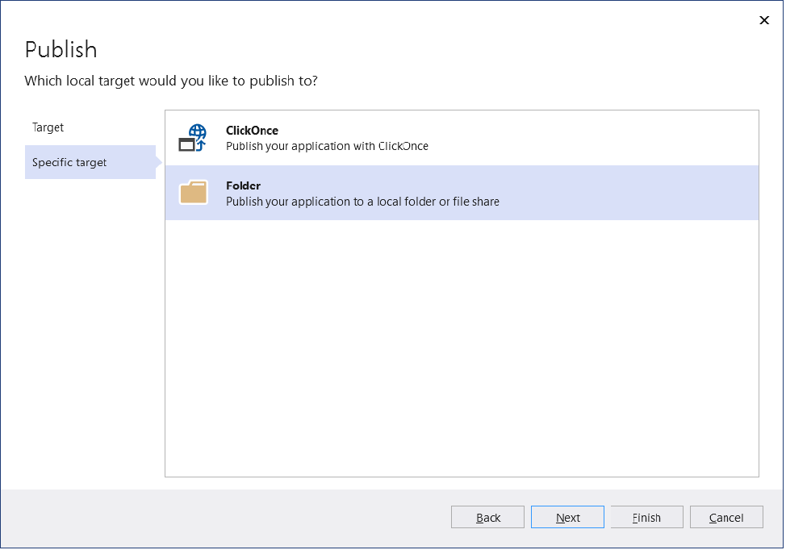

# Deploy an app to a folder using Visual Studio

You can use the **Publish** tool to publish ASP.NET, ASP.NET Core, .NET Core, and Python apps to a folder from Visual Studio. For Node.js, the steps are supported but the user interface is different.

[!INCLUDE [quickstart-prereqs](includes/quickstart-prereqs.md)]
::: moniker range=">=vs-2017"
> [!NOTE]
> If you need to publish a Windows desktop application to a folder, see [Deploy a desktop app using ClickOnce](how-to-publish-a-clickonce-application-using-the-publish-wizard.md) (C# or Visual Basic). For C++/CLR, see [Deploy a native app using ClickOnce](/cpp/windows/clickonce-deployment-for-visual-cpp-applications) or, for C/C++, see [Deploy a native app using a Setup project](/cpp/windows/walkthrough-deploying-a-visual-cpp-application-by-using-a-setup-project).

::: moniker-end

::: moniker range=">=vs-2019"
> [!NOTE]
> If you need to publish a .NET Core 3.1, or newer, Windows desktop application to a folder, see [Deploy a .NET Windows application using ClickOnce](quickstart-deploy-using-clickonce-folder.md).

::: moniker-end

## Deploy to a local folder

1. In Solution Explorer, right-click the project and choose **Publish** (or use the **Build** > **Publish** menu item).

    

1. If you have previously configured any publishing profiles, the **Publish** window appears. Select **New**.

1. In the **Publish** window, select **Folder**.

    

::: moniker range=">=vs-2019"

4. If you are deploying a .NET Core 3.1, or newer, Windows Application you may need to select **Folder** in the **Specific target** window.

5. If you wish to publish a .NET Core 3.1, or newer, Windows application with ClickOnce, see [Deploy a .NET Windows application using ClickOnce](quickstart-deploy-using-clickonce-folder.md).

 ::: moniker-end

4. Enter a path or select **Browse** to specify a folder.

    

1. Select **Publish**. Visual Studio builds the project and publishes it to the specified folder. The project properties **Publish** pane appears, showing a profile summary.

    

1. To configure deployment settings, select **Edit** in the publish profile summary and select the **Settings** tab.

   The settings you see depend on your application type. The following illustration shows example settings for an ASP.NET Core app.

    

    For additional help to choose settings in .NET, see the following:

    - [Framework-dependent vs. self-contained deployment](/dotnet/core/deploying/)
    - [Target runtime identifiers (portable RID, et al)](/dotnet/core/rid-catalog)
    - [Debug and release configurations](../ide/understanding-build-configurations.md)

1. Configure options such as whether to deploy a Debug or Release configuration, and then select **Save**.

1. To republish, select **Publish**.

Deploy the published files in any way you like. For example, you can package them in a *.zip* file, use a simple copy command, or deploy them with any installation package of your choice.

## Next steps

For .NET apps:

- [Deploy a .NET Core Application with the Publish tool](/dotnet/core/deploying/deploy-with-vs)
- [.NET Core application publishing (framework-dependent vs. self-contained deployments)](/dotnet/core/deploying/)
- [Deploy the .NET Framework and applications](/dotnet/framework/deployment/)
::: moniker range=">=vs-2019"
- [Deploy a .NET Windows application using ClickOnce](quickstart-deploy-using-clickonce-folder.md).
 ::: moniker-end
