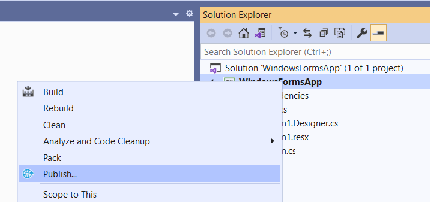
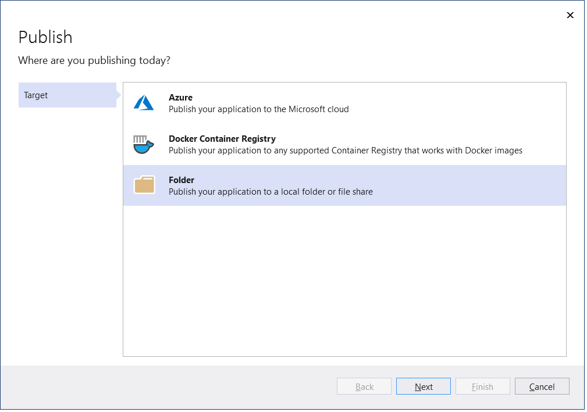
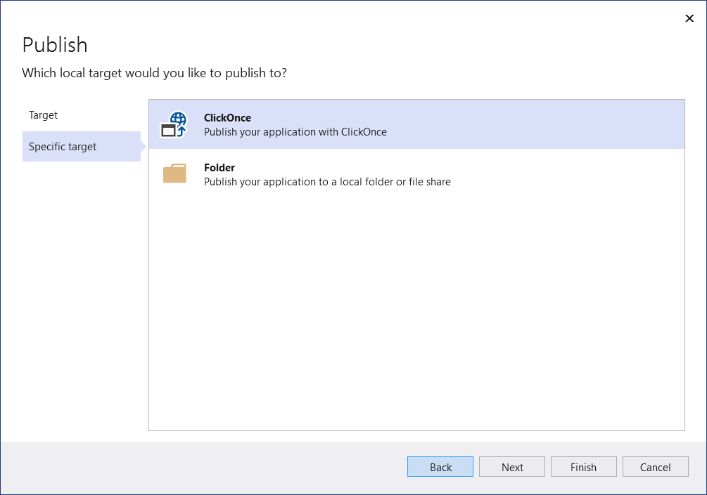
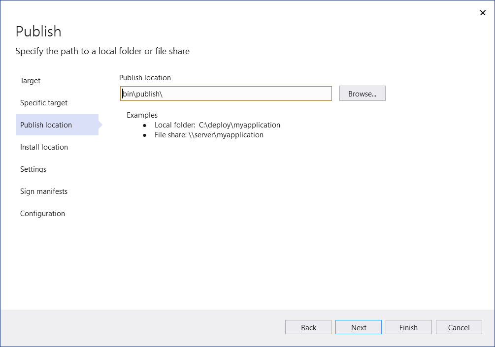
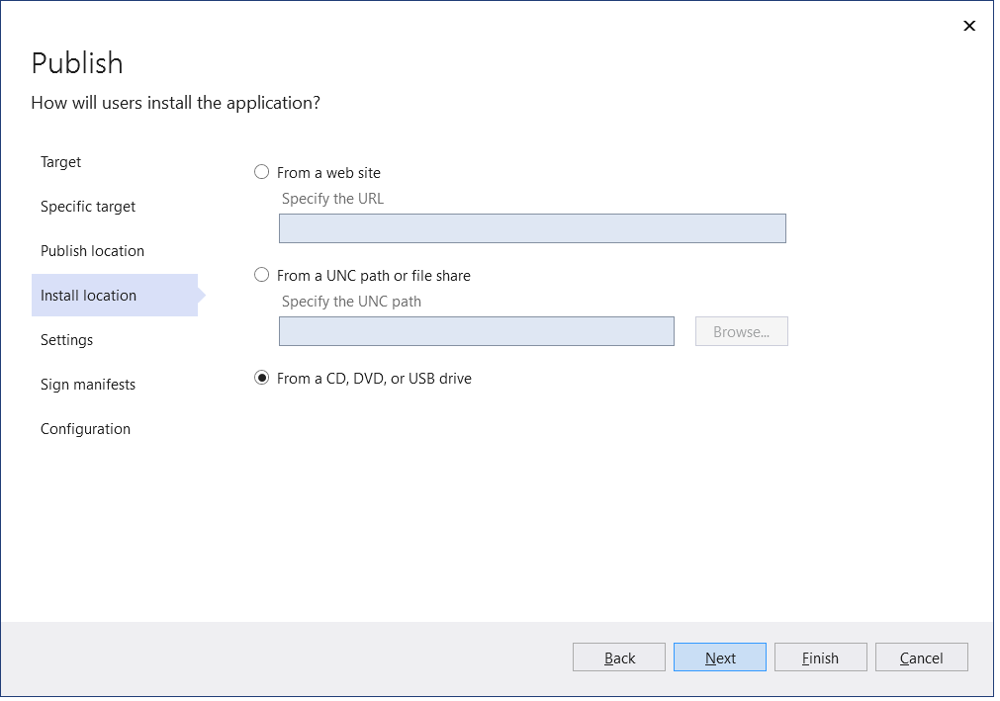
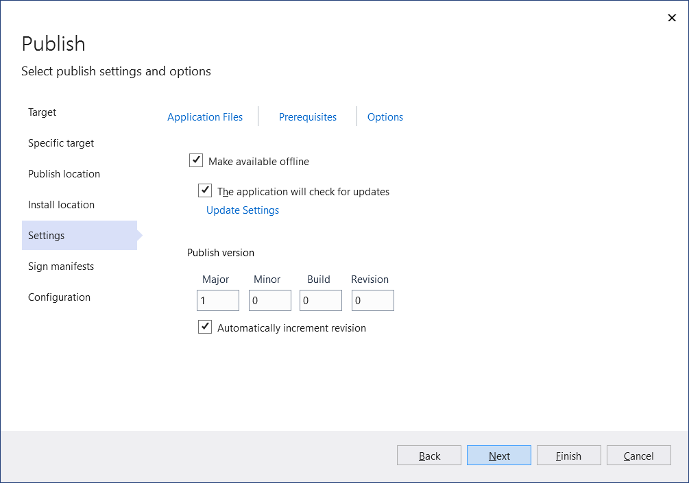
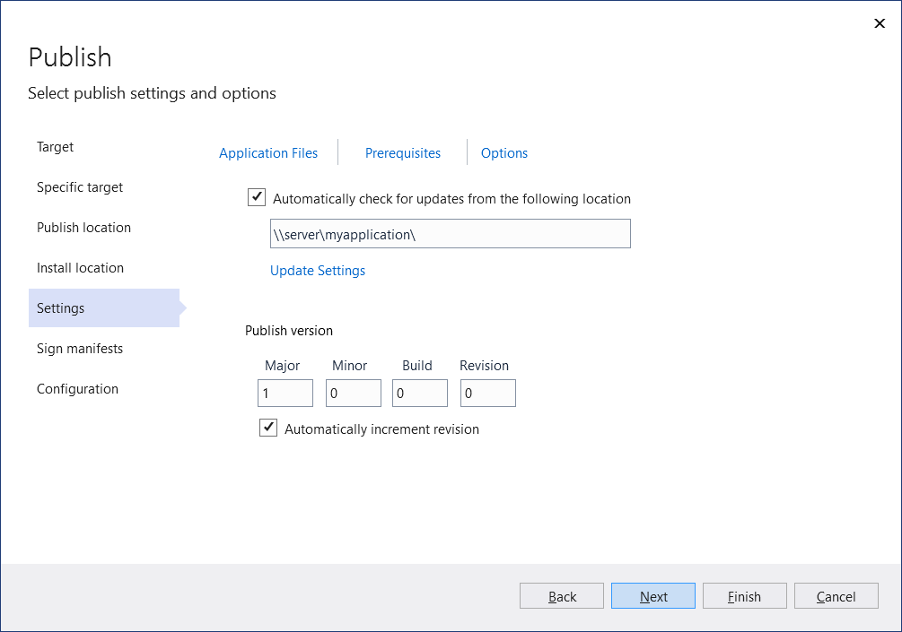
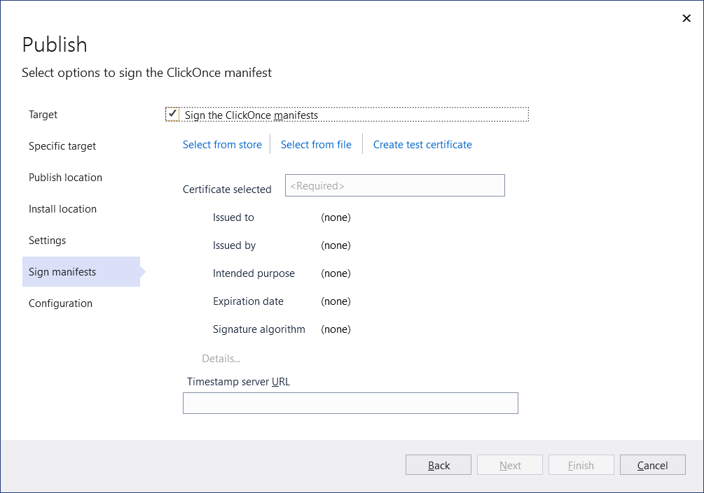
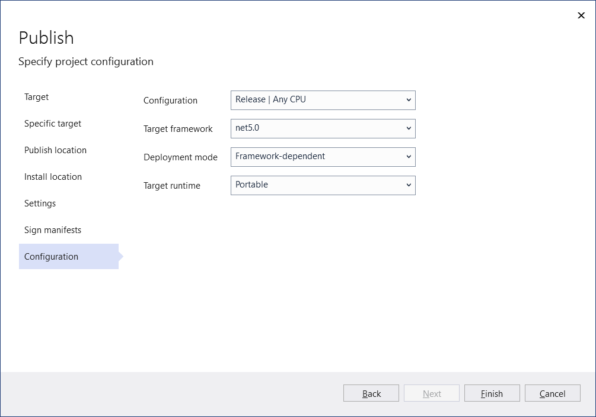
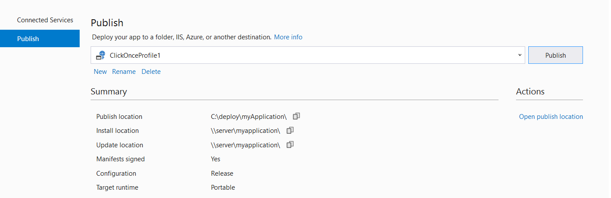

# Deploy a .NET Windows desktop application using ClickOnce

Starting in Visual Studio 2019 version 16.8, you can use the **Publish** tool to publish .NET Core 3.1, .NET 5, or newer, Windows Desktop applications using ClickOnce from Visual Studio.

> [!NOTE]
> If you need to publish a .NET Framework Windows application, see [Deploy a desktop app using ClickOnce](how-to-publish-a-clickonce-application-using-the-publish-wizard.md) (C# or Visual Basic).

## Publishing with ClickOnce

1. In Solution Explorer, right-click the project and choose **Publish** (or use the **Build** > **Publish** menu item).

    

1. If you have previously configured any publishing profiles, the **Publish** page appears. Select **New**.

1. In the **Publish** wizard, select **Folder**.

    

1. In the **Specific target** page, select **ClickOnce**.

    

1. Enter a path or select **Browse** to select the publish location.

    

1. In the **Install location** page, select where  users will install the application from.

    

1. In the **Settings** page, you can provide the settings necessary for ClickOnce.

1. If you selected to install from a UNC path or web site, this page allows you to specify whether the application is available offline. When selected, this option will list the application on the users Start Menu and it allows the application to be automatically updated when a new version is published. By default, updates are available from the Install location.  If you wish to have a different location for updates, you can specify that using the Update Settings link. If you do not want the application to be available offline, it will run from the install location.

    

1. If you selected to install from a CD, DVD or USB drive, this page also allows you to specify if the application supports automatic updates. If you select to support updates, the Update Location is required and must be a valid UNC path or web site.

    

   Included on this page is the ability to specify which **Application Files** to include in the setup, which **Prerequisites** packages to install, and other **Options** via the links at the top of the page.

   Also in this page, you can also set the Publish version and if the version will automatically increment with each publish.

   > [!NOTE]
   > The Publish version number is unique for each ClickOnce profile. If you plan on having more than one profile, you will need to keep this in mind.

10. In the **Sign manifests** page, you can specify if the manifests should be signed and which certificate to use.

    

1. On the **Configuration** page, you can select the desired project configuration.

     

    For additional help on which setting to choose, see the following:

    - [Framework-dependent vs. self-contained deployment](/dotnet/core/deploying/)
    - [Target runtime identifiers (portable RID, et al)](/dotnet/core/rid-catalog)
    - [Debug and release configurations](../ide/understanding-build-configurations.md)

1. Select **Finish** to save the new ClickOnce Publish Profile.

1. On the **Summary** page, select **Publish** and Visual Studio builds the project and publishes it to the specified publish folder. This page also shows a profile summary.

    

1. To republish, select **Publish**.

## Next steps

For .NET apps:

- [ClickOnce for .NET on Windows](clickonce-deployment-dotnet.md)
- [.NET application publishing overview](/dotnet/core/deploying/)
- [ClickOnce reference](clickonce-reference.md)
