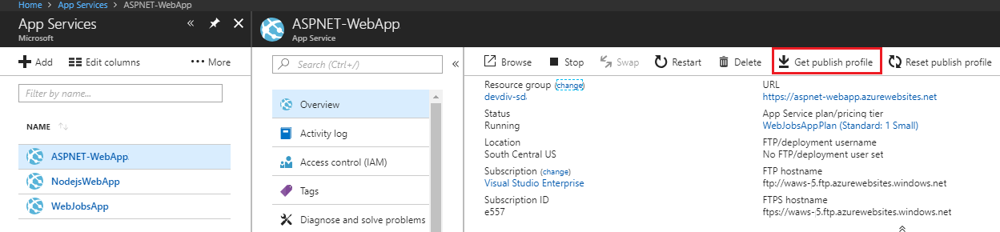

# Get publish settings from Azure and import into Visual Studio

You can use the **Publish** tool to import publish settings and then deploy your app. In this article, we use publish settings for Azure App Service.

These steps apply to ASP.NET and ASP.NET Core web apps. You can also import publish settings for [Python](../python/publishing-python-web-applications-to-azure-from-visual-studio.md) apps.

> [!NOTE]
> A publish settings file (*\*.publishsettings*) is different than a publishing profile (*\*.pubxml*) created in Visual Studio. A publish settings file is created by Azure App Service, and then it can be imported into Visual Studio.

## Prerequisites

::: moniker range=">=vs-2019"

* You must have Visual Studio 2019 installed and the **ASP.NET and web development** workload.

    If you haven't already installed Visual Studio, go to the [Visual Studio downloads](https://visualstudio.microsoft.com/downloads/) page to install it for free.
::: moniker-end

::: moniker range="vs-2017"

* You must have Visual Studio 2017 installed and the **ASP.NET and web development** workload.

    If you haven't already installed Visual Studio, go to the [Visual Studio downloads](https://visualstudio.microsoft.com/downloads/) page to install it for free.
::: moniker-end

* Create an Azure App Service. For detailed instructions, see [Deploy an ASP.NET Core web app to Azure using Visual Studio](/aspnet/core/tutorials/publish-to-azure-webapp-using-vs).

## Create a new ASP.NET project in Visual Studio

1. On the computer running Visual Studio, create a new project.

    Choose the correct template. In this example, choose either **ASP.NET Web Application (.NET Framework)** or (for C# only) **ASP.NET Core Web Application**, and then select **OK**.

    If you don't see the specified project templates, go to the **Open Visual Studio Installer** link in the left pane of the **New Project** dialog box. The Visual Studio Installer launches. Install the **ASP.NET and web development** workload.

    The project template you choose (ASP.NET or ASP.NET Core) must correspond to the version of ASP.NET installed on the web server.

1. Choose either **MVC** (.NET Framework) or **Web Application (Model-View-Controller)** (for .NET Core), and make sure that **No Authentication** is selected, and then select **OK**.

1. Type a name like **MyWebApp** and select **OK**.

    Visual Studio creates the project.

1. Choose **Build** > **Build Solution** to build the project.

## Create the publish settings file in Azure App Service

1. In the Azure portal, open the Azure App Service.

1. Go to **Get publish profile** and save the profile locally.

    

    A file with a *.publishsettings* file extension has been generated in the location where you saved it. The following code shows a partial example of the file (in a more readable formatting).

    ```xml
    <publishData>
      <publishProfile
        profileName="DeployASPDotNetCore - Web Deploy"
        publishMethod="MSDeploy"
        publishUrl="deployaspdotnetcore.scm.azurewebsites.net:443"
        msdeploySite="DeployASPDotNetCore"
        userName="$DeployASPDotNetCore"
        userPWD="abcdefghijklmnopqrstuzwxyz"
        destinationAppUrl="http://deployaspdotnetcore2021.azurewebsites.net"
        SQLServerDBConnectionString=""
        mySQLDBConnectionString=""
        hostingProviderForumLink=""
        controlPanelLink="http://windows.azure.com"
        webSystem="WebSites">
        <databases />
      </publishProfile>
    </publishData>
    ```

    Typically, the preceding *.publishsettings file contains two publishing profiles that you can use in Visual Studio, one to deploy using Web Deploy, and one to deploy using FTP. The preceding code shows the Web Deploy profile. Both profiles will be imported later when you import the profile.

## Import the publish settings in Visual Studio and deploy

[!INCLUDE [import publish settings](../deployment/includes/import-publish-settings-vs.md)]

## Next steps

In this tutorial, you created a publish settings file, imported it into Visual Studio, and deployed an ASP.NET app to Azure App Service. You may want an overview of publishing options in Visual Studio.

> [!div class="nextstepaction"]
> [First look at deployment](../deployment/deploying-applications-services-and-components.md)
