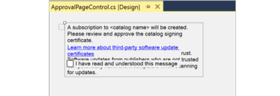

# Fix HDPI/scaling issues with Windows Forms Designer in Visual Studio 

In this article, you learn how to address rendering issues due to scaling limitations of the Windows Forms Designer on HDPI monitors by [running Visual Studio as a DPI-unaware process](#restart-visual-studio-as-a-dpi-unaware-process). HDPI stands for high dots per inch, with each dot representing a physical device pixel.

Higher pixel density creates sharper images, and display scaling sizes elements properly. Without proper scaling, user interface (UI) elements and text are too tiny to use effectively and can overlap. To help remedy this issue, Windows automatically scales the UI percentile to match the DPI setting. For example, a DPI setting of 100% represents 96 DPI and 125% is 120 DPI. Monitors used to ship with 96 pixels per inch, which Windows used as the baseline for 100% bitmap drawing. However, as display technology advanced, monitors now ship with panels of 300 DPI or higher.

When an application declares itself to be DPI-aware, it's a statement specifying that the app behaves well at higher DPI settings, and so Windows can apply autoscaling. Conversely, DPI-unaware applications render at a fixed DPI value of 96 pixels per inch, or 100%, and so autoscaling isn't applied.

## Windows Forms Designer is DPI-unaware

:::moniker range=">=vs-2022"

> [!NOTE]
> In Visual Studio 2022 version 17.8 or later, you can avoid the issues described in this article. Visual Studio 2022 version 17.8 provides support for DPI-unaware tabs within a DPI-aware application. See [Visual Studio DPI improvements](/dotnet/desktop/winforms/whats-new/net80#visual-studio-dpi-improvements). This lets you design Windows Forms for DPI-unaware contexts, without requiring you to run Visual Studio in DPI-unaware mode. To use this setting in a Windows Forms project, set the property `ForceDesignerDPIUnaware` to `true` in your project file:
>
>```xml
><PropertyGroup>
>   ...
>   <ForceDesignerDPIUnaware>true</ForceDesignerDPIUnaware>
></PropertyGroup>

:::moniker-end

By default, Visual Studio is a dots per inch (DPI)-aware application, which means the display scales automatically.  However, **Windows Forms Designer** is a DPI-unaware app, so it appears as a bitmap at 96 DPI. Without autoscaling support, issues and overlapping arises when opening forms on HDPI monitors, like in this image:



When you open a form in **Windows Forms Designer** on an HDPI monitor, Visual Studio displays an info bar that displays the monitor's current scaling percentage (for example, 150%/144 DPI), an option to restart Visual Studio at 100% scaling to match Windows Forms Designer, and further information.   Restarting at 100% scaling makes VS DPI-unaware, allowing for proper rendering without overlap.

:::image type="content" source="media/scaling-gold-bar-message-1.png" alt-text="Screenshot of the information bar in Visual Studio to restart in DPI-unaware mode.":::

> [!TIP]
> 1. If you closed the information bar and want to restart Visual Studio as DPI-unaware, [use the DevEnv.exe tool](#use-the-devenvexe-tool).
> 1. If you aren't working in the designer, you can ignore the information bar. You can also [disable notifications](#disable-notifications) so that the information bar doesn't continue to appear.

## Restart Visual Studio as a DPI-unaware process

The recommended solution to resolve these UI issues is to restart Visual Studio as a DPI-unaware process, which means that it restarts at 100% scaling (96 DPI). 

**To switch to DPI-unaware:**
- Select the "**Restart Visual Studio with 100% scaling**" option on the yellow information bar that appears when you open a form in **Windows Forms Designer**.

It's important to restart Visual Studio to return it to its default as a DPI-aware process when you're finished working in the **Windows Forms Designer**. 

**To return to DPI-aware:**
- Close and reopen Visual Studio to return to DPI-aware again. Alternatively, select the **Restart Visual Studio as a DPI-aware process** option in the information bar.

When Visual Studio runs as DPI-unaware, the designer layout issues are resolved, however fonts might appear blurry and issues can appear in other designers such as the XAML Designer. Visual Studio displays a different informational message when DPI-unaware that says "Visual Studio is running as a DPI-unaware process. WPF and XAML designers might not display correctly." 

::: moniker range="<=vs-2019"

> [!NOTE]
> - If you have undocked [tool windows](../ide/customizing-window-layouts-in-visual-studio.md#tool-and-document-windows) after you select the option to restart Visual Studio as a DPI-unaware process, the position of the tool windows might change.
> - If you use the default Visual Basic profile, or if you have the **Save new projects when created** option deselected in **Tools** > **Options** > **Projects and Solutions**, Visual Studio can't reopen your project when it restarts as a DPI-unaware process. However, you can open the project by selecting it under **File** > **Recent Projects and Solutions**.

::: moniker-end

::: moniker range=">=vs-2022"

> [!NOTE]
> - If you undock [tool windows](../ide/customizing-window-layouts-in-visual-studio.md#tool-and-document-windows) after you select the option to restart Visual Studio as a DPI-unaware process, the position of the tool windows might change.
> - The default Visual Basic profile doesn't reopen projects when Visual Studio restarts as a DPI-unaware process. Instead, access your project through **File** > **Recent Projects and Solutions**.

::: moniker-end

## Use Windows to set your display scaling to 100%

To avoid using Visual Studio to toggle display scaling, adjust scaling in Windows settings. For instance, in Windows 11, you can set scaling to 100% (96 DPI).

To do so, type **display settings** in the task bar search box, and then select **Change display settings**. In the **Settings** window, set **Change the size of text, apps, and other items** to **100%**.  Be aware that 100% scaling (96 DPI) can make the user interface too small for practical use.

## <a name="use-the-devenvexe-tool"></a>Disable scaling by using DevEnv command-line tool

To manage your display settings by using command-line tools rather than the UI (user interface) tools, use [DevEnv.exe](../ide/reference/devenv-command-line-switches.md). The `devenv.exe` command takes `/noscale` as a command-line parameter to run in 100% scaling mode. Here's how to use it:

1. Select **Tools** > **Command Line** > **Developer Command Prompt** from the Visual Studio menu bar.
1. Then, enter `devenv /noScale`.

## Other options

In addition to the aforementioned options, you can also try the following options:

- [Automatically scale in Windows Forms](/dotnet/framework/winforms/automatic-scaling-in-windows-forms)

- Select the option to [Optimize rendering for screens with different pixel densities (requires restart)](../ide/reference/general-environment-options-dialog-box.md#visual-experience)

- <a name="disable-notifications"></a>**Disable scaling notifications** in Visual Studio, for example,  if you aren't working in a designer. Here's how to disable notifications:

   :::moniker range="visualstudio"

   1. Open the **Tools** > **Options** pane and expand the **All Settings** > **Windows Forms Designer** > **General** section.

   1. Under **High DPI Support**, clear the **DPI scaling notifications** checkbox.

   :::moniker-end
   :::moniker range="<=vs-2022"

   1. Open the **Tools** > **Options** dialog and expand the **Windows Forms Designer** > **General** section.

   1. Under **High DPI Support**, set the **DPI scaling notifications** option to **False**.

   :::moniker-end

## Troubleshoot

If the DPI-awareness transition doesn't work in Visual Studio, ensure the `dpiAwareness` value is NOT present in the **HKEY_LOCAL_MACHINE\SOFTWARE\Microsoft\Windows NT\CurrentVersion\Image File Execution Options\devenv.exe** subkey in Registry Editor. Delete the value if it's present.
