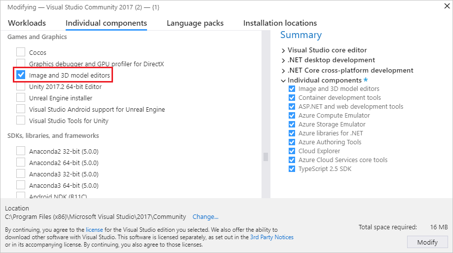

# Shader Designer

This document describes how to work with the Visual Studio **Shader Designer** to create, modify, and export custom visual effects that are known as *shaders*.

You can use **Shader Designer** to create custom visual effects for your game or app even if you don't know high-level shader language (HLSL) programming. To create a shader in **Shader Designer**, you lay it out as a graph. That is, you add to the design surface *nodes* that represent data and operations and then make connections between them to define how the operations process the data. At each operation node, a preview of the effect up to that point is provided so that you can visualize its result. Data flows through the nodes toward a final node that represents the output of the shader.

## Supported formats

The **Shader Designer** supports these shader formats:

|Format Name|File Extension|Supported Operations (View, Edit, Export)|
|-----------------| - | - |
|Directed Graph Shader Language|*.dgsl*|View, Edit|
|HLSL Shader (source code)|*.hlsl*|Export|
|HLSL Shader (bytecode)|*.cso*|Export|
|C++ header (HLSL bytecode array)|*.h*|Export|

## Get started

This section describes how to add a DGSL shader to your Visual Studio C++ project and provides basic information to help you get started.

> [!NOTE]
> Automatic build integration of graphics items like shader graphs (.dgsl files) is only supported for C++ projects.

### To add a DGSL shader to your project

1. Ensure you have the required Visual Studio component installed that you need to work with graphics. The component is called **Image and 3D model editors**.

   To install it, open Visual Studio Installer by selecting **Tools** > **Get Tools and Features** from the menu bar, and then select the **Individual components** tab. Select the **Image and 3D model editors** component under the **Games and Graphics** category, and then select **Modify**.

   

2. In **Solution Explorer**, open the shortcut menu for the C++ project to which you want to add the shader, and then choose **Add** > **New Item**.

3. In the **Add New Item** dialog box, under **Installed**, select **Graphics**, and then select **Visual Shader Graph (.dgsl)**.

   > [!NOTE]
   > If you don't see the **Graphics** category in the **Add New Item** dialog, and you have the **Image and 3D model editors** component installed, graphics items are not supported for your project type.

4. Specify the **Name** of the shader file, and the **Location** where you want it to be created.

5. Choose the **Add** button.

### The default shader

Each time that you create a DGSL shader, it begins as a minimal shader that has just a **Point Color** node that's connected to the **Final Color** node. Although this shader is complete and functional, it doesn't do much. Therefore, the first step in creating a working shader is often to delete the **Point Color** node or disconnect it from the **Final Color** node to make room for other nodes.

## Work with the Shader Designer

The following sections describe how to use the Shader Designer to work with custom shaders.

### Shader Designer toolbars

The Shader Designer toolbars contain commands that help you work with DGSL shader graphs.

Commands that affect the state of the Shader Designer are located on the **Shader Designer Mode** toolbar in the main Visual Studio window. Design tools and commands are located on the **Shader Designer** toolbar on the Shader Designer design surface.

Here's the **Shader Designer Mode** toolbar:

This table describes the items on the **Shader Designer Mode** toolbar, which are listed in the order in which they appear from left to right:

|Toolbar Item|Description|
|------------------|-----------------|
|**Select**|Enables interaction with nodes and edges in the graph. In this mode, you can select nodes and move or delete them, and you can establish edges or break them.|
|**Pan**|Enables movement of a shader graph relative to the window frame. To pan, select a point on the design surface and move it around.   In **Select** mode, you can press and hold **Ctrl** to activate **Pan** mode temporarily.|
|**Zoom**|Enables the display of more or less shader-graph detail relative to the window frame. In **Zoom** mode, select a point on the design surface and then move it right or down to zoom in, or left or up to zoom out.   In **Select** mode, you can press and hold **Ctrl** to zoom in or out by using the mouse wheel.|
|**Zoom to Fit**|Displays the full shader graph in the window frame.|
|**Real-Time Rendering Mode**|When real-time rendering is enabled, Visual Studio redraws the design surface, even when no user action is performed. This mode is useful when you work with shaders that change over time.|
|**Preview with sphere**|When enabled, a model of a sphere is used to preview the shader. Only one preview shape at a time can be enabled.|
|**Preview with cube**|When enabled, a model of a cube is used to preview the shader. Only one preview shape at a time can be enabled.|
|**Preview with Cylinder**|When enabled, a model of a cylinder is used to preview the shader. Only one preview shape at a time can be enabled.|
|**Preview with cone**|When enabled, a model of a cone is used to preview the shader. Only one preview shape at a time can be enabled.|
|**Preview with teapot**|When enabled, a model of a teapot is used to preview the shader. Only one preview shape at a time can be enabled.|
|**Preview with plane**|When enabled, a model of a plane is used to preview the shader. Only one preview shape at a time can be enabled.|
|**Toolbox**|Alternately shows or hides the **Toolbox**.|
|**Properties**|Alternatively shows or hides the **Properties** window.|
|**Advanced**|Contains advanced commands and options.   **Export**: Enables the export of a shader in several formats.   **Export As**: Exports the shader as either HLSL source code or as compiled shader bytecode. For more information about how to export shaders, see [How to: Export a shader](../designers/how-to-export-a-shader.md).   **Graphics Engines**: Enables the selection of the renderer that is used to display the design surface.   **Render with D3D11**: Uses Direct3D 11 to render the Shader Designer design surface.   **Render with D3D11WARP**: Uses Direct3D 11 Windows Advanced Rasterization Platform (WARP) to render the Shader Designer design surface.   **View**: Enables the selection of additional information about the Shader Designer.   **Frame Rate**: When enabled, displays the current frame rate in the upper-right corner of the design surface. The frame rate is the number of frames that are drawn per second. This option is useful when you enable the **Real-Time Rendering Mode** option.|

> [!TIP]
> You can choose the **Advanced** button to run the last command again.

### Work with nodes and connections

Use **Select** mode to add, remove, reposition, connect, and configure nodes. Here's how to perform these basic operations:

#### To perform basic operations in Select mode

- Here's how:

  - To add a node to the graph, select it in the **Toolbox** and then move it to the design surface.

  - To remove a node from the graph, select it and then press **Delete**.

  - To reposition a node, select it and then move it to a new location.

  - To connect two nodes, move an output terminal of one node to an input terminal of the other node. Only terminals that have compatible types can be connected. A line between the terminals shows the connection.

  - To remove a connection, on the shortcut menu for either one of the connected terminals, choose **Break Links**.

  - To configure the properties of a node, select the node, and then, in the **Properties** window, specify new values for the properties.

### Preview shaders

To help you understand how a shader will appear in your app, you can configure how your effect is previewed. To approximate your app, you can choose one of several shapes to render, configure textures and other material parameters, enable animation of time-based effects, and examine the preview from different angles.

#### Shapes

The Shader Designer includes six shapes—a sphere, a cube, a cylinder, a cone, a teapot, and a plane—that you can use to preview your shader. Depending on the shader, certain shapes might give you a better preview.

To choose a preview shape, on the **Shader Designer Modes** toolbar, choose the shape that you want.

#### Textures and material parameters

Many shaders rely on textures and material properties to produce a unique appearance for each kind of object in your app. To see what your shader will look like in your app, you can set the textures and material properties that are used to render the preview to match the textures and parameters that you might use in your app.

To bind a different texture to a texture register, or to modify other material parameters:

1. In **Select** mode, select an empty area of the design surface. This causes the **Properties** window to display the global shader properties.

2. In the **Properties** window, specify new values for the texture and parameter properties that you want to change.

The following table shows the shader parameters that you can modify:

|Parameter|Properties|
|---------------|----------------|
|**Texture 1** - **Texture 8**|**Access**:                             **Public** to allow the property to be set from the Model Editor; otherwise, **Private**.   **Filename**: The full path of the texture file that is associated with this texture register.|
|**Material Ambient**|**Access**:                             **Public** to allow the property to be set from the Model Editor; otherwise, **Private**.   **Value**: The diffuse color of the current pixel due to indirect - or ambient - lighting.|
|**Material Diffuse**|**Access**: **Public** to allow the property to be set from the Model Editor; otherwise, **Private**.   **Value**:  A color that describes how the current pixel diffuses direct lighting.|
|**Material Emissive**|**Access**:                              **Public** to allow the property to be set from the Model Editor; otherwise, **Private**.   **Value**: The color contribution of the current pixel due to self-provided lighting.|
|**Material Specular**|**Access**:                              **Public** to allow the property to be set from the Model Editor; otherwise, **Private**.   **Value**: A color that describes how the current pixel reflects direct lighting.|
|**Material Specular Power**|**Access**:                             **Public** to allow the property to be set from the Model Editor; otherwise, **Private**.   **Value**: The exponent that defines the intensity of specular highlights on the current pixel.|

#### Time-based effects

Some shaders have a time-based component that animates the effect. To show what the effect looks like in action, the preview has to be updated several times per second. By default, the preview is only updated when the shader is changed; to change this behavior so that you can view time-based effects, you have to enable real-time rendering.

To enable real-time rendering, on the Shader Designer toolbar, choose **Real time Rendering**.

#### Examine the effect

Many shaders are affected by variables such as viewing angle or directional lighting. To examine how the effect responds as these variables change, you can rotate the preview shape freely and observe how the shader behaves.

To rotate the shape, press and hold **Alt**, and then select any point on the design surface and move it.

### Export shaders

Before you can use a shader in your app, you have to export it in a format that DirectX understands.

You can export shaders as HLSL source code or as compiled shader bytecode. HLSL source code is exported to a text file that has an *.hlsl* file name extension. Shader bytecode can be exported either to a raw binary file that has a *.cso* file name extension, or to a C++ header (*.h*) file that encodes the shader bytecode into an array.

For more information about how to export shaders, see [How to: Export a shader](../designers/how-to-export-a-shader.md).

## Keyboard shortcuts

|Command|Keyboard shortcuts|
|-------------| - |
|Switch to **Select** mode|**Ctrl**+**G**, **Ctrl**+**Q**   **S**|
|Switch to **Zoom** mode|**Ctrl**+**G**, **Ctrl**+**Z**   **Z**|
|Switch to **Pan** mode|**Ctrl**+**G**, **Ctrl**+**P**   **K**|
|Select all|**Ctrl**+**A**|
|Delete the current selection|**Delete**|
|Cancel the current selection|**Escape** (**Esc**)|
|Zoom in|**Ctrl**+**Mouse wheel forward**   Plus Sign (**+**)|
|Zoom out|**Ctrl**+**Mouse wheel backward**   Minus Sign (**-**)|
|Pan the design surface up|**Mouse wheel backward**   **PageDown**|
|Pan the design surface down|**Mouse wheel forward**   **PageUp**|
|Pan the design surface left|**Shift**+**Mouse wheel backward**   **Mouse wheel left**   **Shift**+**PageDown**|
|Pan the design surface right|**Shift**+**Mouse wheel forward**   **Mouse wheel right**   **Shift**+**PageUp**|
|Move the keyboard focus to another node|The **Arrow** keys|
|Select the node that has keyboard focus (adds the node to the selection group)|**Shift**+**Spacebar**|
|Toggle selection of the node that has keyboard focus|**Ctrl**+**Spacebar**|
|Toggle current selection (if no nodes are selected, select the node that has keyboard focus)|**Spacebar**|
|Move the current selection up|**Shift**+**Up Arrow**|
|Move the current selection down|**Shift**+**Down Arrow**|
|Move the current selection left|**Shift**+**Left Arrow**|
|Move current selection right|**Shift**+**Right Arrow**.|

## Related topics

|Title|Description|
|-----------|-----------------|
|[Working with 3D assets for games and apps](../designers/working-with-3-d-assets-for-games-and-apps.md)|Provides an overview of the Visual Studio tools that you can use to work with textures and images, 3D models, and shader effects.|
|[Image Editor](../designers/image-editor.md)|Describes how to use the Visual Studio Image Editor to work with textures and images.|
|[Model Editor](../designers/model-editor.md)|Describes how to use the Visual Studio Model Editor to work with 3D models.|
