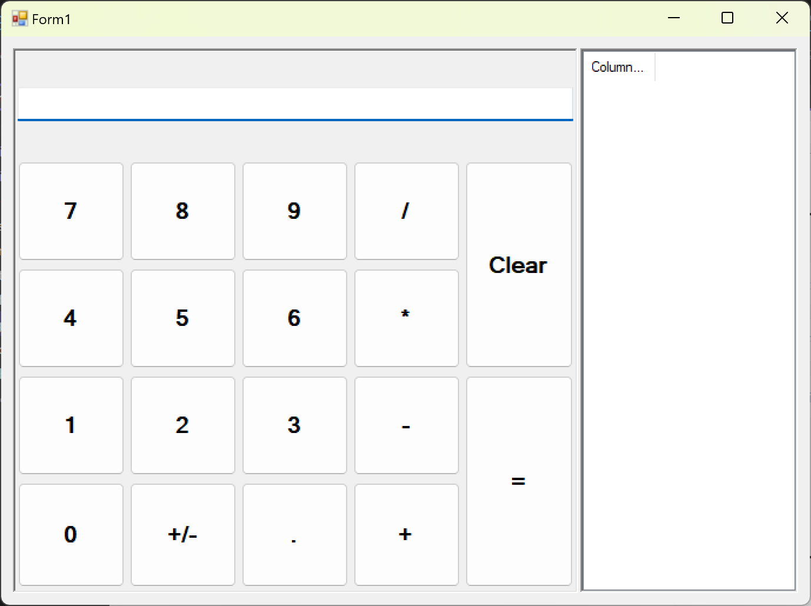
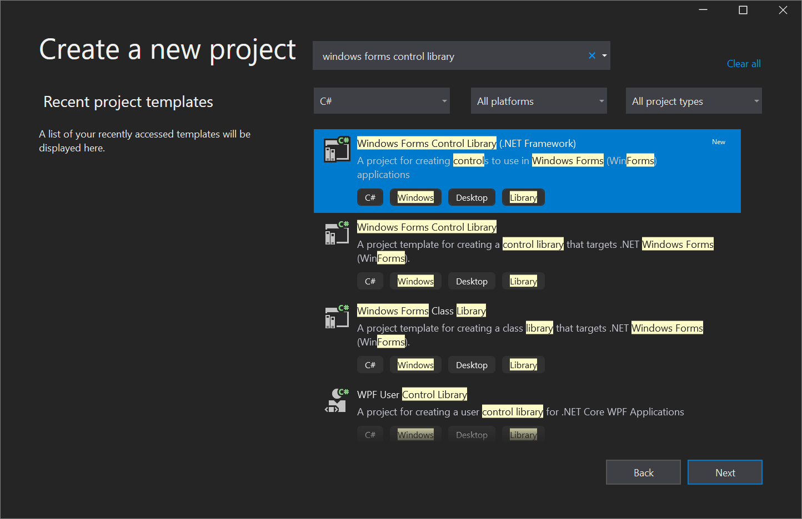

# Tutorial: Get started with Windows Forms Designer

The Windows Forms Designer provides many tools for building Windows Forms applications. This article illustrates how to build an app by using the various tools provided by the designer, including the following tasks:

- Arrange controls by using snaplines.
- Accomplish designer tasks by using smart tags.
- Set margins and padding for controls.
- Arrange controls by using a <xref:System.Windows.Forms.TableLayoutPanel> control.
- Partition your control’s layout by using a <xref:System.Windows.Forms.SplitContainer> control.
- Navigate your layout with the Document Outline window.
- Position controls with the size and location information display.
- Set property values by using the Properties window.

When you're finished, you'll have a custom control that's been assembled by using many of the layout features available in the Windows Forms Designer. This control implements the user interface (UI) for a simple calculator. The following image shows the general layout of the calculator control:

> [!TIP]
> If you're a C++ developer and are looking for a tutorial to help you create a Windows app that includes forms and controls, see [Creating a forms-based MFC application](/cpp/mfc/reference/creating-a-forms-based-mfc-application?view=msvc-170&preserve-view=true). For more generalized info, see [Overview of Windows programming in C++](/cpp/windows/overview-of-windows-programming-in-cpp?view=msvc-170&preserve-view=true).

## Create the custom control project

The first step is to create the DemoCalculator control project.

1. Open Visual Studio and create a new **Windows Forms Control Library** project by using the .NET Framework template for either C# or Visual Basic. Name the project **DemoCalculatorLib**.

   

1. To rename the file, in **Solution Explorer**, right-click **UserControl1.vb** or **UserControl1.cs**, select **Rename**, and change the file name to DemoCalculator.vb or DemoCalculator.cs. Select **Yes** when you're asked if you want to rename all references to the code element "UserControl1".

The Windows Forms Designer shows the designer surface for the DemoCalculator control. In this view, you can graphically design the appearance of the control by selecting controls and components from Toolbox and placing them on the designer surface. For more information about custom controls, see [Varieties of custom controls](/dotnet/framework/winforms/controls/varieties-of-custom-controls).

## Design the control layout

The DemoCalculator control contains several Windows Forms controls. In this procedure, you'll arrange the controls by using the Windows Forms Designer.

1. In the Windows Forms Designer, change the DemoCalculator control to a larger size by selecting the sizing handle in the lower-right corner and dragging it to resize. In the lower-right corner of Visual Studio, find the size and location information for controls. Set the size of the control to width 1000 and height 800 by watching the size information as you resize the control. You can also scroll down to the bottom of the **Properties** window, which is usually docked the lower right corner, and manually enter the values in the **Size** property.

1. In **Toolbox**, select the **Containers** node to open it. Select the **SplitContainer** control and drag it onto the designer surface.

   The `SplitContainer` is placed on the DemoCalculator control's designer surface.

    > [!TIP]
    > The `SplitContainer` control sizes itself to fit the size of the DemoCalculator control. Look at the **Properties** window to see the property settings for the `SplitContainer` control. Find the <xref:System.Windows.Forms.SplitContainer.Dock%2A> property. Its value is [DockStyle.Fill](xref:System.Windows.Forms.DockStyle.Fill), which means the `SplitContainer` control will always size itself to the boundaries of the DemoCalculator control. Resize the DemoCalculator control to verify this behavior.

1. In the **Properties** window, change the value of the <xref:System.Windows.Forms.SplitContainer.Dock%2A> property to `None`.

    The `SplitContainer` control shrinks to its default size and no longer follows the size of the DemoCalculator control.

1. Select the smart tag glyph () on the upper-right corner of the `SplitContainer` control. Select **Dock in Parent Container** to set the `Dock` property to `Fill`.

    The `SplitContainer` control docks to the DemoCalculator control's boundaries.

    > [!NOTE]
    > Several controls offer smart tags to facilitate design. For more information, see [Walkthrough: Perform common tasks by using Smart Tags on Windows Forms controls](/dotnet/framework/winforms/controls/performing-common-tasks-using-smart-tags-on-wf-controls).

1. Select the vertical border between the panels and drag it to the right, so that the left panel takes most of the space.

    The `SplitContainer` divides the DemoCalculator control into two panels with a movable border separating them. The panel on the left holds the calculator buttons and display, and the panel on the right shows a record of the arithmetic operations performed by the user.

1. In the **Properties** window, change the value of the `BorderStyle` property to `Fixed3D`.

1. In **Toolbox**, select the **Common Controls** node to open it. Select the `ListView` control and drag it into the right panel of the `SplitContainer` control.

1. Select the `ListView` control's smart tag glyph. In the smart tag panel, change the `View` setting to `Details`.

1. In the smart tag panel, select **Edit Columns**.

   The **ColumnHeader Collection Editor** dialog box opens.

1. In the **ColumnHeader Collection Editor** dialog box, select **Add** to add a column to the `ListView` control. Change the value of the column's `Text` property to **History**. Select **OK** to create the column.

1. In the smart tag panel, select **Dock in Parent Container**, and then select the smart tag glyph to close the smart tag panel.

1. From the **Containers** node **Toolbox**, drag a `TableLayoutPanel` control into the left panel of the `SplitContainer` control.

    The `TableLayoutPanel` control appears on the designer surface with its smart tag panel open. The `TableLayoutPanel` control arranges its child controls in a grid. The `TableLayoutPanel` control holds the DemoCalculator control's display and buttons. For more information, see [Walkthrough: Arrange controls by using a TableLayoutPanel](/dotnet/framework/winforms/controls/walkthrough-arranging-controls-on-windows-forms-using-a-tablelayoutpanel).

1. Select **Edit Rows and Columns** on the smart tag panel.

    The **Column and Row Styles** dialog box opens.

1. Select the **Add** button until five columns are displayed. Select all five columns, and then select **Percent** in the **Size Type** box. Set the **Percent** value to **20**. This action sets each column to the same width.

1. Under **Show**, select **Rows**.

1. Select **Add** until five rows are displayed. Select all five rows, and the select **Percent** in the **Size Type** box. Set the **Percent** value to **20**. This action sets each row to the same height.

1. Select **OK** to accept your changes, and then select the smart tag glyph to close the smart tag panel.

1. In the **Properties** window, change the value of the `Dock` property to `Fill`.

## Populate the control

Now that the layout of the control is set up, you can populate the DemoCalculator control with buttons and a display.

1. In **Toolbox**, select the `TextBox` control icon.

   A `TextBox` control is placed in the first cell of the `TableLayoutPanel` control.

1. In the **Properties** window, change the value of the `TextBox` control's ColumnSpan property to **5**.

   The `TextBox` control moves to a position that is centered in its row.

1. Change the value of the `TextBox` control's `Anchor` property to `Left`, `Right`.

   The `TextBox` control expands horizontally to span all five columns.

1. Change the value of the `TextBox` control's `TextAlign` property to `Right`.

1. In the **Properties** window, expand the `Font` property node. Set `Size` to **14**, and set `Bold` to **true** for the `TextBox` control.

1. Select the `TableLayoutPanel` control.

1. In **Toolbox**, select the `Button` icon.

   A `Button` control is placed in the next open cell of the `TableLayoutPanel` control.

1. In **Toolbox**, select the `Button` icon four more times to populate the second row of the `TableLayoutPanel` control.

1. Select all five `Button` controls by selecting them while holding down the **Shift** key. Press **Ctrl**+**C** to copy the `Button` controls to the clipboard.

1. Press **Ctrl**+**V** three times to paste copies of the `Button` controls into the remaining rows of the `TableLayoutPanel` control.

1. Select all 20 `Button` controls by selecting them while holding down the **Shift** key.

1. In the **Properties** window, change the value of the `Dock` property to `Fill`.

    All the `Button` controls dock to fill their containing cells.

1. In the **Properties** window, expand the `Margin` property node. Set the value of `All` to **5**.

    All the `Button` controls are sized smaller to create a larger margin between them.

1. Select **button10** and **button20**, and then press **Delete** to remove them from the layout.

1. Select **button5** and **button15**, and then change the value of their `RowSpan` property to **2**. These buttons represent the **Clear** and **=** buttons for the DemoCalculator control.

## Use the Document Outline window

When your control or form is populated with several controls, you may find it easier to navigate your layout with the Document Outline window.

1. On the menu bar, choose **View** > **Other Windows** > **Document Outline**. Or, on the keyboard, press **Ctrl**+**Alt**+**T**.

   The Document Outline window shows a tree view of the DemoCalculator control and its constituent controls. Container controls like the `SplitContainer` show their child controls as subnodes in the tree. You can also rename controls in place by using the Document Outline window.

1. In the **Document Outline** window, right-click **button1**, and then select **Rename** (keyboard: **F2**). Change its name to sevenButton.

1. Using the **Document Outline** window, rename the `Button` controls from the designer-generated name to the production name according to the following list:

   - button1 to **sevenButton**

   - button2 to **eightButton**

   - button3 to **nineButton**

   - button4 to **divisionButton**

   - button5 to **clearButton**

   - button6 to **fourButton**

   - button7 to **fiveButton**

   - button8 to **sixButton**

   - button9 to **multiplicationButton**

   - button11 to **oneButton**

   - button12 to **twoButton**

   - button13 to **threeButton**

   - button14 to **subtractionButton**

   - button15 to **equalsButton**

   - button16 to **zeroButton**

   - button17 to **changeSignButton**

   - button18 to **decimalButton**

   - button19 to **additionButton**

1. Using the **Document Outline** and **Properties** windows, change the `Text` property value for each `Button` control name according to the following list:

   - Change the sevenButton control text property to **7**

   - Change the eightButton control text property to **8**

   - Change the nineButton control text property to **9**

   - Change the divisionButton control text property to **/** (forward slash)

   - Change the clearButton control text property to **Clear**

   - Change the fourButton control text property to **4**

   - Change the fiveButton control text property to **5**

   - Change the sixButton control text property to **6**

   - Change the multiplicationButton control text property to **\*** (asterisk)

   - Change the oneButton control text property to **1**

   - Change the twoButton control text property to **2**

   - Change the threeButton control text property to **3**

   - Change the subtractionButton control text property to **-** (hyphen)

   - Change the equalsButton control text property to **=** (equals sign)

   - Change the zeroButton control text property to **0**

   - Change the changeSignButton control text property to **+/-**

   - Change the decimalButton control text property to **.** (period)

   - Change the additionButton control text property to **+** (plus sign)

1. On the designer surface, select all the `Button` controls by selecting them while holding down the **Shift** key.

1. In the **Properties** window, expand the `Font` property node. Set `Size` to **14**, and set `Bold` to **true** for all the `Button` controls.

This set of instructions completes the design of the DemoCalculator control. All that remains is to provide the calculator logic.

## Implement event handlers

The buttons on the DemoCalculator control have event handlers that can be used to implement much of the calculator logic. The Windows Forms Designer enables you to implement the stubs of all the event handlers for all the buttons with one selection.

1. On the designer surface, select all the `Button` controls by selecting them while holding down the **Shift** key.

1. Select one of the `Button` controls.

   The Code Editor opens to the event handlers generated by the designer.

Since this tutorial is focused on the designer, we omit the implementation details of the calculator functionality.

## Test the control

Because the DemoCalculator control inherits from the <xref:System.Windows.Forms.UserControl> class, you can test its behavior with the **UserControl Test Container**. For more information, see [How to: Test the run-time behavior of a UserControl](/dotnet/framework/winforms/controls/how-to-test-the-run-time-behavior-of-a-usercontrol).

1. Press **F5** to build and run the DemoCalculator control in the **UserControl Test Container**.

1. Select the border between the `SplitContainer` panels and drag it left and right. The `TableLayoutPanel` and all its child controls resize themselves to fit in the available space.

1. When you're finished testing the control, select **Close**.

## Use the control on a form

The DemoCalculator control can be used in other composite controls or on a form. The following procedure describes how to use it.

### Create the project

The first step is to create the application project. You'll use this project to build the application that shows your custom control.

1. Add a new **Windows Forms App (.NET Framework)** project to the existing solution and name it **DemoCalculatorTest**.

1. In **Solution Explorer**, right-click the **DemoCalculatorTest** project, and then select **Add** > **Reference** to open the **Reference Manager** dialog box.

1. Go to the **Projects** tab, and then select the DemoCalculatorLib project to add the reference to the test project.

1. In **Solution Explorer**, right-click **DemoCalculatorTest**, and then select **Set as StartUp Project**.

1. In the Windows Forms Designer, increase the size of the form to about **1400 x 1000**.

### Use the control in the form's layout

To use the DemoCalculator control in an application, you need to place it on a form.

1. In **Toolbox**, expand the **DemoCalculatorLib Components** node.

1. Drag the **DemoCalculator** control from **Toolbox** onto your form. Move the control to the upper-left corner of the form. When the control is close to the form's borders, *snaplines* appears. Snaplines indicate the distance of the form's `Padding` property and the control's `Margin` property. Position the control at the location indicated by the snaplines.

   For more information, see [Walkthrough: Arrange controls by using snaplines](/dotnet/framework/winforms/controls/walkthrough-arranging-controls-on-windows-forms-using-snaplines).

1. Drag a `Button` control from **Toolbox** and drop it onto the form.

1. Move the `Button` control around the DemoCalculator control and observe where the snaplines appear. You can align your controls precisely and easily by using this feature. Delete the `Button` control when you're finished.

1. Right-click the DemoCalculator control, and then select **Properties**.

1. Change the value of the `Dock` property to `Fill`.

1. Select the form, and then expand the `Padding` property node. Change the value of **All** to **20**.

   The size of the DemoCalculator control is reduced to accommodate the new `Padding` value of the form.

1. Resize the form by dragging the various sizing handles to different positions. Observe how the DemoCalculator control is resized to fit.

## Next steps

This article has demonstrated how to construct the user interface for a simple calculator. To continue, you can extend its functionality by implementing the calculator logic, then [publish the app by using ClickOnce](../deployment/how-to-publish-a-clickonce-application-using-the-publish-wizard.md). Or, continue on to a different tutorial where you [create a picture viewer by using Windows Forms](../ide/tutorial-windows-forms-picture-viewer-layout.md).

## See also

- [Windows Forms controls](/dotnet/framework/winforms/controls/)
- [Accessibility for Windows Forms controls](/dotnet/framework/winforms/controls/providing-accessibility-information-for-controls-on-a-windows-form)
- [Publish by using ClickOnce](../deployment/how-to-publish-a-clickonce-application-using-the-publish-wizard.md)
