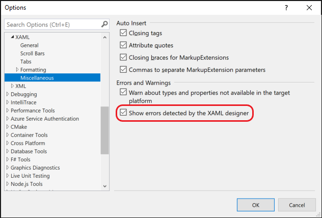

# XAML Errors and Warnings

When authoring XAML, Visual Studio analyzes the code as you type. A squiggle appears on a line of code when an error is detected. Hovering over the squiggle gives you more information about the error or warning. For some errors/warnings, a Quick Action lightbulb is displayed, and using the `ctrl+.` keyboard shortcut displays the options to fix the issue.

## Error types

Behind the scene, multiple tools analyze the XAML in parallel. XAML errors are categorized into the three types based on the tool that detected the error.

|**Error detected by**|**Error code format**|  
|--------------------------------|-----------------|  
|XAML Language Service (XAML editor)|XLSxxxx|  
|XAML Designer|XDGxxxx|  
|XAML Edit and Continue|XECxxxx|  

> [!Note]
> Not all errors/warnings have a corresponding code. Such errors are usually XAML Designer errors.

## Suppress XAML Designer errors

Open **Tools > Options** and navigate to **Text Editor > XAML > Miscellaneous**.

Uncheck the **Show errors detected by the XAML designer** check box.

