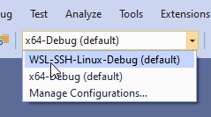

# OpenCV

> [!IMPORTANT]
> As of April 12th 2021, connecting to GitHub Codespaces from Visual Studio 2019 will no longer be supported and this private preview has concluded. We’re focused on evolving experiences for a cloud-powered inner loop and VDI solutions optimized for a broad set of Visual Studio workloads. As part of this `devinit` and associated tools will no longer be available. We encourage you to be involved in our developer community forum for Visual Studio for information on future previews and roadmap information.

This example illustrates how to customize [GitHub Codespaces](https://github.com/features/codespaces) in order to develop with multi-platform projects such as [opencv/OpenCV](https://github.com/opencv/opencv).

The following customizations are already applied on the fork [microsoft/OpenCV](https://github.com/microsoft/opencv) and allow to build targeting either Windows and Ubuntu.

## Customization with devcontainer.json and devinit.json

The `.devcontainer` directory needs to contain the following files:

* devcontainer.json
* devinit.json

### devcontainer.json

The following is the content of the _devcontainer.json_ file.

```json
{
  "postCreateCommand": "devinit init"
}
```

The `postCreateCommand` launches the  [devinit](devinit-and-codespaces.md) tool, which consumes _devinit.json_.

### devinit.json

The following is the content of the [_devinit.json_](devinit-json.md) file.

```json
{
    "run": [
        {
            "comments": "Example that will install Ubuntu 20.04 using WSL2, and configure it with various packages useful for C++ development.",
            "tool": "wsl-install",
            "input": "https://aka.ms/wslubuntu2004",
            "additionalOptions": "--wsl-version 2 --post-create-command 'apt-get update && apt-get install g++ gcc g++-9 gcc-9 cmake gdb ninja-build zip rsync -y'"
        }
    ]
}
```

The _devinit.json_ is the file consumed by the [devinit](devinit-and-codespaces.md) tool and it must be in the same directory of _devcontainer.json_.

In this sample, the [wsl-install](tool-wsl-install.md) tool is used to create a WSL instance running Ubuntu 20.04, and provisioning it with essential C++ development tools.
## Targeting Windows or Linux

A default build configuration targeting Windows is always created named `x64-Debug`.

By adding the above mentioned files, upon Codespace instance creation, Visual Studio provisions a new SSH connection in the [Connection Manager](/cpp/linux/connect-to-your-remote-linux-computer), and creates a new configuration in the Configuration picker that targets the Ubuntu instance via the SSH connection.

.

By selecting the highlighted configuration that targets WSL, it's possible to build and debug the OpenCV's build targets.
