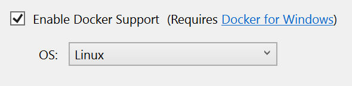

# Quickstart: Visual Studio Tools for Docker

With Visual Studio 2017, you can easily build, debug, and run containerized ASP.NET Core apps and publish them to Azure Container Registry.

[View or download sample code](https://github.com/aspnet/Docs/tree/master/aspnetcore/host-and-deploy/docker/visual-studio-tools-for-docker/samples) ([how to download](xref:index#how-to-download-a-sample))

## Prerequisites

* [Docker for Windows](https://docs.docker.com/docker-for-windows/install/)
* [Visual Studio 2017](https://www.visualstudio.com/) with the **.NET Core cross-platform development** workload
* [ASP.NET Core 2.1 Tools](https://dotnet.microsoft.com/download/dotnet-core/2.1)

## Installation and setup

For Docker installation, first review the information at [Docker for Windows: What to know before you install](https://docs.docker.com/docker-for-windows/install/#what-to-know-before-you-install). Next, install [Docker For Windows](https://docs.docker.com/docker-for-windows/install/).

**[Shared Drives](https://docs.docker.com/docker-for-windows/#shared-drives)** in Docker for Windows must be configured to support volume mapping and debugging. Right-click the System Tray's Docker icon, select **Settings**, and select **Shared Drives**. Select the drive where Docker stores files. Click **Apply**.


> [!TIP]
> Visual Studio 2017 versions 15.6 and later prompt when **Shared Drives** aren't configured.

## Add a project to a Docker container

1. From the Visual Studio menu, select **File > New > Project**.
1. Under the **Templates** section of the **New Project** dialog box, select **Visual C# > Web**.
1. Select **ASP.NET Core Web Application**.
1. Give your new application a name (or take the default) and select **OK**.
1. Select **Web Application**.
1. Check the **Enable Docker Support** checkbox.

   

1. Select the type of container you want (Windows or Linux) and click **OK**.

   When adding Docker support to a project, choose either a Windows or a Linux container. The Docker host must be running the same container type. To change the container type in the running Docker instance, right-click the System Tray's Docker icon and choose **Switch to Windows containers...** or **Switch to Linux containers...**.

## Dockerfile overview

A *Dockerfile*, the recipe for creating a final Docker image, is created in the project. Refer to [Dockerfile reference](https://docs.docker.com/engine/reference/builder/) for an understanding of the commands within it.:

```
FROM microsoft/dotnet:2.1-aspnetcore-runtime AS base
WORKDIR /app
EXPOSE 59518
EXPOSE 44364

FROM microsoft/dotnet:2.1-sdk AS build
WORKDIR /src
COPY HelloDockerTools/HelloDockerTools.csproj HelloDockerTools/
RUN dotnet restore HelloDockerTools/HelloDockerTools.csproj
COPY . .
WORKDIR /src/HelloDockerTools
RUN dotnet build HelloDockerTools.csproj -c Release -o /app

FROM build AS publish
RUN dotnet publish HelloDockerTools.csproj -c Release -o /app

FROM base AS final
WORKDIR /app
COPY --from=publish /app .
ENTRYPOINT ["dotnet", "HelloDockerTools.dll"]
```

The preceding *Dockerfile* is based on the [microsoft/aspnetcore](https://hub.docker.com/r/microsoft/aspnetcore/) image, and includes instructions for modifying the base image by building your project and adding it to the container. This base image includes the ASP.NET Core NuGet packages, which are just-in-time (JIT) compiled to improve startup performance.

When the new project dialog's **Configure for HTTPS** check box is checked, the *Dockerfile* exposes two ports. One port is used for HTTP traffic; the other port is used for HTTPS. If the check box isn't checked, a single port (80) is exposed for HTTP traffic.

## Debug

Select **Docker** from the debug drop-down in the toolbar, and start debugging the app. The **Docker** view of the **Output** window shows the following actions taking place:

* The *2.1-aspnetcore-runtime* tag of the *microsoft/dotnet* runtime image is acquired (if not already in the cache). The image installs the ASP.NET Core and .NET Core runtimes and associated libraries. It's optimized for running ASP.NET Core apps in production.
* The `ASPNETCORE_ENVIRONMENT` environment variable is set to `Development` within the container.
* Two dynamically assigned ports are exposed: one for HTTP and one for HTTPS. The port assigned to localhost can be queried with the `docker ps` command.
* The app is copied to the container.
* The default browser is launched with the debugger attached to the container using the dynamically assigned port.

The resulting Docker image of the app is tagged as *dev*. The image is based on the *2.1-aspnetcore-runtime* tag of the *microsoft/dotnet* base image. Run the `docker images` command in the **Package Manager Console** (PMC) window. The images on the machine are displayed:

```console
REPOSITORY        TAG                     IMAGE ID      CREATED         SIZE
hellodockertools  dev                     d72ce0f1dfe7  30 seconds ago  255MB
microsoft/dotnet  2.1-aspnetcore-runtime  fcc3887985bb  6 days ago      255MB
```

> [!NOTE]
> The *dev* image lacks the app contents, as **Debug** configurations use volume mounting to provide the iterative experience. To push an image, use the **Release** configuration.

Run the `docker ps` command in PMC. Notice the app is running using the container:

```console
CONTAINER ID        IMAGE                  COMMAND                   CREATED             STATUS              PORTS                   NAMES
baf9a678c88d        hellodockertools:dev   "C:\\remote_debugge..."   21 seconds ago      Up 19 seconds       0.0.0.0:37630->80/tcp   dockercompose4642749010770307127_hellodockertools_1
```

## Edit and continue

Changes to static files and Razor views are automatically updated without the need for a compilation step. Make the change, save, and refresh the browser to view the update.

Code file modifications require compilation and a restart of Kestrel within the container. After making the change, use `CTRL+F5` to perform the process and start the app within the container. The Docker container isn't rebuilt or stopped. Run the `docker ps` command in PMC. Notice the original container is still running as of 10 minutes ago:

```console
CONTAINER ID        IMAGE                  COMMAND                   CREATED             STATUS              PORTS                   NAMES
baf9a678c88d        hellodockertools:dev   "C:\\remote_debugge..."   10 minutes ago      Up 10 minutes       0.0.0.0:37630->80/tcp   dockercompose4642749010770307127_hellodockertools_1
```

## Publish Docker images

Once the develop and debug cycle of the app is completed, the Visual Studio Tools for Docker assist in creating the production image of the app.

1. Change the configuration drop-down to **Release** and build the app. 
1. Right-click your project in **Solution Explorer** and choose **Publish**.
1. On the publish target dialog, select the **Container Registry** tab.
1. Choose **New Azure Container Registry** and click **Publish**.
1. Fill in your desired values in the **Create a new Azure Container Registry**.

    | Setting      | Suggested value  | Description                                |
    | ------------ |  ------- | -------------------------------------------------- |
    | **DNS Prefix** | Globally unique name | Name that uniquely identifies your container registry. |
    | **Subscription** | Choose your subscription | The Azure subscription to use. |
    | **[Resource Group](/azure/azure-resource-manager/resource-group-overview)** | myResourceGroup |  Name of the resource group in which to create your container registry. Choose **New** to create a new resource group.|
    | **[SKU](https://docs.microsoft.com/azure/container-registry/container-registry-skus)** | Standard | Service tier of the container registry  |
    | **Registry Location** | A location close to you | Choose a Location in a [region](https://azure.microsoft.com/regions/) near you or near other services that will use your container registry. |

    ![Visual Studio's create Azure Container Registry dialog][0]

1. Click **Create**

You can now pull the container from the registry to any host capable of running Docker images, for example [Azure Container Instances](/azure/container-instances/container-instances-tutorial-deploy-app).

## Additional resources

* [Container development with Visual Studio](/visualstudio/containers)
* [Azure Service Fabric: Prepare your development environment](/azure/service-fabric/service-fabric-get-started)
* [Deploy a .NET app in a Windows container to Azure Service Fabric](/azure/service-fabric/service-fabric-host-app-in-a-container)
* [Troubleshoot Visual Studio 2017 development with Docker](/azure/vs-azure-tools-docker-troubleshooting-docker-errors)
* [Visual Studio Tools for Docker GitHub repository](https://github.com/Microsoft/DockerTools)


[0]:media/vs-azure-tools-docker-hosting-web-apps-in-docker/vs-acr-provisioning-dialog.png
