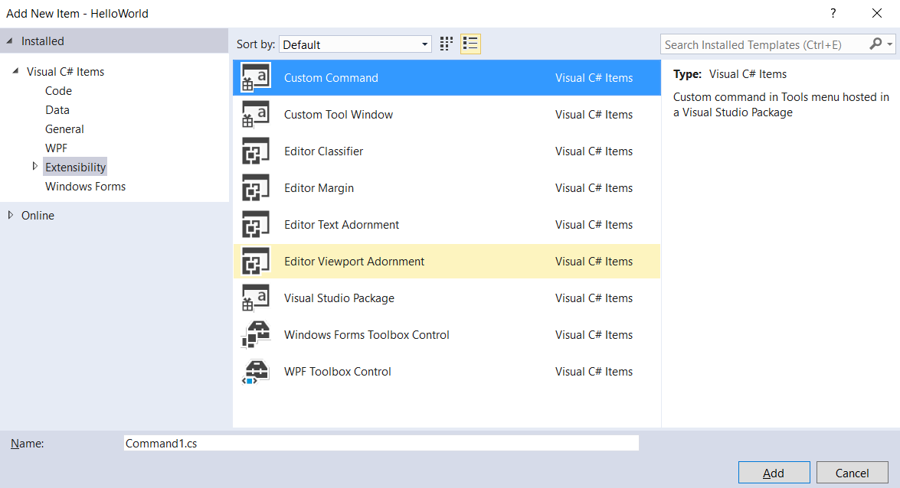

# Creating your First Extension: Hello World

This Hello World example walks you through creating your first extension for Visual Studio. This tutorial will show you how to add a new command to Visual Studio.

In the process, you will learn how to:

* **[Create an extensibility project](#create-an-extensibility-project)**
* **[Add a custom command](#add-a-custom-command)**
* **[Modify the source code](#modify-the-source-code)**
* **[Run it](#run-it)**

For this example, you'll use Visual C# to add a custom menu button named "Say Hello World!" that looks like this:


## Prerequisites

Before you start, make sure you have installed the **Visual Studio extension development** workload which includes the VSIX template you'll need and sample code.

Note: You can use any version of Visual Studio (Community, Professional, or Enterprise) to create a Visual Studio Extensibility project.

## Create an extensibility project

Step 1. From the **File** menu, click **New Project**. At the bottom of the screen, you can enter the name of your project.

Step 2. From the **Templates** menu, click **Visual C#**, click **Extensibility**, and then click **VSIX Project**.


You should now see the Getting Started page and some sample resources.

If you need to leave this tutorial and come back to it, you can find your new HelloWorld project on the **Start Page** in the **Recent** section.

## Add a custom command

Step 1. If you select the manifest, you can see what options are changeable, for instance, metadata, description, and version.

Step 2. Right-click the project (not the solution). On the context menu, click **Add**, and then click **User Control**.

Step 3. Go back to the **Extensibility** section, and then click **Custom Command**.

Step 4. In the **Name** field at the bottom, give it a name, for instance Command.cs.



Your new command will be listed in the **Solution Explorer** under the **Resources** branch. This is also where you'll find other files related to your command, such as the PNG and ICO files if you wish to modify the image.

## Modify the source code

At this point, the Button you're adding is pretty generic. You'll have to modify the VSCT file and CS file if you want to make changes.

* The VSCT file is where you can rename your commands, as well as define where they go in the Visual Studio command system. As you explore the VSCT file, you will notice a lot of commented code that explains what each section of code controls.

* The CS file is where you can define actions, such as the click handler.

Step 1. In **Solution Explorer**, find the VSCT file for your new command. In this case, it will be called CommandPackage.vsct.


Step 2. Change the `ButtonText` parameter to "Say Hello World!"

```xml
  ...
  <Button guid="guidCommandPackageCmdSet" id="CommandId" priority="0x0100" type="Button">
     <Parent guid="guidCommandPackageCmdSet" id="MyMenuGroup" />
     <Icon guid="guidImages" id="bmpPic1" />
     <Strings>
        <ButtonText>Say Hello World!</ButtonText>
     </Strings>
  </Button>
  ...
```

Step 3. Go back to **Solution Explorer** and find the Command.cs file. Change the string `message` for the command `string.Format(..)` to "Hello World!"

```csharp
  ...
  private void MenuItemCallback(object sender, EventArgs e)
  {
    string message = "Hello World!";
    string title = "Command1";

    // Show a message box to prove we were here
    VsShellUtilities.ShowMessageBox(
        this.ServiceProvider,
        message,
        title,
        OLEMSGICON.OLEMSGICON_INFO,
        OLEMSGBUTTON.OLEMSGBUTTON_OK,
        OLEMSGDEFBUTTON.OLEMSGDEFBUTTON_FIRST);
  }
  ...
```

Make sure to save your changes to each file.

## Run it

You can now run the source code in the Visual Studio Experimental Instance.

Step 1. Click **Start** in the Toolbar. This will build your project and start the debugger, launching a new instance of Visual Studio called the **Experimental Instance**.

You will see the words "Experimental Instance" in the Visual Studio title bar.


Step 2. On the **Tools** menu of the **Experimental Instance**, click **Say Hello World!**.


You should see the output from your new custom command, in this case the dialog in the center of the screen that gives you the "Hello World!" message.

## Next steps

Now that you know the basics of working with Visual Studio Extensibility, here's where you can learn more:

* [Starting to Develop Visual Studio Extensions](starting-to-develop-visual-studio-extensions.md) - Samples, tutorials. and publishing your extension.
* [What's New in the Visual Studio 2017 SDK](what-s-new-in-the-visual-studio-2017-sdk.md) -New extensibility features in Visual Studio 2017
* [Inside the Visual Studio SDK](internals/inside-the-visual-studio-sdk.md) - Learn the details of Visual Studio Extensibility