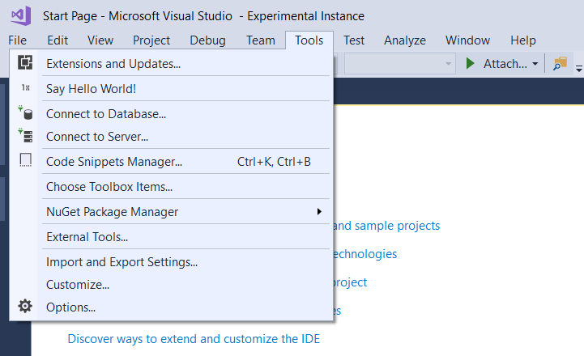
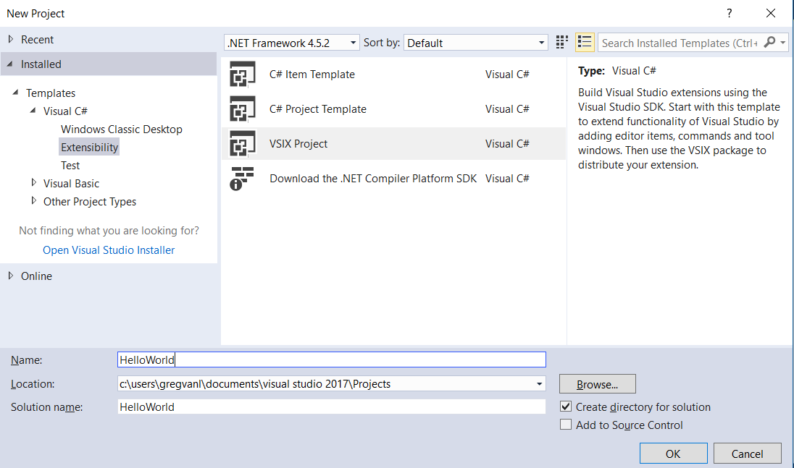
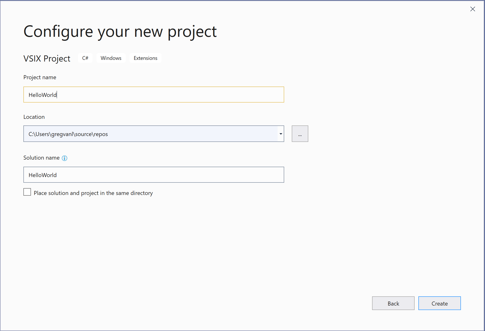
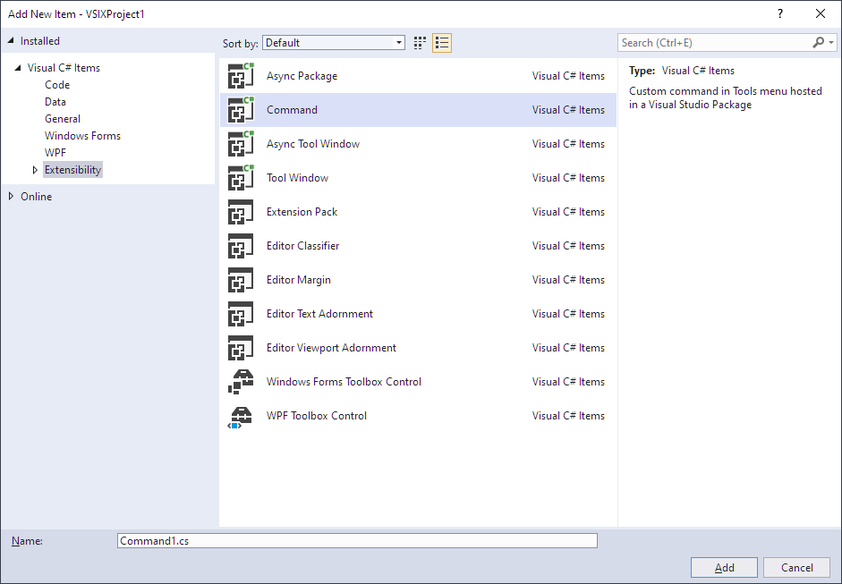
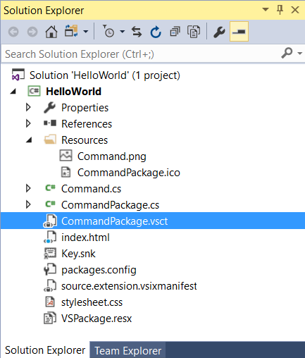
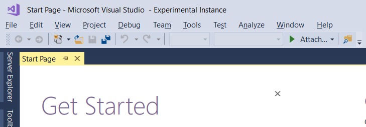
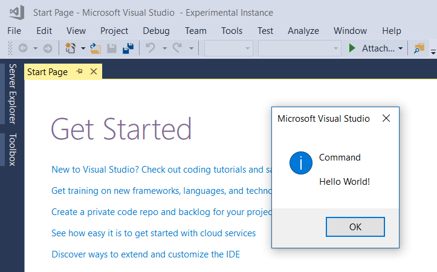

# Create your first extension: Hello World

This Hello World example walks you through creating your first extension for Visual Studio. This tutorial shows you how to add a new command to Visual Studio.

In the process, you will learn how to:

* **[Create an extensibility project](#create-an-extensibility-project)**
* **[Add a custom command](#add-a-custom-command)**
* **[Modify the source code](#modify-the-source-code)**
* **[Run it](#run-it)**

For this example, you'll use Visual C# to add a custom menu button named "Say Hello World!" that looks like this:



> [!NOTE]
> This article applies to Visual Studio on Windows. For Visual Studio for Mac, see [Extensibility walkthrough in Visual Studio for Mac](/visualstudio/mac/extending-visual-studio-mac-walkthrough).

## Prerequisites

Before you start, make sure you have installed the **Visual Studio extension development** workload, which includes the VSIX template you'll need and sample code.

> [!NOTE]
> You can use any edition of Visual Studio (Community, Professional, or Enterprise) to create a Visual Studio extensibility project.

## Create an extensibility project

::: moniker range="vs-2017"

Step 1. From the **File** menu, select **New** > **Project**.

Step 2. In the search box in the upper right, type "vsix" and select the Visual C# **VSIX Project**. Enter "HelloWorld" for the **Name** at the bottom of the dialog and select **OK**.



You should now see the Getting Started page and some sample resources.

If you need to leave this tutorial and come back to it, you can find your new HelloWorld project on the **Start Page** in the **Recent** section.

::: moniker-end

::: moniker range=">=vs-2019"

Step 1. From the **File** menu, select **New** > **Project**. Search for "vsix" and select the Visual C# **VSIX Project** and then **Next**.

Step 2. Enter "HelloWorld" for the **Project name** and select **Create**.



You should now see the HelloWorld project in **Solution Explorer**.

::: moniker-end

## Add a custom command

Step 1. If you select the *.vsixmanifest* manifest file, you can see what options are changeable, such as description, author, and version.

Step 2. Right-click the project (not the solution). On the context menu, select **Add**, and then **New Item**.

Step 3. Select the **Extensibility** section, and then choose **Command**.

Step 4. In the **Name** field at the bottom, enter a filename such as *Command.cs*.



Your new command file is visible in **Solution Explorer**. Under the **Resources** node, you'll find other files related to your command. For example, if you wish to modify the image, the PNG file is here.

## Modify the source code

At this point, the command and Button text are autogenerated and not very interesting. You can modify the VSCT file and CS file if you want to make changes.

* The VSCT file is where you can rename your commands, as well as define where they go in the Visual Studio command system. As you explore the VSCT file, you will notice comments that explain what each section of the VSCT code controls.

* The CS file is where you can define actions, such as the click handler.

::: moniker range="vs-2017"

Step 1. In **Solution Explorer**, find the VSCT file for your new command. In this case, it will be called *CommandPackage.vsct*.



::: moniker-end

::: moniker range=">=vs-2019"

Step 1. In **Solution Explorer**, find the VSCT file for your extension VS package. In this case, it will be called *HelloWorldPackage.vsct*.

::: moniker-end

Step 2. Change the `ButtonText` parameter to `Say Hello World!`.

```xml
  ...
  <Button guid="guidCommandPackageCmdSet" id="CommandId" priority="0x0100" type="Button">
     <Parent guid="guidCommandPackageCmdSet" id="MyMenuGroup" />
     <Icon guid="guidImages" id="bmpPic1" />
     <Strings>
        <ButtonText>Say Hello World!</ButtonText>
     </Strings>
  </Button>
  ...
```

Step 3. Go back to **Solution Explorer** and find the *Command.cs* file. In the `Execute` method, change the string `message` from `string.Format(..)` to `Hello World!`.

```csharp
  ...
  private void Execute(object sender, EventArgs e)
  {
    ThreadHelper.ThrowIfNotOnUIThread();
    string message = "Hello World!";
    string title = "Command";

    // Show a message box to prove we were here
    VsShellUtilities.ShowMessageBox(
        this.ServiceProvider,
        message,
        title,
        OLEMSGICON.OLEMSGICON_INFO,
        OLEMSGBUTTON.OLEMSGBUTTON_OK,
        OLEMSGDEFBUTTON.OLEMSGDEFBUTTON_FIRST);
  }
  ...
```

Make sure to save your changes to each file.

## Run it

You can now run the source code in the Visual Studio Experimental Instance.

Step 1. Press **F5** to run the **Start Debugging** command. This command builds your project and starts the debugger, launching a new instance of Visual Studio called the **Experimental Instance**.

::: moniker range="vs-2017"

You will see the words **Experimental Instance** in the Visual Studio title bar.



::: moniker-end

Step 2. On the **Tools** menu of the **Experimental Instance**, click **Say Hello World!**.



You should see the output from your new custom command, in this case the dialog in the center of the screen that gives you the **Hello World!** message.

## Next steps

Now that you know the basics of working with Visual Studio Extensibility, here's where you can learn more:

* [Start to develop Visual Studio extensions](starting-to-develop-visual-studio-extensions.md) - Samples, tutorials. and publishing your extension
* [What's new in the Visual Studio 2017 SDK](what-s-new-in-the-visual-studio-2017-sdk.md) - New extensibility features in Visual Studio 2017
* [What's new in the Visual Studio 2019 SDK](whats-new-visual-studio-2019-sdk.md) - New extensibility features in Visual Studio 2019
* [Inside the Visual Studio SDK](internals/inside-the-visual-studio-sdk.md) - Learn the details of Visual Studio Extensibility
